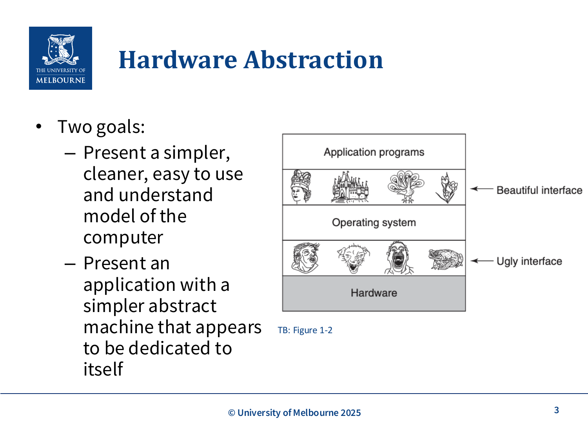
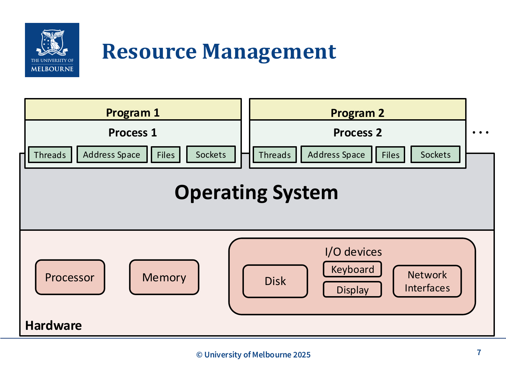
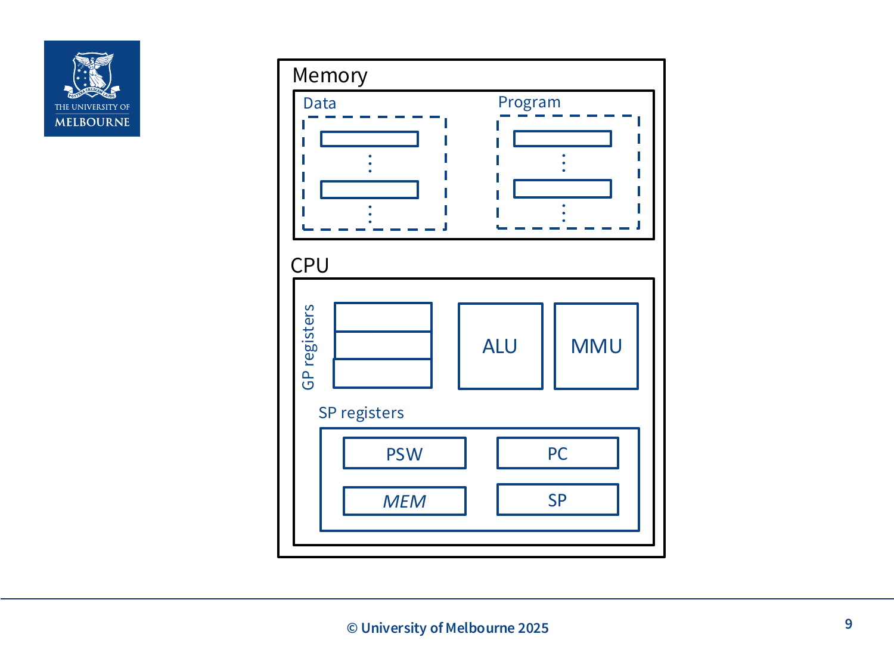
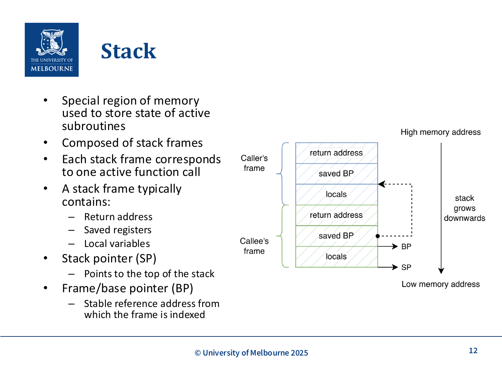
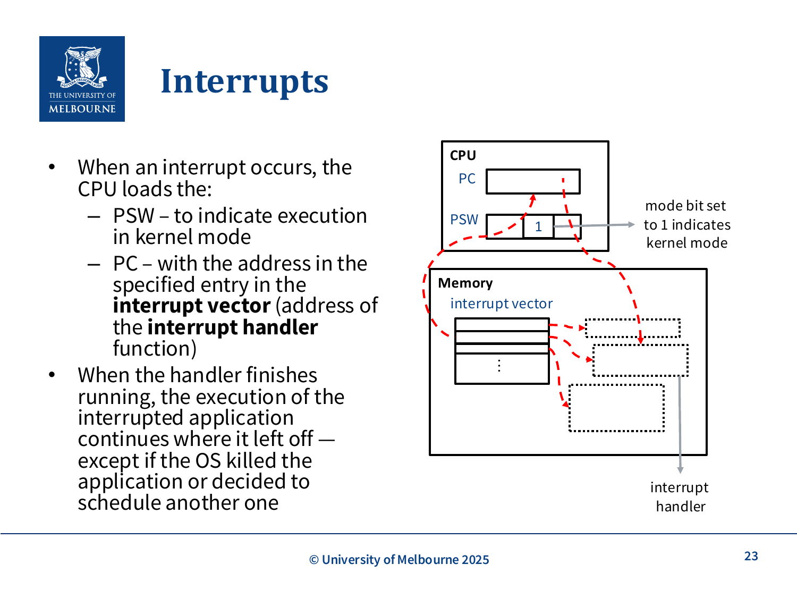
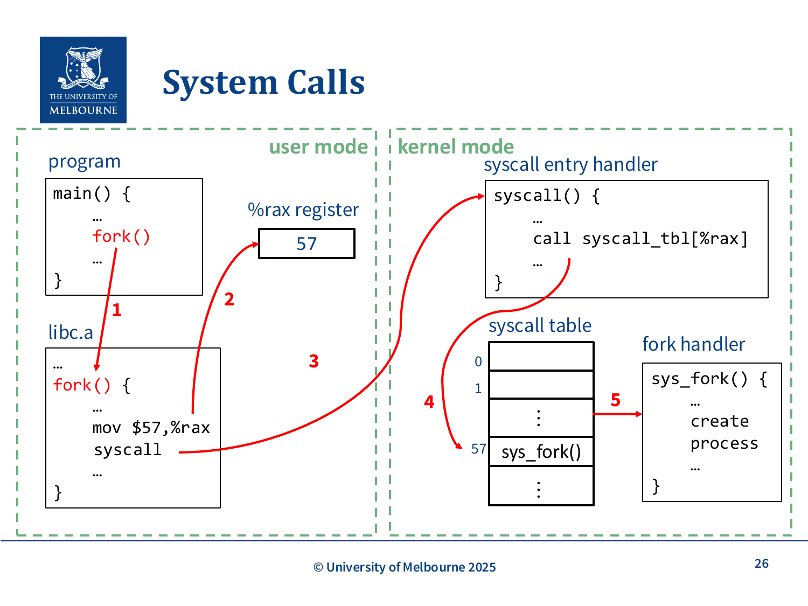

# WK1-OS-Overview

## 课件概述
本课件是计算机系统课程的开篇，介绍了操作系统的基本概念、核心功能和工作原理。课件从操作系统与硬件、应用程序的关系入手，详细讲解了硬件抽象、资源管理、计算机体系结构基础、内存管理、指令执行、子程序调用、栈机制、内存边界保护、执行模式、中断处理和系统调用等核心概念。这些内容为后续学习进程管理、内存管理、文件系统等奠定了坚实基础。

## 必须掌握的知识点

### 1. What is an Operating System? (什么是操作系统)

#### What（是什么）
操作系统（Operating System, OS）是管理计算机硬件资源并为应用程序提供服务的系统软件。它是用户与硬件之间的中介层，负责协调和控制计算机系统的各种活动。

**核心定义**：
- 操作系统是一个程序，它在硬件和应用程序之间提供接口
- 其主要任务是确保其他程序能够高效运行
- 操作系统提供硬件抽象和资源管理两大核心功能

**系统层次结构**：
```
用户 (User)
    ↓
应用程序 (Application)
    ↓
操作系统 (Operating System)
    ↓
硬件 (Hardware)
```



#### Why（为什么重要）
操作系统的重要性体现在以下几个方面：

1. **简化编程**：程序员无需直接操作硬件，通过操作系统提供的接口即可完成文件操作、网络通信等任务
2. **资源管理**：多个程序同时运行时，操作系统负责公平、高效地分配CPU时间、内存空间和I/O设备
3. **系统保护**：防止应用程序相互干扰，保护操作系统自身不被破坏
4. **抽象层**：将复杂的硬件细节隐藏，提供统一的、简洁的编程接口

**实际例子**：
- 当你在Python中调用`open()`函数时，操作系统负责将这个调用转换为实际的磁盘操作
- 当多个程序同时运行时，操作系统决定哪个程序使用CPU，使用多长时间

#### How（如何工作/实现）
操作系统通过以下机制实现其功能：

1. **硬件抽象层**：
   - 提供进程（Process）、线程（Thread）、地址空间（Address Space）、文件（File）、套接字（Socket）等抽象概念
   - 将复杂的硬件操作封装成简单的API

2. **资源管理机制**：
   - 进程调度：决定哪个进程使用CPU
   - 内存管理：分配和回收内存空间
   - I/O管理：协调设备访问

3. **保护机制**：
   - 用户模式和内核模式的区分
   - 内存边界保护
   - 特权指令限制

#### 关键术语
- **Operating System (OS)**：操作系统，管理硬件资源的系统软件
- **Hardware Abstraction**：硬件抽象，隐藏硬件复杂性
- **Resource Management**：资源管理，协调资源分配

#### 常见问题
- **Q：操作系统和应用程序有什么区别？**
  A：操作系统管理硬件资源，为应用程序提供服务；应用程序使用操作系统提供的接口完成特定任务。

- **Q：常见的操作系统有哪些？**
  A：Windows、Linux、macOS、Android、iOS等。

---

### 2. Hardware Abstraction (硬件抽象)

#### What（是什么）
硬件抽象是操作系统的核心功能之一，它将复杂的硬件细节隐藏起来，为应用程序提供简洁、统一的编程接口。

**两个主要目标**：
1. **简化计算机模型**：呈现一个更简单、更清晰、易于使用的计算机模型
2. **专用抽象机器**：为每个应用程序提供一个看似专属于自己的抽象机器

**抽象层次**：
```
应用程序看到的抽象：
- 进程 (Process)：运行中的程序
- 线程 (Thread)：进程中的执行单元
- 地址空间 (Address Space)：程序的内存视图
- 文件 (File)：数据的逻辑组织
- 套接字 (Socket)：网络通信端点

实际硬件：
- 处理器 (Processor)
- 内存 (Memory)
- 磁盘 (Disk)
- 键盘 (Keyboard)
- 显示器 (Display)
- 网络接口 (Network Interfaces)
```

#### Why（为什么重要）
硬件抽象的重要性：

1. **可移植性**：应用程序可以在不同硬件平台上运行，无需修改代码
2. **简化开发**：程序员无需了解硬件细节，专注于业务逻辑
3. **资源隔离**：每个程序都认为自己独占硬件资源
4. **安全性**：防止应用程序直接操作硬件造成系统崩溃

**实际例子**：
- 文件系统抽象：程序员只需知道文件名和路径，无需知道数据在磁盘上的具体存储位置
- 网络抽象：程序员只需使用socket API，无需了解网络协议的具体实现

#### How（如何工作/实现）
硬件抽象的实现机制：

1. **系统调用接口**：
   - 提供统一的API（如POSIX标准）
   - 将高级操作转换为低级硬件操作

2. **设备驱动程序**：
   - 为每种硬件设备提供驱动
   - 将通用操作转换为设备特定操作

3. **虚拟化技术**：
   - 虚拟内存：每个程序有自己的地址空间
   - 虚拟处理器：通过时间片轮转实现多任务

#### 关键术语
- **Process**：进程，运行中的程序实例
- **Thread**：线程，进程中的执行单元
- **Address Space**：地址空间，程序可访问的内存范围
- **Socket**：套接字，网络通信端点

#### 常见问题
- **Q：硬件抽象会降低性能吗？**
  A：会有轻微开销，但带来的好处（可移植性、安全性、易用性）远大于性能损失。

- **Q：如何查看系统中的进程？**
  A：Mac/Linux使用`ps aux`命令，Windows使用`tasklist`命令。

---

### 3. Resource Management (资源管理)

#### What（是什么）
资源管理是操作系统的另一核心功能，负责在多个竞争的进程之间有序、受控地分配处理器、内存和I/O设备。

**管理的资源类型**：
1. **处理器 (Processor)**：CPU时间分配
2. **内存 (Memory)**：内存空间分配
3. **I/O设备**：磁盘、键盘、显示器、网络接口等

**资源分配原则**：
- 有序性：按照某种策略（如优先级、先来先服务）分配
- 受控性：防止资源被某个进程独占
- 公平性：确保所有进程都能获得所需资源



#### Why（为什么重要）
资源管理的重要性：

1. **并发支持**：多个程序同时运行，需要合理分配资源
2. **效率优化**：最大化资源利用率，减少空闲时间
3. **防止冲突**：避免多个进程同时访问同一资源造成冲突
4. **系统稳定**：防止某个进程耗尽资源导致系统崩溃

**实际例子**：
- 当你同时打开浏览器、音乐播放器和文档编辑器时，操作系统需要分配CPU时间给每个程序
- 当多个程序需要使用内存时，操作系统需要决定每个程序使用多少内存

#### How（如何工作/实现）
资源管理的实现机制：

1. **进程调度**：
   - 使用调度算法（如轮转调度、优先级调度）
   - 决定哪个进程使用CPU，使用多长时间

2. **内存管理**：
   - 分配和回收内存空间
   - 使用虚拟内存技术扩展可用内存

3. **I/O管理**：
   - 设备分配和回收
   - I/O请求的排队和调度

4. **死锁处理**：
   - 检测和预防死锁
   - 资源分配图的维护

#### 关键术语
- **Resource Allocation**：资源分配
- **Process Scheduling**：进程调度
- **Deadlock**：死锁，多个进程相互等待对方释放资源

#### 常见问题
- **Q：如何查看系统资源使用情况？**
  A：Mac/Linux使用`top`或`htop`命令，Windows使用任务管理器。

- **Q：什么是资源饥饿？**
  A：某个进程长时间无法获得所需资源，导致无法继续执行。

---

### 4. Computer Architecture Background (计算机体系结构背景)

#### What（是什么）
计算机体系结构是理解操作系统工作原理的基础。课件将计算机硬件简化为两个主要组件：内存和CPU。

**内存 (Memory)**：
- 存储程序和数据的地方
- 内存层次结构：寄存器 → 缓存 → 主存 → 磁盘

**CPU (Central Processing Unit)**：
- 执行实际计算的组件
- 包含以下子组件：
  - **寄存器 (Registers)**：最快的存储，用于存储数据和地址
    - 通用寄存器：存储数据（如int、float）和内存地址
    - 特殊寄存器：特定控制功能
  - **ALU (Arithmetic Logic Unit)**：算术逻辑单元，执行数学和逻辑运算
  - **MMU (Memory Management Unit)**：内存管理单元，处理内存访问



**简化视图**：
- 1个CPU，1个核心
- 每个周期执行一条指令

#### Why（为什么重要）
理解计算机体系结构的重要性：

1. **性能优化**：了解硬件特性可以编写更高效的程序
2. **问题诊断**：理解硬件工作原理有助于定位性能瓶颈
3. **系统设计**：操作系统设计需要充分利用硬件特性
4. **并发理解**：理解CPU和内存的交互是理解并发的基础

**实际例子**：
- 寄存器访问速度比主存快100倍以上
- 缓存命中率直接影响程序性能

#### How（如何工作/实现）
CPU的工作原理：

1. **指令周期**：
   ```
   取指 (Fetch) → 译码 (Decode) → 执行 (Execute)
   ```

2. **每个周期的操作**：
   - 从内存获取指令（Fetch）
   - 解析指令内容（Decode）
   - 执行指令（Execute）
     - 可能包括：读取寄存器、访问内存、使用ALU计算、存储结果

3. **程序计数器 (PC)**：
   - 记录下一条要执行的指令的内存地址
   - 每执行一条指令后自动更新

#### 关键术语
- **Register**：寄存器，CPU内部的高速存储
- **ALU**：算术逻辑单元，执行计算
- **MMU**：内存管理单元，处理内存访问
- **Program Counter (PC)**：程序计数器，记录下一条指令地址

#### 常见问题
- **Q：寄存器和内存有什么区别？**
  A：寄存器在CPU内部，访问速度极快但数量有限；内存（主存）在CPU外部，容量大但访问速度较慢。

- **Q：什么是缓存？**
  A：位于CPU和主存之间的高速存储，用于减少CPU等待内存数据的时间。

---

### 5. Stack and Subroutine Calls (栈和子程序调用)

#### What（是什么）
栈是内存中的特殊区域，用于存储活跃子程序的状态。当函数调用子程序时，调用函数的状态必须被保存，以便子程序返回后能继续执行。

**栈的特性**：
- 后进先出 (LIFO - Last In, First Out)
- 由栈帧 (Stack Frame) 组成
- 每个栈帧对应一个活跃的函数调用

**栈帧内容**：
- 返回地址 (Return Address)
- 保存的寄存器 (Saved Registers)
- 局部变量 (Local Variables)

**硬件支持**：
- 栈指针寄存器 (SP - Stack Pointer)：指向栈顶
- 帧指针/基址指针 (BP - Frame/Base Pointer)：稳定的参考地址
- 特殊指令：`call`、`ret`、`push`、`pop`



#### Why（为什么重要）
栈机制的重要性：

1. **函数调用支持**：实现函数的嵌套调用
2. **状态保存**：保存调用函数的局部变量和寄存器状态
3. **内存管理**：自动管理函数的局部变量
4. **递归支持**：支持函数的递归调用

**实际例子**：
```c
void main() {
    int x = 10;
    foo(x);  // 调用foo时，main的状态被保存到栈
    // foo返回后，main的状态被恢复
}

void foo(int a) {
    int b = a + 1;
    bar(b);  // 调用bar时，foo的状态被保存到栈
}
```

#### How（如何工作/实现）
子程序调用的完整流程：

**调用子程序时**：
1. 将参数压入栈（或放入寄存器）
2. 执行`call`指令：
   - 将返回地址压入栈
   - 将PC设置为子程序地址
3. 保存调用者的寄存器到栈
4. 为局部变量分配栈空间

**从子程序返回时**：
1. 将返回值放入寄存器（如eax）
2. 释放局部变量的栈空间
3. 恢复调用者的寄存器
4. 执行`ret`指令：
   - 从栈中弹出返回地址
   - 将PC设置为返回地址
5. 调整栈指针，移除参数

**栈的内存布局**：
```
高地址
┌─────────────────┐
│   参数 (Args)    │
├─────────────────┤
│  返回地址 (RA)   │
├─────────────────┤
│  保存的寄存器    │
├─────────────────┤
│  局部变量        │
├─────────────────┤ ← 栈顶 (SP)
│                 │
│   栈增长方向     │
│       ↓         │
低地址
```

#### 关键术语
- **Stack Frame**：栈帧，函数调用的栈空间
- **Stack Pointer (SP)**：栈指针，指向栈顶
- **Frame Pointer (FP/BP)**：帧指针，稳定的参考地址
- **Return Address**：返回地址，函数返回后继续执行的位置

#### 常见问题
- **Q：栈溢出是什么？**
  A：当函数调用层次太深或局部变量太大时，栈空间耗尽，导致程序崩溃。

- **Q：栈和堆有什么区别？**
  A：栈用于存储局部变量和函数调用信息，由编译器自动管理；堆用于动态内存分配，由程序员手动管理。

---

### 6. Memory Boundaries (内存边界)

#### What（是什么）
内存边界是操作系统提供的保护机制，用于防止应用程序修改其他应用程序或操作系统的内存。

**保护内容**：
- 进程之间的内存隔离
- 操作系统内存的保护
- 只允许进程访问自己的地址空间

**硬件支持**：
- MMU (Memory Management Unit) 提供地址转换和保护
- 基址寄存器和界限寄存器
- 页表和TLB (Translation Lookaside Buffer)

#### Why（为什么重要）
内存边界保护的重要性：

1. **系统稳定性**：防止一个程序崩溃影响其他程序
2. **安全性**：防止恶意程序窃取或破坏其他程序的数据
3. **隔离性**：每个程序都认为自己独占内存空间
4. **调试便利**：内存访问错误只影响单个程序

**实际例子**：
- 程序A不能读取程序B的内存，即使程序B有敏感数据
- 程序崩溃时，操作系统可以安全终止该程序，不影响其他程序

#### How（如何工作/实现）
内存边界的实现机制：

1. **地址转换**：
   - 虚拟地址 → 物理地址
   - 由MMU硬件完成

2. **保护检查**：
   - 每次内存访问都进行权限检查
   - 非法访问触发异常

3. **页表机制**：
   - 每个进程有自己的页表
   - 页表项包含访问权限位

4. **异常处理**：
   - 非法内存访问触发段错误 (Segmentation Fault)
   - 操作系统终止违规进程

#### 关键术语
- **Memory Protection**：内存保护
- **Virtual Address**：虚拟地址，程序使用的地址
- **Physical Address**：物理地址，实际内存地址
- **Segmentation Fault**：段错误，非法内存访问

#### 常见问题
- **Q：什么是虚拟内存？**
  A：每个进程有自己的地址空间，通过MMU转换为物理地址，实现内存隔离。

- **Q：为什么需要内存保护？**
  A：防止程序相互干扰，保证系统稳定性和安全性。

---

### 7. Execution Mode (执行模式)

#### What（是什么）
操作系统支持两种执行模式：用户模式 (User Mode) 和内核模式 (Kernel Mode)。

**用户模式**：
- 应用程序运行的模式
- 受限制的模式
- 不能执行特权指令
- 只能访问允许的内存区域

**内核模式**：
- 操作系统运行的模式
- 特权模式
- 可以执行所有指令
- 可以访问所有内存

**模式指示**：
- 程序状态字 (PSW - Program Status Word) 中的模式位
- 模式位 = 1：内核模式
- 模式位 = 0：用户模式

#### Why（为什么重要）
执行模式的重要性：

1. **系统保护**：防止应用程序执行危险操作
2. **资源控制**：操作系统控制硬件资源的访问
3. **安全性**：防止恶意程序破坏系统
4. **稳定性**：限制应用程序的权限，减少系统崩溃风险

**实际例子**：
- 应用程序不能直接访问硬盘，必须通过操作系统
- 应用程序不能修改其他程序的内存
- 应用程序不能关闭中断

#### How（如何工作/实现）
执行模式的切换机制：

**用户模式 → 内核模式**：
1. 系统调用 (System Call)
2. 中断 (Interrupt)
3. 异常 (Exception)

**内核模式 → 用户模式**：
1. 从系统调用返回
2. 从中断返回
3. 从异常返回

**特权指令示例**：
- I/O指令
- 修改PSW的指令
- 修改页表基址寄存器的指令
- 关闭中断的指令

#### 关键术语
- **User Mode**：用户模式，受限模式
- **Kernel Mode**：内核模式，特权模式
- **Privileged Instruction**：特权指令，只能在内核模式执行
- **Program Status Word (PSW)**：程序状态字，包含模式位

#### 常见问题
- **Q：为什么要区分用户模式和内核模式？**
  A：为了保护系统安全，防止应用程序执行危险操作。

- **Q：系统调用时会发生什么？**
  A：CPU从用户模式切换到内核模式，执行操作系统代码，然后返回用户模式。

---

### 8. OS Kernel (操作系统内核)

#### What（是什么）
操作系统内核是操作系统的核心部分，运行在内核模式，提供基本的管理服务。

**内核的组成**：
- 进程管理
- 内存管理
- 文件系统
- 设备驱动
- 网络协议栈

**内核的功能**：
- 调度：决定哪个进程使用CPU
- 资源分配：分配内存、设备等资源
- I/O设备访问：提供统一的设备访问接口

#### Why（为什么重要）
内核的重要性：

1. **系统核心**：所有系统服务都通过内核提供
2. **资源管理**：统一管理所有硬件资源
3. **抽象层**：为应用程序提供统一的接口
4. **保护层**：保护硬件不被应用程序直接访问

**实际例子**：
- 文件操作：应用程序调用`read()`，内核负责从磁盘读取数据
- 网络通信：应用程序调用`send()`，内核负责发送数据包

#### How（如何工作/实现）
内核的工作机制：

1. **模块化设计**：
   - 可加载的内核模块
   - 设备驱动作为模块

2. **系统调用接口**：
   - 提供统一的API
   - 将用户请求转换为内核操作

3. **中断处理**：
   - 处理硬件中断
   - 调用相应的中断处理程序

4. **进程管理**：
   - 进程创建和销毁
   - 进程调度

#### 关键术语
- **Kernel**：内核，操作系统的核心
- **Module**：模块，可加载的内核组件
- **Device Driver**：设备驱动，控制硬件设备的程序

#### 常见问题
- **Q：内核和操作系统有什么区别？**
  A：内核是操作系统的核心部分，运行在内核模式；操作系统还包括运行在用户模式的系统工具和应用程序。

- **Q：什么是微内核？**
  A：将内核功能最小化，其他服务运行在用户模式的设计。

---

### 9. Interrupts (中断)

#### What（是什么）
中断是导致CPU暂停当前执行并转交给操作系统的事件。

**中断的类型**：
1. **外部中断 (External Interrupts)**：
   - 由外部设备在不可预测的时间产生
   - 例子：
     - 时钟中断：通知操作系统时间流逝
     - I/O设备中断：通知I/O操作完成

2. **内部中断 (Internal Interrupts)**：
   - 由执行当前指令时的异常引起
   - 例子：
     - 错误条件：除零、特权指令违规
     - 临时问题：缺页异常

**中断处理流程**：
1. 中断发生
2. CPU进入内核模式
3. 保存当前状态（PC、PSW）
4. 跳转到中断处理程序
5. 执行中断处理程序
6. 恢复状态
7. 继续执行



#### Why（为什么重要）
中断的重要性：

1. **异步处理**：处理不可预测的事件
2. **效率提升**：CPU不需要轮询设备状态
3. **实时响应**：及时处理紧急事件
4. **系统控制**：操作系统通过中断控制系统

**实际例子**：
- 键盘输入：按键时产生中断，CPU暂停当前工作，处理键盘输入
- 磁盘读写：读写完成时产生中断，CPU处理数据
- 定时器：时钟中断用于进程调度

#### How（如何工作/实现）
中断的处理机制：

**中断向量表**：
- 存储在OS内存中
- 每个表项存储一个中断处理程序的地址
- 中断号作为索引

**中断发生时**：
1. CPU保存当前PSW和PC到栈
2. 设置PSW为内核模式
3. 从中断向量表加载新的PC
4. 执行中断处理程序

**中断返回时**：
1. 从栈恢复PSW和PC
2. 继续执行被中断的程序

**中断处理程序**：
```c
void interrupt_handler() {
    // 保存寄存器
    // 处理中断
    // 恢复寄存器
    // 返回
}
```

#### 关键术语
- **Interrupt**：中断，导致CPU暂停的事件
- **Interrupt Vector**：中断向量，存储中断处理程序地址的表
- **Interrupt Handler**：中断处理程序，处理中断的函数
- **Clock Interrupt**：时钟中断，定时器产生的中断
- **I/O Interrupt**：I/O中断，设备操作完成产生的中断

#### 常见问题
- **Q：中断和异常有什么区别？**
  A：中断通常由外部设备异步产生；异常由CPU执行指令时同步产生。

- **Q：什么是中断优先级？**
  A：不同中断有不同的优先级，高优先级中断可以打断低优先级中断的处理。

---

### 10. System Calls (系统调用)

#### What（是什么）
系统调用是用户程序和操作系统之间的接口，允许用户程序请求操作系统服务。

**系统调用的作用**：
- 文件操作：open、read、write、close
- 进程控制：fork、exec、exit
- 内存管理：mmap、brk
- 设备操作：ioctl
- 网络通信：socket、bind、listen、accept

**系统调用的执行过程**：
1. 用户程序将系统调用号放入寄存器（如%rax）
2. 执行系统调用指令（如`syscall`）
3. CPU切换到内核模式
4. 内核查找系统调用表
5. 执行相应的系统调用处理程序
6. 返回用户程序



#### Why（为什么重要）
系统调用的重要性：

1. **安全接口**：提供受控的方式访问系统资源
2. **抽象层**：隐藏实现细节，提供统一接口
3. **保护机制**：防止应用程序直接操作硬件
4. **可移植性**：不同系统提供相同的接口

**实际例子**：
```c
// 用户程序
int fd = open("file.txt", O_RDONLY);  // 系统调用
char buf[100];
read(fd, buf, 100);  // 系统调用
close(fd);  // 系统调用
```

#### How（如何工作/实现）
系统调用的详细实现：

**系统调用表**：
- 存储在内核中
- 每个表项对应一个系统调用处理程序
- 系统调用号作为索引

**执行流程**：
```
用户程序：
    fork() {
        mov $57, %rax    // 系统调用号
        syscall           // 切换到内核模式
    }

内核：
    syscall_entry_handler() {
        call syscall_tbl[%rax]  // 查找并调用处理程序
    }

    sys_fork() {
        // 创建新进程
    }
```

**系统调用的开销**：
- 模式切换：用户模式 ↔ 内核模式
- 参数传递：通过寄存器或栈
- 返回值：通过寄存器

#### 关键术语
- **System Call**：系统调用，用户程序请求OS服务
- **System Call Table**：系统调用表，存储处理程序地址
- **Trap**：陷阱，切换到内核模式的指令
- **syscall**：系统调用指令

#### 常见问题
- **Q：系统调用和函数调用有什么区别？**
  A：系统调用需要切换到内核模式，有模式切换开销；函数调用在用户模式执行，开销较小。

- **Q：什么是库函数？**
  A：库函数是用户空间的函数，可能封装了系统调用，也可能不涉及系统调用（如数学函数）。

## 知识点之间的联系

这些知识点形成了一个完整的知识体系：

1. **操作系统定义** → **硬件抽象** → **资源管理**：这是操作系统的三大核心功能
2. **计算机体系结构** → **栈和子程序** → **内存边界**：这是理解程序执行的基础
3. **执行模式** → **OS内核** → **中断** → **系统调用**：这是操作系统工作原理的核心

**整体流程**：
- 应用程序通过系统调用请求操作系统服务
- 操作系统在内核模式执行服务
- 通过中断处理异步事件
- 通过内存边界保护系统安全
- 通过硬件抽象提供简洁接口

## 实际应用案例

### 案例1：文件读取过程
```
1. 应用程序调用 read(fd, buf, size)
2. 触发系统调用，切换到内核模式
3. 内核检查参数合法性
4. 内核通过设备驱动读取磁盘
5. 数据复制到用户空间的buf
6. 返回用户模式，返回读取的字节数
```

### 案例2：多任务处理
```
1. 时钟中断发生
2. CPU进入内核模式
3. 操作系统保存当前进程状态
4. 操作系统选择下一个进程
5. 恢复下一个进程的状态
6. 继续执行
```

### 案例3：程序崩溃处理
```
1. 程序访问非法内存
2. 触发缺页异常或段错误
3. CPU进入内核模式
4. 操作系统检查错误
5. 操作系统终止程序
6. 释放程序占用的资源
```

## 常见错误和易错点

### 1. 混淆用户模式和内核模式
- **错误**：认为应用程序可以直接访问硬件
- **正确**：应用程序必须通过系统调用请求操作系统服务

### 2. 不理解中断和系统调用的区别
- **错误**：认为中断和系统调用是一回事
- **正确**：中断是异步事件，系统调用是同步请求

### 3. 忽视栈的作用
- **错误**：认为函数调用只是简单的跳转
- **正确**：函数调用需要保存状态，通过栈实现

### 4. 不理解内存保护
- **错误**：认为程序可以访问任意内存地址
- **正确**：操作系统通过MMU限制内存访问

### 5. 混淆内核和操作系统
- **错误**：认为内核就是整个操作系统
- **正确**：内核是操作系统的核心，但操作系统还包括其他组件

## 关键术语

| 英文术语 | 中文 | 定义 |
|---------|------|------|
| Operating System (OS) | 操作系统 | 管理硬件资源并为应用程序提供服务的系统软件 |
| Hardware Abstraction | 硬件抽象 | 将复杂的硬件细节隐藏，提供简洁统一的编程接口 |
| Resource Management | 资源管理 | 在多个竞争的进程之间有序分配处理器、内存和I/O设备 |
| Process | 进程 | 运行中的程序实例 |
| Thread | 线程 | 进程中的执行单元 |
| Address Space | 地址空间 | 程序可访问的内存范围 |
| Register | 寄存器 | CPU内部的高速存储，分为通用寄存器和特殊寄存器 |
| ALU | 算术逻辑单元 | 执行数学和逻辑运算的硬件组件 |
| MMU | 内存管理单元 | 处理内存访问和地址转换的硬件组件 |
| Program Counter (PC) | 程序计数器 | 记录下一条要执行的指令的内存地址 |
| Stack Frame | 栈帧 | 函数调用在栈上占用的空间，包含返回地址、保存的寄存器和局部变量 |
| Stack Pointer (SP) | 栈指针 | 指向栈顶的寄存器 |
| Frame Pointer (FP/BP) | 帧指针 | 提供稳定参考地址的寄存器 |
| Return Address | 返回地址 | 函数返回后继续执行的位置 |
| Kernel Mode | 内核模式 | 操作系统运行的特权模式，可执行所有指令和访问所有内存 |
| User Mode | 用户模式 | 应用程序运行的受限模式，不能执行特权指令 |
| Privileged Instruction | 特权指令 | 只能在内核模式执行的指令（如I/O指令、修改PSW） |
| PSW | 程序状态字 | 包含模式位，指示当前执行模式 |
| Interrupt | 中断 | 导致CPU暂停当前执行并转交控制权给OS的事件 |
| Interrupt Vector | 中断向量 | 存储中断处理程序地址的表 |
| Interrupt Handler | 中断处理程序 | 处理特定中断的函数 |
| System Call | 系统调用 | 用户程序请求操作系统服务的接口 |
| System Call Table | 系统调用表 | 存储系统调用处理程序地址的表，以系统调用号为索引 |

## 常见问题

**Q1：操作系统和应用程序有什么区别？**
A：操作系统管理硬件资源，为应用程序提供服务，运行在内核模式；应用程序使用操作系统提供的接口完成特定任务，运行在用户模式。

**Q2：硬件抽象会降低性能吗？**
A：会有轻微开销（如系统调用的模式切换），但带来的好处（可移植性、安全性、易用性）远大于性能损失。

**Q3：中断和系统调用有什么区别？**
A：中断是**异步**事件，由外部设备或执行异常在不可预测的时间触发；系统调用是**同步**请求，由应用程序主动发起。

**Q4：什么是栈溢出？**
A：当函数调用层次太深（如无限递归）或局部变量太大时，栈空间耗尽，导致程序崩溃。

**Q5：系统调用和普通函数调用有什么区别？**
A：系统调用需要切换到内核模式（用户态→内核态→用户态），有模式切换开销；函数调用在用户模式执行，开销较小。

**Q6：什么是特权指令？为什么需要？**
A：特权指令是只能在内核模式执行的指令（如I/O操作、修改页表、关闭中断）。需要防止应用程序执行危险操作，保护系统安全。

## 课件总结

本课件介绍了操作系统的基础知识，包括：

1. **操作系统的定义和功能**：操作系统是管理硬件资源并为应用程序提供服务的系统软件，主要功能包括硬件抽象和资源管理。

2. **硬件抽象**：将复杂的硬件细节隐藏，提供简洁的编程接口，包括进程、线程、地址空间、文件、套接字等抽象概念。

3. **资源管理**：在多个竞争的进程之间有序、受控地分配处理器、内存和I/O设备。

4. **计算机体系结构**：理解CPU、内存、寄存器、ALU、MMU等硬件组件的工作原理。

5. **栈和子程序调用**：理解栈帧、栈指针、返回地址等概念，以及函数调用的完整过程。

6. **内存边界保护**：通过MMU实现进程间的内存隔离，保护系统安全。

7. **执行模式**：用户模式和内核模式的区分，以及模式切换机制。

8. **中断处理**：理解外部中断和内部中断，以及中断向量表和中断处理程序。

9. **系统调用**：理解系统调用的执行过程，以及系统调用表的作用。

这些基础知识为后续学习进程管理、内存管理、文件系统、设备管理等奠定了坚实基础。

## 复习建议

1. **理解概念**：不要死记硬背，理解每个概念的含义和作用
2. **画图辅助**：画出系统调用流程图、中断处理流程图、栈帧结构图
3. **联系实际**：结合实际操作系统（如Linux）理解这些概念
4. **做练习题**：通过练习题巩固知识
5. **重点复习**：系统调用、中断处理、内存保护是重点
