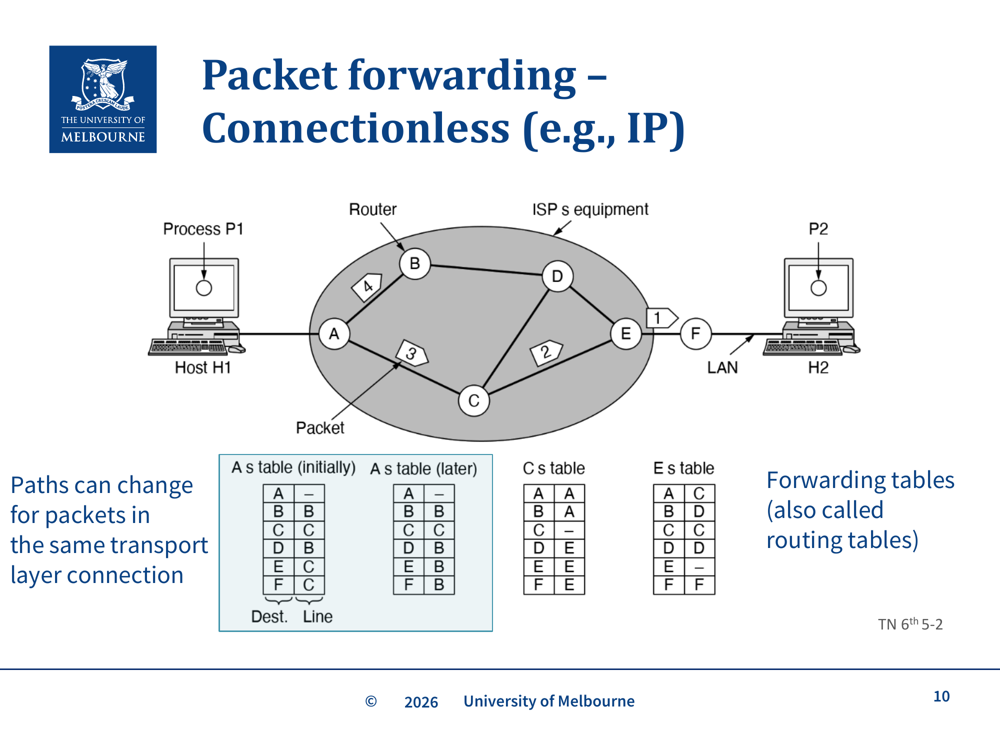
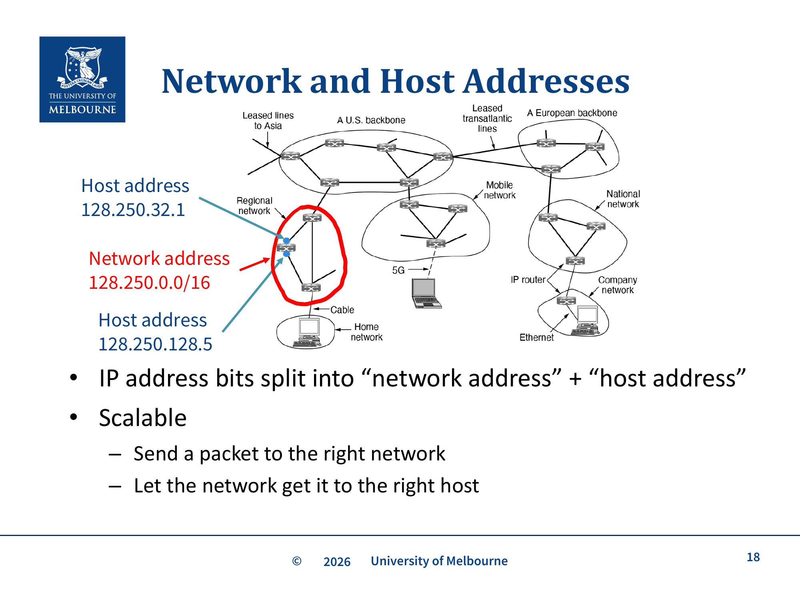
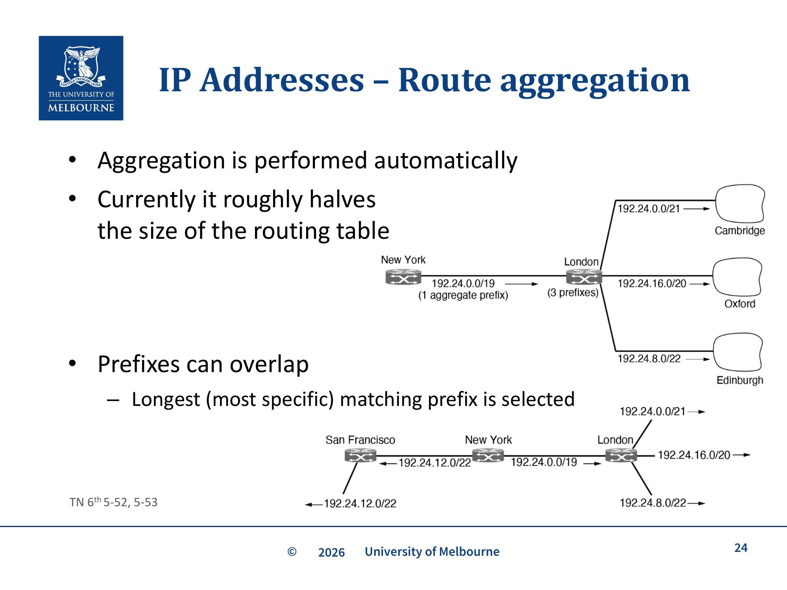

# WK10 - IP Addresses and Packet Switching

## 课件概述

本课件介绍网络层（Internet Layer）的核心概念，包括 IP 地址和分组交换。重点讲解 IPv4 和 IPv6 的地址格式、层次化地址设计、前缀表示法、路由聚合，以及分组交换和电路交换的对比。网络层的核心任务是将数据从源端送到目的端，这需要高效的路由和寻址机制。

---

## 必须掌握的知识点

### 1. 网络层的角色（Internet Layer Role）

#### What（是什么）
网络层的核心任务：**get data from the source all the way to the destination**（端到端传输）。

特点：
- 通常不是单跳（single hop），需要经过多个中间节点
- 流量需要被**高效路由**（routed efficiently）
- 由**路由器（routers）**执行
- 节点必须被赋予**地址（addresses）**

#### 与其他层的关系
```
Application Layer    (HTTP, DNS, etc.)
       ↓
Transport Layer      (TCP, UDP)
       ↓
Network Layer        (IP) ← 本课重点
       ↓
Link Layer           (Ethernet, Wi-Fi)
       ↓
Physical Layer       (Cables, signals)
```

---

### 2. 分组交换 vs 电路交换


*无连接分组转发（IP）：每个 packet 独立路由，路由器根据 Forwarding table 决定下一跳（Tanenbaum TN 6th 5-2）*

#### What（是什么）

| 类型 | 特点 | 协议 |
|------|------|------|
| **Connectionless (Datagram)** | 无连接，每个 packet 独立路由 | IP (Internet Protocol) |
| **Connection-oriented (Virtual Circuit)** | 面向连接，建立虚电路 | ATM, MPLS |

#### Store-and-Forward Packet Switching（存储转发分组交换）

**工作过程**：
1. Host H1 发送 packet 到最近的 router（A）
2. Packet 在到达时被**缓冲**，checksum 被验证
3. 如果有效，packet 被存储直到**出接口空闲**
4. Router 将 packet 转发到路径上的下一个 router
5. 重复 2-4

**关键理解**：每个 router 都会**完整接收**一个 packet 后才转发（store-and-forward），这引入了延迟。

#### Datagram vs Virtual Circuit 对比

| 问题 | Datagram Network | Virtual Circuit |
|------|------------------|-----------------|
| **类型** | Connectionless | Connection-oriented |
| **状态** | + 路由器不保存连接状态 | - 每个 VC 需要 router 表空间，重启是问题 |
| **地址** | - 每个 packet 有完整源和目的地址 | + 每个 packet 只有短 VC 号 |
| **路由** | 每个 packet 独立，同一TCP连接的不同packet可能走不同路径 | 在 setup 时定义，路径固定 |
| **QoS** | - 困难 | + 连接建立时承诺最大速率，每跳检查容量，不够则拒绝连接（Admission Control） |
| **拥塞控制** | - 困难 | + 如果资源足够则容易 |
| **链路故障恢复** | + 简单 | - 需要额外工作 |

**Virtual Circuit 的转发机制：** VC 的转发表是每跳的本地映射：`In: (连接ID) → Out: (下一跳, 新连接号)`。VC号是**每跳局部的（hop-local）**，不同链路可以使用不同的VC号。VC网络（如MPLS）通常作为IP网络的单个"链路"存在，而不是取代IP。

---

### 3. Internet Protocol (IP) 设计原则

#### 设计哲学
1. **"Something that works OK is better than an ideal standard 'in progress'"**
   - 能用的标准比理想中但未完成的标准更好
   - 随着互联网变得重要，"OK"的标准已经提高

2. **Keep it simple**（**Occam's Razor，奥卡姆剃刀原则**，对应 slide p.13）——能用更简单的机制解决就不用复杂的；这是 IP 头部、转发规则都尽量简洁的根因

3. **Be strict when sending, tolerant when receiving**
   - 发送时严格，接收时宽容
   - 例如：Web 浏览器能处理无效 HTML 的页面

4. **Avoid static options and parameters** — 在运行时协商

5. **Think about scalability**（可扩展性）

6. **"Best effort"**，不保证性能

7. **多路径冗余（对应 slide p.14）**：IP 路由允许到同一目的地存在**多条路径**，路由器可在它们间分流——既提供冗余（一条断了换另一条），又均衡负载。这与虚电路"一条路径走到底"形成对比。

---

### 4. IPv4 地址格式

#### What（是什么）
- **32-bit 数字**
- 表示为**十进制**，每个 byte 用十进制表示，用点分隔
- 例：`172.22.44.10`（十六进制：`0xAC162C0A`）
- 最低：`0.0.0.0`，最高：`255.255.255.255`
- **IP 地址分配给接口（interfaces），不是主机（hosts）**
  - 一个有多个网卡的主机将有多个 IP 地址
- IPv4 地址已经基本耗尽

#### 地址类型
- **Unicast**: 单播，一个目的地（"正常"地址）
- **Broadcast**: 广播，发送给所有人
- **Multicast**: 组播，发送给特定节点集合（如直播视频）

---

### 5. 层次化地址设计（Network + Host）


*IP 地址分为 Network address（网络号）+ Host address（主机号），层次化设计使路由可扩展（Lecture Slide 18）*

#### What（是什么）
IP 地址分为两部分：
- **Network address**（网络地址）：高位 bits
- **Host address**（主机地址）：低位 bits

```
128.250.32.1  →  Network: 128.250.0.0/16, Host: 32.1
128.250.128.5 →  Network: 128.250.0.0/16, Host: 128.5
```

#### Why（为什么）
- **Scalable**（可扩展）：先将 packet 发送到正确的网络，再让网络找到正确的主机
- 中间路由器只需要维护**前缀（prefix）**的路由，而不是每个单独的主机

#### How（前缀表示法）
- 网络对应 IP 地址空间的一个**连续块**，称为 **prefix**
- 写法：最低 IP 地址 + `/` + 网络部分的大小
- 例：`192.0.2.0/24`
  - 24 bits 用于网络
  - 剩下 8 bits 用于主机（最多 256 个地址）
- `10.0.0.0/8`（保留私有块）
  - 8 bits 用于网络
  - 24 bits 用于主机（最多 16,777,216 个地址）

#### Subnet Mask（子网掩码）
- `/24` 对应子网掩码：`255.255.255.0`
- `/16` 对应子网掩码：`255.255.0.0`
- `/8` 对应子网掩码：`255.0.0.0`

#### 关键理解
**接口必须知道网络掩码**：
- 不能仅从 IP 地址推断网络掩码
- 每个接口需要被告知 IP 地址**和**网络掩码
- 同一网络上的所有接口必须有相同的网络掩码

**课件前缀练习题（对应 slide p.21–22，重点计算题）**——用 `128.250.73.5` 做一组判断：
- 它在 `128.250.0.0/16` 里吗？→ **是**（前 16 位 `128.250` 匹配）
- 它在 `128.250.0.0/24` 里吗？→ 取决于第三字节：`73` ≠ `0`，所以**不在** `128.250.0.0/24`（而在 `128.250.73.0/24`）
- 它在 `128.250.0.0/17` 里吗？→ `/17` 看第 17 位（第三字节最高位）；`73` = `01001001`，最高位 0，而 `128.250.0.0/17` 要求第三字节在 `0–127`，所以**在**
- `/17` 有多少地址？→ `2^(32−17) = 2^15 = 32768`
- 它的网络掩码是什么？→ **不能单从 IP 推断！**（这正是 slide p.22 的陷阱答案）必须由接口配置给定；若被告知是 `/24`，则掩码 `255.255.255.0`、网络 `128.250.73.0`

**关键陷阱（slide p.22）**：**单凭一个 IP 地址无法推断它的网络掩码**——`128.250.73.5` 在 `/16`、`/17`、`/24` 下分别属于不同网络。掩码是配置信息，不是地址的固有属性。

---

### 6. IP 地址的路由聚合（Route Aggregation）


*路由聚合：多个子网前缀合并为一个聚合前缀，减少路由表大小。前缀可重叠，使用 Longest Prefix Match（Tanenbaum TN 6th 5-52, 5-53）*

#### What（是什么）
- **Network number = Network mask (bitwise-AND) IP address**
- 这对于高效路由至关重要：
  - 网络被分配地址块
  - 中间路由器只需要维护前缀的路由，而不是每个单独的主机
  - 只有当 packet 到达目的网络时，才需要读取主机部分

#### 聚合效果
- 自动执行
- 目前大约将路由表大小减半
- 前缀可以重叠 → 选择**最长匹配前缀（longest matching prefix）**

---

### 7. 路由器连接网络

#### How（工作方式）
- 路由器是连接网络的**特殊节点**
- 路由器之间的链路本身就是一个"网络"
- **路由器有多个 IP 地址**（每个接口一个）

```
10.5.25.10/31 ←→ Router ←→ 10.0.25.5/31
                      ↕
              10.5.25.8/31
```

`/31` 网络只有 2 个地址，用于点对点链路。

---

### 8. IPv4 Header 格式

| 字段 | 用途 |
|------|------|
| **Version** | 协议版本（4） |
| **IHL** | Header 长度（32-bit words），最小 5，最大 15 |
| **Differentiated services** | QoS 服务类别 |
| **ECN** | 显式拥塞通知 |
| **Total length** | 包含 payload，最大 65,535 |
| **Identification, DF, MF, Fragment Offset** | 分片处理（本课程不深入） |
| **Time to live (TTL)** | 跳数计数，到 0 时丢弃 |
| **Protocol** | 传输层服务（TCP/UDP/SCTP/DCCP 等） |
| **Source and Destination** | IPv4 地址 |
| **Options** | 很少使用，支持不好 |

---

### 9. IPv6 地址

#### What（是什么）
- 设计于近 30 年前，解决 IPv4 地址耗尽问题
- **128-bit 地址**，不太可能用尽
- 其他改进：
  - **更简单的 header** → 更快处理
  - **改进的安全性**（已回移到 IPv4）
  - **更好的 QoS 支持**

#### IPv6 地址格式
- 写为 **8 组**（最多 4 个十六进制数字）
- 例：`8000:0000:0000:0000:0123:4567:89AB:CDEF`
- 可以省略一组连续的 0：`8000::123:4567:89AB:CDEF`
- IPv4 兼容：`::ffff:192.31.2.46`（注意十六进制和十进制混合）

#### IPv6 Header

| 字段 | 用途 |
|------|------|
| **Version** | 6 |
| **Differentiated services** | 6 bits 服务类别 + 2 bits 拥塞控制（ECN） |
| **Flow label** | 伪虚电路标识符 |
| **Payload length** | 40-byte header 之后的字节数 |
| **Next header** | 指定额外 headers 或 Protocol（TCP/UDP） |
| **Hop limit** | 等同于 TTL |
| **Source and Destination** | 16-byte IPv6 地址 |

#### IPv6 部署现状
- 全球约 50% 支持
- 澳大利亚约 35%
- 继续增长中

---

### 10. IPv4 地址的稀缺性

#### 问题
- 层次化地址空间的缺点：如果分配不当会浪费大量地址
- 可用 IPv4 地址稀缺（耗尽），地址已成为**有价值的资产**
- 理论上不应出售，应返还给分配机构重新分配
- IPv6 早期采用者能够以高价出售其 IPv4 地址空间

---

## 关键术语

| 术语 | 定义 |
|------|------|
| Network Layer | 网络层，负责端到端数据传输 |
| Router | 路由器，连接不同网络的设备 |
| Packet Switching | 分组交换，数据被分成独立的 packets 传输 |
| Circuit Switching | 电路交换，建立专用路径传输数据 |
| Store-and-Forward | 存储转发，router 完整接收 packet 后才转发 |
| Datagram | 数据报，无连接的 packet |
| Virtual Circuit | 虚电路，面向连接的逻辑路径 |
| IPv4 | Internet Protocol version 4，32-bit 地址 |
| IPv6 | Internet Protocol version 6，128-bit 地址 |
| Prefix | 前缀，IP 地址的网络部分 |
| Subnet Mask | 子网掩码，标识网络和主机部分 |
| Route Aggregation | 路由聚合，合并多个前缀为一个 |
| Longest Prefix Match | 最长前缀匹配，路由查找原则 |
| TTL | Time To Live，packet 的跳数限制 |
| ECN | Explicit Congestion Notification，显式拥塞通知 |
| Unicast | 单播，点对点通信 |
| Broadcast | 广播，一对所有通信 |
| Multicast | 组播，一对多通信 |

---

## 常见问题

### Q1: 为什么 IP 地址分配给接口而不是主机？
因为一个主机可能有多个网络接口（如有线网卡、无线网卡、Loopback），每个接口需要独立的地址来标识其在网络中的位置。

### Q2: 为什么需要层次化地址？
为了**可扩展性**。路由器只需要维护网络前缀的路由表，而不是每个主机。这大大减小了路由表的大小。

### Q3: 为什么 IPv4 地址会耗尽？
32-bit 地址空间只有约 43 亿个地址，而互联网设备数量远超此数。加上早期分配不当（如某些公司获得 /8 块），导致地址浪费。

### Q4: 为什么 IPv6 还没有完全取代 IPv4？
- **兼容性问题**: 大量现有设备和软件只支持 IPv4
- **成本**: 升级基础设施需要大量投资
- **NAT**: Network Address Translation 延长了 IPv4 的使用寿命
- **惯性**: "如果没坏，就不要修"

---

## 知识点之间的联系

```
WK6-Intro-OSI (网络层概念)
    ↓ 详细
WK10-Addressing-Switching (IP 寻址和分组交换)
    ↓ 路由
WK11-Routing (路由算法)
    ↓ 地址转换
WK12-NAT (网络地址转换)
```

- **IP 地址**是**路由**的基础（WK11）
- **分组交换**是互联网的核心架构
- **IPv4 vs IPv6** 的演进反映了互联网的发展

---

## 实际应用案例

### 案例 1: 子网划分
一个公司获得 `192.168.1.0/24` 的地址块：
- 可以进一步划分为 `/25`（128 个地址）和 `/26`（64 个地址）
- 不同部门使用不同的子网
- 路由器在子网之间转发 packets

### 案例 2: 私有地址空间
RFC 1918 定义的私有地址块：
- `10.0.0.0/8`（16M 地址）
- `172.16.0.0/12`（1M 地址）
- `192.168.0.0/16`（65K 地址）
- 用于内部网络，需要 NAT 才能访问互联网

### 案例 3: IPv6 部署
- Google 报告约 50% 的请求来自 IPv6-capable 客户端
- T-Mobile、Comcast 等运营商已大规模部署 IPv6
- 中国、印度等国家 IPv6 采用率快速增长

---

## 常见错误和易错点

### ❌ 错误 1: 认为 IP 地址分配给主机
IP 地址分配给**接口（interface）**，不是主机。一个主机可以有多个接口，每个接口有独立的 IP 地址。

### ❌ 错误 2: 混淆网络地址和主机地址
网络地址 = IP 地址 AND 子网掩码。例如：
- IP: `128.250.73.5`
- Mask: `/16` = `255.255.0.0`
- Network: `128.250.0.0`

### ❌ 错误 3: 认为 /24 比 /16 大
`/24` 的网络部分更长，主机部分更短，所以**网络更小**。`/16` 的网络更大（65K vs 256 个地址）。

### ❌ 错误 4: 忘记路由器有多个 IP 地址
路由器连接多个网络，每个接口都有独立的 IP 地址。

### ❌ 错误 5: 混淆 Datagram 和 Virtual Circuit
- **Datagram**: 无连接，每个 packet 独立路由（IP）
- **Virtual Circuit**: 面向连接，预先建立路径（ATM, MPLS）

---

## 课件总结

本课件介绍了网络层的核心概念：
1. **网络层角色**: 端到端数据传输，由路由器执行
2. **分组交换**: Store-and-forward，每个 packet 独立路由
3. **IP 地址**: 层次化设计（网络 + 主机），前缀表示法
4. **IPv4 vs IPv6**: 32-bit vs 128-bit 地址，header 改进
5. **路由聚合**: 减小路由表，提高查找效率

理解 IP 地址和分组交换是理解互联网架构的基础。

---

## 复习建议

1. **练习子网计算**: 给定 IP 和前缀，计算网络地址、广播地址、可用主机数
2. **理解层次化地址的优缺点**: 可扩展性 vs 地址浪费
3. **对比 Datagram 和 Virtual Circuit**: 状态、路由、QoS、故障恢复
4. **掌握 IPv4 和 IPv6 的区别**: 地址大小、header 格式、部署现状
5. **理解路由聚合的原理**: 为什么能减小路由表？最长前缀匹配是什么？

---

*课件来源: COMP30023 2026 S1 WK10*
## 默写背诵 Dictation

> 以下为本章必须能默写的中英对照；网站「默写 Recite」Tab 提供自测模式。

| # | 默写提示 Prompt | 标准答案 Answer |
|---|----------------|----------------|
| 1 | IP address binds to what? · IP 地址绑定到什么？ | **EN:** An interface (host-router port), not the host as a whole. / **中文：** 接口（interface），而非整台主机。 |
| 2 | CIDR notation meaning. · CIDR 表示法含义。 | **EN:** a.b.c.d/x — x is prefix length (number of leading network bits). / **中文：** a.b.c.d/x——x 为前缀长度（网络位前导位数）。 |
| 3 | Number of addresses in /n prefix. · /n 前缀有多少地址？ | **EN:** 2^(32−n) addresses (IPv4). / **中文：** 2^(32−n) 个地址（IPv4）。 |
| 4 | Network vs broadcast vs host in a subnet. · 子网中网络地址、广播地址与主机地址。 | **EN:** Network = all host bits 0; broadcast = all host bits 1; usable hosts between them. / **中文：** 网络地址 = 主机位全 0；广播 = 主机位全 1；可用主机在中间。 |
| 5 | Can you infer netmask from IP alone? (slide p.22) · 能否单从 IP 推断 netmask？（课件 p.22） | **EN:** No — netmask/prefix is configuration, not inherent in the address. / **中文：** 不能——掩码/前缀是配置信息，不是地址固有属性。 |
| 6 | 128.250.73.5 prefix exercise (slide p.21–22). · 128.250.73.5 前缀练习（课件 p.21–22）。 | **EN:** In /16 yes; in 128.250.0.0/24 no (use 128.250.73.0/24); in /17 yes; /17 has 2^15 = 32768 addresses. / **中文：** 在 /16 是；在 128.250.0.0/24 否（属 128.250.73.0/24）；在 /17 是；/17 有 2^15 = 32768 地址。 |
| 7 | Longest prefix match rule. · 最长前缀匹配规则。 | **EN:** Router chooses forwarding entry with longest matching network prefix. / **中文：** 路由器选择匹配网络前缀最长的转发表项。 |
| 8 | Route aggregation benefit. · 路由聚合好处。 | **EN:** One forwarding-table entry covers many networks — smaller tables, faster lookup. / **中文：** 一条转发表项覆盖多个网络——表更小、查找更快。 |
| 9 | Datagram vs virtual circuit network. · Datagram vs 虚电路网络。 | **EN:** Datagram = connectionless per-packet routing; VC = setup phase, fixed path, local VC numbers per hop. / **中文：** Datagram = 无连接逐包路由；VC = 有建立阶段、固定路径、VC 号逐跳本地。 |
| 10 | Store-and-forward — five steps (slide p.9). · 存储转发——五步（课件 p.9）。 | **EN:** (1) Host sends to router; (2) buffer on arrival, verify checksum; (3) store until out interface free; (4) forward to next router; (5) repeat. / **中文：** （1）主机发到路由器；（2）到达缓冲、校验 checksum；（3）存到出接口空闲；（4）转发下一跳；（5）重复。 |
| 11 | Private address range 10.0.0.0/8. · 私有地址 10.0.0.0/8 范围。 | **EN:** 10.0.0.0 through 10.255.255.255. / **中文：** 10.0.0.0 至 10.255.255.255。 |
| 12 | IPv6 basics — 128-bit, hop limit, ::ffff, compression (slide p.26–28). · IPv6 基础——128 位、hop limit、::ffff、压缩（课件 p.26–28）。 | **EN:** 128-bit addresses; hop limit like TTL; IPv4-mapped ::ffff:x.x.x.x; compress longest zero run (8000::123:4567:89AB:CDEF). / **中文：** 128 位地址；hop limit 同 TTL；IPv4-mapped ::ffff:x.x.x.x；压缩最长零段（8000::123:4567:89AB:CDEF）。 |

