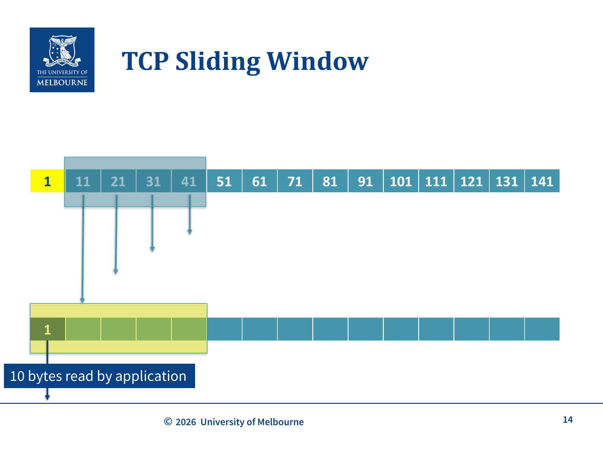
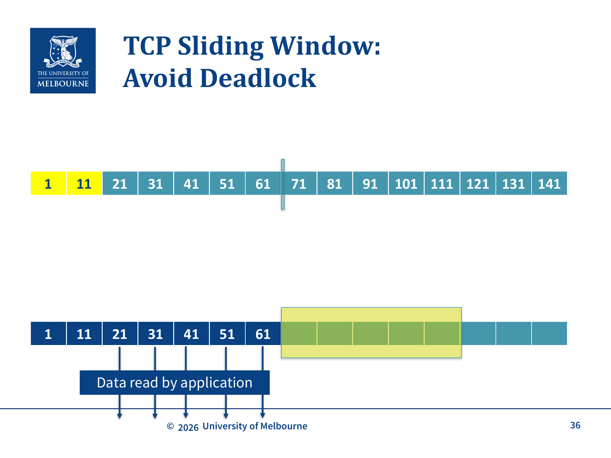
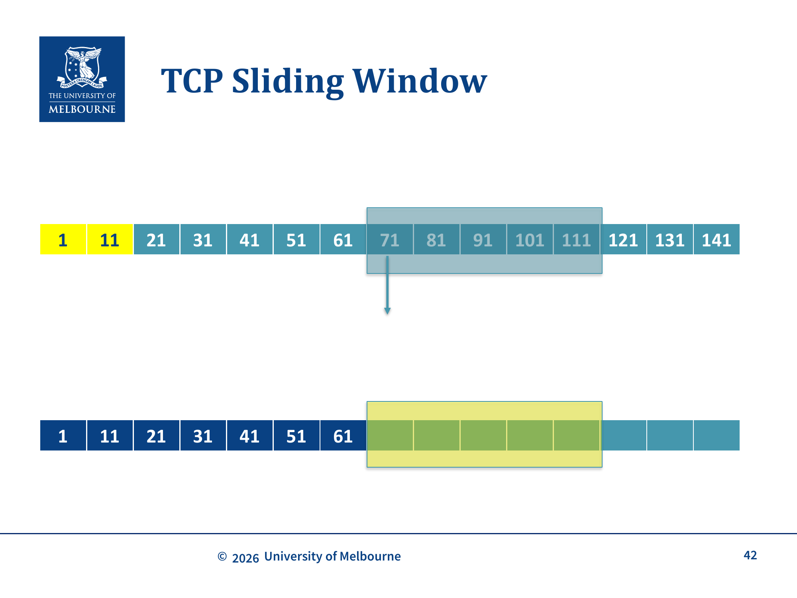
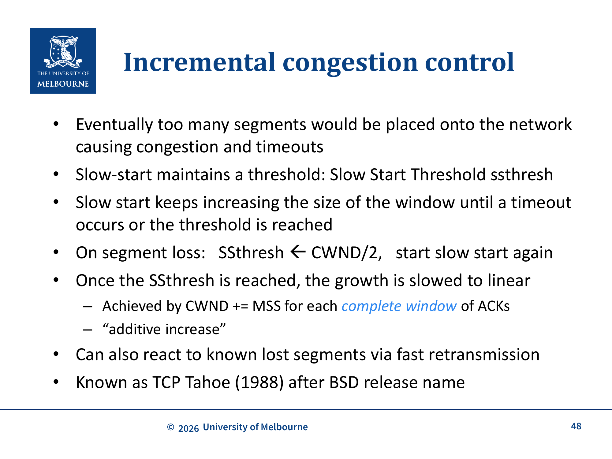

# WK10 - TCP Sliding Window and Congestion Control

## 课件概述

本课件深入讲解 TCP 的核心机制：Sliding Window（滑动窗口）和 Congestion Control（拥塞控制）。Sliding Window 是 TCP 的"魔法"，它同时提供可靠性、有序传输和速率控制。拥塞控制是 TCP 在网络拥塞时自动降低发送速率的机制，是互联网稳定运行的关键。

---

## 必须掌握的知识点

### 1. TCP Sliding Window 回顾


*TCP Sliding Window 机制：发送方和接收方维护缓冲区，接收方通过 ACK 告知可用窗口大小，发送方据此控制发送速率*

#### What（是什么）
Sliding Window 提供三大功能：
- **Reliability**（可靠性）：确保数据正确到达
- **In-order delivery**（有序传输）：数据按顺序到达
- **Rate control**（速率控制）：防止发送过快

#### How（工作原理）

**窗口类型**：
- **Send Window**: 发送方能发送的数据 = 未确认 segments + 能装入接收窗口的未发送数据
- **Receive Window**: 接收方愿意接收的数据量（在 ACK 中通告）
- **Other windows**: 用于拥塞控制（CWND）

**关键不变量**：
```
LastByteSent - LastByteAcked <= ReceiveWindowAdvertised
```

**窗口为 0 时的处理**：
- 发送方不应发送数据
- 但可以发送 **URGENT data**
- 可以发送 **ACK packets**（0 bytes data）
- 可以发送 **zero window probe**（0 字节 segment），让接收方重新通告窗口大小，防止死锁

**死锁场景与 Persist Timer：**
- 当接收方缓冲区满（window=0）且应用层不读取数据时，接收方不会发送ACK
- 发送方收到 window=0 后停止发送，等待接收方的 WindowUpdate
- 但接收方也在等待发送方发送数据——造成**死锁**
- **解决方案：** 发送方启动 **Persist Timer**（坚持定时器），超时后发送 **ZeroWindowProbe**，强制接收方重新通告窗口大小
- 注意区分：**WindowUpdate** 由接收方发起（有数据可读时），**ZeroWindowProbe** 由发送方主动发起（防止死锁）


*避免死锁：应用层读取数据后，接收方发送 ACK 通告新的窗口大小，发送方窗口向前滑动*


*窗口滑动：接收方确认数据后，发送窗口向前移动，允许发送更多数据*

**延迟发送**：
- 发送方可能延迟发送，等待更多数据填满窗口
- 例如：不立即发送 1000B，而是等待更多数据填满 1500B packet
- **课件数值（对应 slide p.8）**：另一种说法是"已有 1000B，再等 **500B** 凑满一个 **1500B** 的 packet 才发"——核心都是用延迟换更少的 segment/header 开销，但代价是延迟

**把零窗口、丢包、persist/probe 串成一条完整 trace（对应 slide p.23–41，承接 WK9 的 byte trace，seg size=10）**：
```
正常发送中，seg 21 在路上丢失，31/41/51/... 到达接收方
→ 接收方对每个收到的乱序 segment 回 DupACK:21, Window:50（重复确认，窗口仍 50）
→ 发送方收到 ACK + 3 个 DupACK:21 → 触发 Fast Retransmit，重传 seg 21
→ seg 21 到达，接收方按序收到 1-70 → 回 ACK:71, Window:0（缓冲被占满！）
→ 发送方收到 Window:0，停止发送，等接收方应用读数据
→ 死锁风险：若那条 WindowUpdate 丢了，双方互等
→ 发送方 Persist Timer 超时 → 发 ZeroWindowProbe
→ 接收方回 ZeroWindowProbeACK:71, Window:50（应用已读，窗口恢复）
→ 发送方恢复发送
```
这条 trace 把"丢包→3 DupACK→fast retransmit→Window:0→persist→probe→恢复"串成一个闭环，是 WK9 滑动窗口 + WK10 拥塞/死锁的合体考点。

**缓冲区独立于应用：** 发送方和接收方的缓冲区独立于应用层运行。发送方可能缓冲数据等待填充更大的 segment，接收方也可能延迟将数据交付给应用——**不能保证数据立即被发送或读取**。这意味着窗口不会总是在应用读写后立即滑动。

---

### 2. Segment Loss 处理

#### 问题
当 segment 丢失时，接收方会收到乱序的数据，需要机制来检测和重传丢失的 segment。

#### 解决方案：Fast Retransmit（快速重传）

**触发条件**：收到 **3 个重复 ACK**（3 DupACKs）

**过程**：
1. 发送方发送 segments: 1, 11, 21, 31, 41, 51
2. Segment 21 丢失
3. 接收方收到 31, 41, 51（乱序），发送 ACK:21（重复）
4. 发送方收到 3 个重复 ACK:21
5. 发送方**立即重传** segment 21，不等待超时

**为什么是 3 个重复 ACK？**
- 1-2 个重复 ACK 可能是网络乱序导致
- 3 个重复 ACK 强烈暗示 segment 丢失

---

### 3. 两种流控机制

#### Go-back-N（回退 N）
- 当 packet 丢失时，从丢失点开始，**重传所有后续 packets**
- 优点：接收方不需要存储/重排 packets
- 缺点：重传大量可能已正确到达的数据

#### Selective Repeat（选择性重传）
- 只重传**丢失的 packet**
- Packets 可能乱序到达，接收方必须**存储乱序 packets**，然后按顺序交给应用层
- 更复杂，只在丢包常见时才有优势

#### 历史背景
- 链路层已经有流控和错误控制
- TCP 最初使用链路层的经验（Go-back-N）
- **这是一个糟糕的设计决定**

**为什么是糟糕的决定：** 链路层假设错误很少（因为它在物理链路上运行，出错率低），Go-back-N 在错误少时效率尚可。但 TCP 运行在互联网上，丢包是**常态**。每次丢包时 Go-back-N 重传 N 个 packets，这**加剧了拥塞**——每次丢包导致更多数据进入网络，形成恶性循环，直接导致了 1980 年代的拥塞崩溃。

---

### 4. Congestion Collapse（拥塞崩溃）

#### What（是什么）
1980 年代末，互联网发生了**拥塞崩溃**：
- 发送一个 packet 到隔壁大楼需要**几十分钟**

#### Why（为什么会发生）
- Router buffers 溢出，导致高丢包率
- 发送方使用 Go-back-N，每次丢包导致 **N 个更多 packets** 进入系统
- 形成恶性循环：丢包 → 重传 → 更多 packets → 更多丢包

**Pre-Jacobson 的基线（对应 slide p.44）**：在 Jacobson 之前，TCP **只有接收窗口（rwnd）做流控**，没有拥塞窗口——发送方完全不知道网络中间拥塞了，只看接收方还能不能收。所以拥塞发生在**网络**（路由器缓冲）而非**接收方缓冲**，rwnd 根本感知不到，于是窗口开得很大、持续往已拥塞的网络里灌包。Jacobson 引入 **CWND** 正是为了让发送方对"网络这一侧"也有限制。

#### How（如何解决）
Van Jacobson 诊断并解决了问题：
- 引入 **Selective Repeat**（fast retransmit）
- 引入 **Congestion Window (CWND)**
- **"Packet conservation" principle**: 只有在旧 packet 离开网络后才发送新 packet

---

### 5. Congestion Control Window (CWND)

#### What（是什么）
- **CWND (Congestion Window)**: 拥塞窗口，由**发送方**维护
- 动态调整，基于 packet loss 来限制发送速率到网络容量
- 与 Receive Window 不同：CWND 是发送方自己维护的，不需要修改 packet 格式

#### Why（为什么需要）
- Receive Window 只能防止**接收方缓冲区溢出**
- 但不能防止**网络拥塞**
- CWND 解决了网络拥塞问题

---

### 6. Slow Start（慢启动）

#### What（是什么）
- 初始：CWND = Maximum Segment Size (MSS)
- 发送方只发送 1 个 segment

#### How（增长过程）
1. 每收到一个 ACK：CWND += MSS
2. 发送方发送 2 个更多 segments（1 个替换已 ACK 的，1 个因为窗口增长）
3. 每个完整窗口的 ACK 使拥塞窗口**翻倍**
4. **指数增长**，直到：
   - 超时（timeout）
   - 达到阈值 **ssthresh**

#### 关键理解
- "Slow Start" 名称有误导性——实际上是**指数增长**
- "Slow" 是相对于最初一次发送整个窗口来说的

---

### 7. Congestion Avoidance（拥塞避免）

#### 机制
- 当 CWND 达到 **ssthresh** 时，增长变为**线性**
- 实现：每个完整窗口的 ACK，CWND += MSS
- 称为 **"Additive Increase"**（加法增长）

#### 丢包处理
- 当发生丢包时：**ssthresh = CWND / 2**
- 重新开始 slow start

---

### 8. TCP Tahoe (1988)


*TCP Tahoe 拥塞控制：Slow Start（指数增长）→ 达到 ssthresh 后 Congestion Avoidance（线性增长）→ 丢包时 ssthresh=CWND/2 重新 Slow Start*

#### What（是什么）
TCP Tahoe 是 BSD Tahoe 版本中的 TCP 实现，引入了：
- **Slow Start**
- **Congestion Avoidance**
- **Fast Retransmit**

#### 工作流程
1. 初始：CWND = MSS, ssthresh = 大值
2. Slow Start：指数增长
3. 达到 ssthresh → Congestion Avoidance：线性增长
4. 超时或 3 DupACKs → ssthresh = CWND/2, 重新 Slow Start

---

### 9. TCP Reno（优化）

#### What（是什么）
TCP Reno 在 Tahoe 基础上增加了 **Fast Recovery**（快速恢复）：

#### 改进
- 当 fast retransmit 触发时：
  - ssthresh = CWND / 2
  - CWND = ssthresh + 3（因为有 3 个 DupACKs 说明有 3 个 packets 到达了接收方）
  - 直接进入 **Congestion Avoidance**，跳过 Slow Start

#### 对比

| 事件 | TCP Tahoe | TCP Reno |
|------|-----------|----------|
| 超时 | ssthresh=CWND/2, Slow Start | ssthresh=CWND/2, Slow Start |
| 3 DupACKs | ssthresh=CWND/2, Slow Start | ssthresh=CWND/2, **Fast Recovery** |

**SACK（Selective Acknowledgment，对应 slide p.54，非考）**：标准 TCP 的累积 ACK 只能说"我连续收到到第 N 字节"，中间多段丢失时发送方不知道哪些段其实到了。**SACK** 在 TCP option 里额外通告**最多 3 段已收到的字节范围**，让发送方只重传真正缺的段，而非 go-back-N 式全重传。这对高带宽延迟乘积（BDP）链路特别有用，但不属于期末考点，了解概念即可。

---

### 10. 宏观模型（Macroscopic Model）⚠️ 以下内容为扩展知识，非考试范围（not examinable）

#### 窗口大小公式
- W 每个窗口增加一次
- 近似：每个到达的 packet 使 W 增加 1/W
- 当丢包发生（概率 p）时，W 减半

**平衡状态**：
```
W ≈ √(2/p)
```

#### 速率公式
- 窗口每 RTT (T) 发送一次
```
Rate ≈ W/T = √(2/p)/T
```

#### 两个重要洞察
1. **RTT 不公平性**：对于给定的丢包率，RTT 更长的流获得更少的速率
2. **如果 RTT 很小，TCP 会强制丢包率很高**

---

### 11. 现代拥塞控制 ⚠️ 背景了解，不背细节

#### 问题
- 对于高带宽、长距离的网络（如跨洲数据中心），TCP Reno 需要**不现实的小丢包率**
- 数据中心内部的需求又不同

#### 解决方案
- **DCTCP**: 数据中心内部使用
- **Google's BBR**: 数据中心之间使用
- IETF 不愿改变标准，公司自己实现

**复习处理：** 课件把DCTCP/BBR放在"And finally"里，用来说明为什么Reno不适合所有现代网络。期末重点仍是Sliding Window、CWND、Slow Start、Congestion Avoidance、Tahoe/Reno；不需要背DCTCP/BBR算法细节。

---

## 关键术语

| 术语 | 定义 |
|------|------|
| Sliding Window | 滑动窗口，TCP 流量控制机制 |
| Receive Window | 接收窗口，接收方通告的可接收数据量 |
| CWND | Congestion Window，拥塞窗口，发送方维护 |
| ssthresh | Slow Start Threshold，慢启动阈值 |
| Slow Start | 慢启动，指数增长阶段 |
| Additive Increase | 加法增长，线性增长阶段 |
| Multiplicative Decrease | 乘法减少，丢包时窗口减半 |
| Fast Retransmit | 快速重传，3 DupACKs 触发 |
| Fast Recovery | 快速恢复，TCP Reno 的优化 |
| Go-back-N | 回退 N，重传丢失点之后的所有数据 |
| Selective Repeat | 选择性重传，只重传丢失的数据 |
| Congestion Collapse | 拥塞崩溃，网络严重过载 |
| MSS | Maximum Segment Size，最大 segment 大小 |
| RTT | Round Trip Time，往返时间 |
| DupACK | Duplicate ACK，重复确认 |

---

## 常见问题

### Q1: Slow Start 为什么叫"慢"？
实际上 Slow Start 是**指数增长**，并不慢。"Slow" 是相对于最初一次发送整个窗口来说的。它从 1 个 segment 开始，逐步探测网络容量。

### Q2: CWND 和 Receive Window 有什么区别？
- **Receive Window**: 接收方通告，防止接收方缓冲区溢出
- **CWND**: 发送方维护，防止网络拥塞
- 实际发送窗口 = min(CWND, Receive Window)

### Q3: 为什么是 3 个重复 ACK 触发 Fast Retransmit？
- 1-2 个重复 ACK 可能是网络乱序
- 3 个重复 ACK 强烈暗示 segment 丢失
- 这是一个启发式（heuristic），不是绝对正确

### Q4: TCP Tahoe 和 Reno 的主要区别？
- Tahoe: 无论超时还是 3 DupACKs，都回到 Slow Start
- Reno: 3 DupACKs 触发 Fast Recovery，直接进入 Congestion Avoidance

### Q5: 什么是 RTT 不公平性？
这是宏观模型给出的背景洞察，属于not examinable部分。知道"长RTT流可能吃亏"即可，不需要背公式或推导。

---

## 知识点之间的联系

```
WK9-TCP (TCP 基础)
    ↓ Sliding Window
WK10-TCP-Flow-Congestion-Control (流控和拥塞控制)
    ↓ 网络层
WK10-Addressing-Switching (IP 寻址)
    ↓ 路由
WK11-Routing (路由算法)
```

- **Sliding Window** 是 TCP 的核心机制
- **CWND** 与 **Receive Window** 共同决定发送速率
- **Fast Retransmit** 解决了拥塞崩溃问题
- **TCP Tahoe/Reno** 是拥塞控制的演进
- **宏观模型、DCTCP/BBR** 是背景材料，不作为主要复习对象

---

## 实际应用案例

### 案例 1: 文件传输的拥塞控制
```
1. 连接建立，CWND = 1 MSS
2. Slow Start: 1 → 2 → 4 → 8 → 16 segments
3. 达到 ssthresh，进入 Congestion Avoidance
4. 线性增长：16 → 17 → 18 → ...
5. 检测到丢包（3 DupACKs）
6. Fast Retransmit + Fast Recovery
7. ssthresh = CWND/2, 继Congestion Avoidance
```

### 案例 2: 视频流的拥塞控制
- 实时视频流使用 TCP 可能导致延迟
- 更好的选择：UDP + 应用层拥塞控制
- WebRTC 使用 GCC (Google Congestion Control)，属于背景理解

### 案例 3: 数据中心网络
- 传统 TCP Reno 在数据中心环境中表现不佳
- DCTCP (Data Center TCP) 使用 ECN 标记来更早检测拥塞
- Google's BBR 基于带宽和延迟建模，而不是丢包
- 这些现代算法不用背细节

---

## 常见错误和易错点

### ❌ 错误 1: 认为 Slow Start 是线性增长
Slow Start 是**指数增长**（每 RTT 翻倍）。Congestion Avoidance 才是线性增长。

### ❌ 错误 2: 混淆 Receive Window 和 CWND
- Receive Window: 接收方控制，防止接收方溢出
- CWND: 发送方控制，防止网络拥塞

### ❌ 错误 3: 认为 Fast Retransmit 需要等待超时
Fast Retransmit 在收到 **3 个重复 ACK** 时立即触发，不需要等待超时。

### ❌ 错误 4: 认为 TCP Tahoe 和 Reno 处理 3 DupACKs 的方式相同
- Tahoe: 回到 Slow Start
- Reno: Fast Recovery，直接进入 Congestion Avoidance

### ❌ 错误 5: 忘记 ssthresh 的更新时机
ssthresh 只在**丢包时**更新：ssthresh = CWND / 2

---

## 课件总结

本课件深入讲解了 TCP 的两大核心机制：
1. **Sliding Window**: 流量控制、可靠传输、有序传输
2. **Congestion Control**: Slow Start → Congestion Avoidance → Fast Retransmit/Fast Recovery

TCP 的拥塞控制从最初的简单机制演进到 Tahoe（1988）和 Reno，解决了拥塞崩溃问题。现代网络（数据中心、长距离传输）需要新的拥塞控制算法（DCTCP, BBR），但这些只需作为背景了解。

---

## 复习建议

1. **画出 Sliding Window 的变化过程**：理解窗口如何滑动、ACK 如何影响窗口
2. **理解 Slow Start 和 Congestion Avoidance 的区别**：指数 vs 线性增长
3. **掌握 Fast Retransmit 的触发条件**：3 个重复 ACK
4. **对比 TCP Tahoe 和 Reno**：Fast Recovery 的作用
5. **不要把宏观模型当重点**：W ≈ √(2/p) 和速率公式明确属于not examinable背景，最多理解结论。

---

*课件来源: COMP30023 2026 S1 WK10*
## 默写背诵 Dictation

> 以下为本章必须能默写的中英对照；网站「默写 Recite」Tab 提供自测模式。

| # | 默写提示 Prompt | 标准答案 Answer |
|---|----------------|----------------|
| 1 | rwnd vs cwnd — who sets each? (slide p.45) · rwnd vs cwnd——各由谁决定？（课件 p.45） | **EN:** rwnd = receiver advertises (flow control); cwnd = sender infers from network (congestion control). / **中文：** rwnd = 接收方通告（流量控制）；cwnd = 发送方根据网络推断（拥塞控制）。 |
| 2 | Effective send window formula. · 有效发送窗口公式。 | **EN:** min(rwnd, cwnd) — unacknowledged data may not exceed this. / **中文：** min(rwnd, cwnd)——未确认数据不得超过此值。 |
| 3 | Slow start — cwnd growth (slide p.46). · 慢启动——cwnd 增长（课件 p.46）。 | **EN:** Increase cwnd by one MSS for each ACK received (exponential growth per RTT). / **中文：** 每收到一个 ACK，cwnd 增加一个 MSS（每 RTT 近似翻倍）。 |
| 4 | Congestion avoidance — cwnd growth (slide p.48). · 拥塞避免——cwnd 增长（课件 p.48）。 | **EN:** Linear increase: add MSS per window of ACKs (additive increase). / **中文：** 线性增加：每窗口 ACK 增加 MSS（加法增长）。 |
| 5 | TCP Tahoe on loss (slide p.48). · TCP Tahoe 丢包时（课件 p.48）。 | **EN:** ssthresh = cwnd/2 before loss; cwnd = 1 MSS; restart slow start. / **中文：** 丢包前 cwnd 一半设为 ssthresh；cwnd = 1 MSS；重新慢启动。 |
| 6 | Fast retransmit trigger — 3 DupACKs (slide p.27). · 快重传触发——3 个 DupACK（课件 p.27）。 | **EN:** Three duplicate ACKs for same sequence number — infer loss without waiting for timeout. / **中文：** 同一序号三个重复 ACK——不等超时就推断丢包。 |
| 7 | TCP Reno vs Tahoe on fast retransmit (slide p.50). · Reno vs Tahoe 快重传后（课件 p.50）。 | **EN:** Reno: halve cwnd and enter fast recovery; Tahoe: cwnd=1 MSS and restart slow start. / **中文：** Reno：cwnd 减半并 fast recovery；Tahoe：cwnd=1 MSS 并重新慢启动。 |
| 8 | Zero window — URGENT data and probe (slide p.8). · 零窗口——URGENT 数据与 probe（课件 p.8）。 | **EN:** When rwnd=0 sender stops data; may send URGENT data or zero-window probe to get new window. / **中文：** rwnd=0 时发送方停发数据；可发 URGENT 数据或 zero-window probe 获取新窗口。 |
| 9 | Persist timer and ZeroWindowProbe. · Persist 定时器与 ZeroWindowProbe。 | **EN:** If window stays zero, persist timer fires → sender sends ZeroWindowProbe → receiver re-advertises rwnd. / **中文：** 窗口持续为零时 persist 定时器超时 → 发送 ZeroWindowProbe → 接收方重新通告 rwnd。 |
| 10 | Full trace — SYN:1 Window:50 through seg21 dupACK (slide p.23–41). · 完整 trace——SYN:1 Window:50 到 seg21 dupACK（课件 p.23–41）。 | **EN:** Handshake Window:50 → send/receive → seg21 lost → DupACK:21 ×3 → fast retransmit → ACK:71 Window:0 → persist probe → Window:50 restored. / **中文：** 握手 Window:50 → 收发 → seg21 丢 → DupACK:21 三次 → 快重传 → ACK:71 Window:0 → persist probe → 窗口恢复 50。 |
| 11 | Pre-Jacobson TCP — only rwnd (slide p.44). · Jacobson 之前——仅 rwnd（课件 p.44）。 | **EN:** Before Jacobson, TCP used only rwnd for flow control — no cwnd; senders could not detect network congestion. / **中文：** Jacobson 之前 TCP 仅用 rwnd 流控——无 cwnd；发送方无法感知网络拥塞。 |
| 12 | ssthresh role and DupACK meaning. · ssthresh 作用与 DupACK 含义。 | **EN:** ssthresh = threshold between slow start and congestion avoidance; DupACK = receiver repeats same ACK when out-of-order segment arrives. / **中文：** ssthresh = 慢启动与拥塞避免之间的阈值；DupACK = 乱序段到达时接收方重复同一 ACK。 |

