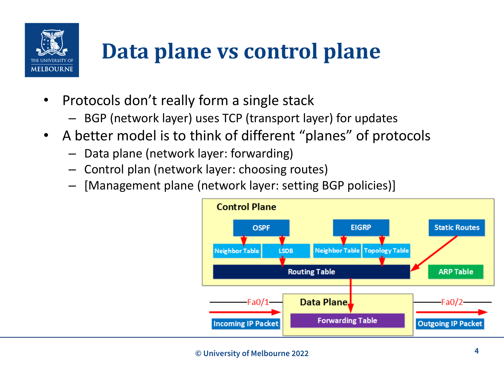
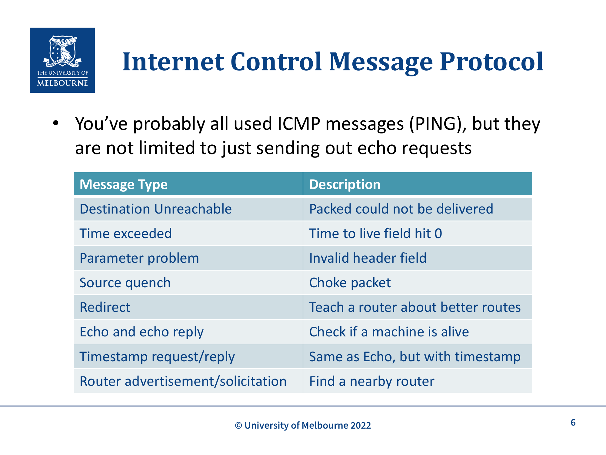
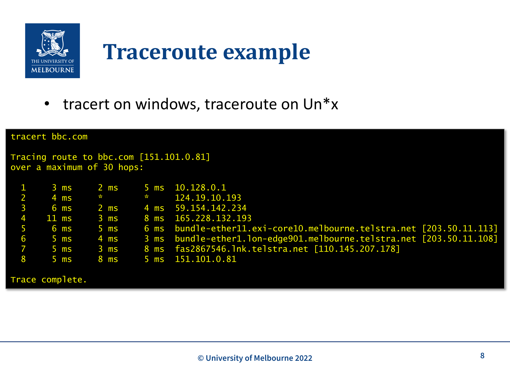
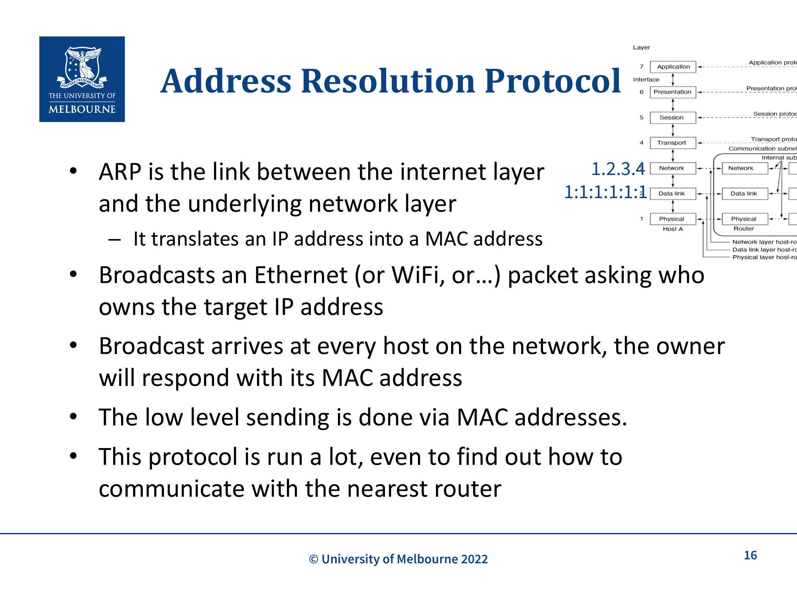

# WK11 - Internet Control Protocols (ICMP, DHCP, ARP)

## 课件概述

本课件介绍互联网网络层的三个关键控制协议：ICMP（Internet Control Message Protocol）、DHCP（Dynamic Host Configuration Protocol）和 ARP（Address Resolution Protocol）。这些协议虽然不属于数据传输的核心路径，但对于网络的正常运行、故障诊断和地址管理至关重要。

---

## 必须掌握的知识点

### 1. Data Plane vs Control Plane


*Data Plane vs Control Plane：Control Plane 通过 OSPF/EIGRP 等协议构建 Routing Table，Data Plane 根据 Forwarding Table 转发数据包*

#### What（是什么）
协议并不真的形成单一的栈。更好的模型是将协议分为不同的"平面"：
- **Data Plane**（数据平面）：网络层的**转发**功能
- **Control Plane**（控制平面）：网络层的**路由选择**功能
- **Management Plane**（管理平面）：网络层的 BGP 策略设置

#### Why（为什么需要区分）
- BGP（网络层）使用 TCP（传输层）进行更新
- 这打破了传统的分层模型
- 需要更灵活的理解方式

---

### 2. ICMP (Internet Control Message Protocol)


*ICMP 消息类型：Destination Unreachable、Time Exceeded（traceroute 利用此机制）、Echo/Reply（ping 使用）等*

#### What（是什么）
ICMP 是网络层的**管理协议**，用于报告错误和传递控制信息。最常见的应用是 `ping`。

#### ICMP 消息类型

| Message Type | Description |
|--------------|-------------|
| **Destination Unreachable** | Packet 无法送达 |
| **Time exceeded** | TTL 字段减到 0 |
| **Parameter problem** | 无效的 header 字段 |
| **Source quench** | 阻塞包（choke packet） |
| **Redirect** | 教会 router 更好的路由 |
| **Echo and echo reply** | 检查机器是否在线 |
| **Timestamp request/reply** | 与 Echo 相同，但带时间戳 |
| **Router advertisement/solicitation** | 查找附近的 router |

#### ICMP 在协议栈中的位置
ICMP 是**网络层协议**，但它的消息**封装在 IP packet 中**传输。

---

### 3. Traceroute（路由追踪）


*Traceroute 输出示例：通过逐步增加 TTL 值，逐跳发现从源到目的地的路径，每跳显示 3 次 RTT*

#### What（是什么）
Traceroute 是一个利用 ICMP Time Exceeded 消息来追踪 packet 路径的工具。

#### How（工作原理）
1. 发送 TTL=1 的 packet → 第一个 router 收到后 TTL 减到 0，返回 **Time Exceeded** 消息（包含 router 的 IP 地址）
2. 发送 TTL=2 的 packet → 第二个 router 返回 Time Exceeded
3. 发送 TTL=3 的 packet → 第三个 router 返回 Time Exceeded
4. 重复直到到达目的地

#### 实际输出示例
```
tracert bbc.com
Tracing route to bbc.com [151.101.0.81] over 30 hops:
1   3 ms   2 ms   5 ms   10.128.0.1
2   4 ms   *      *      124.19.10.193
3   6 ms   2 ms   4 ms   59.154.142.234
...
8   5 ms   8 ms   5 ms   151.101.0.81
```

**关键理解**：
- `*` 表示请求超时（router 不返回 ICMP 消息）
- 每一行是路径上的一个 hop
- IP 地址是每个 router 的接口地址

---

### 4. DHCP (Dynamic Host Configuration Protocol)

#### What（是什么）
DHCP 自动化 IP 地址分配。每个网络都有一个 DHCP server 来发放 IP 地址。

#### Why（为什么需要）
- 手动配置每个主机：困难、容易出错
- 对新设备响应慢
- 移动设备需要频繁重新配置

#### How（工作过程）

```
Client                              DHCP Server
  |                                    |
  |--- DHCP DISCOVER (广播) --------->|  (我在哪里？我需要 IP)
  |                                    |
  |<-- DHCP OFFER --------------------|  (给你一个 IP: 192.168.1.100)
  |                                    |
  |--- DHCP REQUEST ----------------->|  (我要用这个 IP)
  |                                    |
  |<-- DHCP ACK ----------------------|  (确认，租期 24 小时)
  |                                    |
  |         IP Address Assigned        |
```

**关键细节**：
- **DHCP DISCOVER** 通过 UDP 广播发送
- Router 可以配置为**中继**这些请求到 DHCP server（如果不是直接连接）
- IP 地址通常有**租期（lease）**——到期后 server 会回收并重新发放
- 主机可以在租期到期前请求**续租**
- 还可以设置其他参数：默认网关、DNS server 地址、时间 server
- **安全风险：** DHCP 允许任何连接的设备获取 IP 地址（可以应用 MAC 限制，但基本机制无认证）

#### DHCP 在协议栈中的位置
- DHCP 是 **Layer 7（应用层）协议**，属于 **Control Plane**
- 尽管它被网络层使用，但它本身运行在 UDP 之上
- 这打破了传统的分层模型

---

### 5. MAC Address

#### What（是什么）
- **MAC (Media Access Control) Address**: 网络接口的**硬件地址**
- 可以看作是接口的**全局唯一标识符**
- 通常由制造商**硬编码**
- 48 或 64 bits 长，例如：`00:1A:2B:3C:4D:5E`
- 工作在 **Host-to-network/Data Link layer**

#### Why（为什么需要）
- DHCP 请求时还没有 IP 地址，需要用 MAC 地址来标识
- 底层网络（Ethernet/WiFi）使用 MAC 地址进行通信

---

### 6. ARP (Address Resolution Protocol)


*ARP 是连接 Network Layer（IP 地址）和 Data Link Layer（MAC 地址）的桥梁，通过广播请求将 IP 地址解析为 MAC 地址*

#### What（是什么）
ARP 是网络层和底层网络层之间的**桥梁**：
- 将 **IP 地址** 转换为 **MAC 地址**
- 使得 IP packet 能在 Ethernet/WiFi 网络上传输

#### How（工作过程）

```
Host A (1.2.3.4)                     Host B (5.6.7.8)
  |                                    |
  |--- ARP Request (广播):             |
  |    "谁拥有 IP 5.6.7.8？"          |
  |                                    |
  |<-- ARP Response (单播):            |
  |    "我是 5.6.7.8，MAC 是 XX:XX:XX"|
  |                                    |
  |         用 MAC 地址通信            |
```

**关键细节**：
- ARP **广播**一个 Ethernet packet，询问谁拥有目标 IP 地址
- 广播到达网络上的**每个主机**，拥有者会用其 MAC 地址响应
- 低层发送是通过 MAC 地址完成的
- 这个协议运行非常频繁，甚至用于查找最近的 router

#### ARP Cache
- 为了提高效率，主机会**缓存** ARP 响应
- 缓存有过期时间

---

### 7. ARP Spoofing（ARP 欺骗攻击）

#### What（是什么）
ARP 是**安全噩梦**：
- **没有认证机制**
- 缓存响应，即使不是直接请求的
- **ARP Spoofing** 是大多数中间人攻击的**入口攻击**

#### How（攻击原理）
1. 攻击者发送伪造的 ARP 响应
2. 将攻击者的 MAC 地址与另一个主机的 IP 地址关联
3. 例如：将攻击者的 MAC 与默认网关、DNS server、网站的 IP 关联
4. 所有流量都会经过攻击者

#### 防御
- **Dynamic ARP Inspection (DAI)**
- **DHCP Snooping**
- 静态 ARP 条目（不实用）

---

### 8. Data Plane vs Control Plane 总结

| Plane | 功能 | 协议示例 |
|-------|------|----------|
| **Data Plane** | 数据转发 | IP |
| **Control Plane** | 路由选择、地址管理 | BGP, OSPF, DHCP, ARP |
| **Management Plane** | 策略配置 | BGP policies |

**关键理解**：
- DHCP 是 Layer 7 协议（运行在 UDP 上），但属于 Control Plane
- ARP 是 Link Layer 协议，但为 Network Layer 服务
- 协议栈不是严格的分层，而是有交叉
- **注意：** 在本课程之外，"Control Plane"一词通常**仅指路由协议**（如 BGP, OSPF），不包括 DHCP/ARP。本课程将这些都归入 Control Plane 是为了理解方便。

---

## 关键术语

| 术语 | 定义 |
|------|------|
| ICMP | Internet Control Message Protocol，网络层控制消息协议 |
| DHCP | Dynamic Host Configuration Protocol，动态主机配置协议 |
| ARP | Address Resolution Protocol，地址解析协议 |
| MAC Address | Media Access Control Address，硬件地址 |
| TTL | Time To Live，packet 的跳数限制 |
| Traceroute | 路由追踪工具，利用 ICMP Time Exceeded |
| DHCP DISCOVER | DHCP 客户端广播请求 |
| DHCP OFFER | DHCP 服务器提供的 IP 地址 |
| DHCP REQUEST | 客户端确认使用该 IP |
| DHCP ACK | 服务器确认分配 |
| ARP Request | 广播询问谁拥有某 IP |
| ARP Response | 单播回复 MAC 地址 |
| ARP Spoofing | ARP 欺骗攻击 |
| Data Plane | 数据转发平面 |
| Control Plane | 控制平面（路由、地址管理） |

---

## 常见问题

### Q1: ICMP 是网络层还是传输层协议？
ICMP 是**网络层协议**，但它的消息封装在 IP packet 中。它不提供数据传输服务，而是提供错误报告和控制信息。

### Q2: DHCP 为什么是应用层协议？
因为 DHCP 运行在 **UDP** 之上（端口 67/68），使用客户端-服务器模型。尽管它为网络层服务，但它本身是应用层协议。

### Q3: ARP 为什么是安全噩梦？
因为：
- 没有认证机制
- 缓存所有响应（即使不是直接请求的）
- 攻击者可以轻易发送伪造的 ARP 响应
- 是中间人攻击的入口

### Q4: Traceroute 如何工作？
通过发送递增 TTL 的 packets，每个 router 在 TTL 减到 0 时返回 ICMP Time Exceeded 消息，从而揭示路径上的每个 router。

### Q5: 为什么需要 MAC 地址和 IP 地址两套地址？⚠️ 补充知识，非考试内容（Not examinable）
- **MAC 地址**: 硬件层面的标识，全球唯一，用于本地网络通信
- **IP 地址**: 逻辑层面的标识，用于路由和端到端通信
- 两层地址使得网络更灵活（IP 可以改变，MAC 不变）

---

## 知识点之间的联系

```
WK10-Addressing-Switching (IP 地址)
    ↓ 地址解析
WK11-Control (ICMP, DHCP, ARP)
    ↓ 路由
WK11-Routing (路由算法)
    ↓ 地址转换
WK12-NAT (网络地址转换)
```

- **ARP** 将 IP 地址转换为 MAC 地址，是 IP 通信的基础
- **DHCP** 自动分配 IP 地址，减少手动配置
- **ICMP** 提供网络诊断工具（ping, traceroute）
- 这三个协议都是网络正常运行的**基础设施**

---

## 实际应用案例

### 案例 1: 网络故障排查
```
1. ping 目标 → 检查是否可达（ICMP Echo）
2. traceroute 目标 → 查看路径（ICMP Time Exceeded）
3. 检查 ARP 缓存 → 确认 MAC 地址映射
4. 检查 DHCP 租期 → 确认 IP 地址有效
```

### 案例 2: 企业网络安全
- **ARP Spoofing** 是常见的内部攻击
- 使用 **Dynamic ARP Inspection** 防御
- **DHCP Snooping** 防止伪造 DHCP server

### 案例 3: 移动设备漫游
- 设备从一个网络移动到另一个网络
- DHCP 自动分配新的 IP 地址
- ARP 重新解析网关的 MAC 地址

---

## 常见错误和易错点

### ❌ 错误 1: 认为 ICMP 是传输层协议
ICMP 是**网络层协议**，封装在 IP packet 中。

### ❌ 错误 2: 认为 DHCP 是网络层协议
DHCP 是**应用层协议**（运行在 UDP 上），但属于 Control Plane。

### ❌ 错误 3: 认为 ARP 有安全机制
ARP **没有任何认证机制**，是安全噩梦。

### ❌ 错误 4: 混淆 MAC 地址和 IP 地址
- MAC 地址: 硬件标识，48/64 bits，本地网络使用
- IP 地址: 逻辑标识，32/128 bits，路由使用

### ❌ 错误 5: 认为 Traceroute 使用 UDP
Traceroute 使用 **ICMP**（在某些实现中使用 UDP）。

---

## 课件总结

本课件介绍了三个关键的互联网控制协议：
1. **ICMP**: 错误报告和诊断（ping, traceroute）
2. **DHCP**: 自动 IP 地址分配
3. **ARP**: IP 地址到 MAC 地址的转换

这些协议虽然不在数据传输的核心路径上，但对于网络的正常运行、故障诊断和地址管理至关重要。理解它们的工作原理有助于网络编程和故障排查。

---

## 复习建议

1. **理解 ICMP 的消息类型**: 尤其是 Destination Unreachable 和 Time Exceeded
2. **掌握 DHCP 的工作过程**: DISCOVER → OFFER → REQUEST → ACK
3. **理解 ARP 的工作原理**: 广播请求，单播响应
4. **了解 ARP Spoofing**: 攻击原理和防御方法
5. **区分 Data Plane 和 Control Plane**: 哪些协议属于哪个平面？

---

*课件来源: COMP30023 2026 S1 WK11*
