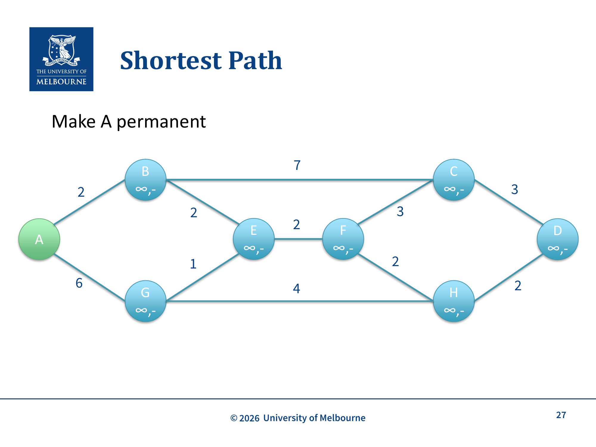
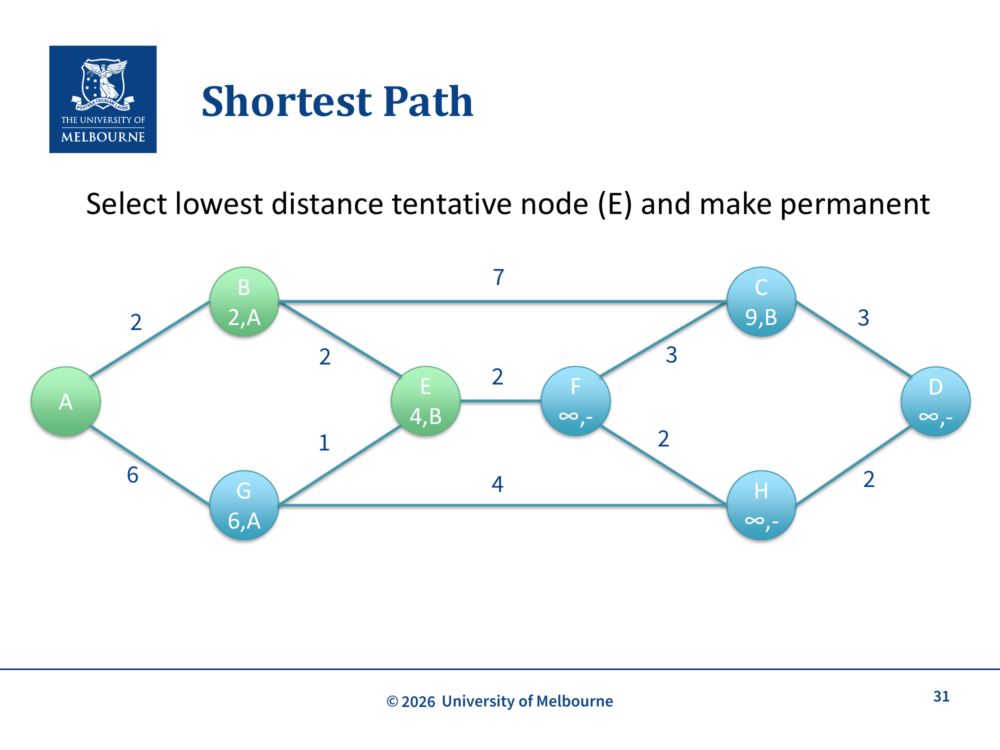
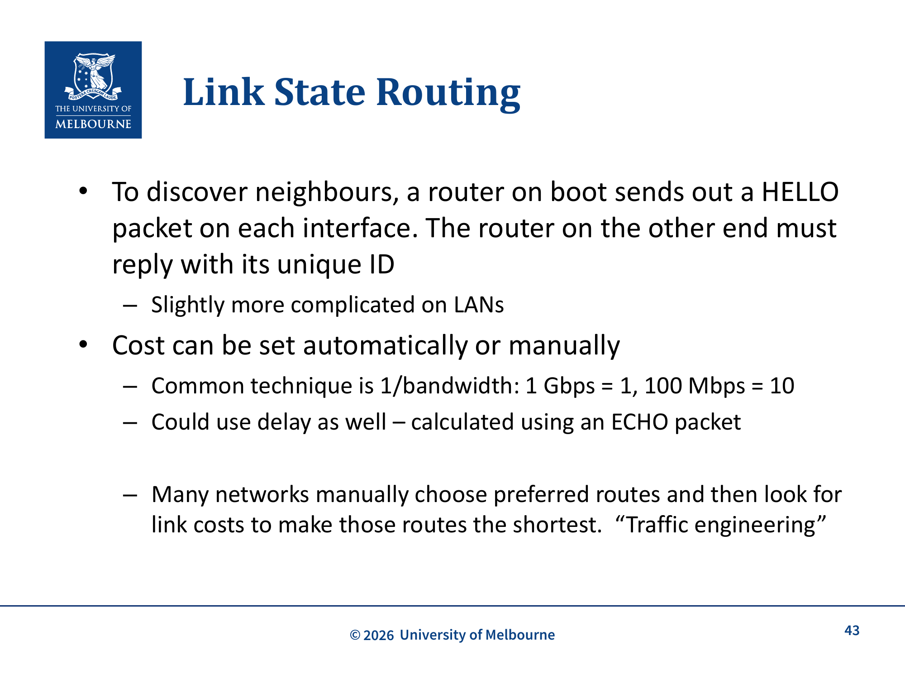

# WK11 - Routing Algorithms

## 课件概述

本课件介绍网络层的路由算法，包括静态路由、自适应路由、Flooding（洪泛）、Bellman最优性原理、Dijkstra 最短路径算法，以及 Link State Routing（链路状态路由，如 OSPF）。本课件考试重点是会区分forwarding/routing、理解flooding的性质、能手动执行Dijkstra、掌握Link State Routing的五步。Distance Vector和BGP只作背景对比。

---

## 必须掌握的知识点

### 1. Forwarding vs Routing

#### What（是什么）
- **Forwarding（转发）**: 当 packet 到达 router 时，根据 forwarding table 决定从哪个接口发出
- **Routing（路由）**: 决定 forwarding table 如何创建

#### How（工作方式）
每个 router 有 forwarding table（路由表）：
1. 检查 packet 的目的 IP 地址
2. 查表确定出接口
3. 将 packet 从该接口转发出去
4. 下一个 router 重复此过程

**关键理解**: Forwarding 是**本地操作**，Routing 是**全局决策**。

---

### 2. 路由算法的性质

一个好的路由算法应该具备：
- **Correctness**: 在所有节点对之间找到有效路由
- **Simplicity**: 简单
- **Robustness**: router 崩溃不需要"网络重启"
- **Stability**: 稳定算法达到平衡并保持
- **Fairness**: 公平
- **Efficiency**: 高效
- **Flexibility**: 能够实现策略

---

### 3. Delay vs Bandwidth 优化

#### 优化目标
- **Mean packet delay**: 平均 packet 延迟
- **Max network throughput**: 最大网络吞吐量

#### 最简单的方法
- **最小化跳数**: packet 需要经过的 router 数量
- 倾向于减少每 packet 带宽并改善延迟
- 但不保证减少实际距离——跨越太平洋可能只是 1 个 IP hop

#### 更灵活的方法
- 为每条链路分配**成本（cost）**
- 更灵活，但仍然不能表达所有路由偏好

---

### 4. 静态路由 vs 自适应路由

#### 静态路由（Non-adaptive）
- **不适应**网络拓扑变化
- **离线计算**，在 router 启动时上传
- **不响应故障**
- 适用于有明确或隐含选择的场景
- 例如：家庭 router——只有一条出路

#### 自适应路由（Adaptive）
- **动态路由**，适应拓扑和流量变化
- 优化某些属性：距离、跳数、估计传输时间等
- 可能从**相邻 router** 或**网络中的所有 router** 获取信息

---

### 5. Flooding（洪泛）

#### What（是什么）
- 将 packet 发送给**所有还没有它的邻居**
- 最简单的非静态路由

#### How（工作过程）
1. 发送 packet 给所有邻居
2. 每个邻居收到后，转发给**除了来源之外的所有邻居**
3. 必须跟踪已转发的 packet，避免重复转发
4. 使用 **TTL** 限制 packet 的传播

#### 优缺点

| 优点 | 缺点 |
|------|------|
| 保证最短距离和最小延迟 | 产生大量重复 packets |
| 速度基准 | 高度低效 |
| 极其 robust——如果有路径就能找到 | 必须有丢弃 packet 的机制（TTL） |

---

### 6. Bellman's Optimality Principle（最优性原理）

#### What（是什么）
> If router J is on the optimal path from router I to K, then the optimal path from J to K also falls along the same route.

如果 router J 在从 I 到 K 的最优路径上，那么从 J 到 K 的最优路径也沿着同一条路线。

#### Why（为什么）
如果存在更好的 J→K 路径，它会与 I→J 路径结合，形成更好的 I→K 路径，这与我们最初假设 I→K 是最优的矛盾。

#### Sink Tree（汇树）
- 最优性原理意味着从所有源到某个目的地的最优路由形成一棵**以目的地为根的树**
- 这就是 **Sink Tree**

---

### 7. Dijkstra's Shortest Path Algorithm


*Dijkstra 算法初始状态：节点 A 为永久节点（绿色），其他节点为 tentative（蓝色），每个节点标记 (距离, 前驱节点)*


*Dijkstra 算法执行中：选择距离最小的 tentative 节点 E（距离 4）设为永久，更新邻居节点的距离和前驱*

#### What（是什么）
- 将网络视为**带标签的图**
- 标签权重基于延迟、距离、成本等
- 找到从源到所有目的地的最短路径

#### How（算法步骤）

**节点分类**：
- **Unseen（未见）**: 不是我们已处理节点的邻居
- **Open（开放）**: 我们"访问"了邻居，但不是它。我们知道一条路径
- **Closed（关闭）**: 我们访问了它。我们知道到它的最短路径

**算法流程**：
1. 访问源节点："Open" 所有邻居，设置距离标签
2. 重复直到所有节点被访问或找到目的地：
   - 检查"工作节点"的相邻节点，计算距离，如果改进则更新标签
   - 检查所有 open 节点，选择距离最低的，标记为 closed
   - 将其作为新的"工作节点"
   - 回到步骤 1

**详细示例**：
```
初始: A=0, 其他=∞

步骤1: A → Open B(2), G(6)
       Make A closed

步骤2: 选 B(2) → Open C(9), E(4)
       Make B closed

步骤3: 选 E(4) → Open F(6), G(5, 更新)
       Make E closed

步骤4: 选 G(5) → Open H(9)
       Make G closed

步骤5: 选 F(6) → Open H(8, 更新)
       Make F closed

步骤6: 选 H(8) → Open D(10)
       Make H closed

步骤7: 选 C(9) → (无改进)
       Make C closed

步骤8: 选 D(10) → 到达目的地
```

**关键理解**：
- 距离必须**非负**
- 标签从**临时（tentative/open）**变为**永久（permanent/closed）**
- 一旦 closed，标签不会再改变

---

### 8. Link State Routing（链路状态路由）


*Link State Routing：通过 HELLO 包发现邻居，使用 1/bandwidth 计算链路代价，通过可靠洪泛传播 Link State Packet，最常见实现是 OSPF*

#### What（是什么）
- 是一种**分布式**算法，取代了收敛慢的 Distance Vector Routing（Bellman-Ford）
- 今天使用的路由协议（如 OSPF）基于此

#### How（5 步过程）

1. **Discover neighbours**: 发送 HELLO packet，邻居回复其唯一 ID
2. **Set cost**: 设置到每个邻居的距离/成本
   - 常见技术：1/bandwidth（1 Gbps = 1, 100 Mbps = 10）
   - 也可以用延迟（通过 ECHO packet 计算）
   - 许多网络手动选择首选路由，然后找到使这些路由最短的链路成本（"Traffic Engineering"）
3. **Construct packet**: 构建包含所有信息的 Link State packet
   - 包含：ID, sequence number, age, 邻居列表和成本
   - **何时构建？** 构建packet本身容易，但决定何时构建很困难——是按固定间隔？还是链路变化时（如断开/恢复）？
4. **Send to all routers**: 使用**可靠洪泛（reliable flooding）**发送到所有 router
   - 使用 ACK 保证每个 router 收到
   - 比较 sequence number，如果不是更大则丢弃
   - Sequence numbers 是 32 bits 避免 wrap-around
   - Age 字段每秒减 1，到 0 时丢弃信息
5. **Compute shortest path**: 使用 Dijkstra 算法计算到每个其他 router 的最短路径

#### OSPF (Open Shortest Path First)
- 最常见的 Link State Routing 协议
- 用于**域内路由**（within a domain）

---

### 9. Distance Vector Routing vs Link State Routing ⚠️ 背景对比，非本课件重点

课件只明确提到：Link State Routing 取代了收敛慢的 Distance Vector Routing（Bellman-Ford），最常见的Link State Routing是OSPF。

**复习处理：** 不需要背完整DV vs LS表格，也不需要掌握Bellman-Ford算法。重点放在：
- Link State Routing的五步：发现邻居、设置cost、构造link state packet、可靠洪泛、运行Dijkstra
- Link State packet包含ID、sequence number、age、邻居及cost
- sequence number和age如何避免旧信息造成问题

---

## 关键术语

| 术语 | 定义 |
|------|------|
| Forwarding | 转发，根据路由表决定 packet 的出接口 |
| Routing | 路由，决定 forwarding table 如何创建 |
| Routing Table | 路由表，映射目的地址到出接口 |
| Flooding | 洪泛，将 packet 发送给所有邻居 |
| Dijkstra's Algorithm | 最短路径算法 |
| Link State Routing | 链路状态路由，OSPF 的基础 |
| Distance Vector Routing | 距离向量路由，Bellman-Ford；本课件背景对比 |
| OSPF | Open Shortest Path First，链路状态路由协议 |
| Sink Tree | 汇树，最优路由形成的树 |
| HELLO Packet | 用于发现邻居的 packet |
| Sequence Number | 序列号，用于避免旧信息 |
| Age | 年龄字段，用于过期信息 |
| Cost | 链路成本，通常基于带宽或延迟 |
| Static Routing | 静态路由，不适应拓扑变化 |
| Adaptive Routing | 自适应路由，动态调整 |

---

## 常见问题

### Q1: Forwarding 和 Routing 有什么区别？
- **Forwarding**: 当 packet 到达时，查表决定从哪个接口发出（本地操作）
- **Routing**: 决定路由表如何创建（全局决策）

### Q2: 为什么 Flooding 不实用？
因为会产生**大量重复 packets**，极度低效。但它极其 robust，如果有路径就能找到。

### Q3: Dijkstra 算法的时间复杂度是多少？
课件没有要求背复杂度。期末更可能考手动执行Dijkstra：维护unseen/open/closed节点，反复选择当前距离最小的open节点并更新邻居。

### Q4: 为什么需要 Age 字段？
因为 router 崩溃重启后，sequence number 可能从 0 开始。Age 字段每秒减 1，到 0 时丢弃信息，避免使用过时的路由信息。

### Q5: OSPF 和 BGP 有什么区别？
OSPF在本课件中作为Link State Routing的常见实现出现；BGP不属于本课件重点。只需知道OSPF是基于Link State的域内路由协议，BGP细节不用背。

---

## 知识点之间的联系

```
WK10-Addressing-Switching (IP 地址)
    ↓ 路由基础
WK11-Routing (路由算法)
    ↓ 实现
OSPF (Link State Routing的常见实现)
    ↓ 地址转换
WK12-NAT (网络地址转换)
```

- **IP 地址**是路由的基础（前缀匹配）
- **Dijkstra 算法**是 OSPF 的核心
- **Link State Routing** 取代了收敛慢的 Distance Vector，但DV算法细节不是本课件重点
- **Flooding** 是 Link State Routing 的一部分（可靠洪泛）

---

## 实际应用案例

### 案例 1: OSPF 在企业网络中的应用
- 企业网络使用 OSPF 进行域内路由
- 每个 router 维护完整的网络拓扑图
- 使用 Dijkstra 算法计算最短路径
- 支持负载均衡和故障恢复

### 案例 2: 家庭路由器的静态路由
- 家庭 router 只有一条出路（到 ISP）
- 使用静态路由：所有流量发往默认网关
- 不需要复杂的路由算法

### 案例 3: 数据中心网络
- 使用 ECMP (Equal-Cost Multi-Path) 路由
- 多条等成本路径，负载均衡
- 需要快速收敛，避免服务中断
- 这是现实背景，不是课件核心考点

---

## 常见错误和易错点

### ❌ 错误 1: 混淆 Forwarding 和 Routing
- Forwarding: 查表转发（本地）
- Routing: 创建路由表（全局）

### ❌ 错误 2: 认为 Dijkstra 算法可以处理负权重
Dijkstra 算法**不能处理负权重**。距离必须非负。

### ❌ 错误 3: 认为 Flooding 是实用的路由协议
Flooding 产生大量重复 packets，极度低效，不实用。

### ❌ 错误 4: 忘记 Age 字段的作用
Age 字段用于处理 router 崩溃重启后 sequence number 从 0 开始的问题。

### ❌ 错误 5: 混淆 OSPF 和 BGP
OSPF是本课件提到的Link State Routing实现；BGP不在本课件核心范围内，不要把BGP细节当作复习重点。

---

## 课件总结

本课件介绍了网络层的路由算法：
1. **Forwarding vs Routing**: 本地转发 vs 全局决策
2. **Flooding**: 简单但低效的洪泛算法
3. **Dijkstra's Algorithm**: 最短路径算法，OSPF 的基础
4. **Link State Routing**: 分布式算法，可靠洪泛 + 本地计算；OSPF是常见实现

路由算法是互联网高效运行的核心，理解它们有助于网络设计和故障排查。

---

## 复习建议

1. **手动执行 Dijkstra 算法**: 给定一个图，逐步计算最短路径
2. **理解 Link State Routing 的 5 个步骤**: 发现邻居、设置成本、构建包、洪泛、计算
3. **对比 Flooding 和 Link State Routing**: 效率、robustness、复杂度
4. **掌握 Bellman's Optimality Principle**: 为什么最优路径形成 Sink Tree？
5. **淡化背景内容**: Distance Vector/BGP/ECMP只作背景，不背算法细节。

---

*课件来源: COMP30023 2026 S1 WK11*
