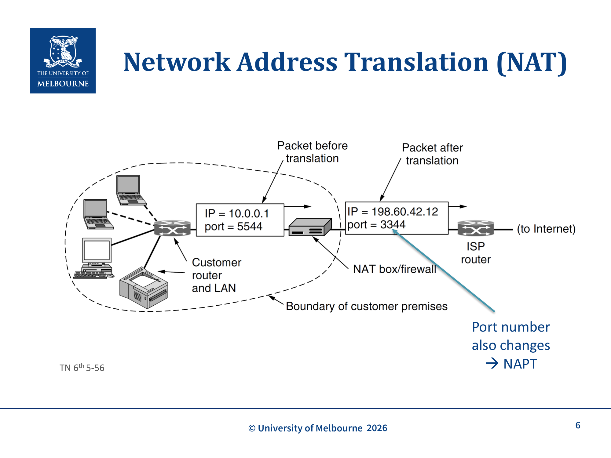

# WK12 - Network Address Translation (NAT) & Debugging

## 课件概述

本课件介绍 Network Address Translation (NAT) 的动机、机制、优缺点，以及如何调试"互联网不工作"的问题。NAT 是解决 IPv4 地址耗尽的关键技术，通过将私有地址转换为公共地址，允许多个设备共享一个公共 IP 地址。

---

## 必须掌握的知识点

### 1. IPv4 地址稀缺性

#### What（是什么）
随着 IP 地址变得稀缺，需要处理更多客户端的方法。IPv6 能解决问题，但需要一个**临时方案**。

#### 私有地址（Private Addresses）
- 许多主机只需要内部访问
- **私有子网**：
  - `192.168.0.0/16`
  - `172.16.0.0/12`
  - `10.0.0.0/8`
- 可以重复使用：在组织内唯一，但**全球不唯一**
- **绝对不能**在公共互联网上使用

**原始设计意图：** 最初考虑使用**应用层代理**来访问外部服务，但实际上 NAT 最终成为被广泛采用的方案。

---

### 2. NAT 的工作原理


*NAT 工作原理：内部主机 (10.0.0.1:5544) 发送数据包到 NAT box，NAT 将源 IP 和端口转换为公网 IP (198.60.42.12:3344)，同时修改端口号 (NAPT)*

#### What（是什么）
- 每个客户/家庭被分配**一个公共 IP 地址**
- 内部主机/接口被分配**私有 IP 地址**
- 内部 IP 地址用于 LAN 内部通信
- 当 packet 发往互联网时，内部地址被**转换**为公共 IP 地址

#### How（详细机制）

**假设**: TCP/UDP（有一些例外），特别是源和目的端口字段的位置

**过程**：
1. NAT box 将 IP 源地址（`10.x.y.z`）替换为公共 IP 地址
2. TCP 源端口被替换为 NAT 转换表条目的**索引**
   - 共 65,536 个条目（16 bits，与 TCP 端口字段相同）
   - 每个条目包含原始 IP 地址（私有 IP）和原始源端口号
3. IP 和 TCP checksums 被**重新计算**
4. 当从互联网到达 NAT box 的 packet 到达时，查找 TCP header 中的目的端口
   - 检索原始源端口和源 IP 地址
   - 更新 headers 和 checksums
   - 发送给内部主机

**关键理解**: 这实际上是 **NAPT (Network Address Port Translation)**，因为端口号也改变了。

---

### 3. NAT 的批评

#### 违反端到端连接性
- 私有网络中的接口**只能在发送 packets 并创建映射后才能接收 packets**（某些例外情况：如 UPnP 端口映射、静态端口转发）
- 打破了端到端连接模型

#### 违反 IP 架构模型
- IP 架构规定每个 IP 地址表示互联网上的**唯一接口**
- 但数千个连接到互联网的接口都有 `10.0.0.1`

#### 层级违规（Layering Violation）
- 假设了 payload 内容的性质
- 最初只适用于 TCP 和 UDP
- 必须窥探 FTP 消息（因为 FTP 在 payload 中嵌入 IP 地址）

#### 将互联网从无连接变为伪面向连接
- NAT 维护**连接状态**
- 如果 NAT 崩溃，所有连接都会丢失

#### 限制连接数量
- 端口号是 16 bits，限制了同时连接数

---

### 4. NAT 的优势

#### 广泛部署
- 尽管有批评，NAT 在家庭和小型企业中广泛部署
- **Carrier Grade NAT**: ISP 只给客户私有地址

#### 安全优势
- 只有在创建出站连接后才能接收 packets
- 内部网络**大大屏蔽**了来自入站未请求 packets 的攻击
- **但 NAT 不应取代防火墙**

#### 未来
- 即使 IPv6 广泛部署且不再稀缺，NAT 可能仍会继续使用

---

### 5. UPnP (Universal Plug and Play)

#### What（是什么）
- 试图克服 NAT 的弱点
- 随着互联网使用增长，家庭机器需要充当服务器（游戏、聊天、媒体播放器等）

#### How（工作方式）
- UPnP 实现了 **Internet Gateway Device Protocol**
- 允许在 NAT 转换表中创建**端口映射**
- 使得内部网络可以运行服务器

#### 安全问题
- UPnP 的**不良实现**允许攻击者从外部 IP 地址修改转换表

---

### 6. 调试"互联网不工作"

#### 症状分析
- **一个应用还是多个/所有应用？**
- **无响应**：一个、多个、所有？
- **非常慢**
- **访问被拒绝**
- **部分响应**（页面部分加载或未格式化）

#### 结构化探究框架
当有人报告"互联网不工作"时，可以用这4个问题引导排查：
1. **用户体验的哪些部分可能出了问题？**（症状分析）
2. **可以问同事什么问题来缩小可能性范围？**（例如："你还能访问其他网站吗？"）
3. **每个部分存在哪些可能的问题？**（按位置排查）
4. **如何检验这些假设？**（使用调试工具验证）

#### 可能的位置
- **空间位置**：本地计算机、服务器、router、NAT、防火墙？
- **协议栈位置**：物理层、链路层、网络层、传输层、应用层？
- 注意：并非所有层级组合都有意义——**路由器没有应用层**
- "关闭再重新打开"对本地设备有用，但对**互联网整体不起作用**

#### 调试工具

| 工具 | 用途 |
|------|------|
| `ifconfig`/`ipconfig` | 查看网络接口配置 |
| `route` | 查看路由表 |
| `arp` | 查看 ARP 缓存 |
| `ping` | 测试连通性（ICMP Echo） |
| `traceroute`/`tracert` | 追踪路径（ICMP Time Exceeded） |
| `dig`/`host`/`nslookup` | DNS 查询 |
| `cURL`/`wget` | HTTP 请求 |
| Speedtest | 测试带宽 |
| Downdetector | 检查服务是否宕机 |
| Browser Dev Tools | 网络请求分析 |
| Task Manager | 检查系统资源 |

#### 常见问题
- **IP 黑名单**: 目标服务器封锁了你的 IP
- **DNS 配置错误**: DNS server 配置不正确
- **本地 ISP 问题**: ISP 网络故障
- **服务器宕机**: 一个页面还是整个站点？DoS 攻击？
- **CDN 问题**: CDN 节点故障
- **密码错误**: 剪切粘贴空格、大写锁定
- **WiFi 未连接**: 物理连接问题
- **链路拥塞**: 网络拥堵

---

### 7. NAT 转换表示例

```
私有 IP:Port          公共 IP:Port         状态
192.168.1.100:50001 → 203.0.113.1:40001   ESTABLISHED
192.168.1.101:50002 → 203.0.113.1:40002   ESTABLISHED
192.168.1.100:50003 → 203.0.113.1:40003   ESTABLISHED
```

**关键理解**:
- 多个内部主机可以共享同一个公共 IP
- 通过不同的端口号区分不同的连接
- NAT box 维护映射表，进行地址转换

---

## 关键术语

| 术语 | 定义 |
|------|------|
| NAT | Network Address Translation，网络地址转换 |
| NAPT | Network Address Port Translation，网络地址端口转换 |
| Private IP | 私有 IP 地址，仅在内部网络使用 |
| Public IP | 公共 IP 地址，全球唯一 |
| Translation Table | NAT 转换表，维护地址映射 |
| Carrier Grade NAT | 运营商级 NAT，ISP 使用 |
| UPnP | Universal Plug and Play，允许 NAT 端口映射 |
| End-to-end Connectivity | 端到端连接性 |
| Layering Violation | 层级违规 |
| Connection State | 连接状态，NAT 维护 |

---

## 常见问题

### Q1: NAT 如何处理多个内部主机？
通过**端口号**区分。每个内部连接被分配一个唯一的公共端口号，NAT 维护映射表。

### Q2: NAT 为什么是安全优势？
因为只有在创建出站连接后才能接收 packets，内部网络被屏蔽了来自入站未请求 packets 的攻击。

### Q3: NAT 违反了什么架构原则？
- 端到端连接性
- IP 地址唯一性
- 分层原则（假设 payload 内容）

### Q4: Carrier Grade NAT 是什么？
ISP 只给客户私有地址，进一步节省公共 IP 地址。

### Q5: UPnP 有什么安全风险？
不良实现允许攻击者从外部 IP 地址修改 NAT 转换表。

---

## 知识点之间的联系

```
WK10-Addressing-Switching (IP 地址)
    ↓ 地址稀缺
WK12-NAT (网络地址转换)
    ↓ 安全
Firewall (防火墙)
```

- **IP 地址稀缺**是 NAT 的主要动机
- **私有地址**是 NAT 的基础
- **NAT** 与**防火墙**共同提供安全保护
- **UPnP** 试图克服 NAT 的限制

---

## 实际应用案例

### 案例 1: 家庭网络 NAT
```
内部网络: 192.168.1.0/24
公共 IP: 203.0.113.1

设备 192.168.1.100:50001 → NAT → 203.0.113.1:40001 → 互联网
设备 192.168.1.101:50002 → NAT → 203.0.113.1:40002 → 互联网
```

### 案例 2: 企业网络
- 企业获得少量公共 IP
- 内部使用私有地址
- NAT box 负责地址转换
- 防火墙提供额外安全

### 案例 3: Carrier Grade NAT
- ISP 使用 Carrier Grade NAT
- 客户获得私有地址
- 多个客户共享一个公共 IP
- 进一步节省 IPv4 地址

---

## 常见错误和易错点

### ❌ 错误 1: 认为私有地址可以在互联网上使用
私有地址**绝对不能**在公共互联网上使用。

### ❌ 错误 2: 认为 NAT 是防火墙
NAT 提供安全优势，但**不应取代防火墙**。

### ❌ 错误 3: 认为 NAT 不影响应用
NAT 违反分层原则，某些应用（如 FTP）需要特殊处理。

### ❌ 错误 4: 认为 IPv6 部署后 NAT 会消失
即使 IPv6 广泛部署，NAT 可能仍会继续使用。

### ❌ 错误 5: 忘记 NAT 维护连接状态
如果 NAT 崩溃，所有连接都会丢失。

---

## 课件总结

本课件介绍了 NAT 的动机、机制和影响：
1. **IPv4 地址稀缺**是 NAT 的主要动机
2. **NAT 机制**: 私有地址 → 公共地址转换，通过端口号区分
3. **NAT 优缺点**: 节省地址、安全优势 vs 违反架构原则
4. **UPnP**: 试图克服 NAT 的限制
5. **调试方法**: 使用各种工具定位网络问题

NAT 是互联网的重要组成部分，理解它有助于网络编程和故障排查。

**考试提示：** 重点理解**功能概念**而非记忆具体命令名或网站名。知道有什么工具可用，而不需要记住所有命令细节。

---

## 复习建议

1. **理解 NAT 的工作原理**: 私有地址转换、端口映射、checksum 重算
2. **掌握 NAT 的批评**: 端到端连接性、层级违规、连接状态
3. **理解 NAT 的安全优势**: 屏蔽入站未请求 packets
4. **掌握调试工具**: ping、traceroute、dig、cURL 等
5. **理解 Carrier Grade NAT**: ISP 如何进一步节省地址

---

*课件来源: COMP30023 2026 S1 WK12*
