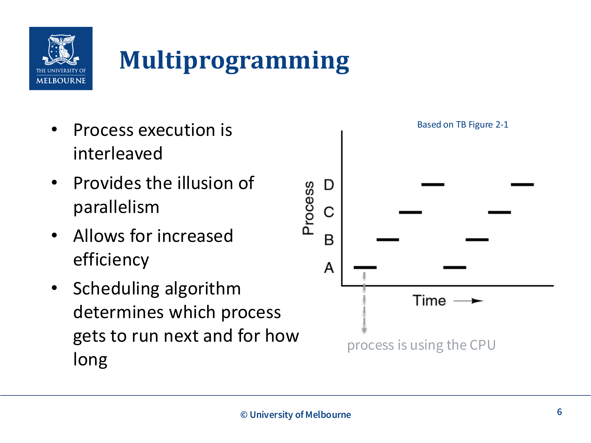
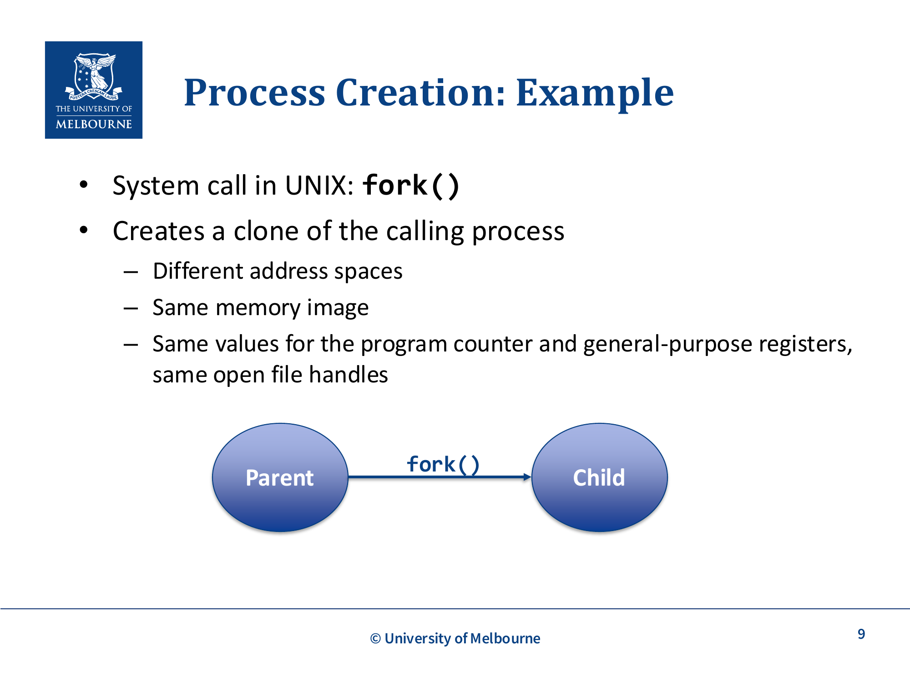
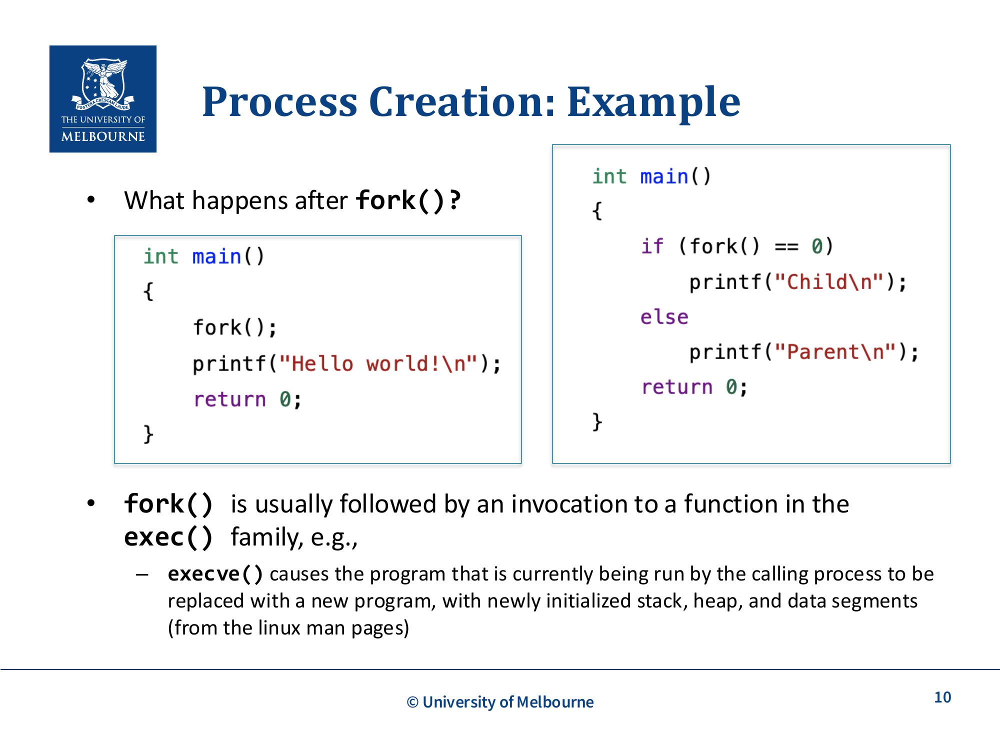
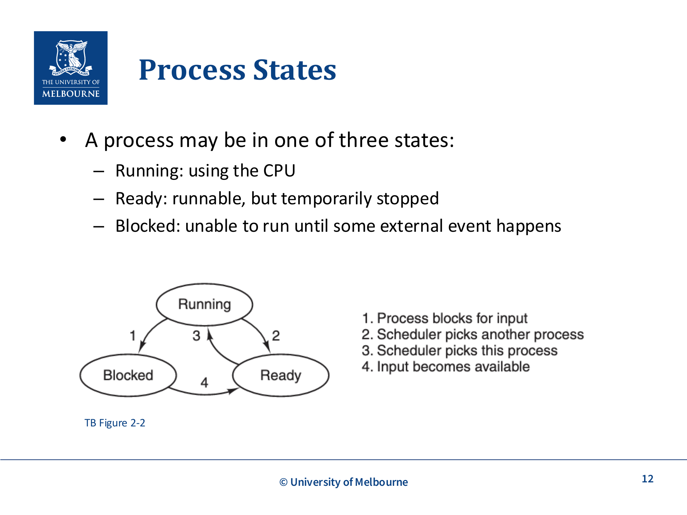
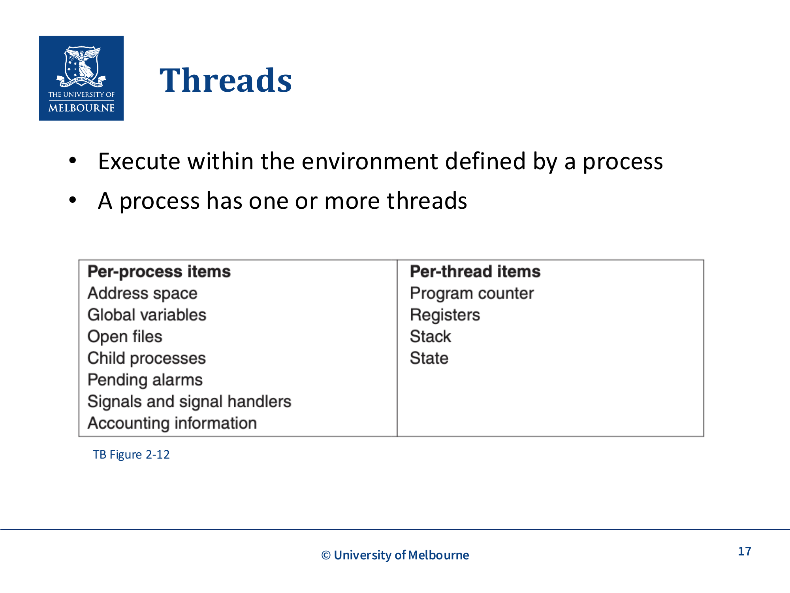
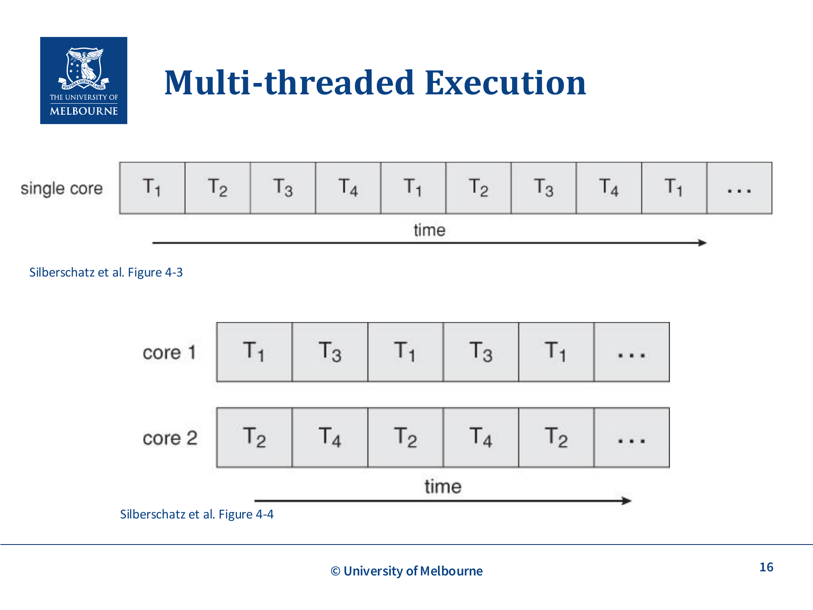
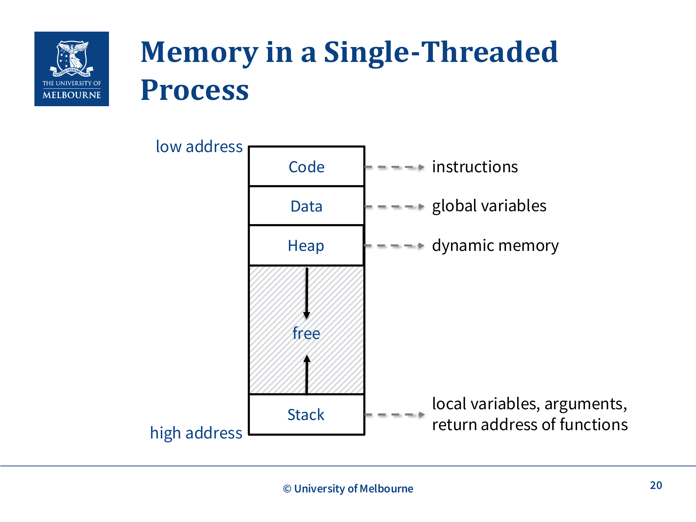
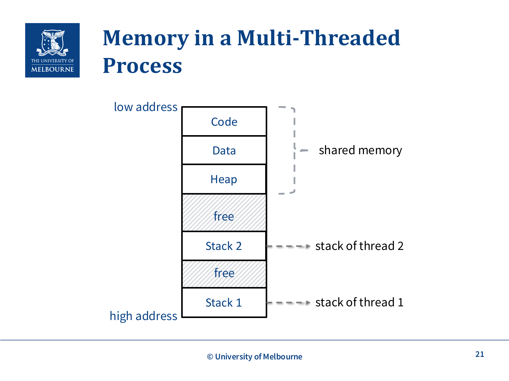

# WK2-Process-Intro

## 课件概述
本课件介绍了进程和线程的基本概念，这是操作系统中最核心的抽象之一。课件从进程的定义入手，详细讲解了进程的组成元素、多道程序设计、进程的创建和终止、进程状态转换、进程控制块（PCB）、线程的概念、多线程执行、进程地址空间、线程与进程的比较、线程控制块（TCB）以及PThreads API。这些内容是理解操作系统并发执行和资源管理的基础。

## 必须掌握的知识点

### 1. Process (进程)

#### What（是什么）
进程是正在执行的程序实例，是操作系统提供的基本抽象。它为程序提供了一个专用的、抽象的机器来运行。

**程序与进程的区别**：
- **程序 (Program)**：静态的代码，类似于食谱
- **进程 (Process)**：程序的动态执行，类似于烹饪过程

**关键特性**：
- 一个程序可以对应多个进程（例如，多个浏览器窗口）
- 每个进程有自己的地址空间、程序计数器、寄存器集合
- 进程是资源分配的基本单位

**进程的组成元素**：
- **线程 (Threads)**：抽象CPU，执行单元
- **地址空间 (Address Space)**：抽象内存，进程可访问的内存范围
- **文件 (Files)**：抽象磁盘，数据存储
- **套接字 (Sockets)**：抽象网络，通信端点

#### Why（为什么重要）
进程的重要性：

1. **并发执行**：允许多个程序在单个CPU上并发运行
2. **资源隔离**：每个进程有自己的地址空间，相互隔离
3. **资源管理**：操作系统以进程为单位分配资源
4. **故障隔离**：一个进程崩溃不影响其他进程

**实际例子**：
- 当你同时打开浏览器、音乐播放器和文档编辑器时，每个都是一个独立的进程
- 每个进程认为自己独占CPU和内存资源

#### How（如何工作/实现）
进程的实现机制：

1. **进程创建**：
   - 系统初始化时创建初始进程
   - 运行中的进程通过系统调用创建新进程
   - 用户请求创建新进程
   - 批处理作业启动

2. **进程终止**：
   - 正常退出（自愿）
   - 错误退出（自愿）
   - 致命错误（非自愿，如除零、非法内存访问）
   - 被其他进程杀死（如kill命令）

3. **进程状态**：
   - **运行 (Running)**：正在使用CPU
   - **就绪 (Ready)**：可以运行，但暂时被停止
   - **阻塞 (Blocked)**：无法运行，直到某个外部事件发生

#### 关键术语
- **Process**：进程，正在执行的程序实例
- **Program**：程序，静态的代码
- **Address Space**：地址空间，进程可访问的内存范围
- **Thread**：线程，进程内的执行单元

#### 常见问题
- **Q：进程和程序有什么区别？**
  A：程序是静态的代码文件，进程是程序的动态执行实例。一个程序可以对应多个进程。

- **Q：如何查看系统中的进程？**
  A：Linux/Mac使用`ps aux`或`top`命令，Windows使用任务管理器。

---

### 2. Multiprogramming (多道程序设计)

#### What（是什么）
多道程序设计允许多个进程共享CPU，以伪并行方式运行。由于CPU一次只能运行一个进程，操作系统通过快速切换进程来提供并行的假象。

**工作原理**：
- CPU在进程之间快速切换
- 每个进程运行几十毫秒
- 进程执行是交错的
- 提供并行的假象

**调度算法**：
- 决定哪个进程接下来运行
- 决定每个进程运行多长时间

#### Why（为什么重要）
多道程序设计的重要性：

1. **提高效率**：当一个进程等待I/O时，CPU可以运行其他进程
2. **资源利用率**：最大化CPU使用率
3. **响应时间**：用户感觉多个程序同时运行
4. **吞吐量**：单位时间内完成更多任务

**实际例子**：
- 当你在下载文件时，同时可以浏览网页
- 下载进程等待I/O时，浏览器进程可以使用CPU



*Multiprogramming 时序图：进程A/B/C/D交替使用CPU，实现伪并行（TB Figure 2-1）*

#### How（如何工作/实现）
多道程序设计的实现：

1. **进程调度**：
   - 调度器选择下一个运行的进程
   - 使用调度算法（如轮转调度、优先级调度）

2. **上下文切换**：
   - 保存当前进程的状态（PC、SP、寄存器）
   - 恢复下一个进程的状态
   - 切换内存映射（页表）

3. **定时器中断**：
   - 防止进程独占CPU
   - 定时器中断触发调度器

#### 关键术语
- **Multiprogramming**：多道程序设计
- **Context Switch**：上下文切换，进程状态的保存和恢复
- **Scheduling Algorithm**：调度算法，决定进程运行顺序

#### 常见问题
- **Q：多道程序设计和多任务有什么区别？**
  A：多道程序设计强调多个程序共享CPU；多任务强调用户同时使用多个程序。

- **Q：上下文切换的开销有多大？**
  A：通常需要几微秒到几十微秒，包括保存/恢复寄存器、切换内存映射等。

---

### 3. Process Creation (进程创建)

#### What（是什么）
进程创建是操作系统创建新进程的过程。在UNIX系统中，主要通过`fork()`和`exec()`系统调用实现。

**进程创建的四种事件**：
1. 系统初始化
2. 运行中的进程执行进程创建系统调用
3. 用户请求创建新进程
4. 批处理作业启动



*fork() 创建子进程：Parent 通过 fork() 生成 Child，拥有独立地址空间但相同内存映像*

**fork()系统调用**：
- 创建调用进程的克隆
- 创建不同的地址空间
- 相同的内存映像
- 相同的程序计数器和通用寄存器值
- 相同的打开文件句柄

**exec()系统调用**：
- 用新程序替换当前进程
- 重新初始化栈、堆和数据段
- 通常在fork()之后调用

#### Why（为什么重要）
进程创建的重要性：

1. **任务分解**：将复杂任务分解为多个进程
2. **并发执行**：允许多个任务同时执行
3. **服务隔离**：不同服务运行在不同进程
4. **故障隔离**：一个进程崩溃不影响其他进程

**实际例子**：
```c
// 典型的UNIX进程创建
pid_t pid = fork();
if (pid == 0) {
    // 子进程
    execve("/bin/ls", argv, envp);
} else {
    // 父进程
    wait(NULL);
}
```



*fork() 代码示例：fork()返回两次，子进程返回0，父进程返回子进程PID*

#### How（如何工作/实现）
进程创建的详细流程：

**fork()的实现**：
1. 为新进程分配唯一的进程ID
2. 创建新的进程控制块（PCB）
3. 复制父进程的地址空间（写时复制优化）
4. 复制父进程的文件描述符表
5. 设置子进程的状态为就绪
6. 返回子进程ID给父进程，返回0给子进程

**exec()的实现**：
1. 加载新程序的代码段和数据段
2. 重新初始化堆和栈
3. 设置程序计数器为新程序的入口点
4. 保留打开的文件描述符（除非设置了close-on-exec标志）

**写时复制 (Copy-on-Write)**：
- 初始时父子进程共享物理内存页
- 只有当某个进程尝试写入时，才复制该内存页
- 大大减少了fork()的开销

#### 关键术语
- **fork()**：创建当前进程的副本
- **exec()**：用新程序替换当前进程
- **Copy-on-Write**：写时复制，优化fork()的机制
- **Process ID (PID)**：进程ID，唯一标识进程

#### 常见问题
- **Q：fork()为什么会返回两次？**
  A：因为fork()创建了一个新进程，父进程和子进程都需要知道结果，所以返回两次。

- **Q：fork()和exec()为什么要分开？**
  A：这样可以在fork()之后、exec()之前修改子进程的属性（如重定向I/O）。

---

### 4. Process States (进程状态)

#### What（是什么）
进程在其生命周期中会经历不同的状态。最基本的三状态模型包括：

**三种基本状态**：
1. **运行 (Running)**：进程正在CPU上执行
2. **就绪 (Ready)**：进程可以运行，但CPU被其他进程占用
3. **阻塞 (Blocked)**：进程无法运行，等待某个事件（如I/O完成）

**状态转换**：
```
        调度/分派
就绪 ─────────────→ 运行
  ↑                   │
  │                   │
  │ 等待事件发生       │ I/O请求或等待事件
  │                   │
  │                   ↓
  └─────────────── 阻塞
        事件发生
```



*进程三状态模型：Running/Ready/Blocked 及其转换条件（TB Figure 2-2）*

#### Why（为什么重要）
进程状态的重要性：

1. **调度决策**：调度器根据进程状态决定运行哪个进程
2. **资源管理**：阻塞的进程不占用CPU资源
3. **系统效率**：合理管理进程状态提高系统效率
4. **并发控制**：通过状态转换实现并发

**实际例子**：
- 进程等待磁盘I/O时进入阻塞状态
- I/O完成后，进程从阻塞状态转为就绪状态
- 调度器选择就绪进程运行

#### How（如何工作/实现）
进程状态的管理：

**状态转换的触发条件**：
1. **就绪 → 运行**：调度器选择该进程运行
2. **运行 → 就绪**：
   - 时间片用完
   - 更高优先级进程就绪
3. **运行 → 阻塞**：
   - 请求I/O操作
   - 等待事件
   - 申请资源失败
4. **阻塞 → 就绪**：
   - I/O完成
   - 事件发生
   - 资源可用

**进程控制块 (PCB)**：
- 存储进程的当前状态
- 存储进程的其他信息
- 由操作系统维护

#### 关键术语
- **Running**：运行状态，正在CPU上执行
- **Ready**：就绪状态，可以运行但等待CPU
- **Blocked**：阻塞状态，等待事件发生

#### 常见问题
- **Q：进程状态和线程状态有什么区别？**
  A：基本状态相同，但线程状态更细粒度，包括更多状态（如挂起状态）。

- **Q：什么是挂起状态？**
  A：进程被交换到磁盘，不占用内存空间，需要时再换入。

---

### 5. Process Control Block (进程控制块)

#### What（是什么）
进程控制块（PCB）是操作系统维护的关于进程信息的数据结构。每个进程都有一个对应的PCB。

**PCB包含的信息**：
- 进程ID (PID)
- 父进程信息
- 内存管理信息（页表基址寄存器）
- 文件描述符表
- 优先级
- 已使用的CPU时间
- 执行上下文：
  - 程序计数器 (PC)
  - 栈指针 (SP)
  - 其他控制寄存器

**进程表**：
- 包含所有PCB的列表
- 每个进程对应一个PCB
- 操作系统通过进程表管理所有进程

#### Why（为什么重要）
PCB的重要性：

1. **进程管理**：操作系统通过PCB管理进程
2. **上下文切换**：保存和恢复进程状态
3. **资源跟踪**：记录进程使用的资源
4. **调度决策**：调度器使用PCB信息进行调度

**实际例子**：
- 上下文切换时，保存当前进程的PC、SP、寄存器到PCB
- 从PCB恢复下一个进程的PC、SP、寄存器

#### How（如何工作/实现）
PCB的使用：

**上下文切换**：
1. 保存当前进程的执行上下文到PCB
2. 更新进程状态
3. 选择下一个进程
4. 从PCB恢复下一个进程的执行上下文
5. 更新内存管理硬件（如页表基址寄存器）

**PCB的组织**：
- 链表：每个状态（就绪、阻塞）一个链表
- 数组：PCB数组，索引为进程ID
- 树：表示进程间的父子关系

#### 关键术语
- **Process Control Block (PCB)**：进程控制块，存储进程信息
- **Process Table**：进程表，包含所有PCB
- **Execution Context**：执行上下文，程序计数器、栈指针、寄存器

#### 常见问题
- **Q：PCB存储在哪里？**
  A：PCB存储在内核内存中，只有操作系统可以访问。

- **Q：上下文切换的开销主要在哪里？**
  A：保存/恢复寄存器、切换内存映射、刷新TLB等。

---

### 6. Threads (线程)

#### What（是什么）
线程是进程内的执行单元，是CPU调度的基本单位。每个线程有自己的程序计数器、栈指针、寄存器和栈。

**线程的特性**：
- 是进程内的执行单元
- 独立于其他线程运行
- 有自己的执行上下文（PC、SP、寄存器）
- 共享进程的地址空间

**线程与进程的关系**：
- 一个进程可以有一个或多个线程
- 线程在进程定义的环境中执行
- 所有线程共享进程的代码、数据和堆内存
- 每个线程有自己的栈

#### Why（为什么重要）
线程的重要性：

1. **并行性**：利用多核处理器，提高程序性能
2. **重叠I/O与计算**：一个线程等待I/O时，另一个线程可以使用CPU
3. **响应性**：GUI程序中，一个线程处理用户输入，另一个执行后台任务
4. **资源共享**：线程共享进程资源，通信更高效

**实际例子**：
- Web服务器：每个请求一个线程
- 数据库服务器：多个查询并行执行
- 图形界面：一个线程处理界面，另一个执行计算



*进程级资源 vs 线程级资源：地址空间、文件等共享，PC/寄存器/栈独立（TB Figure 2-12）*



*单核交替执行 vs 多核并行执行（Silberschatz Figure 4-3/4-4）*

#### How（如何工作/实现）
线程的实现：

**用户级线程**：
- 由用户空间的线程库管理
- 创建和切换速度快
- 一个线程阻塞会阻塞整个进程

**内核级线程**：
- 由操作系统内核管理
- 创建和切换开销较大
- 一个线程阻塞不影响其他线程

**线程上下文切换**：
1. 保存当前线程的PC、SP、寄存器到TCB
2. 选择下一个线程
3. 从TCB恢复下一个线程的PC、SP、寄存器
4. 继续执行

#### 关键术语
- **Thread**：线程，进程内的执行单元
- **Thread Control Block (TCB)**：线程控制块，存储线程信息
- **User-level Thread**：用户级线程，由用户空间管理
- **Kernel-level Thread**：内核级线程，由内核管理

#### 常见问题
- **Q：线程和进程有什么区别？**
  A：进程是资源分配单位，线程是CPU调度单位。线程共享进程资源，创建和切换开销更小。

- **Q：什么是线程安全？**
  A：多个线程同时访问共享资源时，程序仍能正确运行。

---

### 7. Process Address Space and Threads (进程地址空间和线程)

#### What（是什么）
进程的地址空间由多个部分组成，所有线程共享相同的地址空间。

**地址空间布局**：
```
低地址
┌─────────────┐
│   Code      │ 代码段：程序指令
├─────────────┤
│   Data      │ 数据段：全局变量
├─────────────┤
│   Heap      │ 堆：动态内存分配
├─────────────┤
│   ...       │ 空闲空间
├─────────────┤
│   Stack     │ 栈：局部变量、函数参数
└─────────────┘
高地址
```



*单线程进程内存布局：Code/Data/Heap 共享，单个 Stack*

**单线程进程**：
- 一个栈
- 栈从高地址向低地址增长
- 堆从低地址向高地址增长

**多线程进程**：
- 所有线程共享代码、数据和堆
- 每个线程有自己的栈
- 多个栈分布在地址空间中



*多线程进程内存布局：Code/Data/Heap 共享，每个线程独立 Stack*

#### Why（为什么重要）
地址空间和线程的关系的重要性：

1. **数据共享**：线程可以高效地共享数据
2. **通信便利**：线程间通信不需要额外的系统调用
3. **资源效率**：共享内存减少资源消耗
4. **编程模型**：简化并发编程

**实际例子**：
```c
// 全局变量，所有线程共享
int shared_data = 0;

void* thread_func(void* arg) {
    // 每个线程有自己的局部变量
    int local_data = *(int*)arg;
    shared_data += local_data;  // 访问共享数据
    return NULL;
}
```

#### How（如何工作/实现）
地址空间的管理：

**内存管理单元 (MMU)**：
- 将虚拟地址转换为物理地址
- 提供内存保护
- 支持共享内存

**线程栈的分配**：
- 创建线程时分配栈空间
- 栈大小通常固定（如8MB）
- 栈溢出会触发段错误

**共享内存的同步**：
- 需要同步机制（如互斥锁、信号量）
- 防止数据竞争

#### 关键术语
- **Address Space**：地址空间，进程可访问的内存范围
- **Code Segment**：代码段，存储程序指令
- **Data Segment**：数据段，存储全局变量
- **Heap**：堆，动态内存分配区域
- **Stack**：栈，存储局部变量和函数调用信息

#### 常见问题
- **Q：线程栈的大小是多少？**
  A：通常由操作系统或线程库设置，默认值通常是8MB（Linux）或1MB（Windows）。

- **Q：什么是栈溢出？**
  A：当线程使用的栈空间超过分配的大小时，会触发栈溢出错误。

---

### 8. Multiple Threads or Multiple Processes? (多线程还是多进程)

#### What（是什么）
这是选择并发编程模型时的关键决策。多线程和多进程各有优缺点。

**多线程的优势**：
- 共享地址空间，数据共享方便快速
- 创建速度快
- 上下文切换开销小

**多线程的劣势**：
- 隔离性有限，一个线程崩溃会影响整个进程
- 需要同步机制防止数据竞争

**多进程的优势**：
- 可以跨多台机器并行化
- 提供隔离的执行环境
- 一个进程崩溃不影响其他进程

**多进程的劣势**：
- 进程间通信（IPC）开销较大
- 创建速度较慢
- 上下文切换开销较大

#### Why（为什么重要）
选择正确的并发模型的重要性：

1. **性能**：不同的模型有不同的性能特征
2. **可靠性**：隔离性影响系统的可靠性
3. **复杂性**：不同的模型有不同的编程复杂性
4. **可扩展性**：某些模型更适合分布式系统

**实际例子**：
- **多线程适合**：Web服务器、数据库、GUI应用
- **多进程适合**：分布式计算、需要高可靠性的系统

#### How（如何工作/实现）
选择并发模型的考虑因素：

**选择多线程当**：
- 需要频繁共享数据
- 需要快速创建和切换
- 单机多核并行
- 对可靠性要求不高

**选择多进程当**：
- 需要跨机器并行
- 需要高可靠性
- 可以接受IPC开销
- 不同组件需要独立运行

**混合模型**：
- 多进程 + 多线程
- 每个进程内使用多线程
- 结合两者的优势

#### 关键术语
- **Multi-threading**：多线程，一个进程内多个线程
- **Multi-processing**：多进程，多个独立进程
- **Inter-Process Communication (IPC)**：进程间通信

#### 常见问题
- **Q：什么时候使用多线程，什么时候使用多进程？**
  A：需要频繁共享数据时用多线程；需要高隔离性时用多进程。

- **Q：什么是线程池？**
  A：预先创建一组线程，重复使用，避免频繁创建和销毁线程的开销。

---

### 9. Thread Control Block (线程控制块)

#### What（是什么）
线程控制块（TCB）是存储线程执行上下文的数据结构。类似于进程控制块（PCB），但用于线程。

**TCB包含的信息**：
- 线程ID
- 栈指针
- 程序计数器
- 寄存器值
- 状态（运行、阻塞、就绪）
- 指向所属进程PCB的指针

**TCB与PCB的关系**：
- PCB存储进程信息（地址空间、文件等）
- TCB存储线程信息（执行上下文）
- 多个TCB指向同一个PCB

#### Why（为什么重要）
TCB的重要性：

1. **上下文切换**：保存和恢复线程状态
2. **线程管理**：操作系统通过TCB管理线程
3. **资源跟踪**：记录线程使用的资源
4. **调度决策**：调度器使用TCB信息进行调度

**实际例子**：
- 上下文切换时，保存当前线程的PC、SP、寄存器到TCB
- 从TCB恢复下一个线程的PC、SP、寄存器

#### How（如何工作/实现）
TCB的使用：

**线程上下文切换**：
1. 保存当前线程的执行上下文到TCB
2. 更新线程状态
3. 选择下一个线程
4. 从TCB恢复下一个线程的执行上下文
5. 继续执行

**TCB的组织**：
- 链表：每个状态一个链表
- 数组：TCB数组
- 树：表示线程间的层次关系

#### 关键术语
- **Thread Control Block (TCB)**：线程控制块，存储线程信息
- **Thread ID**：线程ID，唯一标识线程
- **Execution Context**：执行上下文，程序计数器、栈指针、寄存器

#### 常见问题
- **Q：TCB和PCB有什么区别？**
  A：PCB存储进程信息，TCB存储线程信息。一个进程有一个PCB，多个TCB。

- **Q：线程上下文切换和进程上下文切换有什么区别？**
  A：线程切换不需要切换地址空间，开销更小。

---

### 10. PThreads

#### What（是什么）
PThreads是POSIX标准的线程创建和同步API，大多数UNIX系统都支持它。

**PThreads的特性**：
- 函数以`pthread`开头
- 包含头文件`pthread.h`
- 线程ID类型为`pthread_t`

**基本API**：
- `pthread_create()`：创建新线程
- `pthread_join()`：等待线程结束
- `pthread_exit()`：终止线程
- `pthread_self()`：获取当前线程ID

#### Why（为什么重要）
PThreads的重要性：

1. **标准化**：跨平台的线程编程接口
2. **可移植性**：程序可以在不同UNIX系统间移植
3. **功能丰富**：提供线程创建、同步、通信等功能
4. **性能**：直接映射到内核线程

**实际例子**：
```c
#include <pthread.h>

void* thread_func(void* arg) {
    printf("Thread %ld running\n", (long)arg);
    return NULL;
}

int main() {
    pthread_t threads[5];
    for (long i = 0; i < 5; i++) {
        pthread_create(&threads[i], NULL, thread_func, (void*)i);
    }
    for (int i = 0; i < 5; i++) {
        pthread_join(threads[i], NULL);
    }
    return 0;
}
```

#### How（如何工作/实现）
PThreads的使用：

**创建线程**：
```c
int pthread_create(
    pthread_t *thread,           // 线程ID
    const pthread_attr_t *attr,  // 线程属性
    void *(*start_routine)(void*), // 线程函数
    void *arg                    // 函数参数
);
```

**等待线程结束**：
```c
int pthread_join(
    pthread_t thread,  // 线程ID
    void **retval      // 返回值
);
```

**线程属性**：
- 栈大小
- 分离状态
- 调度策略

#### 关键术语
- **PThreads**：POSIX线程API
- **pthread_create()**：创建线程
- **pthread_join()**：等待线程结束
- **pthread_t**：线程ID类型

#### 常见问题
- **Q：PThreads和Java线程有什么区别？**
  A：PThreads是C语言的线程库，Java线程是Java语言的线程API。Java线程在不同平台上可能有不同的实现。

- **Q：什么是线程分离？**
  A：分离的线程结束后自动释放资源，不需要pthread_join()等待。

## 知识点之间的联系

这些知识点形成了一个完整的知识体系：

1. **进程定义** → **多道程序设计** → **进程状态**：这是进程管理的基础
2. **进程创建** → **进程终止** → **进程控制块**：这是进程生命周期的管理
3. **线程概念** → **多线程执行** → **地址空间**：这是线程管理的基础
4. **多线程 vs 多进程** → **线程控制块** → **PThreads**：这是并发编程的实践

**整体流程**：
- 程序被加载为进程
- 进程包含一个或多个线程
- 线程是CPU调度的基本单位
- 操作系统通过PCB和TCB管理进程和线程
- 调度器决定哪个线程运行

## 实际应用案例

### 案例1：Web服务器
```
主进程：
    while (true) {
        accept connection
        create thread to handle request
    }

工作线程：
    read request
    process request
    send response
    exit
```

### 案例2：生产者-消费者问题
```
生产者线程：
    while (true) {
        produce item
        put item in buffer
    }

消费者线程：
    while (true) {
        get item from buffer
        consume item
    }
```

### 案例3：并行计算
```
主线程：
    split data into chunks
    create worker threads
    wait for all threads
    combine results

工作线程：
    process assigned chunk
    return result
```

## 常见错误和易错点

### 1. 混淆进程和线程
- **错误**：认为线程是独立的程序
- **正确**：线程是进程内的执行单元，共享进程资源

### 2. 忽视线程同步
- **错误**：多个线程同时访问共享数据而不同步
- **正确**：需要使用互斥锁、信号量等同步机制

### 3. 不理解fork()的行为
- **错误**：认为fork()只返回一次
- **正确**：fork()在父进程和子进程中各返回一次

### 4. 忽视上下文切换开销
- **错误**：创建过多线程而不考虑切换开销
- **正确**：合理控制线程数量，使用线程池

### 5. 不理解地址空间共享
- **错误**：认为线程有独立的地址空间
- **正确**：线程共享进程的地址空间，每个线程有自己的栈

## 课件总结

本课件介绍了进程和线程的基本概念：

1. **进程的定义和特性**：进程是正在执行的程序实例，是资源分配的基本单位。

2. **多道程序设计**：允许多个进程共享CPU，提高系统效率。

3. **进程的创建和终止**：通过fork()和exec()创建进程，有四种终止条件。

4. **进程状态**：运行、就绪、阻塞三种基本状态及其转换。

5. **进程控制块**：操作系统维护的关于进程信息的数据结构。

6. **线程的概念**：进程内的执行单元，是CPU调度的基本单位。

7. **多线程执行**：利用多核处理器，提高程序性能。

8. **地址空间和线程**：线程共享进程地址空间，每个线程有自己的栈。

9. **多线程 vs 多进程**：根据应用场景选择合适的并发模型。

10. **线程控制块**：存储线程执行上下文的数据结构。

11. **PThreads API**：POSIX标准的线程编程接口。

这些内容为后续学习进程同步、进程通信、死锁等奠定了坚实基础。

## 复习建议

1. **理解概念**：重点理解进程和线程的区别，以及各自的优缺点
2. **画状态图**：画出进程状态转换图，理解状态转换条件
3. **编程实践**：编写使用fork()和PThreads的程序
4. **做练习题**：通过练习题巩固知识
5. **重点复习**：进程状态转换、fork()机制、线程共享和同步
