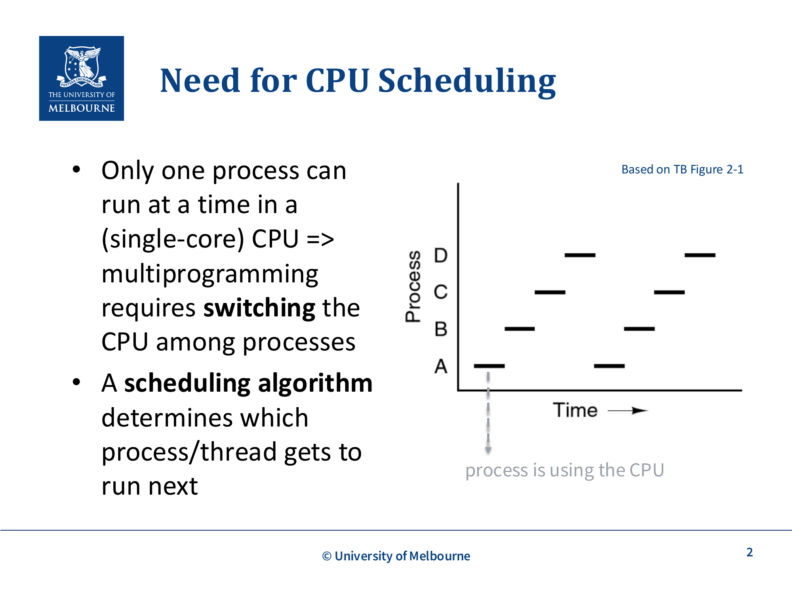
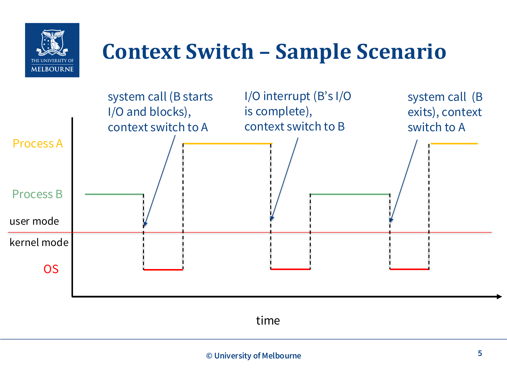
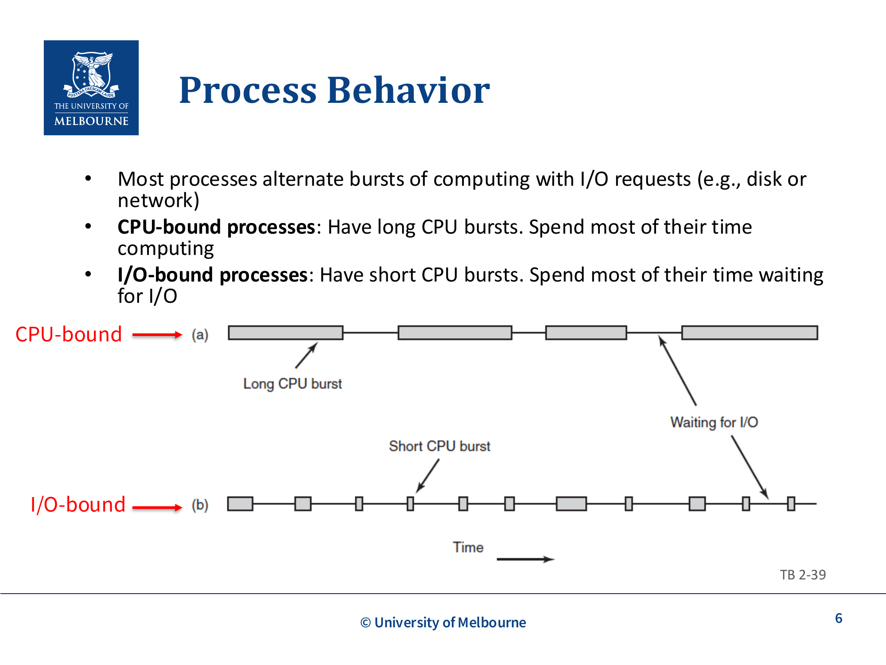
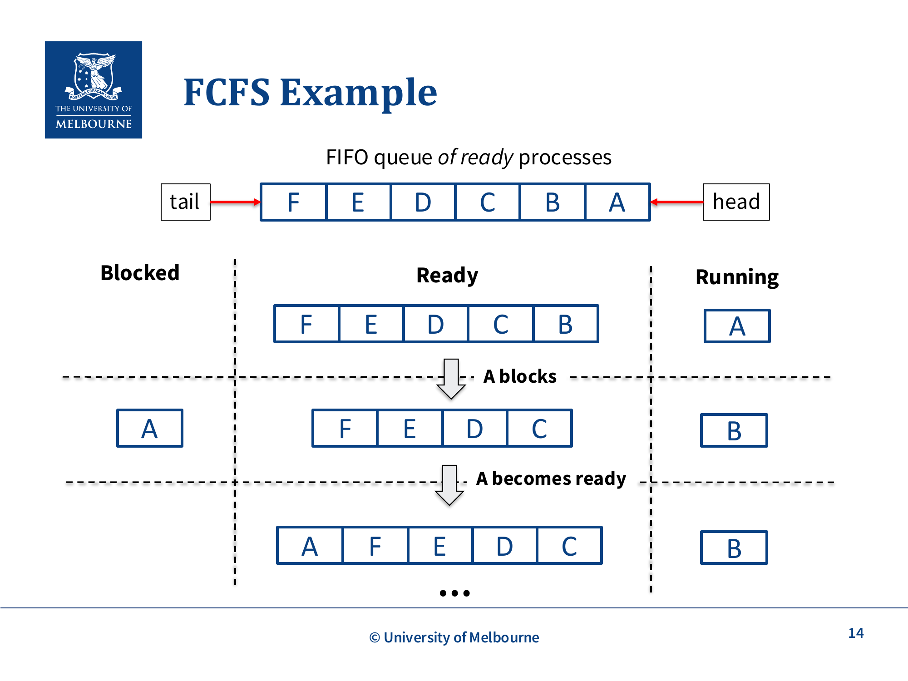
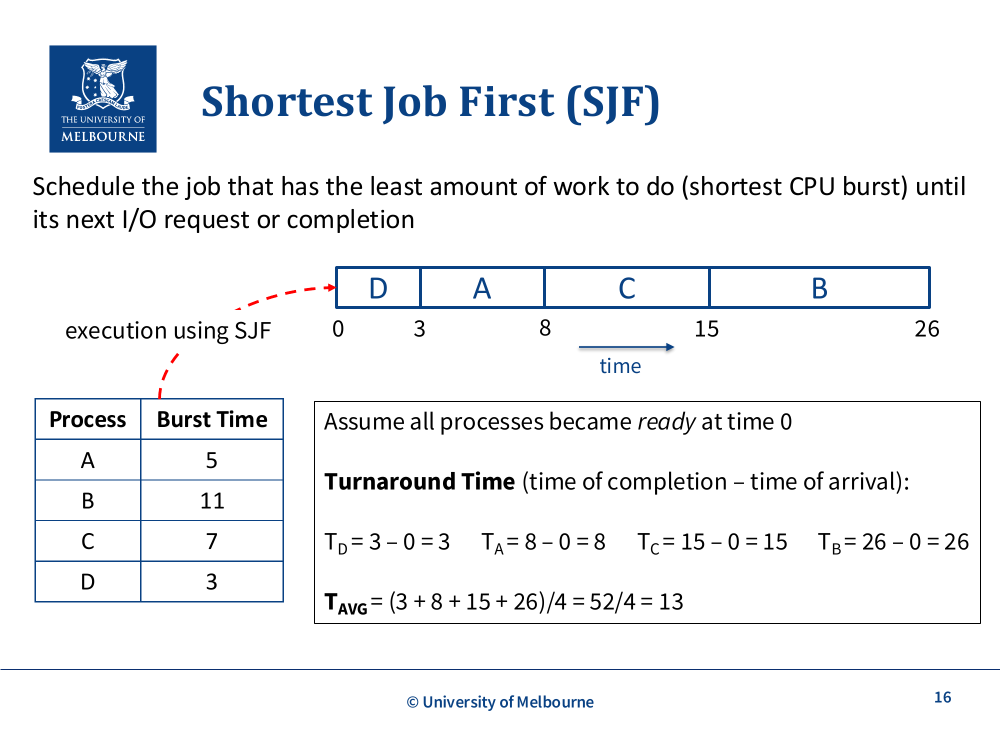
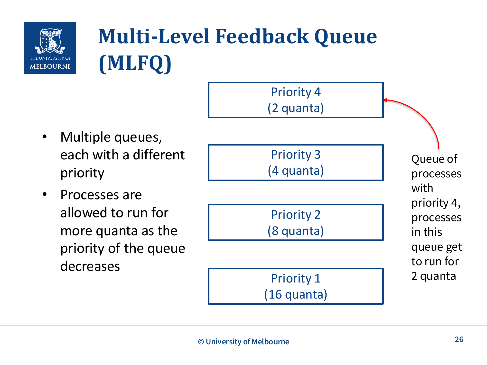
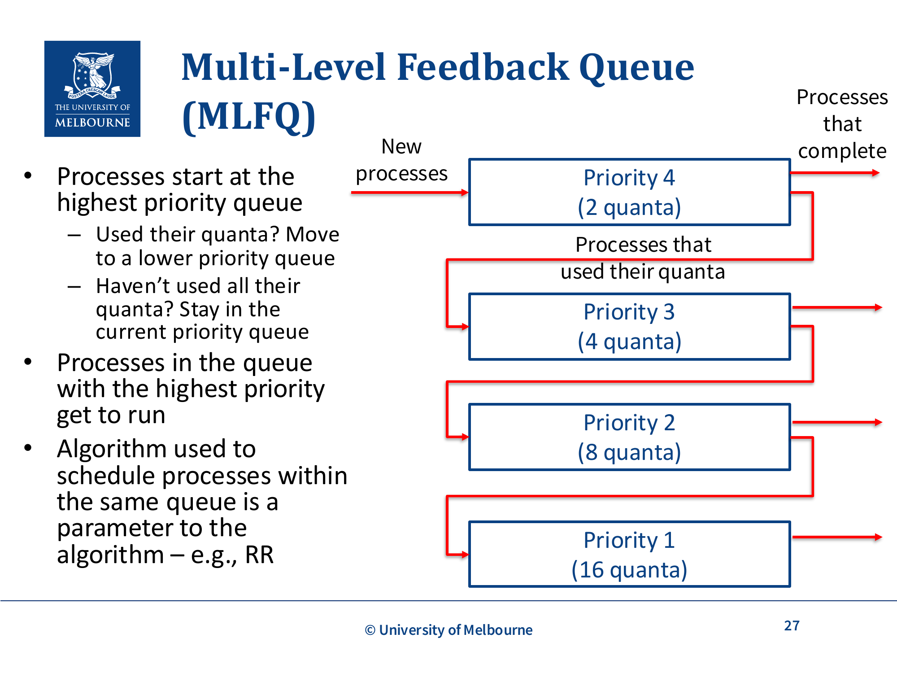
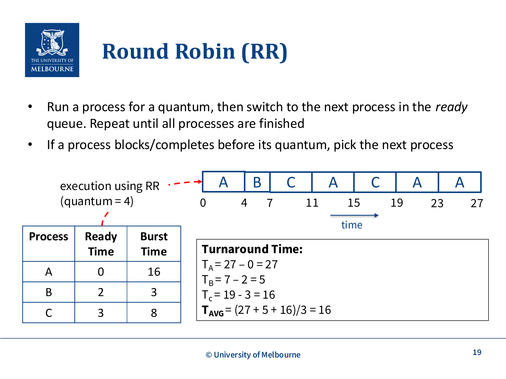

# WK3-CPU-Scheduling

## 课件概述
本课件介绍了CPU调度的基本概念和常用算法。CPU调度是操作系统中最核心的功能之一，它决定了在多个就绪进程中哪个进程获得CPU使用权。课件从调度的必要性入手，详细讲解了上下文切换、进程行为、调度环境和目标，然后介绍了非抢占式调度算法（FCFS、SJF）和抢占式调度算法（RR、优先级调度、多级反馈队列）。这些内容对于理解操作系统的并发执行和性能优化至关重要。

## 必须掌握的知识点

### 1. Need for CPU Scheduling (CPU调度的必要性)


*图片来源：COMP30023 Lecture WK3, Based on TB Figure 2-1*

#### What（是什么）
CPU调度是操作系统决定哪个进程或线程获得CPU使用权的过程。在单核CPU系统中，一次只能运行一个进程，多道程序设计需要在进程之间切换CPU。

**核心问题**：
- CPU一次只能运行一个进程
- 多个进程需要共享CPU
- 调度算法决定哪个进程接下来运行

**调度单元**：
- 可以是进程（单线程进程）
- 也可以是线程（多线程进程）
- 调度策略是 **task-agnostic**（任务无关）的——同一套算法既能调度进程也能调度线程；本课件主要用进程举例，但策略对两者都适用（对应 slide p.3）

> **非考补充（Not Examinable，对应 slide p.29）**：课件末尾提到一些**线程专属**的调度策略，明确标注不在考试范围，仅作了解：
> - **Gang scheduling**（成组调度）：把同一进程的多个线程同时调度到多核上，减少同步等待
> - **Processor affinity**（处理器亲和性）：尽量让线程留在同一核上，利用热缓存
> - **Hierarchical scheduling**（分层调度）：先选进程、再在进程内选线程
> 线程级调度更多见 Week 4 及之后内容。

#### Why（为什么重要）
CPU调度的重要性：

1. **系统效率**：合理的调度可以提高CPU利用率
2. **响应时间**：影响用户交互的响应速度
3. **吞吐量**：影响单位时间内完成的任务数量
4. **公平性**：确保所有进程都能获得CPU时间

**实际例子**：
- 当你同时运行浏览器、音乐播放器和文档编辑器时，操作系统需要决定哪个程序使用CPU
- 合理的调度可以让用户感觉所有程序都在同时运行

#### How（如何工作/实现）
CPU调度的实现机制：

1. **调度器 (Scheduler)**：
   - 从就绪队列中选择进程
   - 根据调度算法做出决策

2. **调度时机**：
   - 进程从运行状态转为阻塞状态（非抢占式）
   - 进程从运行状态转为就绪状态（抢占式）
   - 进程从阻塞状态转为就绪状态（抢占式）
   - 进程终止

3. **调度策略**：
   - 根据系统目标选择不同的调度算法
   - 不同的算法有不同的性能特征

#### 关键术语
- **CPU Scheduling**：CPU调度，决定哪个进程使用CPU
- **Scheduler**：调度器，执行调度的程序
- **Ready Queue**：就绪队列，等待CPU的进程队列

#### 常见问题
- **Q：调度和上下文切换有什么区别？**
  A：调度是决定哪个进程运行；上下文切换是实际切换进程的过程。

- **Q：什么时候发生调度？**
  A：进程阻塞、时间片用完、更高优先级进程就绪、进程终止时。

---

### 2. Context Switch (上下文切换)

#### What（是什么）
上下文切换是从一个执行进程或线程切换到另一个的过程。这是操作系统实现多任务的核心机制。

**线程上下文切换**（同一进程内的线程）：
- 保存当前线程的执行上下文到TCB
- 从TCB加载另一个线程的执行上下文到CPU

**进程上下文切换**（不同进程的线程）：
- 保存/加载执行上下文（同线程切换）
- 加载内存管理相关状态（如页表指针）
- 刷新TLB（在具有虚拟内存的分页系统中）

**执行上下文包括**：
- 程序计数器 (PC)
- 栈指针 (SP)
- 通用寄存器
- 程序状态字 (PSW)

#### Why（为什么重要）
上下文切换的重要性：

1. **多任务实现**：允许多个进程共享CPU
2. **并发执行**：提供并发的假象
3. **资源管理**：在进程之间公平分配CPU时间
4. **系统响应**：及时响应用户请求

**实际例子**：
- 当进程A请求I/O时，操作系统保存A的上下文，切换到进程B
- I/O完成后，操作系统恢复A的上下文，继续执行A

#### How（如何工作/实现）
上下文切换的详细流程：

**进程上下文切换**：
1. 保存当前进程的PC、SP、寄存器到PCB
2. 保存内存管理信息（页表基址寄存器）
3. 刷新TLB（Translation Lookaside Buffer）
4. 更新进程状态
5. 选择下一个进程
6. 从PCB恢复下一个进程的PC、SP、寄存器
7. 加载内存管理信息
8. 继续执行

**上下文切换的开销**：
- 保存/恢复寄存器：几微秒
- 刷新TLB：导致后续内存访问变慢
- 缓存失效：导致缓存命中率下降

**示例场景**：


*图片来源：COMP30023 Lecture WK3, Slide 5*

```
时间线：
1. 进程A运行
2. 系统调用（B开始I/O并阻塞），上下文切换到A
3. I/O中断（B的I/O完成），上下文切换到B
4. 系统调用（B退出），上下文切换到A
```

#### 关键术语
- **Context Switch**：上下文切换，切换进程的过程
- **Execution Context**：执行上下文，程序计数器、栈指针、寄存器
- **TLB (Translation Lookaside Buffer)**：地址转换缓存

#### 常见问题
- **Q：上下文切换的开销有多大？**
  A：通常需要几微秒到几十微秒，包括保存/恢复寄存器、切换内存映射等。

- **Q：如何减少上下文切换开销？**
  A：使用更大的时间片、减少进程数量、使用线程（线程切换开销更小）。

---

### 3. Process Behavior (进程行为)

#### What（是什么）
进程行为描述了进程如何使用CPU和I/O设备。大多数进程在计算和I/O请求之间交替。

**两种进程类型**：
1. **CPU密集型进程 (CPU-bound)**：
   - 有长的CPU突发
   - 大部分时间在计算
   - 例子：科学计算、视频编码

2. **I/O密集型进程 (I/O-bound)**：
   - 有短的CPU突发
   - 大部分时间在等待I/O
   - 例子：文本编辑器、Web浏览器

**CPU突发模式**：
- 进程执行计算 → CPU突发
- 进程请求I/O → I/O突发
- 交替进行


*图片来源：COMP30023 Lecture WK3, TB 2-39*

#### Why（为什么重要）
理解进程行为的重要性：

1. **调度优化**：根据进程类型选择调度策略
2. **资源分配**：合理分配CPU和I/O资源
3. **系统性能**：平衡CPU和I/O设备的使用
4. **响应时间**：I/O密集型进程需要更快的响应

**实际例子**：
- I/O密集型进程（如文本编辑器）需要快速响应用户输入
- CPU密集型进程（如视频编码）需要持续的CPU时间

#### How（如何工作/实现）
进程行为的管理：

**调度策略的考虑**：
- I/O密集型进程应该优先运行，以保持I/O设备忙碌
- CPU密集型进程应该获得较长的CPU时间，以减少上下文切换

**实际观察**：
- 通过监控进程的CPU和I/O使用模式
- 动态调整调度策略

#### 关键术语
- **CPU-bound**：CPU密集型，大部分时间在计算
- **I/O-bound**：I/O密集型，大部分时间在等待I/O
- **CPU Burst**：CPU突发，进程使用CPU的时间段
- **I/O Burst**：I/O突发，进程等待I/O的时间段

#### 常见问题
- **Q：如何判断进程是CPU密集型还是I/O密集型？**
  A：观察进程的CPU使用率和I/O等待时间。CPU密集型进程CPU使用率高，I/O密集型进程I/O等待时间长。

- **Q：为什么I/O密集型进程需要优先调度？**
  A：因为它们频繁进行I/O操作，快速调度它们可以保持I/O设备忙碌，提高系统整体效率。

---

### 4. Preemptive vs. Non-preemptive Scheduling (抢占式 vs 非抢占式调度)

#### What（是什么）
这是两种基本的调度方式，决定了进程何时释放CPU。

**非抢占式调度**：
- 选择一个进程运行，直到它阻塞或自愿释放CPU
- 只在必要时进行上下文切换（进程无法使用CPU时）
- 实现简单，开销小

**抢占式调度**：
- 选择一个进程运行一个固定时间（时间片/量子）
- 如果时间片用完，进程被停止，调度器选择另一个进程
- 需要时钟中断来将CPU控制权交还给调度器
- 通常导致更多的上下文切换

**关键区别**：
- 非抢占式：进程运行直到阻塞或完成
- 抢占式：进程运行直到时间片用完或阻塞

#### Why（为什么重要）
调度方式的重要性：

1. **响应时间**：抢占式调度提供更好的响应时间
2. **公平性**：抢占式调度防止进程独占CPU
3. **系统开销**：非抢占式调度开销更小
4. **适用环境**：不同的环境需要不同的调度方式

**实际例子**：
- **批处理系统**：适合非抢占式调度，因为作业不需要交互
- **交互式系统**：适合抢占式调度，因为需要快速响应用户

#### How（如何工作/实现）
调度方式的实现：

**非抢占式调度的实现**：
1. 调度器选择一个就绪进程
2. 进程运行直到：
   - 请求I/O并阻塞
   - 自愿释放CPU
   - 进程终止
3. 调度器选择下一个进程

**抢占式调度的实现**：
1. 设置定时器中断（时钟中断）
2. 调度器选择一个就绪进程
3. 进程运行直到：
   - 时间片用完（时钟中断）
   - 请求I/O并阻塞
   - 更高优先级进程就绪
4. 保存当前进程上下文
5. 调度器选择下一个进程

#### 关键术语
- **Preemptive Scheduling**：抢占式调度，可以强制切换进程
- **Non-preemptive Scheduling**：非抢占式调度，进程运行直到阻塞
- **Quantum/Time Slice**：时间片，进程运行的最大时间
- **Clock Interrupt**：时钟中断，触发调度

#### 常见问题
- **Q：什么时候使用非抢占式调度？**
  A：批处理系统、实时系统（某些情况下）、对响应时间要求不高的系统。

- **Q：抢占式调度的时间片应该设多大？**
  A：通常10-100毫秒，需要在响应时间和上下文切换开销之间平衡。

---

### 5. Scheduling Environments and Goals (调度环境和目标)

#### What（是什么）
不同的系统环境有不同的调度目标。

**批处理系统 (Batch Systems)**：
- 有（可能周期性的）作业需要运行
- 作业不需要与用户交互
- 适合非抢占式调度或长量子的抢占式调度

**交互式系统 (Interactive Systems)**：
- 作业需要与用户交互
- 用户期望系统快速响应
- 抢占式调度是必需的

**调度目标**：
- **所有系统**：
  - 公平性：**comparable processes should get comparable service**（可比的进程应得到可比的服务，对应 slide p.10 原文）；进程获得公平的CPU份额
  - 资源高效使用：例如，让I/O密集型进程使用CPU以保持I/O设备忙碌，同时通过减少不必要的上下文切换次数来降低开销（Reducing overhead by minimising context switches）
- **批处理系统**：
  - 最大化吞吐量：单位时间内完成的进程数
  - 最小化周转时间：从进程提交到完成的时间
- **交互式系统**：
  - 最小化响应时间：从发出命令到收到响应的时间

#### Why（为什么重要）
调度环境和目标的重要性：

1. **系统设计**：根据环境选择调度算法
2. **性能优化**：针对特定目标优化调度
3. **用户体验**：交互式系统需要快速响应
4. **资源利用**：最大化系统资源利用率

**实际例子**：
- Web服务器：需要最小化响应时间
- 科学计算集群：需要最大化吞吐量

#### How（如何工作/实现）
调度目标的实现：

**公平性**：
- 使用轮转调度
- 防止进程饥饿

**吞吐量最大化**：
- 减少上下文切换开销
- 优化作业调度顺序

**响应时间最小化**：
- 使用抢占式调度
- 优先调度I/O密集型进程

**周转时间最小化**：
- 使用短作业优先调度
- 减少等待时间

#### 关键术语
- **Throughput**：吞吐量，单位时间内完成的进程数
- **Turnaround Time**：周转时间，从提交到完成的时间
- **Response Time**：响应时间，从发出命令到收到响应的时间
- **Fairness**：公平性，进程获得公平的CPU份额

#### 常见问题
- **Q：如何衡量调度算法的好坏？**
  A：根据调度目标，使用吞吐量、周转时间、响应时间等指标。

- **Q：不同的调度目标之间有什么冲突？**
  A：例如，最大化吞吐量可能增加响应时间，需要根据系统需求平衡。

---

### 6. Non-preemptive Scheduling Algorithms (非抢占式调度算法)

#### What（是什么）
非抢占式调度算法选择一个进程运行直到它阻塞或完成。

**FCFS (First-come First-served，先来先服务)**：
- 按照进程进入就绪队列的顺序运行
- FIFO队列实现
- 简单易实现

**SJF (Shortest Job First，短作业优先)**：
- 选择CPU突发最短的进程运行
- 需要估计CPU突发长度
- 对于给定的作业集，平均周转时间最优

#### Why（为什么重要）
非抢占式调度算法的重要性：

1. **简单性**：实现简单，开销小
2. **可预测性**：进程运行时间可预测
3. **适用场景**：批处理系统、实时系统

**实际例子**：
- 打印队列：先来先服务
- 作业调度：短作业优先

#### How（如何工作/实现）
FCFS的实现：

**FCFS算法**：
1. 进程按到达顺序进入就绪队列
2. 调度器选择队首进程运行
3. 进程运行直到阻塞或完成
4. 如果进程阻塞，它回到队尾
5. 重复步骤2-4

**FCFS分析**：
- 优点：简单，易于实现，上下文切换开销低
- 缺点：
  - 护航效应：短进程在长进程后面等待
  - 可能导致饥饿：如果运行的进程永不释放CPU

**SJF算法**：
1. 估计每个进程的CPU突发长度
2. 选择突发最短的进程运行
3. 进程运行直到阻塞或完成
4. 重复步骤1-3

**SJF分析**：
- 优点：平均周转时间最优
- 缺点：
  - 需要估计CPU突发长度
  - 长进程可能饥饿

**FCFS示例**：


*图片来源：COMP30023 Lecture WK3, Slide 14*

```
就绪队列：A, B, C, D
执行顺序：A → B → C → D
```

**FCFS 带 blocking 的队列动态（对应 slide p.14，A–F 六进程）**：真实场景中进程会在运行中阻塞、之后又变 ready，队列会反复变动：
```
初始 ready queue（按到达）：F E D C B A
调度 A 运行 → A 执行中请求 I/O → A 阻塞（移出 ready queue，进 blocked）
调度 B 运行 → ... → A 的 I/O 完成 → A 重新进入 ready queue 尾部
继续调度队首...
```
关键点：**阻塞的进程离开 ready queue**，I/O 完成后**回到队尾**（不是队首），所以 FCFS 的"先来先服务"是对 ready 状态而言，blocked→ready 是一次重新入队。

**RR 带 blocking 的队列动态（对应 slide p.21–22）**：RR 中进程可能在中途阻塞，也可能时间片没用完就阻塞：
```
ready queue: A B C
A 跑满 quantum → 回队尾；B 跑
B 跑到一半请求 I/O → B 阻塞（不回队尾，因为 quantum 没用完）
C 接着跑 → 此时 B 的 I/O 完成 → B 回 ready queue 尾部
注意：B 重新入队时不会"补"上它没用完的 quantum
```
关键点：**阻塞（时间片未用完）≠ 用完时间片降级**；进程阻塞后重新 ready 时按"新到"处理，排在队尾。

**SJF示例**：


*图片来源：COMP30023 Lecture WK3, Slide 16*

```
进程    突发时间
A       5
B       11
C       7
D       3

执行顺序：D(3) → A(5) → C(7) → B(11)
周转时间：
TD = 3 - 0 = 3
TA = 8 - 0 = 8
TC = 15 - 0 = 15
TB = 26 - 0 = 26
平均周转时间 = (3+8+15+26)/4 = 13
```

#### 关键术语
- **FCFS (First-come First-served)**：先来先服务
- **SJF (Shortest Job First)**：短作业优先
- **Convoy Effect**：护航效应，短进程在长进程后面等待
- **Starvation**：饥饿，进程长时间无法获得CPU

#### 常见问题
- **Q：FCFS的护航效应是什么？**
  A：当一个长CPU密集型进程运行时，所有短I/O密集型进程都在等待，导致I/O设备空闲。

- **Q：SJF为什么是最优的？**
  A：对于给定的作业集，SJF的平均周转时间最小。

---

### 7. Preemptive Scheduling Algorithms (抢占式调度算法)

#### What（是什么）
抢占式调度算法可以强制切换进程，提供更好的响应时间和公平性。

**Round Robin (RR，轮转调度)**：
- 每个进程运行一个时间片（量子）
- 时间片用完后，进程被移到队尾
- 循环执行直到所有进程完成

**Priority Scheduling (优先级调度)**：
- 为每个进程分配优先级
- 调度器选择优先级最高的进程
- 可以是静态或动态优先级

**Multi-level Feedback Queue (MLFQ，多级反馈队列)**：
- 多个队列，每个队列有不同的优先级
- 进程可以在队列之间移动
- I/O密集型进程获得更高优先级

#### Why（为什么重要）
抢占式调度算法的重要性：

1. **响应时间**：提供更好的响应时间
2. **公平性**：防止进程独占CPU
3. **适应性**：可以根据进程行为调整调度
4. **交互性**：适合交互式系统

**实际例子**：
- 操作系统：使用MLFQ调度进程
- 实时系统：使用优先级调度

#### How（如何工作/实现）
Round Robin的实现：

**RR算法**：
1. 设置时间片（量子）大小
2. 进程按到达顺序进入就绪队列
3. 调度器选择队首进程运行
4. 进程运行一个时间片或直到阻塞
5. 如果时间片用完，进程移到队尾
6. 重复步骤3-5

**RR分析**：
- 优点：简单，易于实现，无饥饿
- 缺点：
  - 周转时间可能较长（Not good for turnaround time）
  - 倾向于CPU密集型进程（favours CPU-bound over I/O-bound）：CPU密集型进程每次都能用满整个时间片，而I/O密集型进程经常在时间片用完前阻塞，导致I/O密集型进程获得的CPU时间相对较少

**时间片大小的影响**：
- 时间片太长：退化为FCFS
- 时间片太短：上下文切换开销大
- 经验法则：时间片应该比上下文切换时间大100倍以上

**优先级调度的实现**：
1. 为每个进程分配优先级
2. 调度器选择优先级最高的进程
3. 优先级可以是：
   - 静态：进程创建时确定
   - 动态：根据进程行为调整
4. 为避免饥饿：每个时钟中断（clock tick）后降低当前运行进程的优先级
5. 如果运行进程的优先级已降至低于下一个最高就绪进程的优先级，则发生抢占（Preempt process if its priority dropped below that of the next highest process）

**MLFQ的实现**：
1. 创建多个队列，每个队列有不同的优先级
2. 每个队列有不同的时间片
3. 进程从高优先级队列开始
4. 如果进程用完时间片，移到低优先级队列
5. 如果进程在时间片内阻塞，留在当前队列
6. 高优先级队列的进程优先运行


*图片来源：COMP30023 Lecture WK3, Slide 26*


*图片来源：COMP30023 Lecture WK3, Slide 27*

**MLFQ的三个可配置参数**（Parameters include）：
- **队列数量**（Number of queues）
- **每队列的调度算法**（Scheduling algorithm per queue，例如RR或FCFS）
- **每队列的时间片**（Quantum for each queue）

**课件具体配额（对应 slide p.26–27，4 级队列）**：
- Priority 4（最高）= 2 quanta
- Priority 3 = 4 quanta
- Priority 2 = 8 quanta
- Priority 1（最低）= 16 quanta

即**优先级越低、时间片越长**：交互/I/O 进程在高优先级队列用小时间片快速响应；CPU 密集进程沉到低队列后获得大时间片，减少切换开销。

**MLFQ分析**：
- 优点：
  - I/O密集型进程获得高优先级
  - CPU密集型进程获得大时间片
  - 不需要预知进程行为
- 缺点：
  - 实现复杂
  - 可能饥饿（通过优先级提升缓解）

**RR示例**：


*图片来源：COMP30023 Lecture WK3, Slide 19*

```
进程    突发时间    到达时间
A       16         0
B       3          2
C       8          3

时间片 = 4

执行顺序：
0-4: A (剩余12)
4-7: B (完成)
7-11: C (剩余4)
11-15: A (剩余8)
15-19: C (完成)
19-23: A (剩余4)
23-27: A (完成)

周转时间：
TA = 27 - 0 = 27
TB = 7 - 2 = 5
TC = 19 - 3 = 16
平均周转时间 = (27+5+16)/3 = 16
```

**响应时间计算**（Response Time）：
响应时间 = 第一次运行的时间 - 到达就绪队列的时间

```
RA = 0 - 0 = 0
RB = 4 - 2 = 2
RC = 7 - 3 = 4
RAVG = (0 + 2 + 4)/3 = 2
```

RR 对响应时间表现良好（Good for response time），因为每个进程都有机会在较短时间内首次获得CPU运行。

#### 关键术语
- **Round Robin (RR)**：轮转调度
- **Priority Scheduling**：优先级调度
- **Multi-level Feedback Queue (MLFQ)**：多级反馈队列
- **Quantum/Time Slice**：时间片

#### 常见问题
- **Q：时间片大小如何选择？**
  A：通常10-100毫秒，需要在响应时间和上下文切换开销之间平衡。

- **Q：MLFQ如何防止饥饿？**
  A：通过定期提升进程的优先级（优先级提升）。

- **Q：优先级调度的缺点是什么？**
  A：可能导致低优先级进程饥饿。

## 知识点之间的联系

这些知识点形成了一个完整的知识体系：

1. **调度必要性** → **上下文切换** → **进程行为**：这是调度的基础
2. **调度环境和目标** → **调度算法**：这是调度策略的选择
3. **非抢占式算法** → **抢占式算法**：这是调度方式的演进

**整体流程**：
- 操作系统根据系统环境和目标选择调度算法
- 调度器从就绪队列选择进程
- 上下文切换执行进程切换
- 根据进程行为调整调度策略

## 实际应用案例

### 案例1：Linux调度器
```
Linux使用CFS（完全公平调度器）：
- 基于虚拟运行时间
- 红黑树组织就绪进程
- 优先级影响时间片分配
- 适合交互式系统
```

### 案例2：Windows调度器
```
Windows使用多级反馈队列：
- 32个优先级级别
- 动态调整优先级
- 时间片根据优先级变化
- 适合桌面系统
```

### 案例3：实时系统调度
```
实时系统使用优先级调度：
- 严格的时间约束
- 抢占式调度
- 优先级反转问题
- 使用优先级继承协议
```

## 常见错误和易错点

### 1. 混淆调度和上下文切换
- **错误**：认为调度和上下文切换是同一概念
- **正确**：调度是决策，上下文切换是执行

### 2. 不理解时间片的影响
- **错误**：认为时间片越小越好
- **正确**：时间片太小会导致上下文切换开销过大

### 3. 忽视进程行为
- **错误**：对所有进程使用相同的调度策略
- **正确**：根据进程类型（CPU密集型 vs I/O密集型）调整策略

### 4. 不理解饥饿问题
- **错误**：认为所有调度算法都是公平的
- **正确**：某些算法（如SJF、优先级调度）可能导致饥饿

### 5. 混淆周转时间和响应时间
- **错误**：认为周转时间就是响应时间
- **正确**：周转时间是从提交到完成，响应时间是从请求到第一次响应

## 课件总结

本课件介绍了CPU调度的核心概念和算法：

1. **CPU调度的必要性**：单核CPU需要多道程序设计，调度器决定进程运行顺序。

2. **上下文切换**：切换进程的机制，包括保存/恢复执行上下文和内存管理信息。

3. **进程行为**：CPU密集型和I/O密集型进程的不同特征。

4. **调度环境和目标**：批处理系统和交互式系统的不同目标。

5. **非抢占式调度算法**：
   - FCFS：简单，但可能导致护航效应
   - SJF：最优平均周转时间，但需要预测

6. **抢占式调度算法**：
   - RR：简单公平，但周转时间可能较长
   - 优先级调度：灵活，但可能饥饿
   - MLFQ：适应性强，但实现复杂

这些内容为理解操作系统的并发执行和性能优化奠定了基础。

## 复习建议

1. **理解概念**：重点理解不同调度算法的优缺点和适用场景
2. **计算练习**：练习计算周转时间和响应时间
3. **画图辅助**：画出调度执行的时间线图
4. **比较算法**：比较不同算法的性能特征
5. **重点复习**：MLFQ的工作原理和优势
