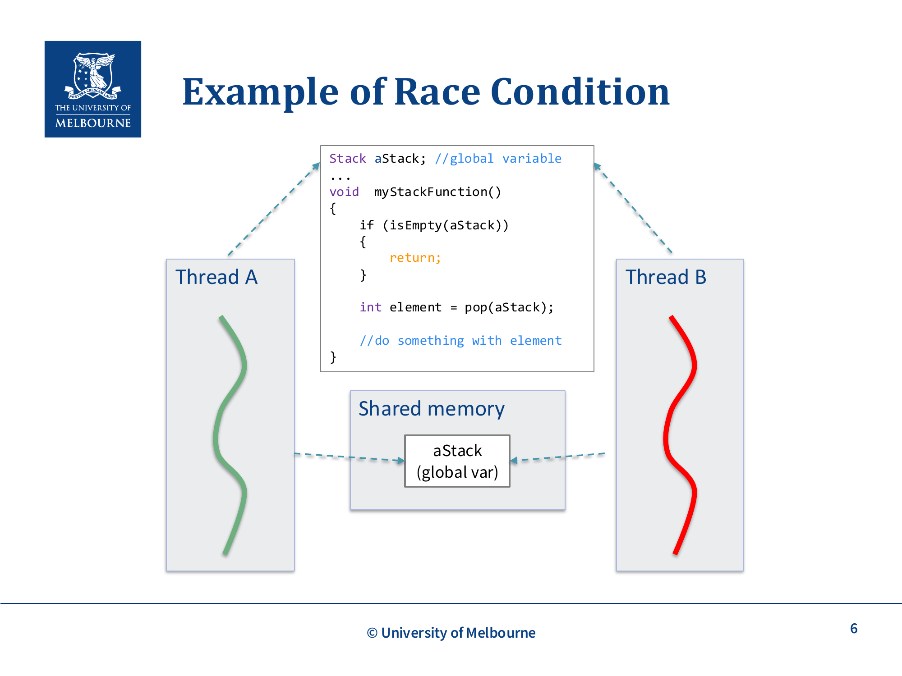
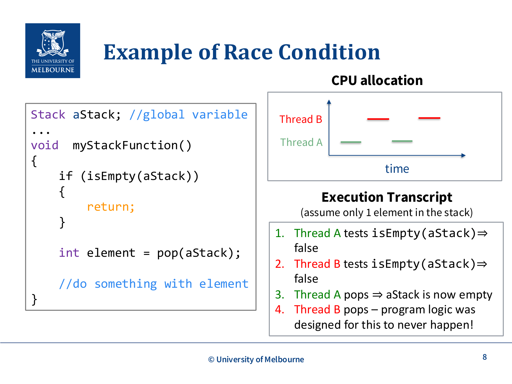
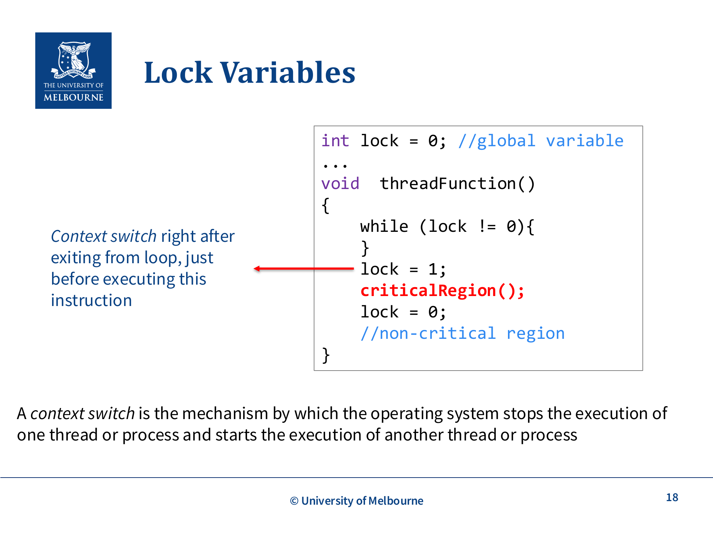
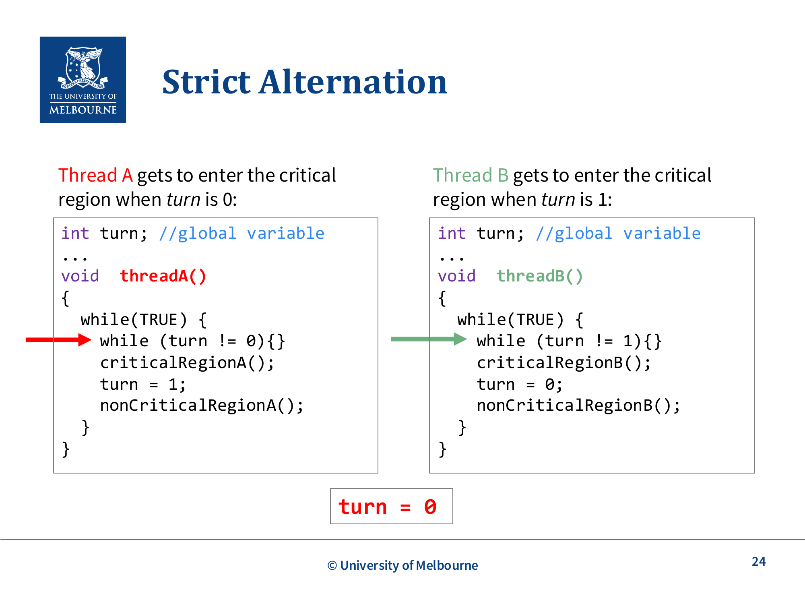
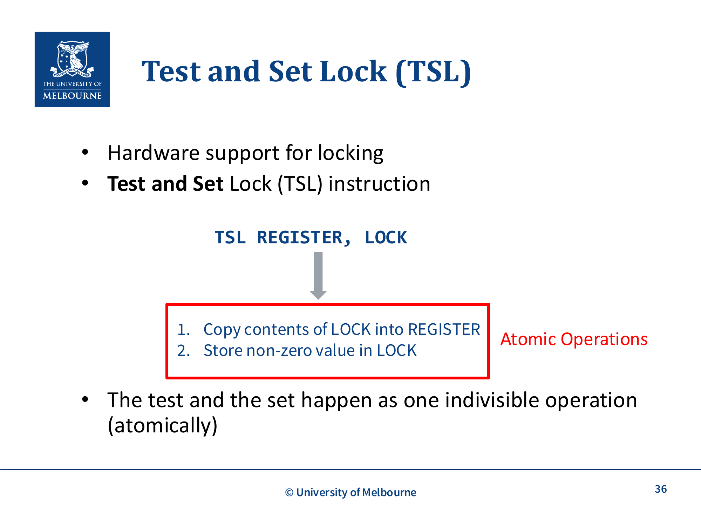
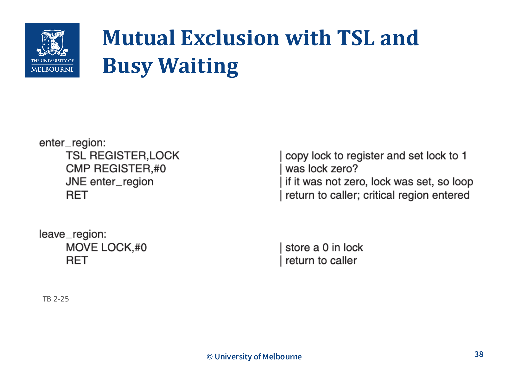

# WK3-IPC

## 课件概述
本课件介绍了进程间通信（IPC）的基本概念和实现机制。重点讲解了竞态条件（Race Condition）问题及其解决方案。课件从进程间通信的必要性入手，详细分析了竞态条件产生的原因和危害，然后介绍了临界区、互斥、锁变量、忙等待、优先级反转、严格交替、测试并设置锁（TSL）、阻塞等概念。这些内容是理解并发编程和操作系统同步机制的基础。

## 必须掌握的知识点

### 1. Interprocess Communication (IPC，进程间通信)

#### What（是什么）
进程间通信是指多个进程之间交换数据和共享资源的机制。由于每个进程有独立的地址空间，进程间通信需要特殊的机制来实现。

**IPC的必要性**：
- 进程经常需要与其他进程通信
- 需要共享资源和数据
- 合作进程需要有序执行

**IPC机制**：
- 共享内存（Shared Memory）
- 管道（Pipes）
- 文件（Files）
- 套接字（Sockets）
- 信号（Signals）

**进程与线程**：
- 本课件中进程和线程可互换使用
- 相同的问题和解决方案适用于两者

#### Why（为什么重要）
IPC的重要性：

1. **数据共享**：多个进程需要访问相同数据
2. **任务协作**：复杂任务需要多个进程协作完成
3. **模块化设计**：将系统分解为独立的进程
4. **并发执行**：允许多个任务并行执行

**实际例子**：
- Web服务器：主进程接收请求，工作进程处理请求
- 数据库系统：多个客户端进程同时访问数据库
- 操作系统：不同系统服务之间需要通信

#### How（如何工作/实现）
IPC的实现机制：

**共享内存**：
- 多个进程映射同一块物理内存
- 进程直接读写共享内存
- 需要同步机制防止竞态条件

**管道**：
- 单向数据流
- 一个进程写入，另一个进程读出
- 匿名管道（父子进程）和命名管道（任意进程）

**消息传递**：
- 进程通过发送/接收消息通信
- 消息队列、邮箱等

#### 关键术语
- **IPC (Interprocess Communication)**：进程间通信
- **Shared Memory**：共享内存
- **Race Condition**：竞态条件
- **Critical Region**：临界区

#### 常见问题
- **Q：进程间通信和线程间通信有什么区别？**
  A：线程共享地址空间，可以直接访问共享变量；进程需要特殊的IPC机制。

- **Q：为什么需要同步机制？**
  A：防止多个进程/线程同时访问共享资源导致数据不一致。

---

### 2. Race Conditions (竞态条件)



#### What（是什么）
竞态条件是多个进程/线程访问共享资源时，结果取决于代码执行时序的问题。

**竞态条件的特征**：
- 多个进程/线程访问共享资源
- 结果取决于指令执行顺序
- 结果不确定，每次运行可能不同

**竞态条件的示例**：
```c
Stack aStack; // 全局变量

void myStackFunction() {
    if (isEmpty(aStack)) {
        return;
    }
    int element = pop(aStack);
    // 使用element
}
```

**问题分析**：
假设栈中只有一个元素：

**执行顺序1**（正确）：
1. 线程A检查isEmpty(aStack) → false
2. 线程A执行pop → 栈为空
3. 线程B检查isEmpty(aStack) → true
4. 线程B返回（没有元素可处理）

**执行顺序2**（错误）：
1. 线程A检查isEmpty(aStack) → false
2. 线程B检查isEmpty(aStack) → false
3. 线程A执行pop → 栈为空
4. 线程B执行pop → **程序逻辑设计为永远不会发生！**

#### Why（为什么重要）
竞态条件的重要性：

1. **数据一致性**：可能导致数据损坏
2. **程序正确性**：破坏程序的逻辑
3. **难以调试**：问题难以重现和定位
4. **系统稳定性**：可能导致系统崩溃

**实际例子**：
- 银行账户：两个ATM同时取款可能导致余额错误
- 购物车：多个用户同时修改购物车可能导致数据丢失
- 文件系统：多个进程同时写入文件可能导致数据损坏



#### How（如何工作/实现）
竞态条件的产生条件：

**必要条件**：
1. **共享资源**：多个进程/线程访问同一资源
2. **并发执行**：多个进程/线程同时执行
3. **修改操作**：至少有一个进程/线程修改资源
4. **无同步**：没有适当的同步机制

**竞态条件的检测**：
- 代码审查
- 压力测试
- 静态分析工具

#### 关键术语
- **Race Condition**：竞态条件
- **Shared Resource**：共享资源
- **Indeterminate**：不确定的

#### 常见问题
- **Q：如何避免竞态条件？**
  A：使用同步机制（如互斥锁）保护共享资源。

- **Q：竞态条件和死锁有什么区别？**
  A：竞态条件是时序问题，死锁是资源等待问题。

---

### 3. Critical Region and Mutual Exclusion (临界区和互斥)

#### What（是什么）
**临界区（Critical Region）**：访问共享资源的代码部分。

**互斥（Mutual Exclusion）**：保证在任何时刻只有一个进程/线程在临界区内执行。


**互斥的可视化**：
```
进程A：          进程B：
    ↓               ↓
[非临界区]      [非临界区]
    ↓               ↓
[获取锁]        [等待锁]
    ↓               ↓
[临界区]        [等待锁]
    ↓               ↓
[释放锁]        [获取锁]
    ↓               ↓
[非临界区]      [临界区]
```

**关键理解**：如果临界区具有互斥属性，前面竞态条件中的"执行顺序2"（两个线程同时进入临界区）将永远不会发生。

**互斥实现方法的分层结构**（Mutual Exclusion approaches）：
```
互斥（Mutual Exclusion）
├── 忙等待（Busy Waiting）
│   ├── 严格交替（Strict Alternation）
│   └── TSL + 忙等待（TSL with busy waiting）
└── 阻塞（Blocking）
    └── 互斥锁（Mutex）
```

#### Why（为什么重要）
互斥的重要性：

1. **数据保护**：防止数据损坏
2. **程序正确性**：保证程序逻辑正确
3. **系统稳定性**：防止系统崩溃
4. **资源管理**：有序管理共享资源

**实际例子**：
- 数据库事务：保证事务的原子性
- 文件操作：防止多个进程同时写入
- 打印队列：保证打印任务有序执行

#### How（如何工作/实现）
互斥的实现机制：

**锁机制**：
- 获取锁：进入临界区前获取锁
- 释放锁：离开临界区时释放锁
- 只有持有锁的进程/线程可以进入临界区

**互斥的条件**：
1. **互斥**：任何时刻最多一个进程在临界区内
2. **无假设**：不对CPU速度或数量做假设
3. **不阻塞**：临界区外的进程不能阻塞其他进程
4. **无饥饿**：进程不会永远等待进入临界区

#### 关键术语
- **Critical Region**：临界区，访问共享资源的代码
- **Mutual Exclusion**：互斥，保证独占访问
- **Lock**：锁，控制访问的机制

#### 常见问题
- **Q：临界区应该设多大？**
  A：尽可能小，只包含访问共享资源的代码。

- **Q：忘记释放锁会怎样？**
  A：其他进程永远无法进入临界区，导致死锁或饥饿。

---

### 4. Lock Variables (锁变量)



#### What（是什么）
锁变量是实现互斥的一种简单方法，使用变量来表示锁的状态。

**锁变量的实现**：
```c
int lock = 0; // 全局变量

void threadFunction() {
    while (lock != 0) {
        // 忙等待
    }
    lock = 1;
    criticalRegion();
    lock = 0;
    // 非临界区
}
```

**问题分析**：
如果在线程退出循环后、设置lock=1之前发生上下文切换：

1. 线程A检查lock != 0 → false，退出循环
2. 线程B检查lock != 0 → false，退出循环
3. 线程A执行lock = 1，进入临界区
4. 线程B执行lock = 1，进入临界区

**结果**：两个线程同时在临界区内！

#### Why（为什么重要）
锁变量的重要性：

1. **基本同步机制**：理解同步的基础
2. **问题暴露**：展示简单实现的缺陷
3. **设计启发**：启发更复杂的同步机制

**实际例子**：
- 单核系统：可能因为上下文切换导致问题
- 多核系统：多个CPU同时执行导致问题

#### How（如何工作/实现）
锁变量的改进：

**原子操作**：
- 测试和设置必须是原子操作
- 硬件支持（如TSL指令）

**忙等待**：
- 进程循环检查锁状态
- 浪费CPU资源
- 可能导致优先级反转

#### 关键术语
- **Lock Variable**：锁变量
- **Busy Waiting**：忙等待
- **Atomic Operation**：原子操作

#### 常见问题
- **Q：为什么简单的锁变量实现有问题？**
  A：因为测试和设置是两个独立操作，可能被中断。

- **Q：如何解决锁变量的问题？**
  A：使用原子操作（如TSL指令）。

---

### 5. Busy Waiting and Priority Inversion (忙等待和优先级反转)

#### What（是什么）
**忙等待（Busy Waiting）**：进程循环检查条件，不释放CPU。课件原文（slide p.17–18）："**busy waiting – spin until lock becomes 0**"——线程在一个循环里自旋，直到锁变量变成 0 才进临界区。

**上下文切换的形式定义（对应 slide p.18）**：context switch = **OS 停止一个线程、启动另一个线程**的过程，期间要保存旧线程的 PC/SP/寄存器到它的 TCB，并从新线程的 TCB 恢复。它是竞态条件的"温床"——任何在"检查"和"设置"之间发生的 context switch 都可能破坏不变式。

**优先级反转（Priority Inversion）**：高优先级进程等待低优先级进程释放资源，但低优先级进程无法获得CPU。

**优先级反转示例**：
- 系统运行两个进程：高优先级Phigh和低优先级Plow
- 调度规则：Phigh总是获得CPU（除非阻塞）
- 某时刻：
  - Plow在临界区内
  - Phigh变为就绪（如I/O完成）
  - Phigh开始运行，忙等待（无法进入临界区）
  - Plow永远无法退出临界区（因为无法获得CPU）
  - Phigh永远循环等待

#### Why（为什么重要）
忙等待和优先级反转的重要性：

1. **CPU浪费**：忙等待浪费CPU资源
2. **系统性能**：降低系统整体性能
3. **实时性**：影响实时系统的响应时间
4. **死锁风险**：可能导致系统死锁

**实际例子**：
- 实时系统：优先级反转可能导致任务错过截止时间
- 嵌入式系统：资源受限，忙等待影响性能

#### How（如何工作/实现）
忙等待的改进：

**阻塞机制**：
- 进程等待时释放CPU
- 使用系统调用（如yield、sleep）
- 减少CPU浪费

**优先级继承**：
- 低优先级进程继承高优先级进程的优先级
- 确保低优先级进程能尽快释放资源

#### 关键术语
- **Busy Waiting**：忙等待，循环检查条件
- **Priority Inversion**：优先级反转
- **Priority Inheritance**：优先级继承

#### 常见问题
- **Q：忙等待有什么缺点？**
  A：浪费CPU资源，可能导致优先级反转。

- **Q：如何避免优先级反转？**
  A：使用阻塞机制或优先级继承协议。

---

### 6. Strict Alternation (严格交替)



#### What（是什么）
严格交替是忙等待的一种实现方式，两个进程/线程轮流执行临界区。

**实现代码**：
```c
int turn; // 全局变量

void threadA() {
    while(TRUE) {
        while (turn != 0) {} // 忙等待
        criticalRegionA();
        turn = 1;
        nonCriticalRegionA();
    }
}

void threadB() {
    while(TRUE) {
        while (turn != 1) {} // 忙等待
        criticalRegionB();
        turn = 0;
        nonCriticalRegionB();
    }
}
```

**执行流程**：
- turn = 0：线程A进入临界区
- turn = 1：线程B进入临界区
- 交替执行

**问题**：
- 课件原话（slide p.35）："**Thread B is blocking Thread A … but Thread B is outside of the critical region**"——线程 B 在临界区**外**却仍能阻塞线程 A 进入临界区
- 违反互斥条件 3（临界区外的进程不能阻塞其他进程）：进度性被破坏

#### Why（为什么重要）
严格交替的重要性：

1. **基本概念**：理解同步的基础
2. **问题暴露**：展示忙等待的局限性
3. **设计启发**：启发更好的同步机制

**实际例子**：
- 生产者-消费者问题：需要交替执行
- 读者-写者问题：需要控制访问顺序

#### How（如何工作/实现）
严格交替的实现：

**执行流程**：
1. 线程A检查turn != 0 → false（turn = 0）
2. 线程A进入临界区
3. 线程A设置turn = 1
4. 线程A执行非临界区
5. 线程B检查turn != 1 → false（turn = 1）
6. 线程B进入临界区
7. 线程B设置turn = 0
8. 重复

**问题场景**：
- 线程A设置turn = 1后
- 线程B在非临界区执行很长时间
- 线程A想再次进入临界区，但必须等待线程B

#### 关键术语
- **Strict Alternation**：严格交替
- **Turn Variable**：轮转变量

#### 常见问题
- **Q：严格交替有什么缺点？**
  A：进程必须轮流执行，即使另一个进程不在临界区。

- **Q：什么时候适合使用严格交替？**
  A：当两个进程需要严格交替执行时。

---

### 7. Test and Set Lock (TSL，测试并设置锁)



#### What（是什么）
TSL是硬件支持的原子操作，用于实现锁机制。

**TSL指令**：
```
TSL REGISTER, LOCK
```
1. 将LOCK的内容复制到REGISTER
2. 将非零值存储到LOCK



**关键特性**：
- 测试和设置是原子操作
- 不可被中断
- 硬件支持

**使用TSL实现互斥**：
```c
// 进入临界区
while (TRUE) {
    TSL REGISTER, LOCK
    if (REGISTER == 0) {
        break; // 获取锁
    }
    // 否则继续循环（忙等待）
}

// 临界区代码

// 离开临界区
LOCK = 0;
```

#### Why（为什么重要）
TSL的重要性：

1. **原子性**：保证操作的原子性
2. **硬件支持**：高效的同步机制
3. **互斥保证**：正确实现互斥
4. **简单实现**：简化锁的实现

**实际例子**：
- 操作系统内核：实现进程同步
- 多线程程序：实现线程安全

#### How（如何工作/实现）
TSL的实现：

**硬件实现**：
- CPU提供TSL指令
- 总线锁定，防止其他CPU访问内存
- 原子操作

**软件实现**：
- 使用TSL指令实现锁
- 忙等待检查锁状态
- 释放锁时设置为0

#### 关键术语
- **TSL (Test and Set Lock)**：测试并设置锁
- **Atomic Operation**：原子操作
- **Hardware Support**：硬件支持

#### 常见问题
- **Q：TSL和普通锁变量有什么区别？**
  A：TSL是原子操作，普通锁变量的测试和设置是分开的。

- **Q：TSL的缺点是什么？**
  A：仍然是忙等待，浪费CPU资源。

---

### 8. Blocking (阻塞)

#### What（是什么）
阻塞是另一种实现互斥的方式，进程等待时释放CPU。课件里 Blocking 这一支下的锁统称为 **Mutex**（互斥锁，对应 slide p.20）：忙等待靠自旋，阻塞靠把线程挂起并在锁可用时唤醒。所以"mutex"在课件语境里常特指**阻塞型**的互斥实现，与 spinlock 相对。

**阻塞机制**：
- 检查是否可以进入临界区
- 如果不能，释放CPU（yield或sleep）
- 等待锁可用时被唤醒

**Yield Mutex**：
```c
void lock() {
    while (TSL(LOCK)) {
        yield(); // 释放CPU
    }
}

void unlock() {
    LOCK = 0;
}
```

**与忙等待的区别**：
- 忙等待：循环检查，占用CPU
- 阻塞：释放CPU，等待唤醒

#### Why（为什么重要）
阻塞的重要性：

1. **CPU效率**：释放CPU，让其他进程使用
2. **系统性能**：提高系统整体性能
3. **响应性**：提高系统响应性
4. **资源利用**：更好地利用系统资源

**阻塞的缺点**（Cons）：
- **饥饿**：某些进程可能长时间得不到调度
- **系统调用开销**：yield/sleep等系统调用产生额外开销
- **上下文切换开销**：阻塞会导致额外的上下文切换

**实际例子**：
- 操作系统：进程等待I/O时阻塞
- Web服务器：线程等待请求时阻塞
- 数据库：事务等待锁时阻塞

#### How（如何工作/实现）
阻塞的实现：

**系统调用**：
- yield()：让出CPU，重新调度
- sleep()：休眠指定时间
- wait()：等待事件

**唤醒机制**：
- 信号（Signal）
- 条件变量（Condition Variable）
- 事件（Event）

#### 关键术语
- **Blocking**：阻塞，释放CPU等待
- **Yield**：让出CPU
- **Sleep**：休眠

#### 常见问题
- **Q：阻塞和忙等待有什么区别？**
  A：阻塞释放CPU，忙等待占用CPU。

- **Q：什么时候使用阻塞，什么时候使用忙等待？**
  A：等待时间短用忙等待，等待时间长用阻塞。

---

### 9. Deadlocks (死锁) ⚠️ 非考试内容（Not Examinable）

#### What（是什么）
死锁是多个进程相互等待对方释放资源，导致所有进程都无法继续执行的情况。课件定义原话（slide p.41）：进程在"**waiting for an event that only another process in the set can cause**"（等待一个只有该进程组里另一个进程才能引发的事件）。

**死锁的条件**（四个必要条件）：
1. **互斥**：资源不能共享
2. **占有并等待**：进程持有资源并等待其他资源
3. **非抢占**：资源不能被强制释放
4. **循环等待**：存在进程等待的循环链

**死锁示例**：
```c
// 进程A
Lock(M1);
DoWork();
Lock(M2);  // 等待进程B释放M2
DoWork();
Release_lock(M1);
Release_lock(M2);

// 进程B
Lock(M2);
DoWork();
Lock(M1);  // 等待进程A释放M1
DoWork();
Release_lock(M2);
Release_lock(M1);
```

#### Why（为什么重要）
死锁的重要性：

1. **系统停滞**：导致系统无法继续执行
2. **资源浪费**：占用资源无法释放
3. **难以检测**：死锁可能难以发现
4. **难以恢复**：需要特殊机制恢复

**实际例子**：
- 数据库系统：多个事务相互等待
- 操作系统：多个进程相互等待资源
- 网络系统：多个节点相互等待

#### How（如何工作/实现）
死锁的处理：

**预防**：
- 破坏四个必要条件之一
- 资源有序分配
- 银行家算法

**避免**：
- 动态检查资源分配
- 安全状态检测

**检测和恢复**：
- 定期检查死锁
- 终止进程或回滚事务

#### 关键术语
- **Deadlock**：死锁
- **Circular Wait**：循环等待
- **Resource Allocation Graph**：资源分配图

#### 常见问题
- **Q：如何预防死锁？**
  A：破坏四个必要条件之一，如资源有序分配。

- **Q：死锁和饥饿有什么区别？**
  A：死锁是相互等待，饥饿是单方面等待。

## 知识点之间的联系

这些知识点形成了一个完整的知识体系：

1. **IPC需求** → **竞态条件** → **临界区和互斥**：这是问题的发现和定义
2. **锁变量** → **忙等待** → **优先级反转**：这是简单实现的问题
3. **严格交替** → **TSL** → **阻塞**：这是解决方案的演进
4. **死锁（非考试）**：这是同步机制可能引入的新问题，但本课件明确标为Not Examinable，了解概念即可

**整体流程**：
- 进程需要通信和共享资源
- 并发访问导致竞态条件
- 使用临界区和互斥保护共享资源
- 使用锁机制实现互斥
- 处理忙等待和优先级反转问题
- 避免死锁

## 实际应用案例

### 案例1：生产者-消费者问题（扩展理解，不作为本课件重点）
```c
// 共享缓冲区
int buffer[SIZE];
int in = 0, out = 0;
mutex_t mutex;
sem_t empty, full;

// 生产者
void producer() {
    while (1) {
        produce_item();
        wait(&empty);
        lock(&mutex);
        put_item_in_buffer();
        unlock(&mutex);
        signal(&full);
    }
}

// 消费者
void consumer() {
    while (1) {
        wait(&full);
        lock(&mutex);
        get_item_from_buffer();
        unlock(&mutex);
        signal(&empty);
        consume_item();
    }
}
```

### 案例2：读者-写者问题（扩展理解，不作为本课件重点）
```c
// 共享数据
int data;
mutex_t mutex;
sem_t rw_mutex;
int readers = 0;

// 读者
void reader() {
    while (1) {
        lock(&mutex);
        readers++;
        if (readers == 1) {
            lock(&rw_mutex);
        }
        unlock(&mutex);
        
        read_data();
        
        lock(&mutex);
        readers--;
        if (readers == 0) {
            unlock(&rw_mutex);
        }
        unlock(&mutex);
    }
}

// 写者
void writer() {
    while (1) {
        lock(&rw_mutex);
        write_data();
        unlock(&rw_mutex);
    }
}
```

### 案例3：银行账户系统（扩展理解，不作为本课件重点）
```c
// 银行账户
typedef struct {
    int balance;
    mutex_t lock;
} Account;

// 转账
void transfer(Account *from, Account *to, int amount) {
    lock(&from->lock);
    lock(&to->lock);
    
    if (from->balance >= amount) {
        from->balance -= amount;
        to->balance += amount;
    }
    
    unlock(&to->lock);
    unlock(&from->lock);
}
```

## 常见错误和易错点

### 1. 混淆临界区和互斥
- **错误**：认为临界区就是互斥
- **正确**：临界区是代码，互斥是保证

### 2. 忘记释放锁
- **错误**：获取锁后忘记释放
- **正确**：确保所有路径都释放锁

### 3. 把死锁当作本课件考试重点
- **错误**：花大量时间背死锁四条件、银行家算法或资源分配图
- **正确**：死锁在本课件明确Not Examinable，知道它是同步机制可能引入的等待问题即可

### 4. 忙等待滥用
- **错误**：所有等待都用忙等待
- **正确**：根据等待时间选择忙等待或阻塞

### 5. 忽视优先级反转
- **错误**：不考虑进程优先级
- **正确**：使用优先级继承协议

## 课件总结

本课件介绍了进程间通信和同步的核心概念：

1. **进程间通信**：进程需要通信和共享资源，需要特殊的IPC机制。

2. **竞态条件**：并发访问共享资源导致不确定结果。

3. **临界区和互斥**：使用临界区保护共享资源，保证互斥访问。

4. **锁变量**：简单实现互斥，但可能有问题。

5. **忙等待和优先级反转**：忙等待浪费CPU，可能导致优先级反转。

6. **严格交替**：轮流执行临界区，但可能阻塞其他进程。

7. **TSL**：硬件支持的原子操作，正确实现互斥。

8. **阻塞**：释放CPU等待，提高系统效率。

9. **死锁**：Not Examinable，作为同步问题背景了解即可。

这些内容为理解并发编程和操作系统同步机制奠定了基础。

## 复习建议

1. **理解概念**：重点理解竞态条件和互斥的概念
2. **代码分析**：分析锁变量、严格交替、TSL的实现
3. **问题识别**：重点识别竞态条件、临界区和互斥失败；死锁只需背景了解
4. **解决方案**：理解不同同步机制的优缺点
5. **重点复习**：TSL实现、忙等待vs阻塞；死锁条件不作为考试重点
