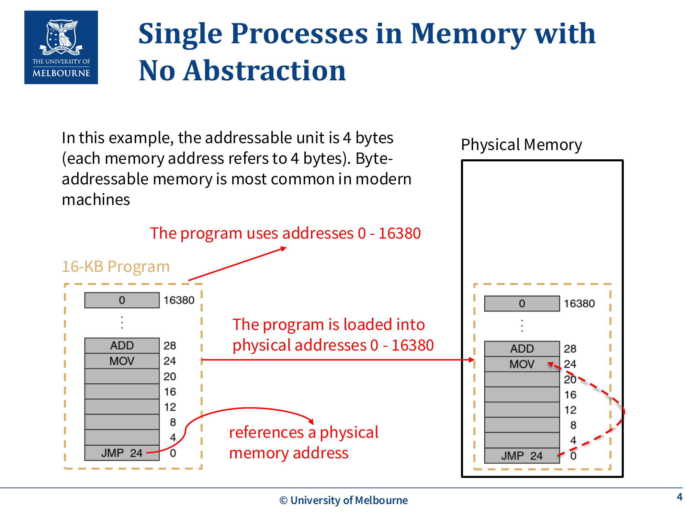
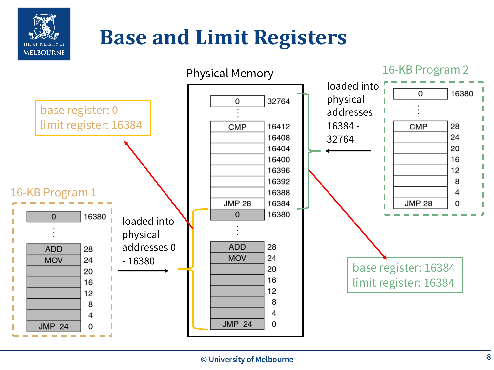
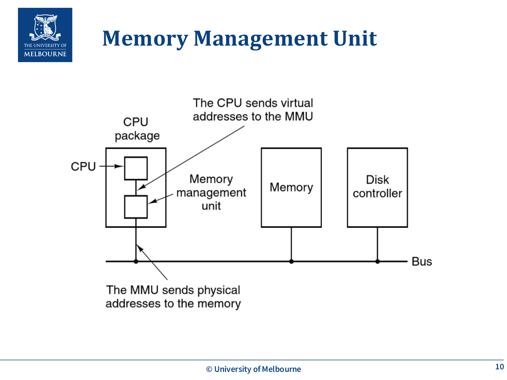
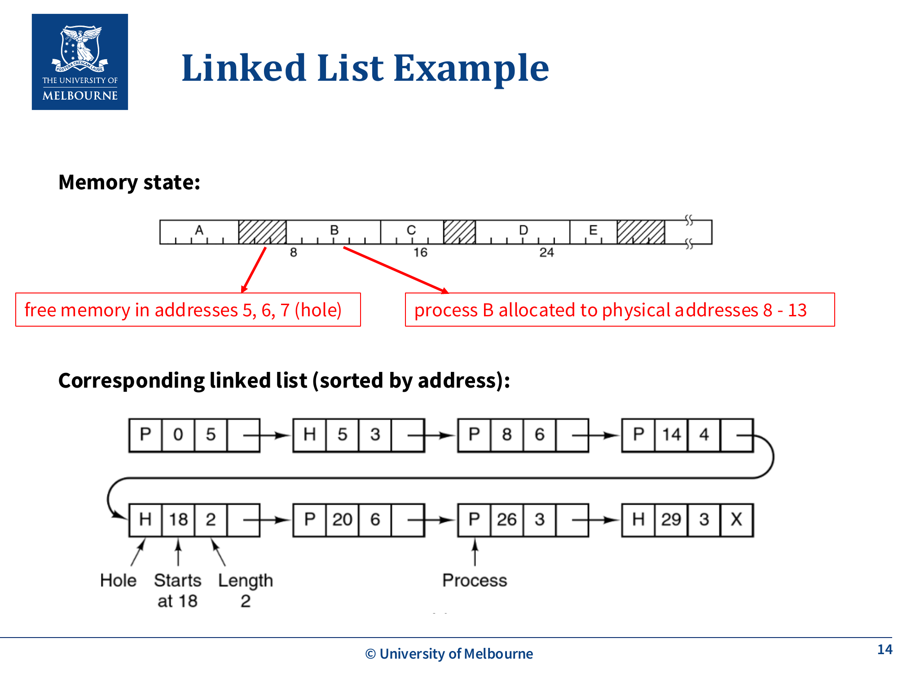
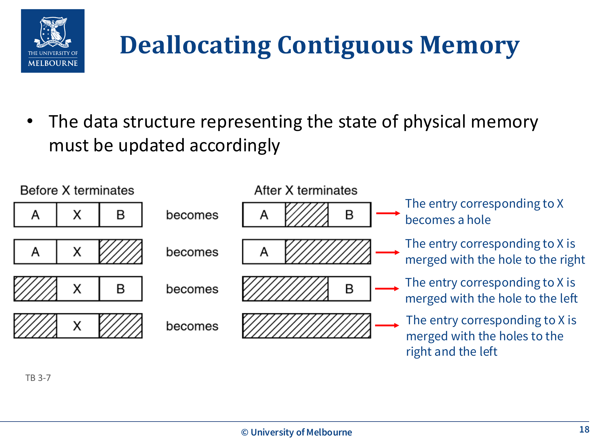
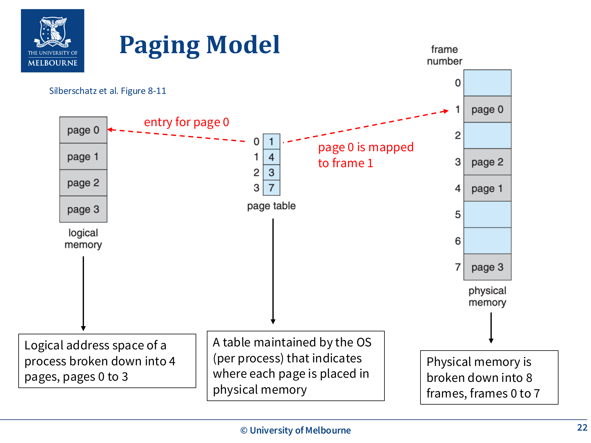
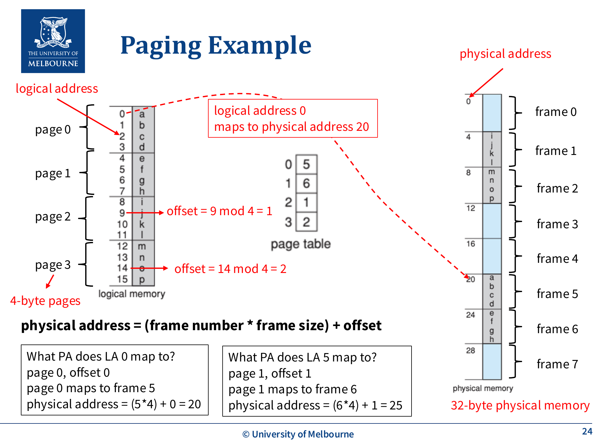
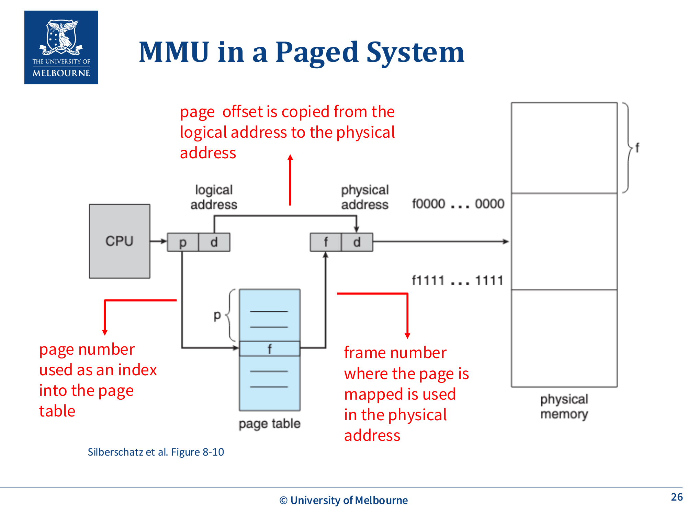
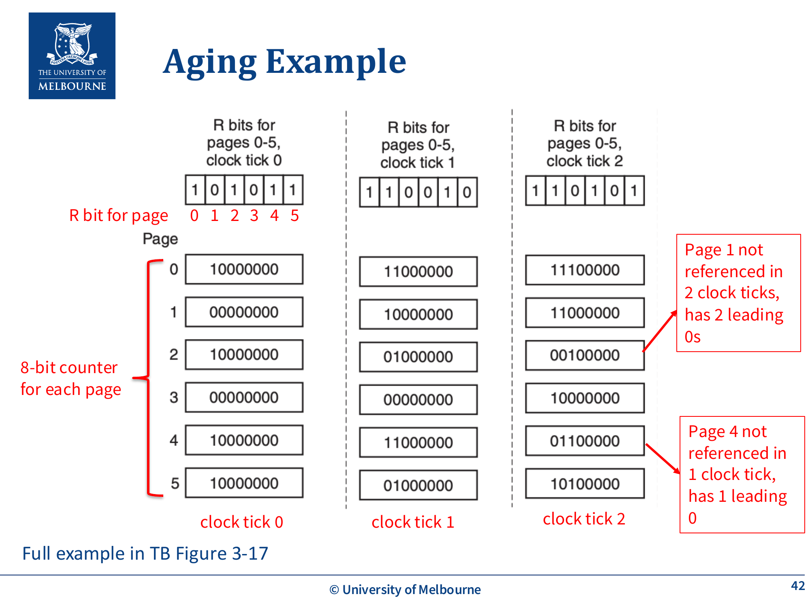
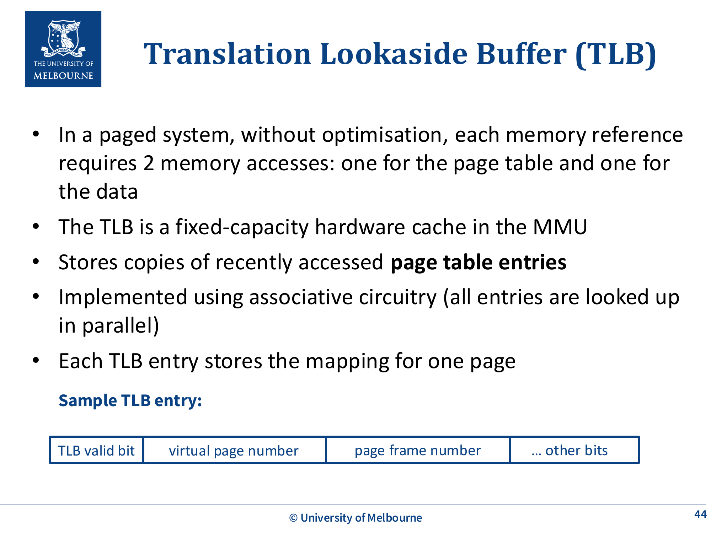

# WK4 - Memory Management

## 课件概述

本课件介绍了操作系统中的**内存管理（Memory Management）**机制。内存管理是操作系统最核心的功能之一，它负责将有限的物理内存资源合理地分配给多个进程使用。课件从最原始的无内存抽象方案讲起，逐步引出两种关键的内存管理方式：**Base and Limit Registers（基址和界限寄存器）**和**Paged Virtual Memory（分页虚拟内存）**。后半部分重点讲解了页表（Page Table）、页面置换算法（Page Replacement Algorithms）以及TLB（Translation Lookaside Buffer）等关键概念。

---

## 必须掌握的知识点

### 1. 为什么需要内存管理？

**What（是什么）：** 内存管理是操作系统负责管理计算机物理内存资源的机制，决定哪些进程可以使用哪些内存区域。

**Why（为什么）：**
- **支持多道程序设计（Multiprogramming）：** 为了提高CPU利用率，内存中需要同时存放多个进程，确保CPU总有就绪进程可以执行。
- **安全性（Security）：** 需要实现进程之间以及进程与操作系统之间的内存隔离（Isolation），防止一个进程访问或破坏另一个进程的数据。
- **突破物理内存限制：** 使得单个进程可以使用比物理内存更大的地址空间（虚拟内存），且所有进程的总内存需求可以超过实际物理内存大小。

**How（怎么实现）：** 通过引入**内存抽象（Memory Abstraction）**，将逻辑地址空间（Logical Address Space）与物理地址空间（Physical Address Space）分离，由硬件在运行时进行地址翻译。

---



### 2. 无内存抽象的早期系统

**What（是什么）：** 早期系统中，进程直接引用物理内存地址。例如指令 `MOV REGISTER, [1000]` 直接将物理地址1000处的内容复制到寄存器。

**注意可寻址单元（Addressable Unit）：** 示例中每个内存地址对应4个字节（addressable unit = 4 bytes），但现代机器最常见的是**字节寻址（byte-addressable）**，即每个地址对应1个字节。

**Why（有问题）：**
- **无法实现多道程序：** 如果两个程序都被加载到内存中，它们可能引用相同的物理地址，导致冲突。例如程序1使用地址0-16380，程序2使用地址16384-32764，如果程序1中有一条 `JMP` 指令错误地跳转到了程序2的地址空间，就会产生严重错误。
- **安全问题：** 进程可以任意访问和修改其他进程甚至操作系统的内存数据。

**How（解决方案）：** 引入内存抽象，将程序使用的逻辑地址与实际物理地址分离。

**早期模型的具体运作（对应 slide p.3）：** 在没有任何内存抽象的最早多道模型里，**同一时刻只有正在运行的那个进程在 RAM 里**，其它进程都放在磁盘上；**每次 context switch 都做一次完整 swap**——把当前进程整体换出到磁盘、把下一个进程整体换进来。这当然慢，正是后来 base/limit、再到分页要解决的动力。

---



### 3. Base and Limit Registers（基址和界限寄存器）

**What（是什么）：** 一种简单的内存管理机制，使用两个CPU寄存器来确定进程在物理内存中的位置和大小：
- **Base Register（基址寄存器）：** 存储进程在物理内存中的起始地址
- **Limit Register（界限寄存器）：** 存储进程的大小（长度）

**Why（为什么）：** 实现基本的地址重定位（Relocation）和内存保护（Protection），允许多个进程安全地共享物理内存。

**How（怎么工作）：**

1. **加载进程时：** OS在物理内存中找到一块连续的空闲区域，将进程加载进去。OS将起始地址写入base register，将进程大小写入limit register。这些值保存在PCB中，当进程被调度到CPU时加载到CPU寄存器中。

2. **地址翻译（每次内存访问时）：**
   - CPU硬件（MMU）首先检查：`逻辑地址 < limit register`？
   - 如果**不满足**（地址越界）：CPU触发异常中断（Exception/Interrupt），终止进程
   - 如果**满足**：`物理地址 = 逻辑地址 + base register`，然后将物理地址发送到内存总线

3. **示例：**
   - 进程2的base = 16384，limit = 16384
   - 执行 `JMP 28` 时：28 < 16384 ✓，物理地址 = 28 + 16384 = 16412

**MMU（Memory Management Unit）：** CPU中负责执行地址翻译的硬件单元。

---



### 4. 连续内存分配管理

**What（是什么）：** 使用base和limit registers时，OS需要管理物理内存的分配和回收，因为每个进程需要连续的物理内存。

**How（怎么管理）：**



**跟踪内存使用情况：** 使用**按地址排序的链表**（Linked List sorted by address）记录内存状态，每个节点包含：
- 类型标记：H（Hole，空闲）或 P（Process，已分配）
- 起始地址
- 长度
- 指向下一个节点的指针

**分配策略（Allocation Strategies）：**
| 策略 | 描述 | 优点 | 缺点 |
|------|------|------|------|
| **First-fit** | 从头开始搜索，分配第一个足够大的空闲块 | 快速，搜索最少 | 可能导致内存前部碎片化 |
| **Best-fit** | 搜索整个列表，分配最小的能满足需求的空闲块 | 保留大的空闲块 | 慢，容易产生很小的无用碎片 |
| **Worst-fit** | 分配最大的空闲块 | 产生最大的剩余块 | 慢，效果通常最差 |

**回收（Deallocation）：** 进程终止或被swap out时释放内存，需要合并相邻的空闲块（hole）：
- 释放的区域变成hole
- 如果右边是hole → 合并
- 如果左边是hole → 合并
- 如果两边都是hole → 三块合并成一个大hole

**Swapping（交换）：** 将不运行的进程换出到磁盘（backing store），需要时再换回内存。这使得所有进程的总地址空间可以超过物理内存。

---



### 5. External Fragmentation（外部碎片）

**What（是什么）：** 随着进程的加载和移除，空闲内存被分割成很多小块，虽然总空闲空间足够容纳新进程，但没有足够大的连续空间。

**Why（为什么是问题）：** 导致内存利用率下降，即使有足够的总空闲内存也无法分配给需要连续内存的进程。

**How（如何解决）：** 后续的分页机制可以有效解决外部碎片问题。

---

### 6. Base and Limit Registers的局限性

- 整个进程必须加载到**连续的**物理内存地址中
- 进程不能大于物理内存
- 需要更多空间时，必须将整个进程swap到磁盘
- 存在外部碎片问题
- 如果进程的内存使用增长，OS可能需要移动整个进程

---



### 7. Paged Virtual Memory（分页虚拟内存）

**What（是什么）：** 现代操作系统使用的内存管理方式，将进程的地址空间和物理内存都划分为固定大小的块：
- **Page（页）：** 进程逻辑地址空间的固定大小块
- **Page Frame（页框/帧）：** 物理内存的固定大小块
- 页和页框大小相同，每个页框恰好容纳一个页

**Why（为什么）：**
- 解决外部碎片问题：不要求连续物理内存
- 允许进程地址空间大于物理内存：只有部分页面需要在内存中
- 页面可以在磁盘和内存之间自由移动，且可以放入任意可用的页框

**How（怎么工作）：**
- 通过**Page Table（页表）** 建立页到页框的映射
- 不同的页可以映射到不相邻的页框
- 不是所有页面都需要同时在物理内存中
- 页面在生命周期内可以在磁盘和内存之间多次移动

---

### 8. Page Table（页表）

**What（是什么）：** 每个进程都有一个页表，由OS维护，记录该进程每个页映射到物理内存的哪个页框。

**How（怎么组织）：**
- **Page Table Base Register (PTBR)：** 指向页表的起始地址，值保存在PCB中
- 页表中每个条目（Page Table Entry, PTE）包含：
  - **Frame Number（页框号）：** 该页映射到的物理页框
  - **Present/Absent Bit（在位位）：** 1=页在物理内存中，0=页在磁盘上（如果为0，MMU不会翻译地址，触发page fault）
  - **Referenced Bit（引用位）：** 当页被访问时，MMU自动设为1
  - **Modified Bit（修改位）：** 当页被写入时，MMU自动设为1

---



### 9. 逻辑地址结构与地址翻译

**What（是什么）：** 在分页系统中，逻辑地址被分为两部分：

```
|  Page Number (m-n bits)  |  Page Offset (n bits)  |
```

- 逻辑地址长度为 m 位（地址空间大小 = 2^m）
- 页偏移占 n 位（页大小 = 2^n）
- 页号占 m-n 位（进程最多可以有 2^(m-n) 个页）

**How（地址翻译过程）：**

1. 从逻辑地址中提取 **page number** 和 **page offset**（offset = logical_address % page_size，即逻辑地址的低 n 位）
2. 用 page number 作为索引查找页表，找到对应的 **frame number**
3. 物理地址 = `(frame number × frame size) + page offset`
4. page offset 直接从逻辑地址复制到物理地址

**示例：**
- 页大小 = 4 bytes（2 bit offset）
- 逻辑地址 = 5（二进制 01|01）
  - Page 1, Offset 1
  - Page 1 映射到 Frame 6
  - 物理地址 = (6 × 4) + 1 = 25
- 逻辑地址 = 0（二进制 00|00）
  - Page 0, Offset 0
  - Page 0 映射到 Frame 5
  - 物理地址 = (5 × 4) + 0 = 20

**课件额外 offset 例子（对应 slide p.24，页大小仍 4）：**
- 逻辑地址 = 9 → `9 mod 4 = 1` → offset = 1（page = 9 div 4 = 2）
- 逻辑地址 = 14 → `14 mod 4 = 2` → offset = 2（page = 14 div 4 = 3）

**位运算分解示例（对应 slide p.25）：**
- m = 4 位逻辑地址 → 地址空间 = 2^4 = 16
- n = 2 位 offset → 页大小 = 2^2 = 4
- 页号位 = m − n = 2 → 进程最多 2^(m−n) = 2^2 = 4 页
- 即 `地址空间 / 页大小 = 16 / 4 = 4 页`，与公式一致

---



### 10. Internal Fragmentation（内部碎片）

**What（是什么）：** 分页系统中，进程的最后一页可能没有完全填满，造成空间浪费。

**示例：**
- 页大小 = 4 bytes，进程大小 = 13 bytes
- 需要 ⌈13/4⌉ = 4 页 = 16 bytes
- 内部碎片 = 16 - 13 = 3 bytes

**页大小的影响：**
| 页大小 | 内部碎片 | 页表大小 |
|--------|----------|----------|
| 大 | 更多（平均浪费更多） | 更小（页表条目更少） |
| 小 | 更少 | 更大（页表条目更多） |

这是一个需要权衡的trade-off。

---

### 11. Page Fault（缺页）

**What（是什么）：** 当进程访问一个不在物理内存中的页面（Present/Absent bit = 0）时，MMU触发page fault（内部中断）。

**How（OS如何处理）：**
1. 如果没有空闲页框，选择一个页面进行**驱逐（evict）**：
   - 如果被驱逐的页面被修改过（Modified bit = 1），写回磁盘
   - 如果没有被修改过，直接丢弃（因为磁盘上有原始副本）
2. 从磁盘读取所需页面，加载到空闲页框中
3. 更新页表
4. **重新执行**触发page fault的指令

---

### 12. Page Replacement Algorithms（页面置换算法）

**What（是什么）：** 当发生page fault且没有空闲页框时，需要选择哪个页面被驱逐到磁盘的策略。

#### (a) Optimal（最优算法）
- **策略：** 驱逐在未来最长时间内不会被访问的页面
- **优点：** 产生最少的page fault
- **缺点：** 无法实现（需要预知未来），仅作为比较基准

#### (b) FIFO（先进先出）
- **策略：** 驱逐在内存中停留时间最长的页面
- **实现：** 维护一个FIFO队列，最早加载的页面在队头
- **优点：** 简单
- **缺点：** 可能驱逐频繁使用的页面

#### (c) Second-chance（第二次机会）
- **策略：** FIFO的改进版，检查最老页面的Referenced bit：
  - R = 0：页面又老又没被最近使用，驱逐
  - R = 1：页面虽然老但最近被使用过，清除R bit，移到队尾（给第二次机会）
- **优点：** 利用局部性原理避免驱逐常用页面
- **课件定时场景（对应 slide p.35）：** "Page fault at time 20. A has R bit set (1)"——在时刻 20 发生缺页，队头是页面 A 且它的 R=1，于是 A **不被驱逐**，R 清 0、A 移到队尾，转而检查新的队头。这个例子强调 second-chance 的判断是"**老 + R 位**"两个条件同时看，而不是只看年龄。

#### (d) LRU（Least Recently Used，最近最少使用）
- **策略：** 驱逐最长时间未被访问的页面
- **实现：** 维护一个链表，最近使用的在头部，最久未使用的在尾部。每次内存引用时将对应页面移到头部。
- **优点：** 很好地利用局部性原理
- **缺点：** 硬件实现开销大，需要在每次内存引用时更新链表

---

### 13. Locality Principle（局部性原理）

**What（是什么）：** 大多数程序在访问内存时表现出的两种局部性模式：
- **Temporal Locality（时间局部性）：** 如果一个内存地址被访问，那么在不久的将来它很可能再次被访问（例如循环中的变量）
- **Spatial Locality（空间局部性）：** 如果一个内存地址被访问，那么附近的地址也很可能很快被访问（例如顺序执行的指令、数组遍历）

**Why（为什么重要）：** 这是页面置换算法（Second-chance、LRU）和TLB能够有效工作的理论基础。

---



### 14. Aging Algorithm（老化算法 - LRU近似）

**What（是什么）：** LRU的一种硬件近似实现，比精确LRU开销小得多。

**How（怎么工作）：**
1. 为每个页面维护一个 n 位的计数器
2. 在每个时钟中断（clock tick）时：
   - 所有计数器**右移1位**
   - 将该页面的**Referenced bit 插入到最左边**
   - 清除所有R bit
3. 发生page fault时，驱逐**计数器值最小**的页面

**计数器的含义：** 计数器高位的1越多，说明该页面最近越频繁被使用；高位的0越多，说明该页面越久没被使用。

**课件逐 tick 演算（对应 slide p.38–42，8-bit 计数器，pages 0–5，3 个时钟 tick）：**
- 每个时钟 tick：所有计数器先**右移 1 位**（高位补 0），再把本页当前 R 位**追加到最左边**，然后清所有 R 位
- 位模式示例：某页上一 tick 后是 `X1000000`（X 是更早的历史），本 tick 它又被引用（R=1）→ 右移得 `0100000` → 追加 R=1 → `11000000`
- **Page 1 有 2 个前导 0**：说明它在最近 2 个 tick 都没被引用（R=0 两次），计数器高位被 0 占住
- **Page 4 有 1 个前导 0**：只在最近 1 个 tick 没被引用
- 驱逐时选**计数器值最小**的页（即前导 0 最多的）——本例 Page 1 比 Page 4 更久没用，优先驱逐 Page 1
- 注意：因为只有 8 位，超过 8 个 tick 的历史会被移丢，所以 aging 是 LRU 的**近似**而非精确 LRU

**局限性：**
- **Aging可能驱逐并非最近最少使用的页面**（Aging may evict a page that was not the least recently used），它只是一个近似算法
- 每个时钟tick只记录1 bit信息，无法区分tick内早和晚的引用
- 计数器位数有限，无法区分很久以前被引用的页面（例如两个页面计数器都是0，但一个9个tick前被引用，另一个1000个tick前被引用）

---



### 15. TLB（Translation Lookaside Buffer）

**What（是什么）：** MMU中的一个**硬件缓存**，存储最近使用的页表条目的副本。

**Why（为什么需要）：** 在分页系统中，每次内存访问实际上需要**两次**内存访问——一次查页表，一次访问实际数据。TLB通过缓存页表条目来加速地址翻译。

**How（怎么工作）：**
- 使用**关联电路（Associative Circuitry）** 实现，所有条目并行查找
- 每个TLB条目存储：`virtual page number | frame number | valid bit | ...`
- **TLB Hit：** 在TLB中找到页表条目，直接用frame number进行地址翻译（快）
- **TLB Miss：** 在TLB中没找到，需要去内存查页表，然后将条目加载到TLB（如果TLB满了需要驱逐一个条目）

**TLB Valid Bit：** 表示该缓存条目是否有效。

**当前运行进程的页面被换出时的TLB处理：**
- 如果当前运行进程的某个页面被换出到磁盘，该页面在TLB中的对应条目变得无效（page不再映射到frame）
- 该TLB条目需要被**无效化**（invalidate）

**Context Switch时的TLB处理：**
- TLB中的条目只对当前运行的进程有效（不同进程的同一个虚拟页号可能映射到不同的物理页框）
- 一种策略是**flush TLB**（清除所有条目）
- 新运行的进程会经历大量TLB miss，TLB逐渐被重新填充

**页大小对TLB的影响：** 更大的页大小 → 每个TLB条目覆盖更大的地址范围 → TLB miss更少

---

## 关键术语

| 术语 | 英文 | 含义 |
|------|------|------|
| 逻辑地址 | Logical Address / Virtual Address | 程序使用的地址，需要翻译成物理地址 |
| 物理地址 | Physical Address | 实际内存硬件上的地址 |
| 页 | Page | 逻辑地址空间的固定大小块 |
| 页框 | Page Frame | 物理内存的固定大小块 |
| 页表 | Page Table | 记录页到页框映射的数据结构 |
| 缺页 | Page Fault | 访问不在物理内存中的页面时触发的中断 |
| 页面置换 | Page Replacement | 选择哪个页面被驱逐到磁盘 |
| 外部碎片 | External Fragmentation | 空闲内存分散成小块，无法满足大块连续请求 |
| 内部碎片 | Internal Fragmentation | 分配单元内未使用的空间 |
| TLB | Translation Lookaside Buffer | MMU中的页表缓存 |
| 局部性原理 | Locality Principle | 程序访问内存的时间和空间聚集性 |
| 交换 | Swapping | 将进程在内存和磁盘之间移动 |
| 重定位 | Relocation | 将逻辑地址转换为物理地址 |

---

## 常见问题

### Q1: Base and Limit Registers 和 Paging 的主要区别是什么？

| 特性 | Base & Limit | Paging |
|------|-------------|--------|
| 物理内存连续性 | 需要连续 | 不需要连续 |
| 外部碎片 | 有 | 无 |
| 内部碎片 | 无 | 有（最后一页） |
| 进程可以大于物理内存 | 不可以 | 可以（部分页面在磁盘） |
| 实现复杂度 | 简单 | 较复杂 |

### Q2: Page Fault 的处理流程是什么？

1. CPU触发中断 → 陷入内核
2. OS检查访问是否合法（保护检查）
3. 如果没有空闲帧，运行页面置换算法选择victim page
4. 如果victim page被modified（dirty），写回磁盘
5. 从磁盘调度所需页面到空闲帧
6. 更新页表（设置present bit, frame number等）
7. 重新执行引发page fault的指令

### Q3: 为什么Second-chance比FIFO好？

FIFO可能驱逐频繁使用的"老"页面。Second-chance通过检查Referenced bit，如果页面最近被访问过（R=1），就给它"第二次机会"而不是直接驱逐，这样能更好地保留频繁使用的页面。

### Q4: Aging 算法中计数器怎么解读？

- 计数器值越大（高位1越多）→ 最近越频繁使用 → 不应该被驱逐
- 计数器值越小（高位0越多）→ 越久没使用 → 应该优先被驱逐

---

## 知识点之间的联系

```
多道程序设计 (WK1)
    ↓ 需要
内存管理 (本课件)
    ↓ 两种方式
Base & Limit Registers ──────→ 连续分配 → 外部碎片
    ↓ 解决
Paged Virtual Memory
    ↓ 核心组件
Page Table ──→ Page Fault ──→ Page Replacement Algorithms
    ↓ 性能优化                    ↓
TLB                     FIFO, Second-chance, LRU, Aging
```

**与其他课件的联系：**
- **WK1（OS Overview）：** 内存管理是OS的核心职责之一，实现隔离和保护
- **WK2（Process）：** 每个进程有独立的地址空间，PCB中存储page table base register等信息
- **WK3（Scheduling）：** Swapping与调度密切相关，进程换出/换入影响调度决策
- **WK3（IPC）：** 内存隔离是保证进程安全通信的前提

---

## 实际应用案例

1. **Linux的内存管理：** Linux使用多级页表（Multi-level Page Table）来管理虚拟内存，支持4KB、2MB、1GB等不同页大小。

2. **x86-64架构的页表：** 使用4级页表结构，每级9位索引，支持48位虚拟地址空间（256TB）。

3. **数据库系统：** 数据库经常使用自己的buffer pool（类似OS的页面管理），使用LRU或Clock算法管理缓存页。

4. **嵌入式系统：** 某些嵌入式系统不使用虚拟内存，直接使用物理地址（类似早期系统），因为简单且确定性强。

---

## 常见错误和易错点

1. **混淆 Page 和 Frame：** Page是逻辑概念（进程地址空间的划分），Frame是物理概念（物理内存的划分）。两者大小相同但含义不同。

2. **地址翻译公式记错：** 物理地址 = (frame number × page size) + offset，不是 frame number + offset。容易忘记乘以页大小。

3. **Page Fault不等于程序错误：** Page fault是正常的虚拟内存操作，表示页面不在内存中需要从磁盘加载。只有非法访问（如访问未映射的地址）才是真正的错误。

4. **Internal vs External Fragmentation混淆：**
   - External：内存中有足够空间但不连续（Base & Limit的问题）
   - Internal：分配单元内部有未使用空间（Paging的问题）

5. **LRU vs FIFO的Belady异常：** FIFO页面置换可能存在Belady异常（增加页框数反而增加page fault次数），LRU不会。

6. **TLB Flush vs Page Flush：** Context switch时TLB需要flush（因为不同进程的映射不同），但页表不需要flush（每个进程有自己的页表）。

---

## 课件总结

本课件从内存管理的必要性出发，介绍了两种主要的内存管理方法：

1. **Base and Limit Registers：** 简单的连续内存分配方案，通过硬件寄存器实现地址翻译和内存保护，但存在外部碎片和不支持虚拟内存的局限性。

2. **Paged Virtual Memory：** 现代操作系统使用的方案，将逻辑和物理地址空间划分为固定大小的页和页框，通过页表映射。解决了外部碎片问题，支持虚拟内存。

3. **页面管理的关键技术：**
   - Page Fault处理和页面置换算法（Optimal、FIFO、Second-chance、LRU、Aging）
   - 局部性原理是设计高效置换算法的理论基础
   - TLB通过缓存加速地址翻译

---

## 复习建议

1. **理解地址翻译过程：** 手动练习逻辑地址到物理地址的转换，包括base&limit和paging两种方式。
2. **掌握页面置换算法：** 给定一个页面引用序列，能够手动模拟FIFO、Second-chance、LRU和Aging算法的执行过程。
3. **理解Page Table Entry的各个bit：** Present/Absent、Referenced、Modified bit的作用和在page fault处理中的使用。
4. **对比分析：** 对比Base&Limit vs Paging、各种页面置换算法的优缺点。
5. **计算题：** 练习计算内部碎片大小、逻辑地址结构（page number + offset）、TLB命中率等。
