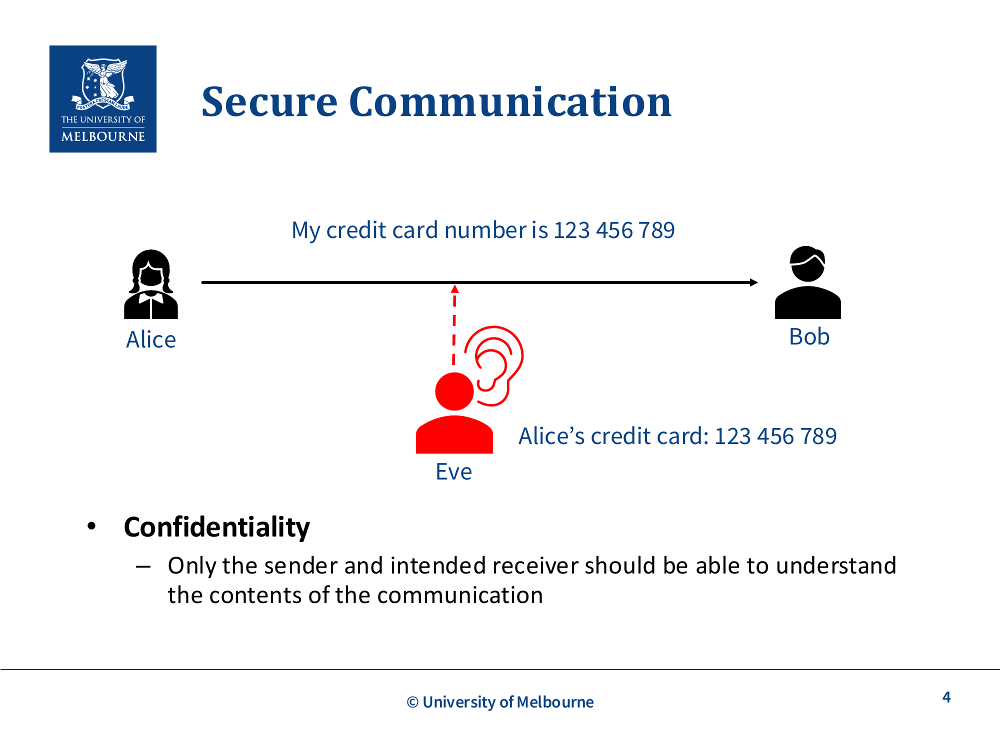
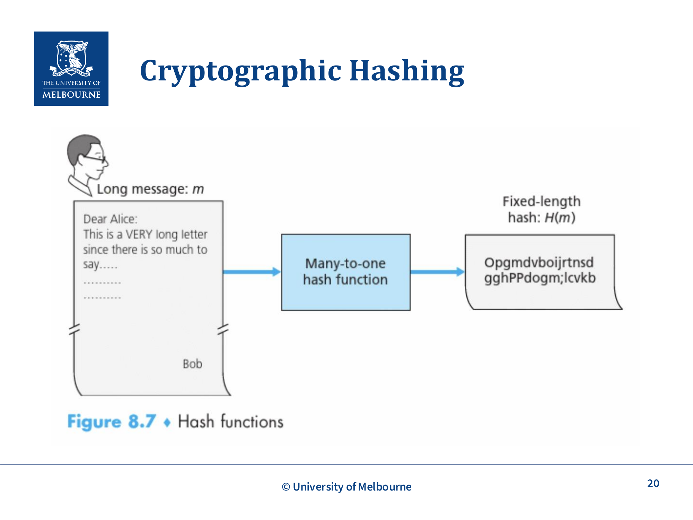
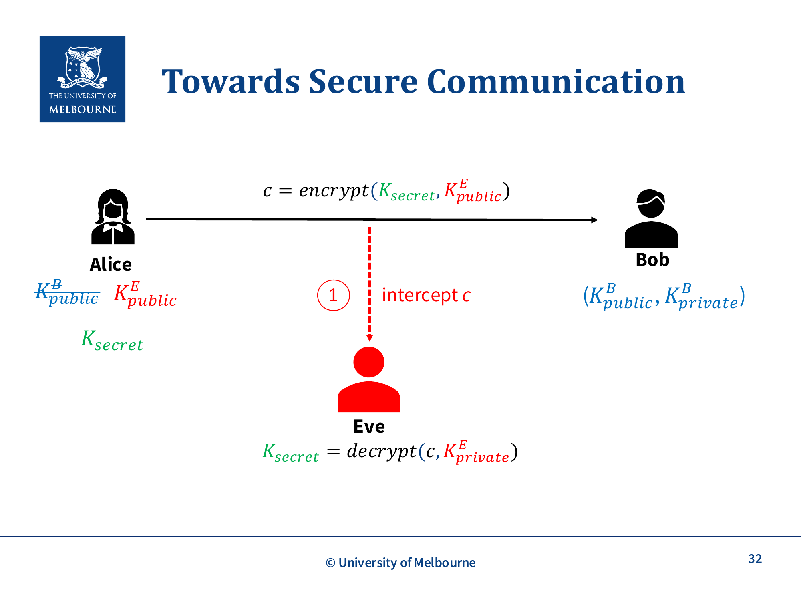
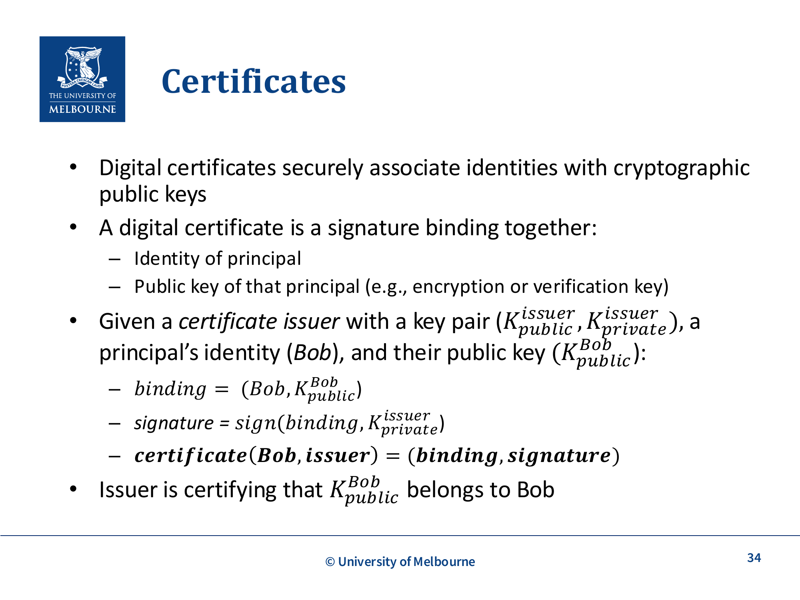

# WK5 - Secure Communication

## 课件概述

本课件介绍了计算机网络中**安全通信（Secure Communication）**的基本原理和密码学基础。课件从安全通信的三个核心目标（机密性、完整性、认证）出发，系统讲解了加密（Encryption）、哈希（Hashing）、消息认证码（MAC）、数字签名（Digital Signatures）等密码学技术，以及如何将这些技术组合实现安全通信。最后介绍了TLS（Transport Layer Security）协议的基本工作原理。

---

## 必须掌握的知识点

### 1. 安全通信的三个核心属性

**What（是什么）：** 安全通信需要满足的三个基本属性。

**课件里的具体场景（对应 slide p.2）：** Alice/Bob 在课件中是抽象代号，实际对应多种通信对——**路由器之间**、**浏览器 ↔ web server**、**SSH client ↔ VM**、**Git ↔ GitHub** 等。安全通信的目标就是让这些对端在不可信网络上仍能保密、防篡改、确认身份。



#### (a) Confidentiality（机密性）
- 只有发送方和接收方能够理解通信的内容
- 防止第三方（如Eve）窃听和理解消息内容
- 课件例子（slide p.4）：Eve 拦截到的信用卡号 `123 456 789` 应当对她不可读
- 实现方式：**Encryption（加密）**

#### (b) Integrity（完整性）
- 能够检测通信内容是否被篡改
- 防止第三方修改传输中的消息
- 实现方式：**MAC（消息认证码）** 或 **Digital Signatures（数字签名）**

#### (c) Authentication（认证）
- 确认通信双方（或至少一方）的身份
- 防止冒充攻击（如Eve冒充Bob）
- 实现方式：**Certificates（证书）** + **Digital Signatures**

**Why（为什么重要）：** 在开放的计算机网络中，攻击者可以读取、修改和删除任何消息。没有安全机制，所有通信都是不安全的。

---

### 2. 加密基础（Encryption）

**What（是什么）：** 将明文（plaintext）通过加密算法和密钥转换为密文（ciphertext），只有持有解密密钥的人才能将其还原为明文。

**核心函数：**
- `c = encrypt(m, Ke)` — 用加密密钥 Ke 加密消息 m 得到密文 c
- `m = decrypt(c, Kd)` — 用解密密钥 Kd 解密密文 c 得到消息 m

**Kerckhoffs' Principle（柯克霍夫原则）：**
- 安全性应该**只依赖于密钥的保密性**，而不依赖于算法的保密性
- 即使攻击者知道加密算法，只要密钥不泄露，安全性就有保障
- 课件精确化（slide p.8）：保密性依赖的是**解密密钥（decryption key）**保持秘密——加密密钥可以公开（公钥密码就是这样），真正必须藏好的是能解密的那一把

---

### 3. 对称加密 vs 非对称加密

#### (a) Symmetric Encryption（对称加密）

**What：** 加密和解密使用**相同的密钥** Ks。

**协议流程：**
1. Alice和Bob安全地交换共享密钥 Ks
2. Alice计算密文 `c = encrypt(m, Ks)`
3. Alice将c发送给Bob
4. Bob计算 `m = decrypt(c, Ks)` 恢复消息

**优点：** 效率高，适合加密大量数据
**缺点：** 需要安全地交换共享密钥（密钥分发问题）
**例子：** AES（Advanced Encryption Standard）

#### (b) Asymmetric Encryption（非对称加密 / 公钥加密）

**What：** 使用一对密钥——公钥（public key）和私钥（private key）。公钥加密，私钥解密。

**协议流程：**
1. Bob生成密钥对 `(K_public^B, K_private^B)`
2. Bob公开发布他的公钥
3. Alice获取Bob的公钥，计算 `c = encrypt(m, K_public^B)`
4. Alice将c发送给Bob
5. Bob计算 `m = decrypt(c, K_private^B)` 恢复消息

**优点：** 不需要安全地交换密钥
**缺点：** 计算开销大，不适合加密大量数据
**密码学的数学基础：** 现代密码学基于数学上计算困难的问题，例如大整数分解（RSA）和离散对数（ElGamal）。但密码学**并非绝对安全**（no perfect security）——暴力破解（brute force attack）在理论上始终可行，目标是使破解所需的时间远超数据的有用生命周期。**Kerckhoffs原则**强调安全性应仅依赖密钥保密而非算法保密。

---

### 4. 混合加密（Hybrid Encryption）

**What（是什么）：** 结合对称加密和非对称加密的优点。

**Why（为什么）：**
- 对称加密：高效但需要安全交换密钥
- 非对称加密：无需安全交换密钥但效率低
- 混合加密：用非对称加密安全交换对称密钥，再用对称密钥加密通信数据

**How（怎么工作）：**
1. Alice生成密钥对 `(K_public^A, K_private^A)`，公开公钥
2. Bob获取 `K_public^A`
3. Bob生成共享密钥 K_secret
4. Bob计算 `c = encrypt(K_secret, K_public^A)`，将c发送给Alice
5. Alice计算 `decrypt(c, K_private^A)` 获得 K_secret
6. Alice和Bob现在共享 K_secret，可以用对称加密通信

---



### 5. 密码学哈希函数（Cryptographic Hashing）

**What（是什么）：** 将任意长度的输入 m 映射为固定长度的哈希值 H(m)。

**核心属性：**
- **Collision Resistance（抗碰撞性）：** 很难找到 m ≠ m' 使得 H(m) = H(m')
- **One-way（单向性）：** 给定 H(m)，很难推导出 m

**例子：** SHA-2、SHA-3

---

### 6. 消息认证码 MAC（Message Authentication Code）

**What（是什么）：** 用于验证消息是否被篡改的机制，基于**共享密钥**（对称密码学）。

**How（怎么工作）：**
- MAC函数：`t = mac(m, Ks)` — 用密钥 Ks 和消息 m 生成标签 t
- 典型实现：`H(m ∥ s)` 或 HMAC（`H((s ⊕ opad) ∥ H((s ⊕ ipad) ∥ m))`）

**协议流程：**
1. Alice生成消息 m
2. Alice计算标签 `t = mac(m, Ks)`
3. Alice将 m 和 t 发送给Bob
4. Bob计算 `t' = mac(m, Ks)`
5. Bob验证 t' == t，如果匹配则消息未被篡改

**关键点：**
- 不知道密钥的攻击者无法伪造标签
- 消息以明文发送，**不提供机密性**，只提供完整性检测

---

### 7. 数字签名（Digital Signatures）

**What（是什么）：** 使用非对称密码学实现消息完整性验证和不可否认性。

**核心概念：**
- **Signing Key（签名密钥）：** 私钥，用于生成签名
- **Verification Key（验证密钥）：** 公钥，用于验证签名

**函数：**
- `s = sign(m, K_sign)` — 用签名密钥对消息签名
- `verify(m, s, K_ver)` — 用验证密钥验证签名

**协议流程：**
1. Alice用私钥签名：`s = sign(m, K_sign^A)`
2. Alice将 m 和 s 发送给Bob
3. Bob用Alice的公钥验证：`verify(m, s, K_ver^A)`，成功则接受消息

**提供的安全属性：**
- **Integrity（完整性）：** 消息未被修改
- **Non-repudiation（不可否认性）：** Alice不能否认她签过这个消息（因为只有她有私钥）

**大消息的处理：** 对于大消息，先计算哈希 H(m)，再对 H(m) 签名：
1. `s = sign(H(m), K_sign^A)`
2. Alice发送 m 和 s
3. Bob计算 H(m)，验证 `verify(H(m), s, K_ver^A)`

---

### 8. 认证加密（Authenticated Encryption）

**What（是什么）：** 同时提供**机密性**和**完整性**的加密方式。

**How（怎么实现）：** "Encrypt then MAC" 策略：
1. Alice加密消息：`c = encrypt(m, K_secret_enc)`
2. Alice对密文计算MAC标签：`t = mac(c, K_secret_mac)`
3. Alice发送 c 和 t
4. Bob验证 t：`t' = mac(c, K_secret_mac)`，如果 t == t'
5. Bob解密：`m = decrypt(c, K_secret_enc)`

**注意：** 先加密，再对密文计算MAC（Encrypt then MAC），这样可以同时保护机密性和完整性。

**例子：** AES-GCM、AES-OCB、AES-CCM

---



### 9. 证书与认证（Certificates and Authentication）

**What（是什么）：** 数字证书将身份与公钥安全地绑定在一起。

**Why（为什么需要）：** 在公钥交换过程中，需要验证公钥确实属于声称的拥有者。否则攻击者可以进行**两步中间人攻击**（Man-in-the-Middle Attack）：

**第一步（公钥替换）：**
- 当Alice请求Bob的公钥时，Eve拦截请求，**用自己公钥 K_public^E 替换Bob的公钥**
- Alice认为她在用Bob的公钥加密，实际在用Eve的公钥
- Eve拦截密文后用自己的私钥 K_private^E 解密得到 K_secret

**第二步（密文重加密）：**
- Eve用Bob的公钥 K_public^B **重新加密** K_secret，生成新密文 c' 发送给Bob
- Bob用自己的私钥解密，以为一切正常（他不知道中间发生过替换）
- 结果：Alice和Bob都认为通信是安全的，但Eve已经获取了所有秘密

**结论：需要一个方法验证公钥确实属于它声称的拥有者**——这就是证书（Certificate）需要解决的问题。

**How（怎么工作）：**



**证书结构：**
- `binding = (Bob, K_public^Bob)` — 身份和公钥的绑定
- `signature = sign(binding, K_private^issuer)` — 证书颁发者的签名
- `certificate(Bob, issuer) = (binding, signature)`

**证书验证流程：**
1. Bob创建消息 "I am Bob"，签名
2. Bob发送 m, 签名, 证书给Alice
3. Alice验证证书签名：`verify(binding, signature, K_public^issuer)`
4. Alice从证书中获取Bob的公钥
5. Alice验证Bob的消息签名

**Certificate Authorities (CA)（证书颁发机构）：**
- 被明确信任的实体
- 为其他人签发证书
- CA的公钥包含在**自签名的根证书**中
- 根证书预装在操作系统和浏览器中

**信任链问题：** CA的公钥本身如何被信任？答案：根证书是**自签名**的（self-signed），并预装在OS/浏览器中作为信任锚点（Trust Anchor）。这形成了一个信任链：根CA → 中间CA → 终端实体证书。

---

### 10. TLS（Transport Layer Security）⚠️ 非考试内容（NOT EXAMINABLE）

**What（是什么）：** 互联网上安全通信的协议，HTTPS就是HTTP over TLS。**TLS本身不在考试范围内**，但理解其原理有助于理解整体安全通信框架。

**基本组成：**
- **Handshake Protocol（握手协议）：** 使用公钥密码学建立共享密钥
- **Record Protocol（记录协议）：** 使用建立的密钥保护数据传输

**TLS 1.2 握手流程（简化）：**
1. Client Hello → 协议版本、支持的密码套件、客户端随机数（client random）
2. Server Hello → 选定的密码套件、服务器随机数（server random）
3. Server Certificate → 服务器公钥证书
4. **Server Hello Done** → 通知客户端服务器一侧的 hello 阶段消息发完（对应 slide p.41）
5. Client Key Exchange → 客户端生成 premaster secret，用服务器公钥加密发送
6. 双方用 **premaster secret + client random + server random** 派生出会话密钥
7. **Change Cipher Spec** → 通知对方后续消息开始用协商好的参数加密
8. **Finished** → 握手后**第一条受保护的消息**，用来验证握手本身没被篡改

**TLS 1.3 vs TLS 1.2（对应 slide p.42–43）：**
- TLS 1.3使用**Diffie-Hellman密钥交换**代替RSA密钥交换——**不再支持 RSA 密钥交换**
- 握手中带 **Key share**（客户端 gx、服务器 gy），在第一次往返里就完成密钥协商，更少 RTT
- **CertificateVerify**：服务器用私钥对**整个握手记录**签名（而不只签证书），认证更强
- 提供**Forward Secrecy（前向保密）**：即使长期私钥泄露，过去的会话仍然安全（因为会话密钥来自一次性 DH，不靠私钥解密）

---

## 关键术语

| 术语 | 英文 | 含义 |
|------|------|------|
| 机密性 | Confidentiality | 只有授权方能理解通信内容 |
| 完整性 | Integrity | 能够检测消息是否被篡改 |
| 认证 | Authentication | 确认通信方的身份 |
| 明文 | Plaintext | 原始未加密的消息 |
| 密文 | Ciphertext | 加密后的消息 |
| 对称加密 | Symmetric Encryption | 加密解密使用相同密钥 |
| 非对称加密 | Asymmetric Encryption | 使用公钥加密、私钥解密 |
| 密码学哈希 | Cryptographic Hashing | 将任意输入映射为固定长度的哈希值 |
| 碰撞 | Collision | 不同输入产生相同哈希值 |
| 消息认证码 | MAC | 基于共享密钥的消息完整性验证 |
| 数字签名 | Digital Signature | 基于非对称密码学的完整性+不可否认性 |
| 不可否认性 | Non-repudiation | 签名者不能否认其签名 |
| 证书 | Certificate | 将身份与公钥绑定的签名文档 |
| 证书颁发机构 | CA | 签发证书的受信任实体 |
| 中间人攻击 | Man-in-the-Middle | 攻击者秘密拦截和修改通信 |
| 前向保密 | Forward Secrecy | 长期密钥泄露不影响过去的会话安全 |

---

## 常见问题

### Q1: 对称加密和非对称加密各有什么优缺点？

| 特性 | 对称加密 | 非对称加密 |
|------|----------|-----------|
| 速度 | 快 | 慢 |
| 密钥数量 | n个用户需要 n(n-1)/2 个密钥 | 每个用户一对密钥 |
| 密钥分发 | 需要安全通道 | 公钥可公开 |
| 适用场景 | 大量数据加密 | 密钥交换、签名 |

### Q2: MAC和数字签名有什么区别？

| 特性 | MAC | 数字签名 |
|------|-----|---------|
| 密码学类型 | 对称（共享密钥） | 非对称（公私钥对） |
| 不可否认性 | 无（双方都有密钥） | 有（只有签名者有私钥） |
| 验证方 | 任何持有共享密钥的人 | 任何人（用公钥验证） |

### Q3: 为什么需要证书？

公钥交换时存在**中间人攻击**风险：攻击者可以用自己的公钥替换Bob的公钥，从而截获和篡改所有通信。证书通过受信任的第三方（CA）对公钥进行签名，确保公钥的真实性。

### Q4: Encrypt then MAC 的顺序为什么重要？

先加密再MAC（Encrypt then MAC）可以确保：接收方先验证消息完整性，只有完整性验证通过才解密。这避免了对被篡改的密文进行解密，防止某些攻击（如padding oracle attack）。

---

## 知识点之间的联系

```
安全通信的三个目标
    ├── Confidentiality ──→ Encryption
    │                        ├── Symmetric (AES)
    │                        ├── Asymmetric (RSA)
    │                        └── Hybrid (Key Exchange)
    ├── Integrity ──→ MAC (对称) / Digital Signature (非对称)
    │                    └── Cryptographic Hashing (SHA)
    └── Authentication ──→ Certificates + Digital Signatures
                              └── Certificate Authorities (CA)

组合：Authenticated Encryption = Encrypt then MAC
实际应用：TLS (HTTPS) = 以上所有技术的综合应用
```

**与其他课件的联系：**
- **WK6-OSI/WK7-Sockets/WK8-HTTP：** 安全通信在网络协议栈中的位置，TLS在传输层之上
- **WK9-TCP：** TLS通常运行在TCP之上

---

## 实际应用案例

1. **HTTPS：** 浏览器与Web服务器之间的安全通信，底层使用TLS
2. **SSH：** 远程登录安全协议，使用公钥认证和对称加密
3. **Git over HTTPS：** GitHub使用TLS保护代码传输
4. **数字证书：** 网站的SSL/TLS证书由CA签发，浏览器预装根证书
5. **PGP/GPG：** 邮件加密，使用混合加密方式

---

## 常见错误和易错点

1. **混淆对称和非对称加密的使用场景：** 对称加密用于数据加密（快），非对称加密用于密钥交换和签名（慢）。

2. **认为MAC提供机密性：** MAC只提供完整性检测，不提供机密性。消息以明文发送。

3. **混淆签名和加密：** 签名用私钥签名、公钥验证；加密用公钥加密、私钥解密。方向相反。

4. **忘记Non-repudiation只属于数字签名：** MAC不提供不可否认性，因为双方都有共享密钥。

5. **证书验证链的理解：** 证书的信任链从根证书（预装在OS/浏览器中）开始，逐级验证。

6. **认为加密就是安全的：** 只有加密是不够的，还需要完整性保护和认证，否则可能遭受各种攻击。

---

## 课件总结

本课件构建了安全通信的完整知识体系：

1. **安全目标：** Confidentiality、Integrity、Authentication
2. **加密技术：** Symmetric → Asymmetric → Hybrid Encryption
3. **完整性技术：** Cryptographic Hashing → MAC → Digital Signatures
4. **组合方案：** Authenticated Encryption（Encrypt then MAC）
5. **认证方案：** Certificates + CA
6. **实际协议：** TLS（综合运用以上所有技术）

核心思想：没有单一技术能解决所有安全问题，需要将多种技术组合使用。

---

## 复习建议

1. **理解每种技术的目标：** 明确每种密码学原语提供哪些安全属性（机密性/完整性/认证/不可否认性）。
2. **掌握协议流程：** 能够描述对称加密、非对称加密、混合加密、MAC、数字签名的完整协议流程。
3. **对比分析：** 对比对称vs非对称、MAC vs 数字签名的优缺点。
4. **理解攻击场景：** 理解中间人攻击以及证书如何防御此类攻击。
5. **综合应用：** 能够设计一个同时提供机密性、完整性和认证的安全通信协议。TLS握手细节明确不考，只需知道TLS综合使用了这些技术。
## 默写背诵 Dictation

> 以下为本章必须能默写的中英对照；网站「默写 Recite」Tab 提供自测模式。

| # | 默写提示 Prompt | 标准答案 Answer |
|---|----------------|----------------|
| 1 | CIA triad — expand each letter. · CIA 三元组各指什么？ | **EN:** Confidentiality, Integrity, Authentication. / **中文：** 保密性（Confidentiality）、完整性（Integrity）、认证（Authentication）。 |
| 2 | Confidentiality vs integrity — one line each. · 保密性与完整性各一句话。 | **EN:** Confidentiality = prevent unauthorised reading; integrity = detect/prevent unauthorised modification. / **中文：** 保密性 = 防止未授权读取；完整性 = 检测/防止未授权篡改。 |
| 3 | Symmetric vs public-key cryptography. · 对称密码 vs 公钥密码。 | **EN:** Symmetric = same secret key encrypts and decrypts; public-key = key pair — public encrypts/verify, private decrypts/signs. / **中文：** 对称 = 同一密钥加解密；公钥 = 密钥对——公钥加密/验证，私钥解密/签名。 |
| 4 | Kerckhoffs' principle (slide wording). · Kerckhoffs 原则（课件表述）。 | **EN:** Security depends on the decryption key, not secrecy of the algorithm. / **中文：** 安全性依赖解密密钥，而非算法保密。 |
| 5 | MAC vs digital signature. · MAC vs 数字签名。 | **EN:** MAC uses shared secret key (both parties); signature uses private key to sign, public key to verify. / **中文：** MAC 用共享密钥（双方持有）；签名用私钥签、公钥验。 |
| 6 | Hash function — collision resistance and one-way (slide p.19). · 哈希函数——抗碰撞与单向性（课件 p.19）。 | **EN:** Collision resistance: hard to find m ≠ m' with H(m)=H(m'); one-way: given H(m), hard to recover m. / **中文：** 抗碰撞：难找 m≠m' 使 H(m)=H(m')；单向：给定 H(m) 难恢复 m。 |
| 7 | What problem does a digital certificate solve? · 数字证书解决什么问题？ | **EN:** Bind a public key to an identity in a trustworthy way (CA signature). / **中文：** 可信地将公钥与身份绑定（CA 签名背书）。 |
| 8 | Man-in-the-middle attack — how certificates help. · 中间人攻击——证书如何防御？ | **EN:** Client verifies server certificate chain to ensure it talks to the real server, not an impostor. / **中文：** 客户端验证服务器证书链，确保连接真实服务器而非冒充者。 |
| 9 | Hybrid encryption — why and how (slide p.15–16). · 混合加密——为何与如何（课件 p.15–16）。 | **EN:** Use public-key crypto to exchange a symmetric session key, then encrypt bulk data with symmetric crypto (efficient + no pre-shared secret). / **中文：** 用公钥密码交换对称会话密钥，再用对称密码加密大量数据（高效且无需预共享密钥）。 |
| 10 | Encrypt-then-MAC strategy (slide p.28). · Encrypt-then-MAC 策略（课件 p.28）。 | **EN:** Encrypt message first, then MAC the ciphertext; verify MAC before decrypting. / **中文：** 先加密消息，再对密文计算 MAC；先验 MAC 再解密。 |
| 11 | Public-key encrypt vs sign — which key for each? · 公钥加密 vs 签名各用哪个密钥？ | **EN:** Encrypt with recipient's public key; sign with sender's private key. / **中文：** 用接收方公钥加密；用发送方私钥签名。 |
| 12 | Non-repudiation — which mechanism provides it? · 不可否认性由哪种机制提供？ | **EN:** Digital signature — only the private-key holder could have produced it. / **中文：** 数字签名——只有私钥持有者才能生成。 |

