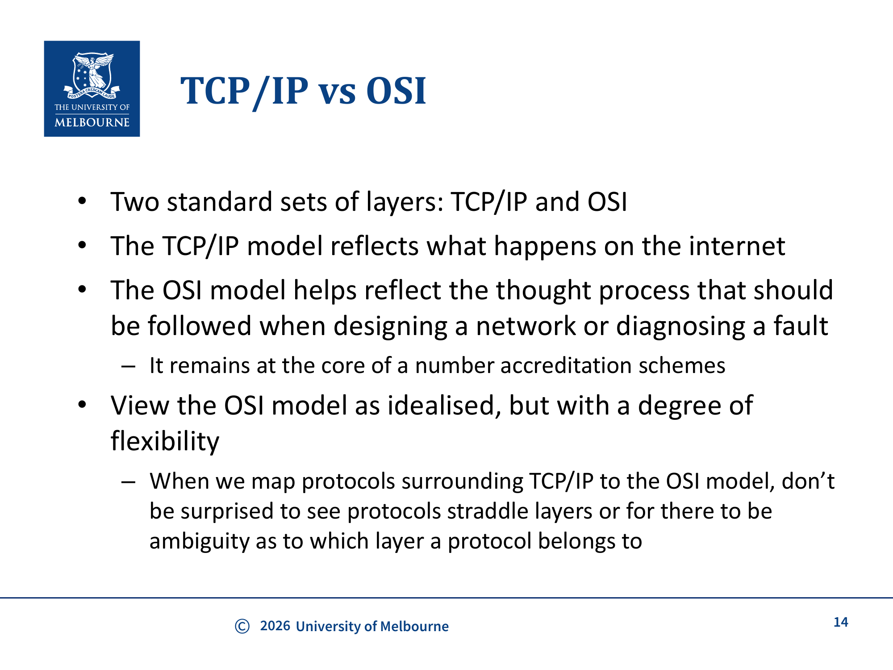
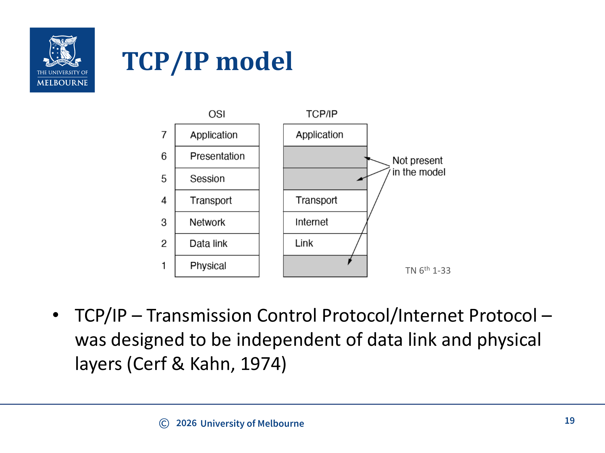
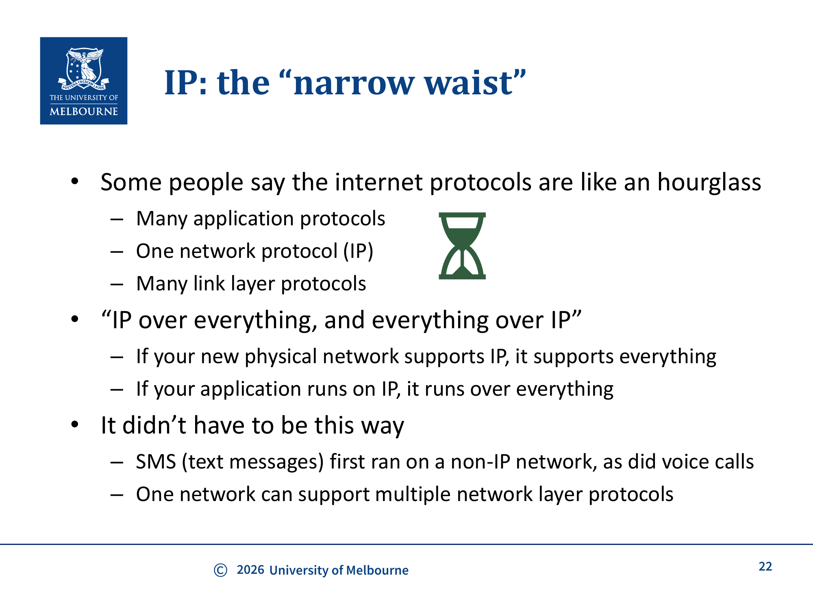
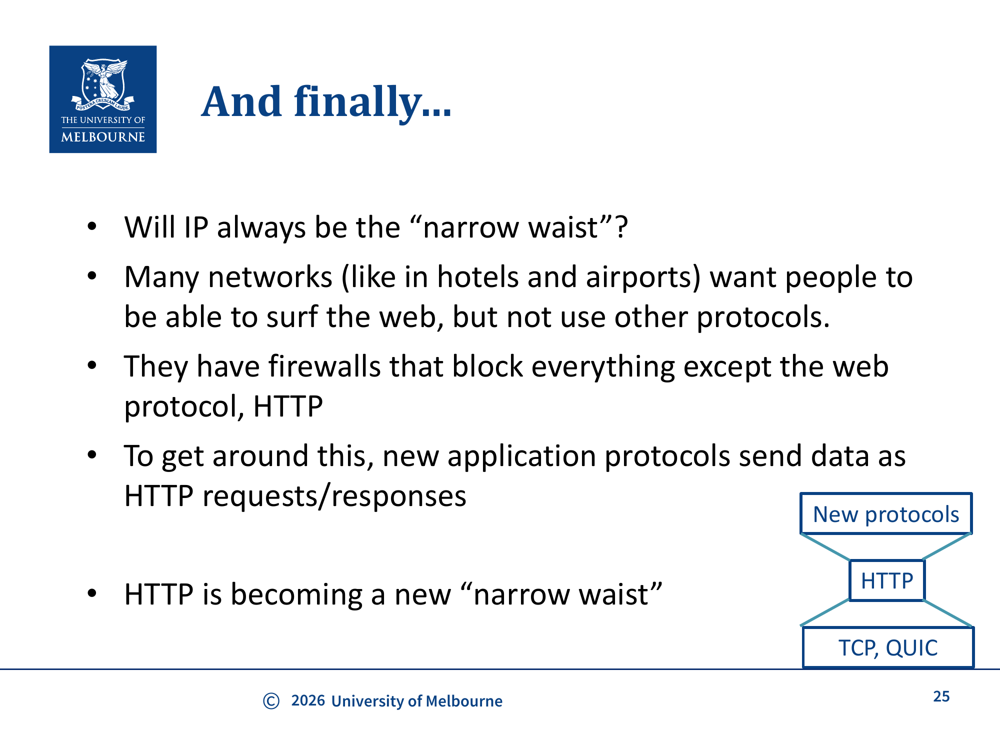

# WK6 - Introduction to Networks & OSI Layers

## 课件概述

本课件是计算机网络部分的入门，介绍了互联网（Internet）的基本结构和分层网络模型。课件从互联网的复杂性出发，引出为什么需要分层模型，然后详细介绍了两种主要的网络模型：**OSI模型**和**TCP/IP模型**。还讨论了互联网的"窄腰"（narrow waist）架构设计、面向连接和无连接的服务类型，以及协议封装（encapsulation）的概念。

---

## 必须掌握的知识点

### 1. 为什么需要网络分层模型？

**What（是什么）：** 将网络功能划分为多个层次，每层提供特定的服务给上层，同时使用下层的服务。

**Why（为什么需要）：** 互联网连接了数百万节点，面临多个复杂问题：
- 大多数节点之间没有直接的物理连接 → 需要**路由**（告诉数据往哪走）
- 需要指定实际的物理信号 → 需要**物理层规范**
- 需要在不同节点对之间共享物理链路 → 需要**链路层管理**
- 需要不同厂商设备互操作 → 需要**开放标准**（非专有协议）
- 需要一个参考模型来独立开发和验证协议
- 网络是多维度的，参考模型可以简化设计过程

这些问题太复杂，不能放在一个层里解决，需要**模块化**（modular）的方式分别处理。这是工程最佳实践：先有抽象参考模型，再有对应实现，用于验证目的。

**How（怎么实现）：** 将网络功能组织成层次结构：
- 每层为上层提供服务（Service）
- 层与层之间通过接口（API）交互
- 同层之间通过协议（Protocol）通信

---

### 2. Service vs Protocol

**Service（服务）：** 一层提供给上层的一组操作原语（primitives），是层与层之间的接口（类似API）。

**Protocol（协议）：** 控制同层对等实体（peer entities）之间数据包格式和含义的规则，是API的实现。



```
Layer N    ←→    Layer N     (同层协议通信)
   ↑ Service        ↑
Layer N-1         Layer N-1
```

---

### 3. 面向连接 vs 无连接服务

#### Connection-oriented（面向连接）
- **流程：** 建立连接 → 使用连接 → 断开连接
- **特点：** 连接建立时有协商过程
- **类比：** 电话服务
- **例子：** TCP、MPLS

#### Connectionless（无连接）
- **特点：** 每条消息独立，无需预先建立连接
- **类比：** 邮政服务或短信
- **例子：** UDP、HTTP（无状态的）

选择哪种服务类型会影响可靠性、质量和成本。

---

### 4. OSI参考模型（7层）

**What（是什么）：** 由ISO（国际标准化组织）提出的7层网络参考模型。

**设计原则：**
- 在需要不同抽象的地方创建层
- 每层执行定义良好的功能
- 每层的功能应致力于定义国际标准化协议
- 层边界应最小化跨接口的信息流
- 层数应适中：足够多以分离不同功能，足够少以避免架构臃肿

**7层结构：**

| 层 | 名称 | 功能 | PDU |
|----|------|------|-----|
| 7 | Application（应用层） | 为应用提供网络服务 | Data |
| 6 | Presentation（表示层） | 数据格式转换、加密、压缩 | Data |
| 5 | Session（会话层） | 管理会话、同步 | Data |
| 4 | Transport（传输层） | 端到端可靠传输、流量控制 | Segment |
| 3 | Network（网络层） | 路由、逻辑寻址 | Packet |
| 2 | Data Link（数据链路层） | 帧传输、差错检测 | Frame |
| 1 | Physical（物理层） | 比特传输、物理信号 | Bit |



---

### 5. Point-to-point vs End-to-end（点到点 vs 端到端）

**What（是什么）：** 网络通信中的两个不同层次概念：
- **Point-to-point（点到点，p2p）：** 相邻直接连接的节点之间（如路由器→路由器），由**数据链路层**处理
- **End-to-end（端到端，e2e）：** 从源主机到目的主机之间，由**传输层**或**网络层**处理

**Why（为什么区分）：** 
- 数据链路层负责在每段链路上可靠传输（检错、重传），但不保证端到端的可靠
- 传输层负责端到端的整体可靠性，不管中间经过多少跳
- 这种分层使得不同的链路可以使用不同的技术（以太网、Wi-Fi），而端到端通信不受影响

**How（对应功能）：**
| 层次 | 获取数据 | 整理数据 |
|------|---------|---------|
| p2p（数据链路层） | Get data p2p：从相邻节点获取 | Tidy up p2p：差错检测 |
| e2e（传输层） | Get data e2e：从源到目的地 | Tidy up e2e：端到端可靠性 |

---

### 6. TCP/IP模型（4层/5层）

**What（是什么）：** 互联网实际使用的协议栈模型，由Cerf & Kahn于1974年设计。

**TCP/IP vs OSI：**
- TCP/IP模型反映了互联网实际发生的事情
- OSI模型有助于设计网络或诊断故障时的思维过程
- 将TCP/IP协议映射到OSI模型时，协议可能跨越多层或存在归属模糊

**TCP/IP 4层模型：**

| 层 | 名称 | 对应OSI层 |
|----|------|----------|
| 4 | Application | Application + Presentation + Session |
| 3 | Transport | Transport |
| 2 | Internet | Network |
| 1 | Network Access | Data Link + Physical |



**关键设计决策：** TCP/IP被设计为独立于数据链路层和物理层，这意味着它可以在任何物理网络上运行。

---

### 7. 协议封装（Encapsulation）

**What（是什么）：** 数据从上层传递到下层时，每一层都会添加自己的头部信息（有时还有尾部）。

**How（怎么工作）：**
- 应用层数据 → 传输层加上TCP/UDP头部 → 网络层加上IP头部 → 数据链路层加上帧头和帧尾
- 每一层的封装对上层是透明的
- 接收方逐层解封装（去掉对应的头部）

```
Application Data
    ↓ 加上TCP头
[TCP Header | Application Data]
    ↓ 加上IP头
[IP Header | TCP Header | Application Data]
    ↓ 加上帧头/尾
[Frame Header | IP Header | TCP Header | App Data | Frame Trailer]
```

---

### 8. IP："窄腰"（Narrow Waist）架构

**What（是什么）：** 互联网协议架构像一个沙漏：
- **上层：** 很多应用协议（HTTP、DNS、FTP、SMTP等）
- **中间：** 一个网络协议（IP）— "窄腰"
- **下层：** 很多链路层协议（Ethernet、Wi-Fi、ADSL等）



**Why（为什么重要）：**
- "IP over everything, and everything over IP"
- 如果你的新物理网络支持IP，它就支持所有应用
- 如果你的应用运行在IP上，它就能在任何网络上运行
- 这种设计使得互联网具有极大的灵活性和可扩展性

**注意事项：**
- 这不是唯一的设计选择
- SMS最初运行在非IP网络上
- 一个网络可以支持多种网络层协议

**新趋势：** HTTP正在成为新的"窄腰"——许多新协议将数据封装在HTTP请求/响应中，以穿越只允许HTTP的防火墙。

---

### 9. 网络架构（Network Architecture）

**What（是什么）：** 超越单个层次的设计决策，是网络的基础结构选择。

**特点：**
- 难以改变——最好一开始就做对
- 但过于追求完美会导致僵化（如OSI的教训）
- TCP/IP的成功在于在网络规模小、灵活性高的时候进行实验

**历史背景：**
- TCP+IP曾经是一个层，但后来分离，使得更多应用能在其上良好运行

---

### 10. 互联网简史 ⚠️ 以下内容为背景知识，非考试范围（not assessable）

**三个发展阶段：**
1. **ARPANET (1960s-1990s)：** 美国国防部资助，最初只有4个节点（UCLA、SRI、UCSB、Utah大学），TCP/IP在此开发
2. **NSFNET (1970s-1990s)：** 美国国家科学基金会网络，为研究人员提供超级计算机访问
3. **Internet (1980s-present)：** 商业ISP出现，CERN开发了WWW

**TCP/IP vs OSI之争：**
- OSI由电话标准组织推动，追求严格的国际标准，但进展缓慢
- TCP/IP由研究社区推动，注重实现而非标准化，最终胜出
- 1992年"宫殿叛乱"：IPv4的局限性被提出，但OSI方案被拒绝
- 1996年才提出IPv6，至今仍未全面普及

**安全问题：** 许多早期协议设计时没有考虑安全性，安全机制是后来添加的（如DNS）。

---

## 关键术语

| 术语 | 英文 | 含义 |
|------|------|------|
| 分层模型 | Layered Model | 将网络功能划分为层次结构 |
| OSI模型 | OSI Model | ISO的7层网络参考模型 |
| TCP/IP模型 | TCP/IP Model | 互联网实际使用的4层模型 |
| 封装 | Encapsulation | 每层添加自己的头部信息 |
| 服务 | Service | 一层提供给上层的操作原语 |
| 协议 | Protocol | 同层对等实体之间的通信规则 |
| 面向连接 | Connection-oriented | 需要建立连接的通信方式 |
| 无连接 | Connectionless | 每条消息独立的通信方式 |
| 窄腰 | Narrow Waist | IP作为唯一的网络层协议 |
| PDU | Protocol Data Unit | 每层的数据单元（Segment/Packet/Frame/Bit） |

---

## 常见问题

### Q1: OSI模型和TCP/IP模型有什么区别？

| 特性 | OSI | TCP/IP |
|------|-----|--------|
| 层数 | 7层 | 4层（或5层） |
| 来源 | ISO标准化 | ARPANET实际实现 |
| 通用性 | 理论参考模型 | 实际互联网使用 |
| 设计方式 | 先设计标准再实现 | 先实现再标准化 |

### Q2: 为什么IP是"窄腰"？

因为IP是唯一广泛使用的网络层协议。所有应用都运行在IP之上，所有物理网络都支持IP。这种设计使得：
- 新物理网络只需支持IP就能支持所有应用
- 新应用只需使用IP就能在所有网络上运行

### Q3: 面向连接和无连接服务的典型例子？

- **面向连接：** TCP（建立连接→传输→断开）、电话通话
- **无连接：** UDP（每条消息独立）、短信、HTTP（无状态请求/响应）

### Q4: 封装过程中数据发生了什么变化？

数据从上到下传递时，每层添加自己的控制信息（头部）：
- 传输层添加端口号、序列号等
- 网络层添加源/目的IP地址
- 数据链路层添加源/目的MAC地址

接收方从下到上逐层剥离这些头部。

---

## 知识点之间的联系

```
互联网复杂性
    ↓ 需要模块化
分层模型
    ├── OSI (7层，理论参考)
    └── TCP/IP (4层，实际使用)
         ├── Application (HTTP, DNS, FTP, SMTP)
         ├── Transport (TCP, UDP) ← WK7-WK9
         ├── Internet (IP) ← WK10-WK12
         └── Network Access (Ethernet, Wi-Fi)
              ↓
         封装 (Encapsulation)
              ↓
         窄腰架构 (IP over everything)
```

**与其他课件的联系：**
- **WK5（Secure Communication）：** TLS在传输层之上提供安全
- **WK7-WK8（应用层）：** HTTP、DNS、FTP等应用层协议
- **WK8-WK9（传输层）：** TCP、UDP
- **WK10-WK12（网络层）：** IP、路由、NAT

---

## 实际应用案例

1. **访问网页的完整过程：** 浏览器（应用层）→ HTTP请求 → TCP段 → IP包 → 以太网帧 → 物理信号
2. **Wi-Fi和有线网络：** 两者使用不同的数据链路层和物理层，但都支持IP
3. **HTTP成为新窄腰：** 很多防火墙只允许HTTP流量，新协议被迫封装在HTTP中（如WebSocket）
4. **VPN：** 在IP层之上创建加密隧道，保护所有上层通信

---

## 常见错误和易错点

1. **混淆Service和Protocol：** Service是层间接口（API），Protocol是同层通信规则。

2. **OSI和TCP/IP层数记混：** OSI是7层，TCP/IP是4层。用助记词"**A**ll **P**eople **S**eem **T**o **N**eed **D**ata **P**rocessing"（从上到下：Application, Presentation, Session, Transport, Network, Data Link, Physical）。

3. **认为TCP/IP严格对应OSI：** 实际上TCP/IP的应用层对应OSI的上面三层（Application + Presentation + Session），而且有些协议会跨越多层。

4. **忽略封装的重要性：** 封装使得每层可以独立工作，上层不需要知道下层的细节。

5. **误以为IP是唯一选择：** IP是"窄腰"但不是唯一选择。其他网络层协议也存在（如IPv6），只是IP最广泛。

---

## 课件总结

本课件奠定了计算机网络的基础知识：

1. **分层的必要性：** 网络的复杂性要求模块化的层次结构
2. **两种参考模型：** OSI（7层，理论）和TCP/IP（4层，实际）
3. **核心概念：** Service vs Protocol、面向连接 vs 无连接、封装
4. **架构设计：** IP的"窄腰"架构使互联网具有灵活性和可扩展性
5. **历史教训：** 标准化 vs 实现之争，安全设计的后补问题

---

## 复习建议

1. **记住两种模型的层次结构：** 能够列出OSI 7层和TCP/IP 4层的名称、功能和对应关系。
2. **理解封装过程：** 能够描述数据从应用层到物理层的封装过程，以及每层添加了什么信息。
3. **区分Service和Protocol：** 理解两者的关系和区别。
4. **理解"窄腰"概念：** 为什么IP是窄腰？这对互联网的扩展性有什么影响？
5. **了解历史背景：** TCP/IP为什么胜出？这对今天的网络安全有什么影响？
