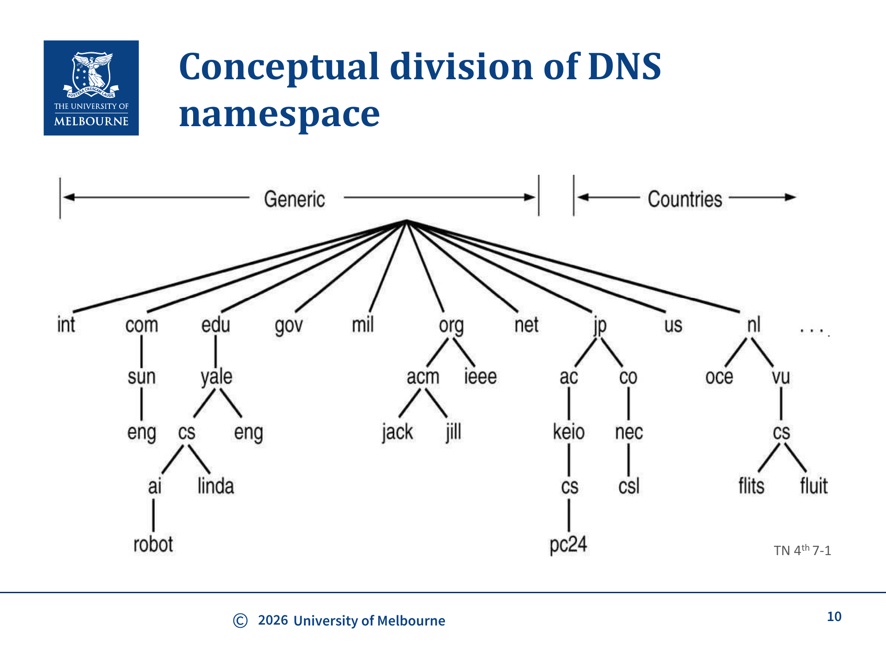
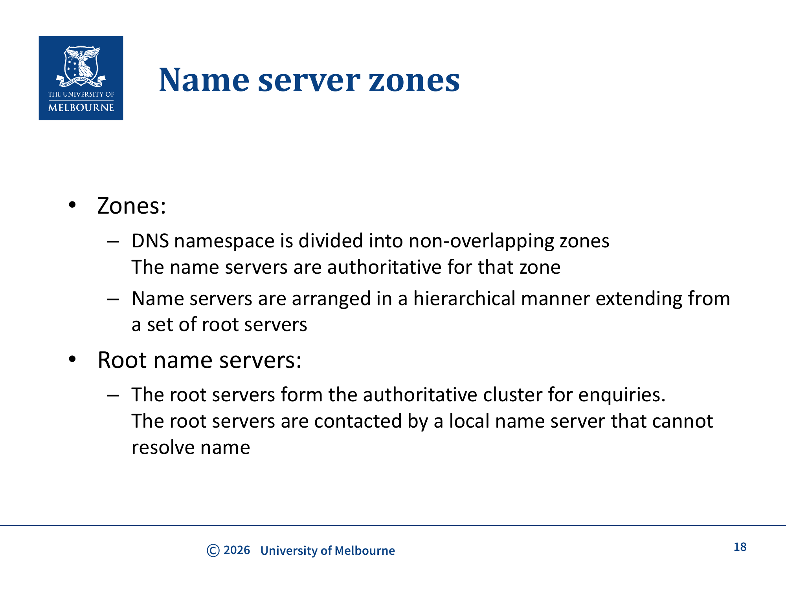
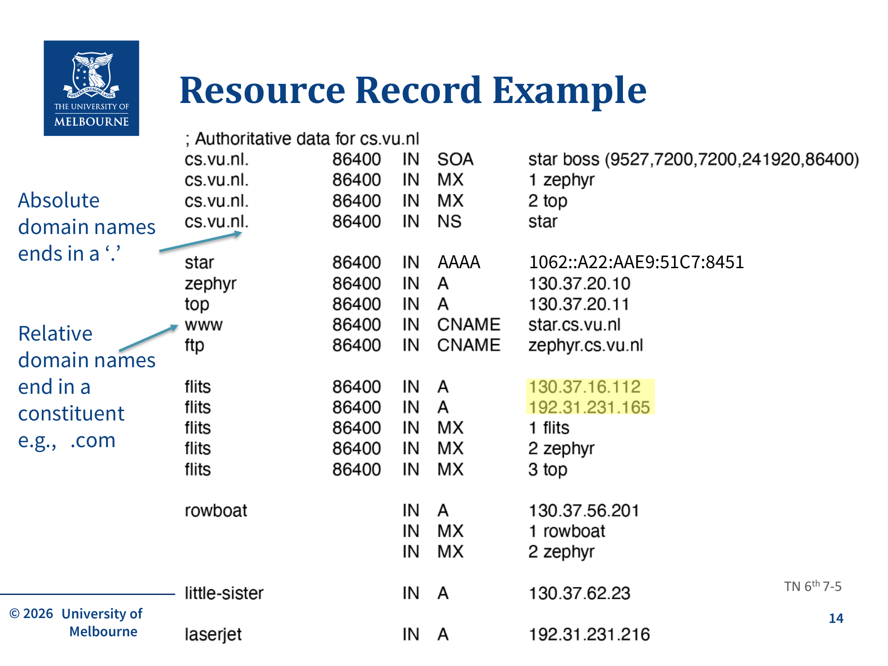
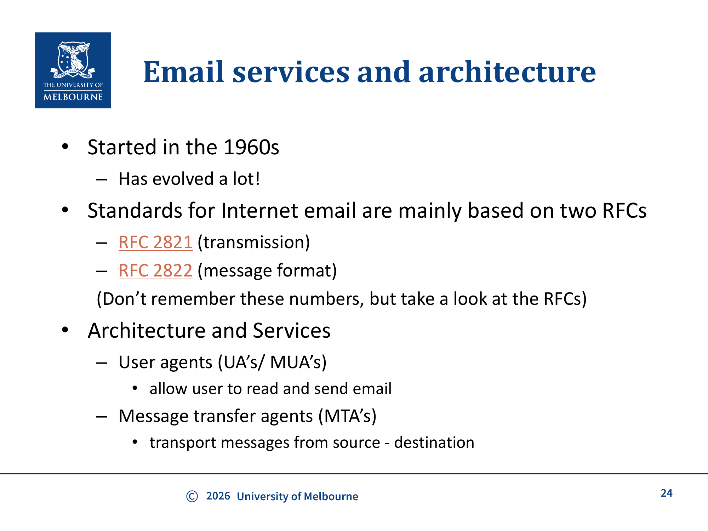
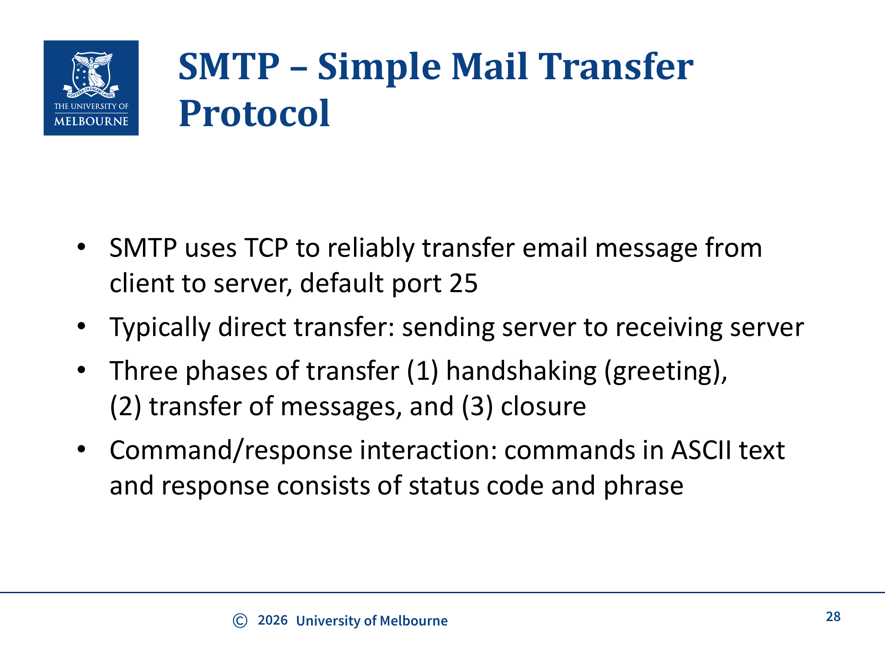
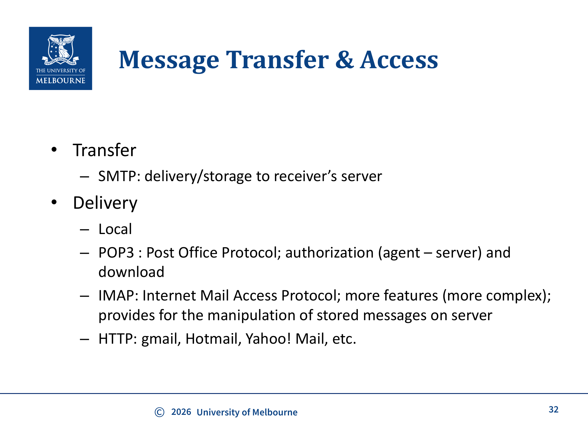

# WK7 - DNS & Email Application Layer Services

## 课件概述

本课件介绍了应用层的两个核心服务：**DNS（域名系统）**和**Email（电子邮件）**。DNS负责将人类可读的域名映射为计算机使用的IP地址，是互联网基础设施的关键组成部分。电子邮件部分重点介绍邮件系统架构、SMTP、MIME、Message Transfer & Access，以及IMAP。课件第40页之后明确标为non-examinable，DNS记录插入、HOSTS文件、DNS安全、POP3详细命令和Streaming只作背景。

---

## 必须掌握的知识点

### 1. DNS（Domain Name System，域名系统）

**What（是什么）：** DNS将人类可读的域名（如 `unimelb.edu.au`）映射为计算机使用的IP地址（如 `128.250.81.2` 或 `fe80::69a4:1496:4354:1862`）。

**Why（为什么需要）：**
- 人类容易记住域名，但Socket通信需要IP地址
- DNS是应用层服务，它本身也需要创建Socket来工作——需要一个硬编码的IP地址来打开第一个Socket（先有鸡还是先有蛋的问题）

**DNS的四个核心组成元素：**

#### (a) Domain Name Space（域名空间）
- 使用**树状结构**的命名空间来标识互联网上的资源
- 域名不区分大小写
- 各部分用"."分隔（与IP地址中的"."无关）
- 每个部分最多63个字符
- 整个路径最多255个字符
- 支持国际化域名（1999年起）——带来了安全问题

#### (b) DNS Database（DNS数据库）
- 命名空间树中的每个节点/叶子都有一组信息，存储在**Resource Record（资源记录，RR）**中
- 所有RR的集合构成一个**分布式数据库**

#### (c) Name Servers（域名服务器）
- 持有域名树结构某部分和相关RR信息的服务器程序
- 分层组织，从根服务器开始

#### (d) Resolvers（解析器）
- 从域名服务器提取信息以响应客户端请求的程序

---

### 2. DNS域名层次结构

**Top-level Domains (TLDs)（顶级域名）：**
- 通用TLDs：`.com`、`.edu`、`.org`、`.net`等
- 国家TLDs：`.uk`、`.au`、`.jp`等
- 国家TLD内部通常也遵循类似的组织结构

**域名层次示例：**
```
                    . (root)
                   / \
                .com  .edu  .org  .au  ...
               /       \
         google.com   unimelb.edu.au
         /    \
    www.google.com  mail.google.com
```



---

### 3. DNS服务器类型



**Zones（区域）：** DNS命名空间被划分为**不重叠的区域（zones）**。每个zone由一组权威名称服务器负责管理，这些服务器对该zone内的域名信息具有权威性。

#### (a) Root Name Servers（根域名服务器）
- 形成权威查询集群
- 当本地域名服务器无法解析名称时，会联系根服务器
- 全球共有13个根服务器集群（A-M）

#### (b) Top-level Domain DNS Servers（顶级域名服务器）
- 负责 `.com`、`.org`、`.net`、`.edu` 等通用TLD和所有国家TLD
- 例如：Network Solutions维护 `.com` 服务器，Educause维护 `.edu` 服务器

#### (c) Authoritative DNS Servers（权威DNS服务器）
- 组织的DNS服务器，提供组织内服务器（如Web、邮件）的权威主机名到IP映射
- 可由组织自己或服务提供商维护

#### (d) Local DNS Server（本地DNS服务器）
- 每个ISP（住宅ISP、公司、大学）都有一个"默认域名服务器"
- 如果有缓存结果则直接返回
- 否则充当代理，将请求转发到查询层次结构中

---

### 4. DNS查询解析过程

**How（怎么工作）：**

1. 客户端的Resolver向本地DNS服务器发送查询
2. 如果本地DNS知道答案 → 直接返回
3. 如果不知道 → 本地DNS向层次结构上级查询直到根DNS
4. 根DNS → TLD DNS → 权威DNS → 返回结果给本地DNS → 返回给客户端
5. 查询受定时器约束，避免过长的响应时间

**递归查询 vs 迭代查询：**
- 客户端到本地DNS通常是**递归查询**（本地DNS负责完成全部解析）
- 本地DNS到其他服务器通常是**迭代查询**（每一步返回下一步应该查询的服务器）

**多IP地址与getaddrinfo()：** 一个域名可能对应多个IP地址（DNS的A/AAAA记录可返回多条结果）。
- `getaddrinfo()` 返回一个**链表**（linked list）的地址，客户端需要**遍历**这个链表，逐个尝试 `socket()` + `connect()`，直到连接成功为止
- 这种方式实现了DNS层面的基本容错——如果一个IP不可用，客户端会自动尝试下一个

---

### 5. Resource Records（资源记录）

**RR的基本格式：** `(Name, Value, Type, TTL)`

**常见Type：**
| Type | 含义 | Value示例 |
|------|------|----------|
| A | 主机名到IPv4地址 | (hostname, IPv4 address) |
| AAAA | 主机名到IPv6地址 | (hostname, IPv6 address) |
| NS | 域名到权威DNS服务器 | (domain, hostname of authoritative DNS) |
| CNAME | 别名到规范名 | (alias, canonical name) |
| MX | 域名到邮件服务器 | (domain, mail server hostname) |

**AAAA 记录的具体示例（对应 slide p.14）：** `1062::A22:AAE9:51C7:8451` —— 一条 IPv6 地址，注意 AAAA 与 A 的区别只在地址族（IPv6 vs IPv4），记录语义相同。

**绝对域名 vs 相对域名：**
- 绝对域名以"."结尾（如 `www.google.com.`）
- 相对域名以TLD结尾（如 `www.google.com`）



---

### 6. DNS缓存

**What（是什么）：** DNS查询结果会被缓存，后续相同的查询可以直接使用缓存结果，无需再次查询层次结构。

**部分缓存（partial caching，对应 slide p.42 讨论）：** 本地 DNS / resolver 不必缓存**整个域**的所有记录，可以只缓存它**已查到的那一段**。例如查 `robot.cs.washington.edu` 时，如果本地 NS 只查到了 `cs.washington.edu` 这一层的 NS 记录却没拿到最终主机记录，它仍可以缓存这条 NS 记录——下次查同子域下其它主机时就能从这一层开始，而不必再从根走。这种"查到哪缓存到哪"的策略叫部分缓存，能显著降低根/TLD 负载。

**Why（为什么重要）：**
- 减少DNS查询延迟
- 减少根服务器和TLD服务器的负载

**HOSTS文件（非考试背景）：** 课件中HOSTS File位于"The following is non-examinable material"之后，只需知道它是本地硬编码域名映射：
- Unix: `/etc/hosts`
- Windows: `C:\Windows\System32\drivers\etc\hosts`
- 可用于广告屏蔽（将广告域名映射到 `0.0.0.0`）

---

### 7. DNS安全 ⚠️ 非考试背景（non-examinable）

**问题：** 原始DNS设计没有考虑安全性
- **DNS Spoofing（DNS欺骗）：** 攻击者伪造DNS响应
- **DNS Flooding（DNS洪泛）：** 用大量请求淹没DNS服务器

**解决方案：**
- **DNSSEC（DNS Security Extensions）：** 为DNS响应提供数字签名验证
- **Root Signing：** 根服务器的签名

**复习处理：** DNS Security在课件第40页之后，属于removed/non-examinable material。期末只需把它当作安全背景，不要背DNSSEC细节。

---

### 8. 电子邮件系统架构

**What（是什么）：** 电子邮件系统由两个主要组件构成：



#### (a) User Agent (UA) / Mail User Agent (MUA)
- 用户用来阅读和发送邮件的程序（如Outlook、Thunderbird、Gmail网页）
- 基本功能：**compose**（撰写）、**report**（报告）、**display**（显示）、**dispose**（处理）（对应 slide p.46）
- 寻址方案：`user@dns-address`——收件人地址用 DNS 域名定位邮件域，用本地名定位域内用户
- 邮件三层结构（对应 slide p.46）：**envelope**（信封，MTA 用来路由，含 MAIL FROM / RCPT TO）+ **header**（头部，给 UA/人看的 To/From/Subject）+ **body**（正文）。信封和头部可能看起来一样，但语义不同：信封是传输用的，头部是展示用的

#### (b) Message Transfer Agent (MTA)
- 负责将邮件从源传输到目的地的程序
- 可能有SMTP relay（中继）在发送方和接收方MTA之间

**邮件格式（RFC 2822）：**
- **Header（头部）：** 包含To、From、Subject、Date等字段
- **Blank line（空行）：** 分隔头部和正文
- **Body（正文）：** 消息内容，ASCII字符

**常见头部字段：**
| 字段 | 用途 |
|------|------|
| To, Cc, Bcc | 收件人 |
| From, Sender | 发件人 |
| Subject | 主题 |
| Date | 日期 |
| Message-Id | 消息唯一标识 |
| In-Reply-To, References | 回复相关 |
| Return-Path | 退信路径 |
| Received | 传输路径记录 |

---

### 9. SMTP（Simple Mail Transfer Protocol）



**What（是什么）：** 用于在邮件服务器之间传输邮件的协议，使用TCP，**默认端口25**。

**三个阶段：**
1. **Handshaking（握手/问候）**
2. **Transfer of messages（消息传输）**
3. **Closure（关闭）**

**特点：**
- 命令/响应交互模式：命令使用ASCII文本，响应包含状态码和短语
- 通常是直接传输：发送服务器到接收服务器
- 很"chatty"（话多），传统SMTP需要多次往返（back-and-forth）交换——在现代网络中，延迟（latency）远大于序列化延迟（serialization delay），所以这种设计会导致显著延迟
- **现代优化：** 一次性发送一个头部（one header），减少往返次数，降低延迟

---

### 10. MIME（Multipurpose Internet Mail Extensions）

**What（是什么）：** 扩展了原始的ASCII-only邮件格式，支持多种语言和多媒体内容。

**Why（为什么需要）：** 早期邮件只支持ASCII（RFC 822），无法支持其他语言和音频/图片等多媒体内容。

**MIME额外的5个消息头：**
| Header | 用途 |
|--------|------|
| MIME-Version | 标识MIME版本 |
| Content-Description | 人类可读的内容描述 |
| Content-Id | 唯一标识符 |
| Content-Transfer-Encoding | 正文如何编码传输 |
| Content-Type | 内容类型和格式 |

**Content-Type示例：** `text/plain`、`text/html`、`image/jpeg`、`multipart/alternate`等

---

### 11. 邮件接收协议



#### (a) POP3（Post Office Protocol，简单了解）
- 课件的Message Transfer & Access页只要求知道POP3用于authorization和download。
- POP3的三个阶段、USER/PASS/LIST/RETR/DELE/QUIT命令位于non-examinable部分，不需要背。
- 高层问题：传统"download and delete"模式不方便重新阅读邮件。

#### (b) IMAP（Internet Message Access Protocol）
- 允许用户查询MTA
- **在会话间保持用户状态**（跨会话记忆）
- 在服务器上保留邮箱内容，允许在线和离线操作
- 更多功能，更复杂
- 需要服务器端存储支持

#### (c) HTTP
- Gmail、Hotmail、Yahoo! Mail等使用Web界面
- 通过HTTP协议访问邮件

**本地 vs 远程邮件接收：**
- **本地（已过时）：** 用户的机器直接运行MTA，有永久网络连接
- **远程（现代）：** 笔记本/手机不是MTA，通过POP3/IMAP/HTTP从邮件服务器获取邮件，网络连接可能是间歇性的

**流媒体与 WebSocket 补充（对应 slide p.50，非考背景）：** 课件在邮件之后顺带讲了实时/流媒体传输：流媒体约占**互联网下载流量的 40%**；常用协议包括 **WebSocket**（`ws://`、`wss://`，跑在端口 80/443，在 HTTP 之上做双向升级）、**RTP + RTCP / RTSP**（音视频实时传输与控制）、以及早期的 **RTMP**（Flash 时代直播）。它们大多跑在 UDP 或 HTTP 之上，是应用层多样性的体现，了解即可。

---

## 关键术语

| 术语 | 英文 | 含义 |
|------|------|------|
| 域名系统 | DNS | 将域名映射为IP地址的分布式数据库 |
| 资源记录 | Resource Record (RR) | DNS数据库中的基本数据单元 |
| 根服务器 | Root Server | DNS层次结构顶部的服务器 |
| 权威服务器 | Authoritative Server | 对特定域名区域有权威信息的服务器 |
| 解析器 | Resolver | 从DNS服务器提取信息的程序 |
| 递归查询 | Recursive Query | 服务器负责完成全部解析 |
| 迭代查询 | Iterative Query | 每步返回下一步应查询的服务器 |
| 用户代理 | User Agent (UA) | 用户读写邮件的程序 |
| 消息传输代理 | MTA | 传输邮件的服务器程序 |
| 简单邮件传输协议 | SMTP | 邮件传输协议，端口25 |
| 邮局协议 | POP3 | 邮件下载协议；详细命令非考试 |
| 互联网邮件访问协议 | IMAP | 邮件服务器访问协议 |
| 多用途互联网邮件扩展 | MIME | 扩展邮件格式支持多媒体 |

---

## 常见问题

### Q1: DNS查询中，本地DNS服务器的作用是什么？

本地DNS服务器是客户端和DNS层次结构之间的"中间人"：
- 如果有缓存结果，直接返回（快速）
- 如果没有，充当代理，向上级DNS服务器查询
- 减少了客户端直接访问根服务器的需要

### Q2: SMTP和IMAP有什么区别？

| 特性 | SMTP | IMAP |
|------|------|------|
| 方向 | 推送（Push）| 拉取（Pull）|
| 用途 | 从发送方传输到接收方服务器 | 从服务器获取邮件到客户端 |
| 状态 | 无状态 | 有状态 |
| 端口 | 25 | 143 |

### Q3: 为什么DNS使用UDP而不是TCP？

DNS查询通常使用UDP（端口53），因为：
- 查询和响应数据量小，适合单个UDP数据报
- UDP无连接，开销小，速度快
- 如果响应超过512字节，可以回退到TCP

### Q4: 为什么邮件系统需要MIME？

原始的RFC 822邮件格式只支持ASCII文本，无法：
- 使用非英语字符（如中文、日文）
- 附件（图片、文档、音频等）
- HTML格式的邮件

MIME通过添加Content-Type等头部，支持多种内容类型。

---

## 知识点之间的联系

```
应用层服务
    ├── DNS (域名→IP映射)
    │    ├── 域名空间 (树状结构)
    │    ├── 域名服务器 (Root → TLD → Authoritative)
    │    ├── 查询过程 (递归/迭代)
    │    └── 缓存 (提高效率)
    │
    └── Email (邮件系统)
         ├── 发送: SMTP (push, port 25)
         ├── 格式: RFC 2822 + MIME
         ├── 接收: POP3 (download) / IMAP (server-side) / HTTP
         └── 架构: UA ←→ MTA ←→ MTA ←→ UA
```

**与其他课件的联系：**
- **WK6（OSI）：** DNS和Email都是应用层协议
- **WK7-Sockets：** DNS和Email都使用Socket进行通信
- **WK8-HTTP：** HTTP也用于访问邮件（Gmail等Web邮件）
- **WK5（Secure Communication）：** DNS安全和邮件加密只作背景联系

---

## 实际应用案例

1. **访问网站时的DNS查询：** 输入 `www.google.com` → 浏览器向本地DNS查询 → 递归/迭代解析 → 获得IP地址 → 建立TCP连接
2. **发送邮件的过程：** 撰写 → UA通过SMTP发送到邮件服务器 → SMTP中继 → 接收方邮件服务器
3. **Gmail：** 使用Web界面（HTTP）而非IMAP/POP3，MIME支持附件和HTML
4. **广告屏蔽：** 修改HOSTS文件属于non-examinable背景示例，不作为重点

---

## 常见错误和易错点

1. **混淆SMTP和POP3/IMAP的方向：** SMTP用于**发送**邮件（push），POP3/IMAP用于**接收**邮件（pull）。

2. **DNS不是传输层协议：** DNS是应用层协议，但使用UDP（有时TCP）作为传输层。

3. **混淆递归和迭代查询：**
   - 递归查询：客户端让本地DNS负责全部解析
   - 迭代查询：本地DNS每步只问一个服务器，服务器返回下一步该问谁

4. **忽略DNS缓存：** DNS查询结果会被缓存，TTL过期后才重新查询。

5. **MIME不是独立协议：** MIME是邮件格式的扩展，不是传输协议。SMTP仍然用于传输MIME格式的邮件。

6. **POP3细节过度复习：** 期末只需知道POP3是邮件下载/访问方式之一；POP3状态机和命令不考。IMAP的"服务器端保留状态、可操作在线邮箱"更接近本课件重点。

---

## 课件总结

本课件介绍了应用层的两个核心服务：

1. **DNS：** 互联网的"电话簿"，将域名映射为IP地址
   - 分布式、层次化的数据库
   - 多级服务器：Root → TLD → Authoritative
   - 缓存机制提高效率
   - DNS安全/DNSSEC在本课件中为non-examinable背景

2. **Email：** 互联网最古老的应用之一
   - 发送：SMTP（push-based）
   - 格式：RFC 2822 + MIME（支持多媒体）
   - 接收：POP3（概念了解）、IMAP（服务器端管理）、HTTP（Web邮件）

---

## 复习建议

1. **理解DNS查询过程：** 能够描述从输入域名到获得IP地址的完整DNS查询流程，区分递归和迭代查询。
2. **掌握RR类型：** 理解A、AAAA、NS、CNAME、MX记录的含义和用途。
3. **重点掌握IMAP，POP3只高层了解：** IMAP在服务器端保留状态并支持在线邮箱操作；POP3命令和状态机不考。
4. **理解邮件传输流程：** 从发件人到收件人的完整邮件传输路径。
5. **了解MIME的作用：** 为什么需要MIME，它如何扩展邮件格式。
## 默写背诵 Dictation

> 以下为本章必须能默写的中英对照；网站「默写 Recite」Tab 提供自测模式。

| # | 默写提示 Prompt | 标准答案 Answer |
|---|----------------|----------------|
| 1 | DNS hierarchy — three levels top to leaf. · DNS 层次自上而下三层。 | **EN:** Root DNS servers → TLD servers → authoritative DNS servers. / **中文：** 根 DNS 服务器 → 顶级域（TLD）服务器 → 权威 DNS 服务器。 |
| 2 | Local DNS server role. · 本地 DNS 服务器角色。 | **EN:** Default nameserver for a host/ISP — caches answers and relays queries up the hierarchy. / **中文：** 主机/ISP 的默认域名服务器——缓存答案并向上层转发查询。 |
| 3 | AAAA record example (slide p.14). · AAAA 记录例子（课件 p.14）。 | **EN:** AAAA maps hostname to IPv6, e.g. 1062::A22:AAE9:51C7:8451. / **中文：** AAAA 将主机名映射到 IPv6，如 1062::A22:AAE9:51C7:8451。 |
| 4 | A record vs AAAA record. · A 记录 vs AAAA 记录。 | **EN:** A = hostname to IPv4; AAAA = hostname to IPv6. / **中文：** A = 主机名到 IPv4；AAAA = 主机名到 IPv6。 |
| 5 | MX record purpose. · MX 记录用途。 | **EN:** Maps domain to mail server(s) that receive email for that domain. / **中文：** 将域名映射到接收该域邮件的邮件服务器。 |
| 6 | NS record purpose. · NS 记录用途。 | **EN:** Delegates a subdomain to authoritative name servers for that zone. / **中文：** 将子域委派给该区域的权威名称服务器。 |
| 7 | Four DNS components (slide p.7–8). · DNS 四个核心组成（课件 p.7–8）。 | **EN:** Domain name space, DNS database (RRs), name servers, resolvers. / **中文：** 域名空间、DNS 数据库（RR）、域名服务器、解析器（resolvers）。 |
| 8 | Local resolver relay (slide p.21). · 本地 resolver 转发（课件 p.21）。 | **EN:** Resolver sends query to local DNS; local DNS fetches answer from hierarchy if not cached, then returns to client. / **中文：** Resolver 向本地 DNS 发查询；本地 DNS 无缓存则向上查询，再返回客户端。 |
| 9 | SMTP role and port. · SMTP 角色与端口。 | **EN:** Push protocol for sending/transferring mail between MTAs; well-known port 25. / **中文：** 服务器间发送/转发邮件的推送协议；well-known 端口 25。 |
| 10 | IMAP vs POP3 — main difference. · IMAP vs POP3 主要区别。 | **EN:** IMAP keeps mail on server and syncs folders; POP3 typically downloads and may delete from server. / **中文：** IMAP 邮件留服务器并同步文件夹；POP3 通常下载并可能从服务器删除。 |
| 11 | MIME purpose. · MIME 用途。 | **EN:** Extends email format to support non-ASCII text, attachments, and multimedia. / **中文：** 扩展邮件格式以支持非 ASCII 文本、附件和多媒体。 |
| 12 | CNAME record purpose. · CNAME 记录用途。 | **EN:** Alias — canonical name points one hostname to another hostname. / **中文：** 别名——将一个主机名指向另一个规范主机名。 |

