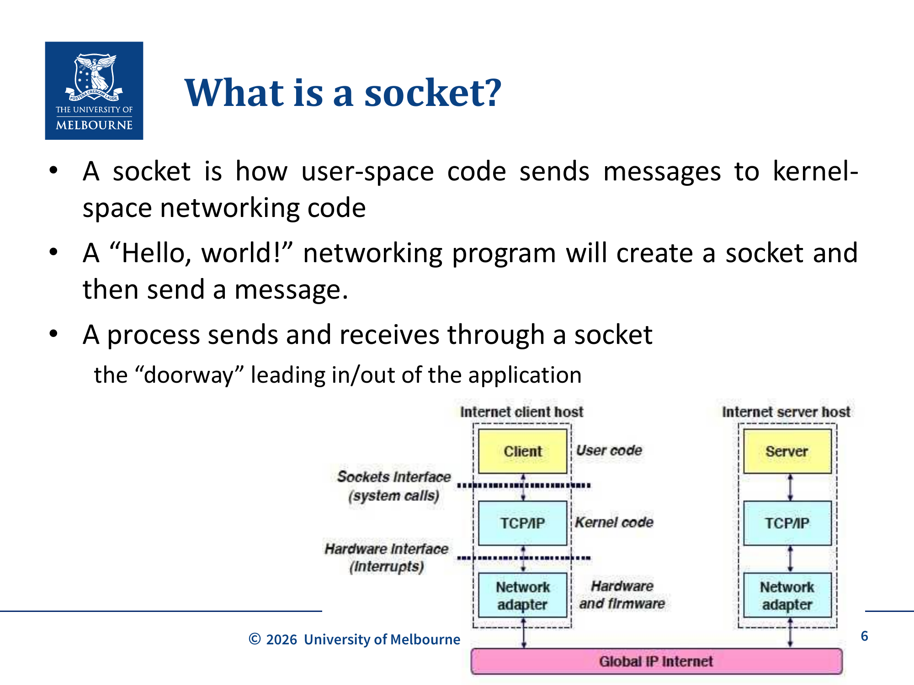
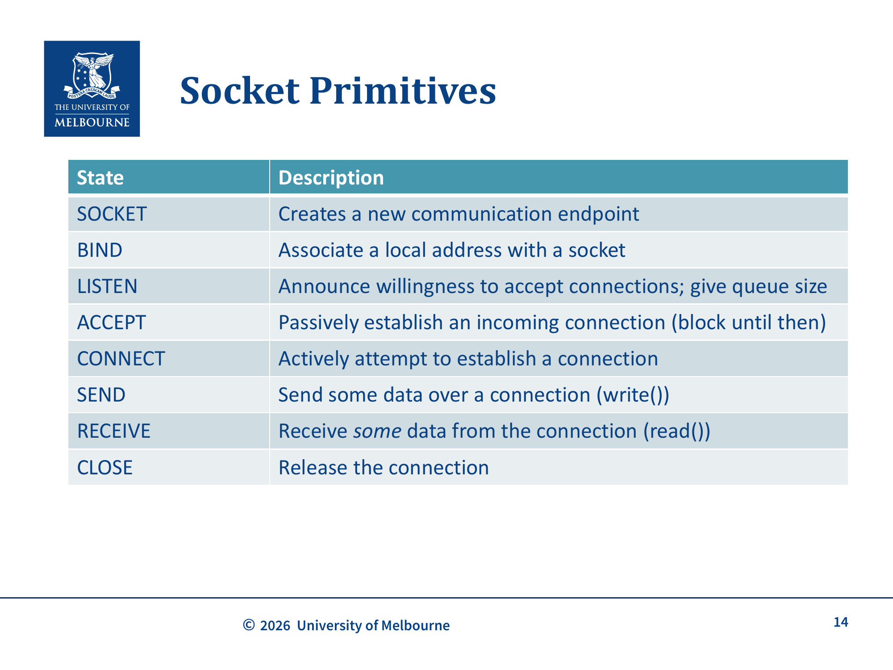
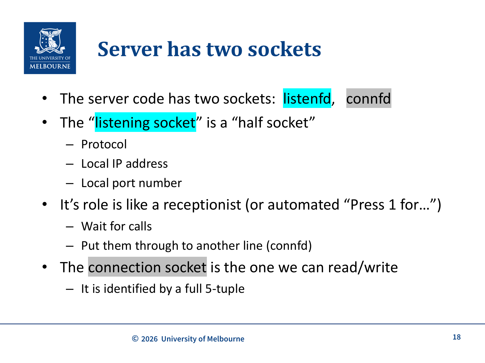
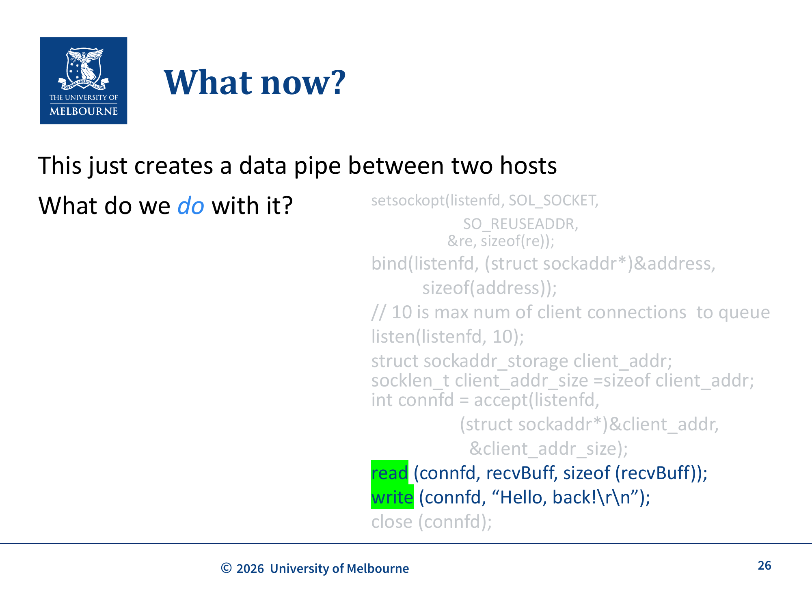
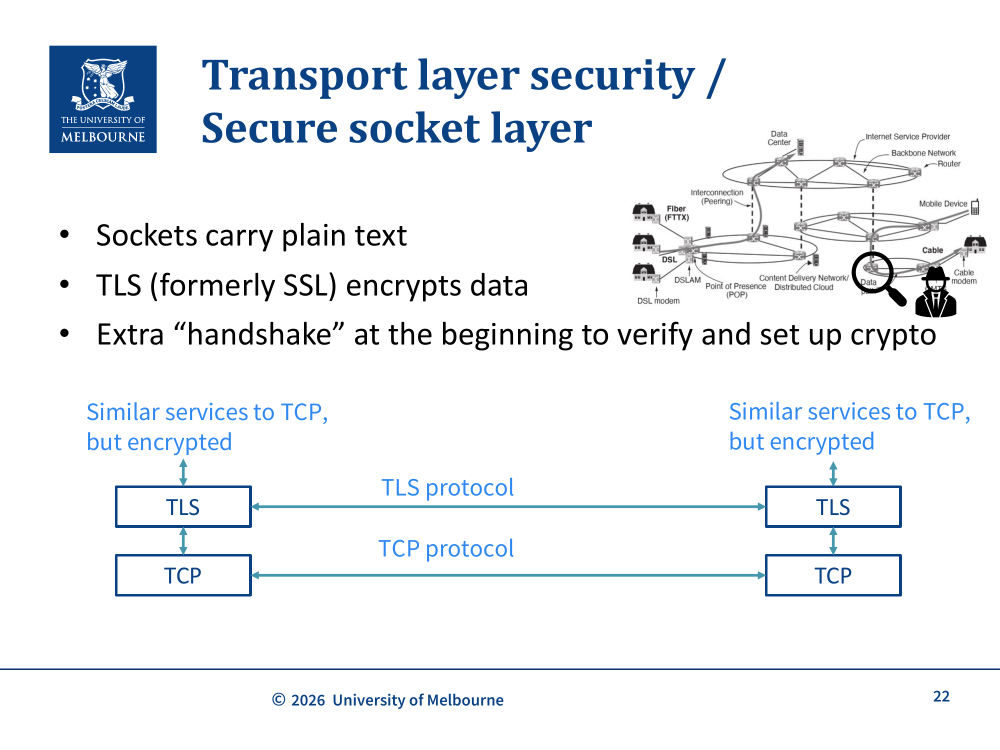

# WK7 - Socket Programming

## 课件概述

本课件介绍了**Socket编程（Socket Programming）**的基础知识，Socket是应用层和传输层之间的接口。课件详细讲解了Socket的概念、客户端和服务器端Socket的创建流程、阻塞/非阻塞读取、TLS安全Socket，以及Socket编程在C语言中的实现。最后简要介绍了QUIC协议的Socket模型。

---

## 必须掌握的知识点

### 1. 什么是Socket？

**What（是什么）：** Socket是用户空间（user-space）代码向内核空间（kernel-space）网络代码发送消息的方式。它是应用层和传输层之间的"门"（doorway），进程通过Socket发送和接收数据。

**Why（为什么需要）：** 应用程序不能直接访问网络硬件，需要通过操作系统提供的接口（Socket API）来使用网络功能。Socket是应用程序与网络协议栈之间的桥梁。

**历史背景：** Socket接口起源于**Berkeley UNIX**（加州大学伯克利分校），后来所有主流操作系统都采用了这一接口。因此，Socket代码在不同平台之间具有**可移植性**（portable）。

**How（怎么工作）：**
- 在UNIX中，一切皆文件——所有输入/输出都像读写文件一样
- Socket通过**文件描述符**（file descriptor，一个整数）来标识
- API通过**系统调用**实现：`connect()`、`read()`、`write()`、`close()`等



> **图片来源：** WK7-Sockets课件第6页。展示了Socket在客户端/服务器架构中的位置——用户代码通过Socket Interface（系统调用）与内核TCP/IP协议栈交互，再通过Hardware Interface（中断）与网络适配器通信。Global IP Internet连接两端的主机。

---

### 2. Socket地址：5元组

**What（是什么）：** 一个Socket由以下**5元组**唯一标识：

| 元素 | 描述 |
|------|------|
| Protocol | 协议（TCP/UDP） |
| Local IP | 本地IP地址 |
| Local Port | 本地端口号 |
| Remote IP | 远端IP地址 |
| Remote Port | 远端端口号 |

**注意：** 经常被误称为"源/目的"（source/dest），正确的术语应该是"本地/远端"（local/remote）。

---

### 3. Client vs Server

**What（是什么）：** Socket编程中的客户端和服务器角色：

- **Server（服务器）：** 被动等待连接的一方（类似等电话的人）
- **Client（客户端）：** 主动发起连接的一方（类似打电话的人）

**电话类比：**
- **接收方（Server）：** 确保SIM卡在 → 手机开机 → 不在飞行模式 → 等待来电
- **呼叫方（Client）：** 同上准备 → 拨号（指定要连接的对象）
- **连接建立后：** 双方可以平等地说和听

---

### 4. Socket原语（Primitives）

| 原语 | 描述 | 对应C函数 |
|------|------|----------|
| SOCKET | 创建新的通信端点 | `socket()` |
| BIND | 将本地地址与Socket关联 | `bind()` |
| LISTEN | 宣布愿意接受连接，指定队列大小 | `listen()` |
| ACCEPT | 被动接受传入连接（阻塞直到连接到达） | `accept()` |
| CONNECT | 主动尝试建立连接 | `connect()` |
| SEND | 通过连接发送数据 | `write()` / `send()` |
| RECEIVE | 从连接接收数据 | `read()` / `recv()` |
| CLOSE | 释放连接 | `close()` |



> **图片来源：** WK7-Sockets课件第14页。展示了8个Socket原语及其描述。SOCKET创建端点，BIND关联地址，LISTEN宣布接受连接，ACCEPT被动建立连接（阻塞），CONNECT主动建立连接，SEND/RECEIVE收发数据，CLOSE释放连接。

---

### 5. 客户端Socket流程

```
getaddrinfo()    → 解析主机名和端口，获取地址信息
    ↓
socket()         → 创建Socket
    ↓
connect()        → 主动连接到服务器
    ↓
write()          → 发送数据
    ↓
read()           → 接收响应
    ↓
close()          → 关闭连接
```

**C代码关键部分：**
```c
// 1. 设置hints
hints.ai_family = AF_INET6;
hints.ai_socktype = SOCK_STREAM;
// 2. 解析地址
s = getaddrinfo("localhost", "5000", &hints, &res);
// 3. 遍历结果，尝试连接
for (rp = res; rp != NULL; rp = rp->ai_next) {
    connfd = socket(rp->ai_family, rp->ai_socktype, rp->ai_protocol);
    if (connfd == -1) continue;
    if (connect(connfd, rp->ai_addr, rp->ai_addrlen) != -1) break;
    close(connfd);
}
// 4. 发送数据
write(connfd, "Hello, network!\r\n", len);
// 5. 关闭
close(connfd);
```

---

### 6. 服务器端Socket流程

```
socket()         → 创建监听Socket
    ↓
setsockopt()     → 设置Socket选项（如SO_REUSEADDR）
    ↓
bind()           → 绑定到本地地址和端口
    ↓
listen()         → 开始监听连接请求
    ↓
accept()         → 阻塞等待客户端连接
    ↓
read()/write()   → 与客户端通信
    ↓
close()          → 关闭连接
```

**服务器有两个Socket：**
1. **listening Socket（listenfd）：** "半Socket"，只包含协议、本地IP、本地端口。像接待员，等待来电并转接到另一条线路。
2. **connection Socket（connfd）：** 完整的5元组Socket，用于实际的读写通信。



> **图片来源：** WK7-Sockets课件第18页。服务器有两个Socket：listening socket（listenfd）是"半Socket"，只有协议、本地IP、端口，像接待员等待来电；connection socket（connfd）是完整5元组，用于实际读写。



> **图片来源：** WK7-Sockets课件第26页。展示了服务器端在accept之后的实际代码：通过connfd进行read/write/close操作。Socket只是创建了两台主机之间的数据管道，关键在于如何使用它。

---

### 7. 阻塞 vs 非阻塞读取

**What（是什么）：** Socket的读取操作有两种模式：

#### Blocking（阻塞模式）
- `read()` 会等待直到有数据到达
- 适用于简单的顺序处理
- 循环读取整个连接：`while ((n = read(connfd, recvBuff, sizeof(recvBuff)-1)) > 0)`

#### Non-blocking（非阻塞模式）
- `read()` 立即返回，即使没有数据（返回0字节）
- 通过 `fcntl` 设置 `O_NONBLOCK`
- 需要更复杂的事件处理：`select()` / `pselect()` / `poll()` 用于**I/O多路复用**（I/O multiplexing），可以同时监控多个文件描述符，等待其中任何一个变为可读/可写

**关键点：** 网络数据是分阶段到达的，一次 `read()` 读到的数据可能少于一次 `write()` 发送的数据。**始终检查实际读取了多少字节**。

---

### 8. getaddrinfo() 函数

**What（是什么）：** 用于解析主机名和服务名，返回可用的地址信息链表。

**Why（为什么需要）：**
- 一个主机名可能对应**多个IP地址**（IPv4、IPv6、多个接口）
- 需要遍历所有可能的地址来建立连接

**How（怎么使用）：**
```c
struct addrinfo hints, *res;
memset(&hints, 0, sizeof hints);
hints.ai_family = AF_INET6;      // IPv6
hints.ai_socktype = SOCK_STREAM;  // TCP
s = getaddrinfo("localhost", "5000", &hints, &res);
// res是一个链表，需要遍历
```

---

### 9. TLS/SSL Socket ⚠️ TLS in Rust 部分为非考试内容（Not examinable）

**What（是什么）：** TLS（Transport Layer Security）在Socket之上提供加密通信。

**层次关系：**
```
应用数据
    ↓
TLS (加密/解密)
    ↓
TCP (可靠传输)
    ↓
IP (路由)
```

**两种使用方式：**
1. **简单加密：** 只加密数据，不验证身份——适用于不需要信任服务器的场景
2. **带身份验证的加密：** 验证服务器身份——需要信任服务器时使用（如提供个人信息的网站）

**C语言OpenSSL示例：** 使用 `SSL_CTX`、`SSL`、`BIO` 等结构实现TLS连接。



> **图片来源：** WK7-Sockets课件第22页。Socket默认传输明文，TLS（前身为SSL）在TCP之上提供加密。TLS握手在连接开始时验证身份并建立加密参数。类似于TCP的服务但数据被加密。

---

### 10. QUIC协议

**What（是什么）：** 2021年标准化的可靠传输协议，最初为HTTP设计，但可用于任何应用。

**特点：**
- 运行在UDP之上（因为防火墙通常只允许TCP/UDP）
- 支持**多字节流**（multiple byte streams）而非单一字节流
- TLS握手与TCP握手**合并**，减少RTT
- 支持连接中途**切换IP地址**（如从Wi-Fi切换到4G）

**三种Socket类型：**
| 类型 | 描述 |
|------|------|
| Listener Socket | 绑定端口，接受传入连接 |
| Connection Socket | 由connect/accept创建，管理连接的流 |
| Stream Socket | 实际发送/接收数据的Socket |

**优势：**
- 丢包时只有一个流需要等待重传（而非整个连接）
- 更少的空闲RTT
- 支持网络切换

---

## 关键术语

| 术语 | 英文 | 含义 |
|------|------|------|
| Socket | Socket | 应用层与传输层之间的接口 |
| 文件描述符 | File Descriptor | 标识Socket/文件的整数 |
| 5元组 | 5-tuple | Socket的唯一标识（协议+本地IP+本地端口+远端IP+远端端口）|
| 监听Socket | Listening Socket | 服务器等待连接的Socket |
| 连接Socket | Connection Socket | 用于实际通信的Socket |
| 阻塞读取 | Blocking Read | 没有数据时阻塞等待 |
| 非阻塞读取 | Non-blocking Read | 没有数据时立即返回 |
| TLS | Transport Layer Security | 传输层安全协议 |
| QUIC | QUIC | 基于UDP的可靠传输协议 |

---

## 常见问题

### Q1: 为什么服务器需要两个Socket？

- **Listening Socket (listenfd)：** 像接待员，只负责等待和接受新连接。它是一个"半Socket"，只有本地地址信息。
- **Connection Socket (connfd)：** 像具体的通话线路，有完整的5元组信息，用于实际的数据读写。

这样服务器可以持续接受新连接，同时与已连接的客户端通信。

### Q2: 为什么需要用getaddrinfo()而不是直接使用IP地址？

- 一个主机名可能对应多个IP地址（IPv4、IPv6、多宿主主机）
- `getaddrinfo()` 返回一个链表，需要遍历尝试所有可能的地址
- 支持协议无关的编程（同时支持IPv4和IPv6）

### Q3: 阻塞和非阻塞Socket的主要区别？

| 特性 | Blocking | Non-blocking |
|------|----------|-------------|
| 没有数据时 | 等待（阻塞） | 立即返回0字节 |
| 编程复杂度 | 简单 | 需要事件循环（select/poll） |
| 适用场景 | 简单的请求-响应 | 需要同时处理多个连接 |

### Q4: QUIC相比TCP有什么优势？

1. **多流支持：** 一个连接可以有多个独立的字节流，丢包只影响一个流
2. **更快的握手：** TLS握手与传输握手合并，减少RTT
3. **连接迁移：** 支持在连接中途切换IP地址
4. **更好的防火墙穿透：** 运行在UDP之上

---

## 知识点之间的联系

```
应用程序
    ↓
Socket API (本课件)
    ├── 客户端: getaddrinfo → socket → connect → read/write → close
    └── 服务器: socket → bind → listen → accept → read/write → close
    ↓
传输层协议
    ├── TCP (可靠的，面向连接) ← WK9
    └── UDP (不可靠的，无连接) ← WK8
    ↓
网络层
    └── IP ← WK10-WK12
```

**与其他课件的联系：**
- **WK6（OSI）：** Socket是应用层和传输层之间的接口
- **WK7-DNS-Mail：** DNS和Email都使用Socket进行通信
- **WK8-HTTP：** HTTP通过Socket发送请求和响应
- **WK9-TCP：** TCP提供Socket底层的可靠传输
- **WK5（Secure Communication）：** TLS在Socket之上提供安全

---

## 实际应用案例

1. **Web浏览器：** 使用Socket连接Web服务器，发送HTTP请求，接收HTML/CSS/JS
2. **SSH客户端：** 通过Socket连接远程服务器，建立加密通道
3. **邮件客户端：** 通过SMTP Socket发送邮件，IMAP Socket接收邮件
4. **在线游戏：** 使用UDP Socket进行实时数据传输
5. **视频流：** WebSocket或QUIC Socket进行实时流媒体传输

---

## 常见错误和易错点

1. **混淆listenfd和connfd：** 服务器有两个Socket，listening socket用于接受连接，connection socket用于通信。

2. **忘记检查read()返回值：** 网络数据分阶段到达，一次read()可能读不到全部数据。

3. **5元组记错：** Socket地址由5个元素组成：协议、本地IP、本地端口、远端IP、远端端口。

4. **阻塞模式下死等：** 在阻塞模式下，如果对端不发送数据，read()会永远阻塞。

5. **忽略SO_REUSEADDR：** 服务器重启时，端口可能处于TIME_WAIT状态，需要设置SO_REUSEADDR才能重新绑定。

6. **getaddrinfo()不遍历链表：** 一个主机名可能有多个地址，需要遍历尝试所有地址。

---

## 课件总结

本课件介绍了Socket编程的基础知识：

1. **Socket概念：** 应用层与传输层之间的接口，由5元组唯一标识
2. **客户端/服务器模型：** 客户端主动连接，服务器被动等待
3. **Socket原语：** socket、bind、listen、accept、connect、read、write、close
4. **阻塞/非阻塞：** 两种读取模式，各有适用场景
5. **安全Socket：** TLS在Socket之上提供加密
6. **QUIC：** 新一代传输协议，基于UDP，支持多流和连接迁移

---

## 复习建议

1. **理解Socket生命周期：** 能够描述客户端和服务器Socket从创建到关闭的完整流程。
2. **区分listening和connection socket：** 理解服务器为什么需要两个Socket。
3. **掌握5元组：** 理解Socket如何被唯一标识。
4. **理解阻塞/非阻塞：** 能够描述两种模式的区别和适用场景。
5. **了解TLS和QUIC：** 理解它们在Socket模型中的位置和作用。
