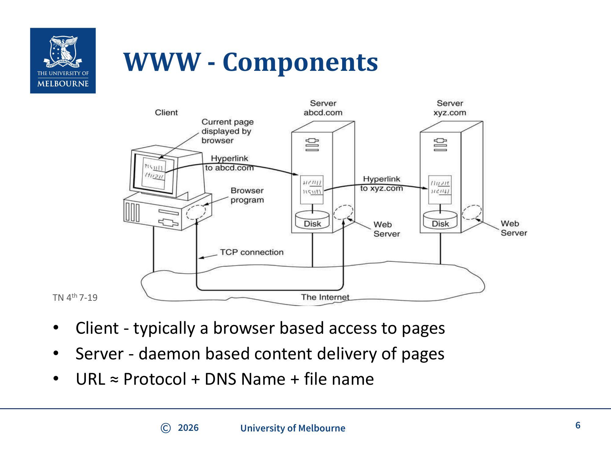
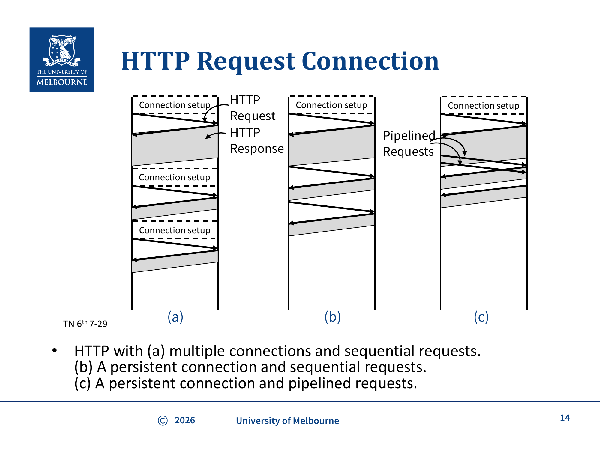
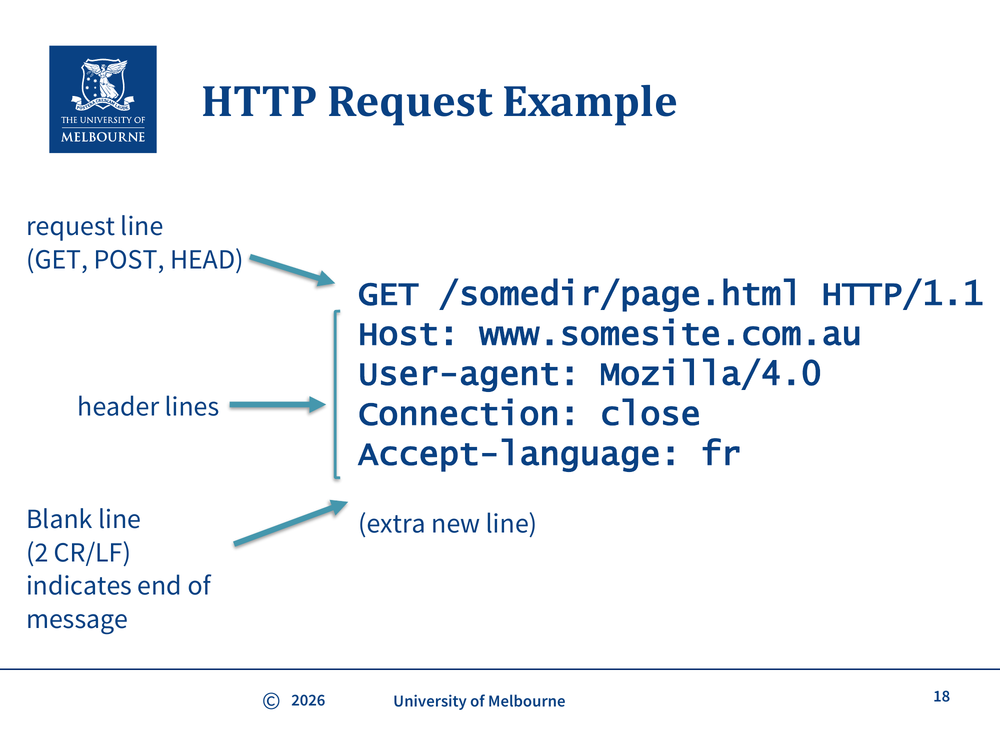
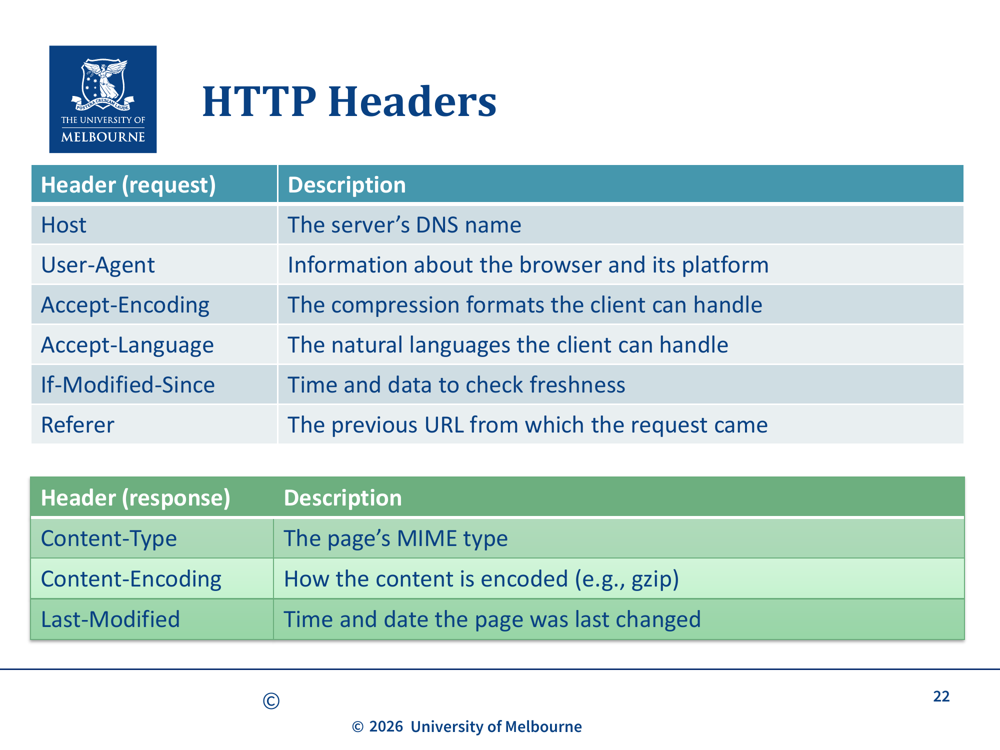
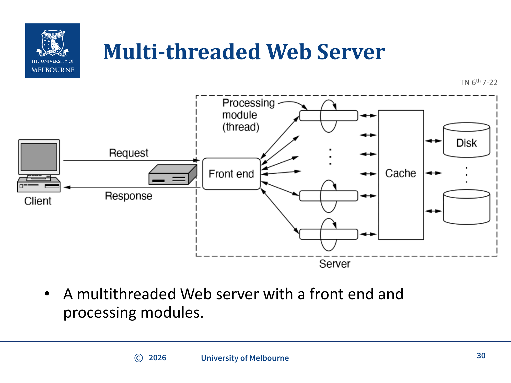

# COMP30023 WK8 - Application Layer: HTTP

## 课件概述
本课件介绍了**超文本传输协议（HTTP）**——World Wide Web 的核心协议。考试重点是 Web 的组成部分（client/server/URL）、HTTP 协议的工作流程、请求与响应格式、persistent vs non-persistent 连接、HTTP 方法和状态码、常见HTTP headers、HTTPS、HTTP/2 和 HTTP/3。Cookies、web cache/proxy 和多线程web server位于课件后半的背景/非考材料中，只需简单了解。

---

## 必须掌握的知识点

### 1. WWW 的三个组成部分

**What**: World Wide Web 由三个核心组件构成：Client（客户端）、Server（服务器）和 URL（统一资源定位符）。

**Why**: 理解 Web 的基本架构是学习 HTTP 的前提。Web 是一个分布式的信息系统，需要明确谁在请求、谁在响应、如何定位资源。

**How**:
- **Client**: 通常是浏览器（browser），负责向服务器发送 HTTP 请求并渲染返回的页面
- **Server**: 守护进程（daemon），监听特定端口（默认80），接收请求并返回内容
- **URL**: 资源的地址，格式为 `scheme://host[:port]/path[?query][#fragment]`

```
URL 结构示例:
https://www.example.com:443/path/page.html?name=value#section1
│         │              │   │              │         │
scheme    host           port path           query     fragment
```



> **图片来源：** WK8-HTTP课件第6页。Client通过浏览器访问Web Server，Server通过daemon提供内容。Hyperlink在不同Server之间链接。URL ≈ Protocol + DNS Name + file name。

---

### 2. HTTP 协议概述

**What**: HTTP（HyperText Transfer Protocol）是一个应用层协议，定义了 Web 上资源交换的规则。它基于请求-响应模型，客户端发送请求，服务器返回响应。

**Why**: HTTP 是整个 Web 的基础。浏览器加载网页、API 调用、文件下载等都依赖 HTTP。

**How**:
1. 浏览器解析 URL，确定服务器的 DNS 名
2. 通过 DNS 查询获取服务器的 IP 地址
3. 建立 TCP 连接（默认端口80）
4. 发送 HTTP 请求消息
5. 服务器处理请求并返回 HTTP 响应消息
6. 浏览器渲染页面，可能需要获取其他资源（图片、CSS、JS）
7. 关闭 TCP 连接

---

### 3. Non-persistent vs Persistent 连接

**What**: HTTP/1.0 使用 non-persistent 连接（每个请求/响应对使用独立的 TCP 连接），HTTP/1.1 默认使用 persistent 连接（同一 TCP 连接上发送多个请求/响应）。

**Why**: Non-persistent 连接需要为每个对象建立新的 TCP 连接，涉及三次握手开销，效率低。Persistent 连接避免了重复建立连接的开销。

**How**:

**Non-persistent HTTP (HTTP/1.0)**:
- 每个对象需要 2 个 RTT（Round Trip Time）：一个用于 TCP 建立，一个用于 HTTP 请求/响应
- 加上文件传输时间
- 浏览器通常并行打开多个 TCP 连接来加速

**Persistent HTTP (HTTP/1.1)**:
- 服务器发送响应后保持连接开放
- 后续请求可以复用同一连接
- 支持 **pipelining**：客户端不必等待前一个请求的响应就可以发送下一个请求

```
(a) Non-persistent: 每个对象一个新连接
[连接建立] [请求/响应] [关闭] ... [连接建立] [请求/响应] [关闭]

(b) Persistent, sequential:
[连接建立] [请求1/响应1] [请求2/响应2] [请求3/响应3] ... [关闭]

(c) Persistent, pipelined:
[连接建立] [请求1] [请求2] [请求3] [响应1] [响应2] [响应3] ... [关闭]
```



> **图片来源：** WK8-HTTP课件第14页。(a)每次请求都需要新的Connection setup（non-persistent）；(b)一次Connection setup后顺序发送多个请求（persistent）；(c)一次Connection setup后管线化发送多个请求（pipelined）。

---

### 4. HTTP 请求消息格式

**What**: HTTP 请求由请求行（request line）和头部行（header lines）组成，以空行（CRLF）结束。

**Why**: 理解请求格式对于编程实现 HTTP 客户端/服务器以及调试网络问题至关重要。

**How**:

```
GET /somedir/page.html HTTP/1.1          ← 请求行（方法 URL 版本）
Host: www.somesite.com                   ← Host 头部（必须）
User-Agent: Mozilla/5.0                  ← 浏览器信息
Connection: close                        ← 告诉服务器发送完关闭连接
Accept-language: fr                      ← 首选语言
                                         ← 空行（两个 CRLF）表示头部结束
```



> **图片来源：** WK8-HTTP课件第18页。GET /somedir/page.html HTTP/1.1 是请求行（method URL version），后面是header lines（Host, User-agent, Connection, Accept-language），最后是Blank line（2 CR/LF）表示消息结束。

---

### 5. HTTP 请求方法

**What**: HTTP 定义了多种请求方法，每种有不同的语义。

**Why**: 不同的操作应该使用不同的方法，这关系到安全性（Safe）和幂等性（Idempotent）。

**How**:

| 方法 | Safe | Idempotent | Cacheable | 用途 |
|------|------|------------|-----------|------|
| GET | Yes | Yes | Yes | 获取资源 |
| HEAD | Yes | Yes | Yes | 只获取头部，不返回 body |
| POST | No | No | 视情况 | 提交数据（如表单） |
| PUT | No | Yes | No | 上传/替换资源 |
| DELETE | No | Yes | No | 删除资源 |
| OPTIONS | Yes | Yes | No | 查询服务器支持的方法 |
| TRACE | Yes | Yes | No | 回显请求，用于调试 |
| PATCH | No | No | No | 部分修改资源 |
| CONNECT | No | No | No | 创建隧道，用于HTTPS代理连接 |

**Safe**: 只用于信息检索，不应改变服务器状态
**Idempotent**: 多次相同的请求与一次请求的效果相同

---

### 6. HTTP 响应消息格式和状态码

**What**: HTTP 响应由状态行（status line）、头部行和消息体（body）组成。

**Why**: 状态码告诉客户端请求的结果，是调试和错误处理的基础。

**How**:

```
HTTP/1.1 200 OK                         ← 状态行（版本 状态码 短语）
Connection: close
Date: Thu, 06 Aug 2009 12:00:15 GMT
Server: Apache/2.2.11 (Unix)
Last-modified: Mon, 22 Jun 2009
Content-Length: 6821
Content-Type: text/html
                                         ← 空行
<html><head>...</html>                   ← 消息体
```

**状态码分类**:

| 类别 | 含义 | 常见例子 |
|------|------|----------|
| 1xx | Information | 100 Continue |
| 2xx | Success | 200 OK, 204 No Content |
| 3xx | Redirection | 301 Moved Permanently, 304 Not Modified |
| 4xx | Client Error | 403 Forbidden, 404 Not Found |
| 5xx | Server Error | 500 Internal Server Error, 503 Service Unavailable |

---

### 7. 常见 HTTP 头部

**What**: HTTP 头部传递关于请求/响应的元数据。

**Why**: 头部控制缓存行为、内容类型、连接管理等重要功能。

**How**:

**请求头部**:
- `Host`: 服务器的 DNS 名（必须）
- `User-Agent`: 浏览器和平台信息
- `Accept-Encoding`: 客户端能处理的压缩格式
- `Accept-Language`: 客户端首选语言
- `If-Modified-Since`: 缓存新鲜度检查
- `Referer`: 请求来源页面
- `Cookie`: 之前设置的 cookie

**响应头部**:
- `Content-Type`: 页面的 MIME 类型（如 `text/html`）
- `Content-Encoding`: 内容编码方式（如 gzip）
- `Content-Length`: 内容长度（字节）
- `Last-Modified`: 页面最后修改时间
- `Set-Cookie`: 设置 cookie
- `Location`: 重定向目标 URL

**通用头部**:
- `Date`: 消息发送时间
- `Cache-Control`: 缓存指令
- `Etag`: 内容标签（用于缓存验证）



> **图片来源：** WK8-HTTP课件第22页。请求头部包括Host（服务器DNS名）、User-Agent（浏览器信息）、Accept-Encoding（压缩格式）、Accept-Language（首选语言）、If-Modified-Since（缓存检查）、Referer（来源URL）。响应头部包括Content-Type（MIME类型）、Content-Encoding（编码方式如gzip）、Last-Modified（最后修改时间）。

---

### 8. HTTPS - HTTP over TLS

**What**: HTTPS 不是一个独立的协议，而是 HTTP 运行在 TLS（Transport Layer Security）之上。

**Why**: 普通 HTTP 以明文传输，容易被窃听和篡改。HTTPS 提供加密、认证和完整性保护。

**How**:
- 使用端口 **443** 而非 80
- 所有内容（包括 URL 路径）都被加密，不仅仅是 payload
- 客户端和服务器先进行 TLS 握手，建立加密通道
- 然后在加密通道上进行普通的 HTTP 通信

---

### 9. HTTP/2 和 HTTP/3

**What**: HTTP/2 和 HTTP/3 是 HTTP 协议的演进版本，主要目标是降低延迟。

**Why**: HTTP/1.1 存在队头阻塞（head-of-line blocking）问题——一个请求阻塞了后续请求。

**How**:

**HTTP/2 改进**:
- **Header 压缩**: 减少重复头部的传输开销
- **Server Push**: 服务器可以主动推送客户端即将需要的资源（如在发送 HTML 时提前推送其中引用的图片）
- **Multiplexing**: 在同一 TCP 连接上多路复用多个请求，互不阻塞
- 虽然逻辑上兼容 HTTP/1.1，但在 TCP 层面完全不同
- **版本协商：** 客户端和服务器在连接建立时可以选择使用 HTTP/1.1、HTTP/2 或其他协议（通过 ALPN 等机制协商）

**HTTP/3 改进**:
- 基于 **QUIC** 协议（而非 TCP），QUIC 运行在 UDP 之上
- 更好的并行性，尤其在丢包场景下（QUIC 避免了 TCP 的队头阻塞）
- HTTP 层面与 HTTP/2 基本相同
- 融合了 TLS 握手与连接建立

---

### 10. Cookies ⚠️ 背景补充，非核心考试范围

**What**: Cookie 是服务器发送给浏览器的一小段数据（<4KB），浏览器会在后续请求中自动回传。

**复习处理：** Cookies在课件"And finally/Background"附近出现，后续详细cookie例子在not assessable部分。期末重点仍是HTTP请求/响应、headers、状态码、连接管理和HTTP/2/3；Cookie只需知道它用于在HTTP消息中携带状态。

**How**:
1. 服务器在响应中通过 `Set-Cookie` 头部设置 cookie
2. 浏览器保存 cookie（包括 domain、path、content、expiry、security 五个字段）
3. 后续向同一 domain 发送请求时，浏览器自动在 `Cookie` 头部中携带 cookie

**Cookie 的争议：** 可用于用户跟踪（tracking），引发隐私问题。课件只用它作为"tracking with cookies is well known"的背景提醒，不需要背浏览器指纹等扩展材料。

---

### 11. Web Cache（Web 缓存/代理）⚠️ not assessable，简单了解

**What**: Web cache（也叫 proxy cache）是位于客户端和源服务器之间的中间服务器，用于缓存经常访问的内容。

**复习处理：** Web cache/proxy在课件"The remainder of these slides are not assessable"之后。只需知道目标是减少响应时间、降低源服务器负载；不需要背proxy工作细节或多线程web server图。



> **⚠️ 非考试范围（not assessable）：** 该图片及其相关说明仅为背景知识，不在考试范围内。

> **图片来源：** WK8-HTTP课件第30页。Client发送Request到Server的Front end，Front end将请求分配给多个Processing module（thread），每个thread从Cache或Disk获取数据并返回Response。

---

### 12. HTTP 与 SMTP 的对比

**What**: HTTP 和 SMTP 都是应用层协议，但设计理念和工作方式有本质不同。

| 特性 | HTTP | SMTP |
|------|------|------|
| 方向 | Pull（客户端拉取） | Push（发送方推送） |
| 消息格式 | 每个对象独立封装 | 所有内容在一个消息中 |
| 编码 | 二进制数据可直接传输 | 需要编码（如 Base64） |
| 用途 | 获取 Web 资源 | 发送电子邮件 |

---

## 关键术语

| 术语 | 定义 |
|------|------|
| HTTP | 超文本传输协议，Web 的核心应用层协议 |
| URL | 统一资源定位符，资源的地址 |
| URI | 统一资源标识符，包含 URL 和 URN |
| RTT | Round Trip Time，往返时间 |
| Persistent Connection | 持久连接，TCP 连接在多个请求间复用 |
| Pipelining | 管线化，无需等待响应即可发送后续请求 |
| MIME Type | 内容类型标识（如 text/html, image/png） |
| Cookie | 服务器存储在客户端的状态数据；背景了解 |
| Web Cache | Web 缓存/代理服务器；not assessable背景 |
| HTTPS | HTTP over TLS，加密的 HTTP |
| TLS | Transport Layer Security，传输层安全协议 |
| QUIC | 基于 UDP 的传输协议，HTTP/3 的基础 |
| Safe Method | 不修改服务器状态的方法（GET, HEAD） |
| Idempotent Method | 多次调用效果相同的方法 |

---

## 常见问题

### Q1: 为什么 HTTP/1.0 要为每个对象建立新连接？
**A**: HTTP/1.0 设计简单，每次请求-响应后就关闭连接。这确保了服务器资源不会被长期占用，但效率低。浏览器通过并行打开多个连接来缓解这个问题。

### Q2: HTTP/2 解决了队头阻塞问题，为什么还需要 HTTP/3？
**A**: HTTP/2 在同一 TCP 连接上多路复用，但 TCP 层面仍然有队头阻塞——一个 TCP 段丢失会阻塞该连接上的所有流。HTTP/3 使用 QUIC（基于 UDP），每个流独立处理丢包，真正消除了队头阻塞。

### Q3: Cookies 和 Web Cache 需要背吗？
**A**: 不作为核心考试重点。Cookies只需知道用于在HTTP消息中携带状态；Web cache/proxy位于not assessable背景部分，知道其目标是减少响应时间即可。

---

## 知识点之间的联系

```
HTTP 协议
├── 依赖 DNS 解析域名 → WK7-DNS
├── 运行在 TCP 之上 → WK8-Transport-Services (TCP 端口)
├── HTTPS 使用 TLS → WK5-Secure-Communication
├── HTTP/3 使用 QUIC → 基于 UDP → WK7-Sockets
├── Cookie 维持状态 → 背景了解
└── Web Cache → not assessable背景
```

---

## 实际应用案例

1. **浏览网页**: 输入 URL → DNS 解析 → TCP 连接 → HTTP 请求 → 服务器返回 HTML → 浏览器请求图片/CSS/JS → 渲染页面
2. **API 调用**: RESTful API 使用 GET/POST/PUT/DELETE 方法操作资源
3. **CDN**: Content Delivery Network 利用缓存思想，将内容缓存到全球各地的节点（背景了解）
4. **登录认证**: 通过 Cookie 或 token 维持登录状态（背景了解）

---

## 常见错误和易错点

1. **混淆 Safe 和 Idempotent**: Safe 意味着不修改状态，Idempotent 意味着多次调用效果相同。GET 既是 safe 又是 idempotent，PUT 是 idempotent 但不是 safe。
2. **忽略 Host 头部**: HTTP/1.1 要求 Host 头部是必须的，因为同一 IP 可能托管多个网站（虚拟主机）。
3. **混淆 HTTP 版本特性**: HTTP/1.0 是 non-persistent，HTTP/1.1 默认 persistent，HTTP/2 是 multiplexing over TCP，HTTP/3 是 over QUIC/UDP。
4. **误解 HTTPS**: HTTPS 不仅仅是"加密的 HTTP"，URL 路径也被加密（不像有些人认为的只有 body 被加密）。
5. **Cookie细节过度复习**: Cookie和Web Cache不是本课件核心考试范围，不要把浏览器指纹、具体cookie字段或proxy实现当作重点。

---

## 课件总结

HTTP 是 Web 的核心协议，从 HTTP/1.0 的简单请求-响应模型演进到 HTTP/3 基于 QUIC 的高效传输。关键概念包括：
- **连接管理**: non-persistent → persistent → pipelining → multiplexing
- **安全**: 通过 TLS/HTTPS 保护数据
- **性能**: 通过 Header 压缩、Server Push、HTTP/3 over QUIC 降低延迟；Web Cache是背景材料

---

## 复习建议

1. 掌握 HTTP 请求和响应的完整格式（包括请求行、状态行、头部）
2. 理解 persistent vs non-persistent 的性能差异（RTT 计算）
3. 记住常见的状态码分类（1xx-5xx）和几个重要的具体状态码
4. 对比 HTTP/1.1、HTTP/2、HTTP/3 的主要区别
5. 了解 HTTPS 如何保护通信（结合 WK5 的 TLS 知识）
6. Cookies/Web Cache只作背景了解，不要作为主要背诵点
