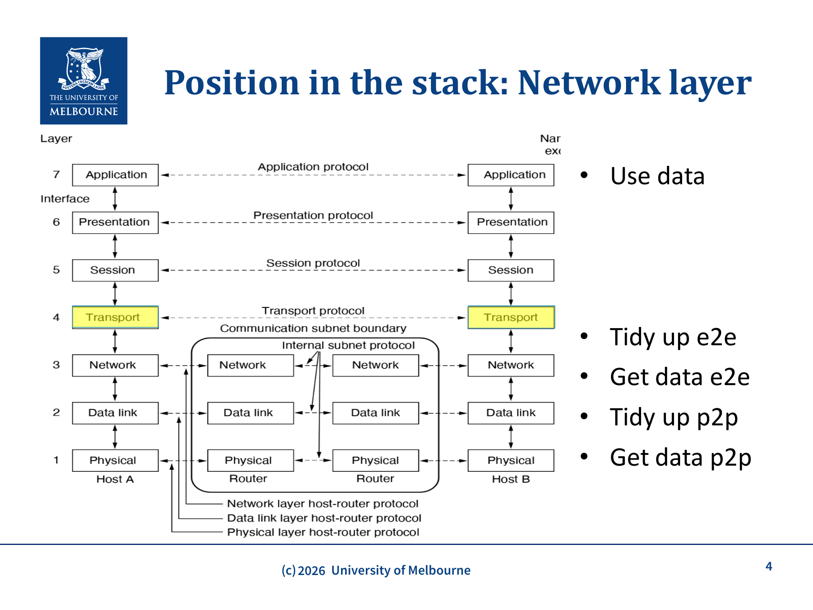
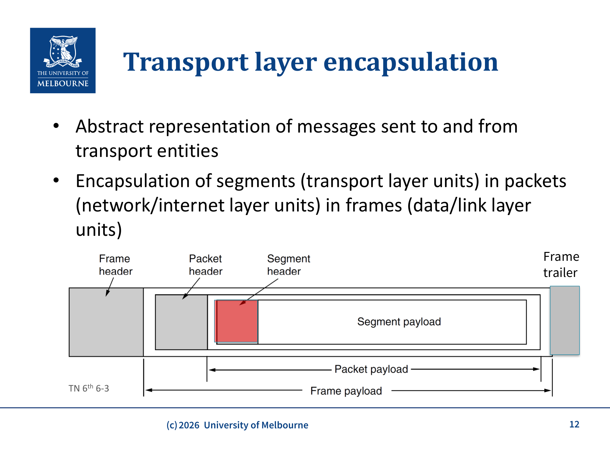
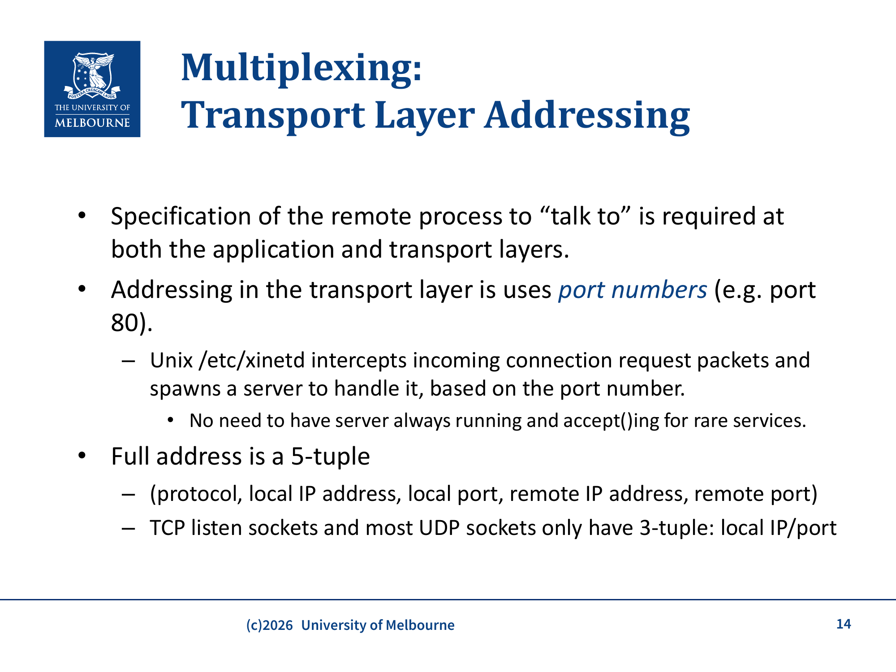
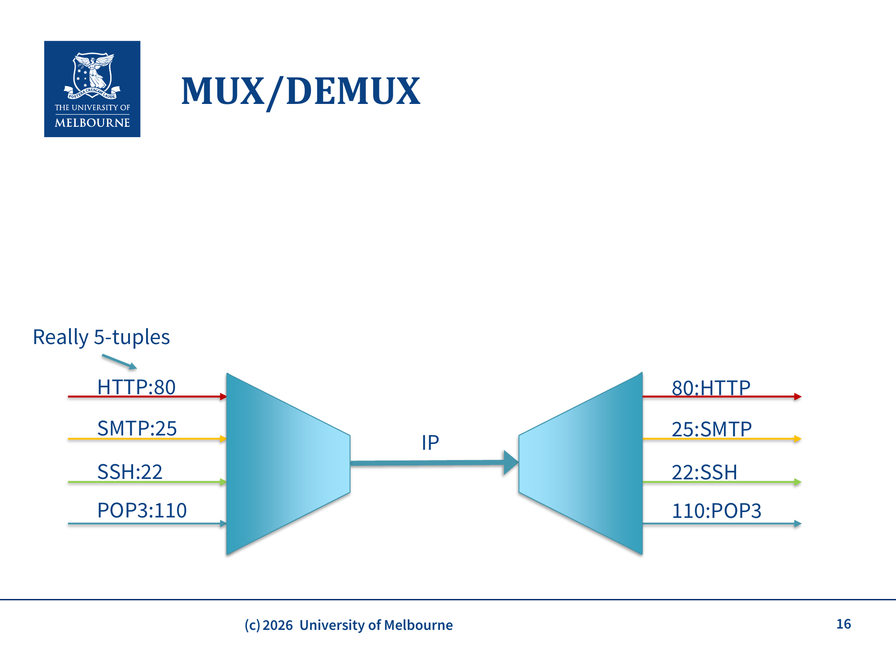
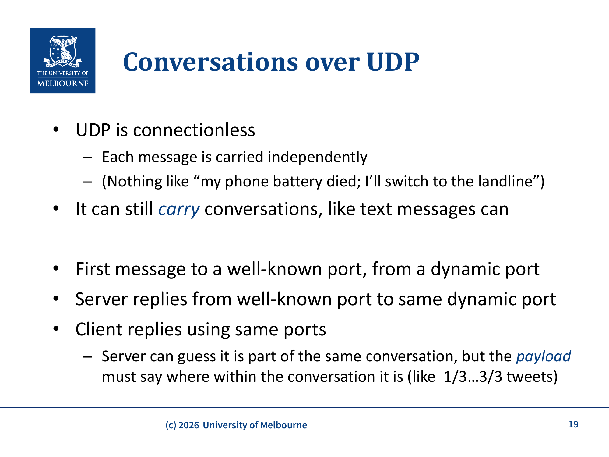

# COMP30023 WK8 - Transport Layer: Services & UDP

## 课件概述
本课件介绍了传输层（Transport Layer）的核心概念和服务，重点讲解了传输层在网络栈中的角色、multiplexing/demultiplexing 机制、端口号分配，以及 UDP（User Datagram Protocol）的特点和适用场景。这是从应用层到传输层的过渡，为后续 TCP 学习打基础。

---

## 必须掌握的知识点

### 1. 传输层的角色

**What**: 传输层位于应用层和网络层之间，提供应用进程间的"逻辑"通信通道。

**Why**: 网络层只提供主机到主机（host-to-host）的通信，但一台主机上可能同时运行多个应用进程。传输层解决了"数据应该交给哪个进程"的问题。同时，网络层不保证可靠性，传输层可以在其上构建可靠服务。

**How**:

传输层的职责是：
- 为应用提供所需的服务
- 利用网络层提供的服务来实现

**应用层的需求 vs 网络层的提供**:

| 应用需要 | 网络提供 |
|----------|----------|
| 不同应用的数据不混在一起 | 主机到主机的通信 |
| 数据不会超过处理速度 | 大多数时候能送达 |
| 字节流 | 有时会重复发送 |
| 可靠传输（或知道丢失了） | — |
| 有序到达 | — |



> **图片来源：** WK8-Transport课件第4页。Transport层（第4层）位于Application和Network之间。Host A和Host B之间通过Transport protocol通信，而Router只处理Network层及以下。Transport层的职责：Tidy up e2e（端到端整理）、Get data e2e、Tidy up p2p（点对点整理）、Get data p2p。

---

### 2. 传输层的服务类型

**What**: 传输层提供两种基本服务：面向连接的可靠服务（TCP）和无连接的不可靠服务（UDP）。

**Why**: 不同应用有不同的需求。文件传输需要可靠性（每字节都不能错），而实时语音通话更在意延迟（丢几个包可以忍受）。两种服务分别满足不同需求。

**How**:

**Connection-oriented（面向连接，TCP）**:
- 类似打电话：先建立连接 → 传输数据 → 释放连接
- 提供"完美"的连接：可靠、有序、无重复
- 隐藏了底层的 ack、拥塞控制、丢包重传等细节
- **不提供**：隐私（需 TLS）、等时性（isochrony，保持包间延迟恒定）



> **图片来源：** WK8-Transport课件第10页。Host 1的Application layer通过Transport address将数据交给Transport entity，Transport entity封装成Segment通过Transport protocol发送到Host 2的Transport entity，再解封装交给Application layer。Transport services provide multiplexing，在不可靠的network之上提供reliable service。

---

### 3. 传输层封装（Encapsulation）

**What**: 传输层将应用数据封装成 **segment**（段），然后交给网络层封装成 **packet**（包），再交给链路层封装成 **frame**（帧）。

**Why**: 每一层添加自己的头部信息，用于该层的寻址和控制。

**How**:

```
Application Data
    ↓ 加上 TCP/UDP 头部
[Transport Header | Application Data]  ← Segment（段）
    ↓ 加上 IP 头部
[IP Header | Segment]                   ← Packet（包）
    ↓ 加上链路层头部和尾部
[Link Header | Packet | Link Trailer]   ← Frame（帧）
```

术语：
- **Segment**: 传输层的数据单元
- **Packet**: 网络层的数据单元
- **Frame**: 链路层的数据单元

**注意：** 这些术语只是概念性的标签。实际上，"packet"这个词在日常使用中常被用于所有三层（人们可能用"packet"指代段或帧），所以如果在其他地方看到"packet"用于传输层，不要困惑。



> **图片来源：** WK8-Transport课件第12页。展示了数据在各层的封装过程：Segment payload被Segment header封装，整体作为Packet payload被Packet header封装，再作为Frame payload被Frame header和Frame trailer封装。

---

### 4. Multiplexing / Demultiplexing（复用/分用）

**What**: Multiplexing 是将多个应用的数据流合并到一个共享通道；Demultiplexing 是从共享通道中将数据分发到正确的应用进程。

**Why**: 一台主机上可能有多个应用同时进行网络通信（浏览器、邮件客户端、SSH），它们共享同一个网络层。传输层需要区分这些数据流。

**How**:

传输层使用**端口号（Port Number）**来标识不同的应用进程。

```
发送方:                              接收方:
App1 (port 1234) ──┐                ┌── App1 (port 1234)
App2 (port 5678) ──┤── MUX → IP ──→DEMUX ── App2 (port 5678)
App3 (port 80)   ──┘                └── App3 (port 80)
```

**完整地址是 5-tuple**:
- (protocol, local IP, local port, remote IP, remote port)
- TCP listen socket 和大多数 UDP socket 只用 3-tuple: (local IP, local port)



> **图片来源：** WK8-Transport课件第14页。传输层使用port numbers寻址。Full address是5-tuple（protocol, local IP, local port, remote IP, remote port）。TCP listen sockets和most UDP sockets only have 3-tuple: local IP/port。



> **图片来源：** WK8-Transport课件第16页。HTTP:80、SMTP:25、SSH:22、POP3:110等多个应用通过MUX合并到IP通道，在接收端通过DEMUX根据端口号分发到对应的应用。Really 5-tuples。

---

### 5. 端口号分配

**What**: 端口号是 16 位整数（0-65535），由 IANA（Internet Assigned Numbers Authority）管理。

**Why**: 需要一种标准化的方式来标识常用服务，同时为客户端动态分配端口。

**How**:

| 类别 | 范围 | 说明 |
|------|------|------|
| Well Known Ports | 0-1023 | 系统级服务，需要管理员权限 |
| Registered Ports (User Ports) | 1024-49151 | 用户注册的应用服务（如MySQL: 3306, PostgreSQL: 5432） |
| Dynamic Ports | 49152-65535 | 客户端临时端口 |

**常见的 Well Known Ports**（了解概念即可，不需要背）:
- 21 FTP, 22 SSH, 25 SMTP, 80 HTTP, 110 POP3, 443 HTTPS, 23 Telnet, 179 BGP

**BIND 原语：** 进程通过 BIND 系统调用将 Socket 与一个端口号关联，从而使该端口上的数据被传递到这个进程。服务器必须 BIND 到一个固定端口才能被客户端找到。

**Unix 的 xinetd**: `/etc/xinetd` 可以拦截到达特定端口的连接请求，按需启动服务处理。这样就不需要为不常用的服务一直保持服务器运行和 `accept()`，节省了系统资源。

---

### 6. UDP（User Datagram Protocol）

**What**: UDP 是一个简单的、无连接的传输层协议。它在 IP 之上只添加了 multiplexing（端口号）和可选的校验和（checksum）。

**Why**: 有些应用需要对传输有精确控制（如实时应用不想等重传），或者交互很简单（如 DNS 的请求-响应），不需要 TCP 的开销。

**How**:

**UDP 头部**（只有 8 字节，非常小）:

```
 0                   1                   2                   3
 0 1 2 3 4 5 6 7 8 9 0 1 2 3 4 5 6 7 8 9 0 1 2 3 4 5 6 7 8 9 0 1
+-+-+-+-+-+-+-+-+-+-+-+-+-+-+-+-+-+-+-+-+-+-+-+-+-+-+-+-+-+-+-+-+
|          Source Port          |       Destination Port        |
+-+-+-+-+-+-+-+-+-+-+-+-+-+-+-+-+-+-+-+-+-+-+-+-+-+-+-+-+-+-+-+-+
|            Length             |           Checksum            |
+-+-+-+-+-+-+-+-+-+-+-+-+-+-+-+-+-+-+-+-+-+-+-+-+-+-+-+-+-+-+-+-+
```

- **Source Port**: 源端口号（可选）
- **Destination Port**: 目的端口号
- **Length**: UDP 段的总长度（头部 + 数据）
- **Checksum**: 校验和（IPv4 可选，IPv6 必须）

**Checksum 的计算**包括一个 IPv4 **pseudo-header**（伪头部），包含源 IP、目的 IP、协议号等信息——确保数据到达了正确的主机和端口。

---

### 7. UDP 的特点——连接无状态

**What**: UDP 是 connectionless 的，每个数据报独立发送，没有连接的概念。

**Why**: 这意味着 UDP 没有连接建立/释放的开销，但也意味着没有连接状态的维护。

**How**:
- 第一个消息从动态端口发到 well-known 端口
- 服务器从 well-known 端口回复到同一动态端口
- 客户端使用同一端口继续发送
- 服务器**猜测**这是同一对话的一部分，但必须通过 payload 内容来判断消息的顺序（如 "1/3...3/3"）

---

### 8. UDP 的优缺点和适用场景

**What**: UDP 相比 IP 只多了 multiplexing（端口号），没有流控制、错误控制或重传。

**Why**: 对于某些应用，TCP 的开销是不必要的甚至是有害的。

**How**:

**优点**:
- 简单高效，头部开销小（8 字节 vs TCP 的 20+ 字节）
- 不被迫等待丢失包的恢复
- 应用可以精确控制数据发送的时机和方式
- 支持 multicast（TCP 不支持）

**缺点**:
- 没有流控制（flow control）：发送方可能淹没接收方
- 没有错误控制（error control）：不保证数据正确到达
- 没有拥塞控制（congestion control）：可能加剧网络拥塞

**适用场景**:
1. **简单的请求-响应交互**: 客户端发送短请求，期望短响应。如 DNS 查询。如果丢失，客户端超时重试。
2. **实时应用**: VoIP、视频会议。如果包丢失，不希望等待重传，而是用"最佳猜测"来填充（loss concealment）。
3. **需要精确控制的应用**: 某些游戏、流媒体应用。

---

### 9. UDP 安全问题——反射 DDoS 攻击

**What**: 利用 UDP 的无连接特性，攻击者可以伪造源 IP 地址发起反射 DDoS 攻击。

**Why**: UDP 没有连接建立过程，服务器无法验证源 IP 的真实性。

**How**（Memcached 反射攻击案例）:
1. 攻击者向 Memcached 服务器发送小的 UDP 请求，**伪造源 IP** 为受害者 IP
2. Memcached 服务器将大量响应发给受害者
3. 放大倍数可达 **50,000 倍**（203 字节请求 → 100MB 响应）
4. 曾产生 1.3 Tbps 的攻击流量

**教训**: Memcached 这类服务不应暴露在外部网络上。

---

## 关键术语

| 术语 | 定义 |
|------|------|
| Transport Layer | 传输层，提供进程间通信 |
| Segment | 传输层数据单元 |
| MUX/DEMUX | Multiplexing/Demultiplexing，复用/分用 |
| Port Number | 端口号，标识应用进程（16位） |
| Well Known Port | 公认端口（0-1023） |
| Dynamic Port | 动态端口（49152-65535） |
| UDP | User Datagram Protocol，用户数据报协议 |
| Datagram | 数据报，独立发送的数据包 |
| Checksum | 校验和，用于错误检测 |
| Pseudo-header | 伪头部，包含在 UDP checksum 计算中 |
| Connectionless | 无连接，每个数据报独立处理 |
| Flow Control | 流控制，防止发送方淹没接收方 |
| DDoS | Distributed Denial of Service，分布式拒绝服务攻击 |
| Loss Concealment | 丢包隐藏，用最佳猜测填充丢失数据 |

---

## 常见问题

### Q1: UDP 和 IP 的主要区别是什么？
**A**: UDP 在 IP 之上添加了端口号（multiplexing/demultiplexing）和可选的 checksum。IP 只提供主机到主机的通信，UDP 提供进程到进程的通信。

### Q2: 为什么 UDP 没有可靠性但仍然有用？
**A**: 因为有些应用不需要（甚至不想要）可靠性。实时应用更在意延迟，简单查询（DNS）可以通过应用层超时重试来处理。UDP 给应用更多控制权。

### Q3: UDP socket 是 3-tuple 还是 5-tuple？
**A**: UDP socket 通常是 3-tuple（local IP, local port），但每个 UDP 包携带完整的 5-tuple 信息。

---

## 知识点之间的联系

```
传输层服务和 UDP
├── 传输层在网络栈中的位置 → WK6-Intro-OSI (分层模型)
├── 端口号用于 MUX/DEMUX → WK7-Sockets (5-tuple)
├── UDP 是 TCP 的基础对比 → WK9-TCP (可靠传输)
├── UDP 用于 DNS → WK7-DNS
├── UDP 用于 QUIC → 背景了解（WK7-Sockets old/draft非考）
├── UDP 用于实时流媒体 → RTP (not assessable背景)
└── Checksum 和 Pseudo-header → 网络安全基础
```

---

## 实际应用案例

1. **DNS 查询**: 使用 UDP 端口 53。客户端发送查询请求，服务器返回响应。如果丢失，客户端超时后重试。
2. **VoIP（网络电话）**: 常使用UDP承载实时数据；RTP细节在课件not assessable部分，背景了解即可。
3. **在线游戏**: 使用 UDP 传输玩家操作。游戏状态更新频率高，丢失一个操作不值得等待重传。
4. **Memcached DDoS**: 展示了 UDP 的安全风险——无连接特性可被滥用。

---

## 常见错误和易错点

1. **混淆 Segment/Packet/Frame**: Segment 是传输层，Packet 是网络层，Frame 是链路层。不要混用。
2. **认为 UDP 完全没有错误检测**: UDP 有 checksum，但它是可选的（IPv4）且只检测不纠正。
3. **忽略 Pseudo-header**: UDP checksum 计算时包含了 pseudo-header，这确保了端口号和 IP 地址的正确性。
4. **高估 TCP 的必要性**: 不是所有应用都需要 TCP。DNS、VoIP、DHCP 都使用 UDP。
5. **混淆 well-known ports 的范围**: Well-known ports 是 0-1023，不是 0-1024。

---

## 课件总结

传输层是应用层和网络层之间的桥梁，核心功能是 **multiplexing/demultiplexing**（通过端口号区分不同应用）。UDP 是最简单的传输层协议：
- 无连接、不可靠
- 头部只有 8 字节
- 适合简单请求-响应和实时应用
- 缺少流控制和拥塞控制，存在安全风险

TCP 将在后续课件中介绍，它在 UDP 的基础上提供了可靠性、有序性和流控制。

---

## 复习建议

1. 理解传输层在网络栈中的位置和角色
2. 掌握 MUX/DEMUX 的概念和 5-tuple 寻址
3. 记住端口号的三个类别和范围
4. 理解 UDP 的头部格式（4个字段，共8字节）
5. 对比 UDP 和 TCP 的特点（为 WK9 做准备）
6. 理解 UDP 适用的场景和原因
7. 了解 UDP 的安全风险（反射 DDoS）
