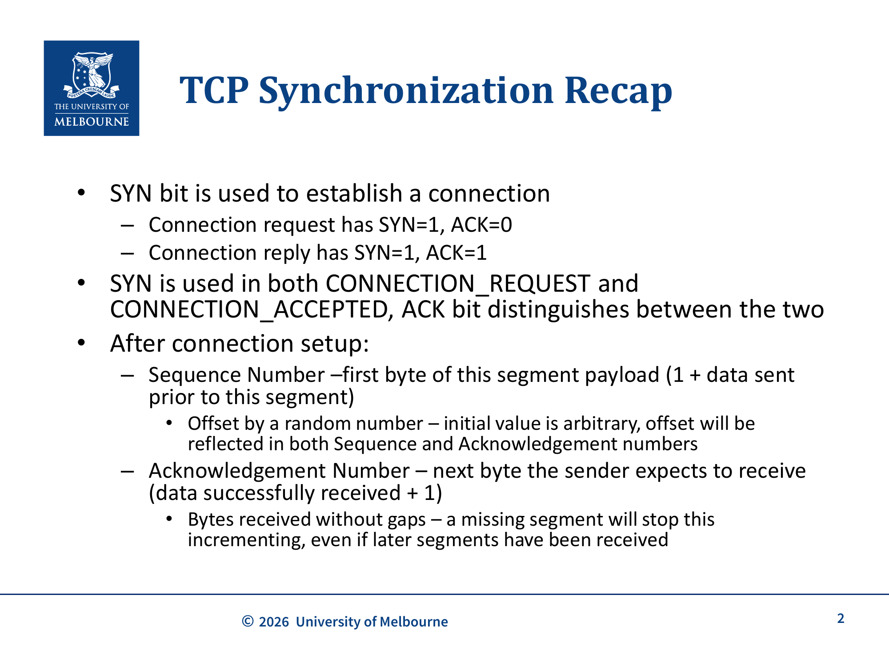
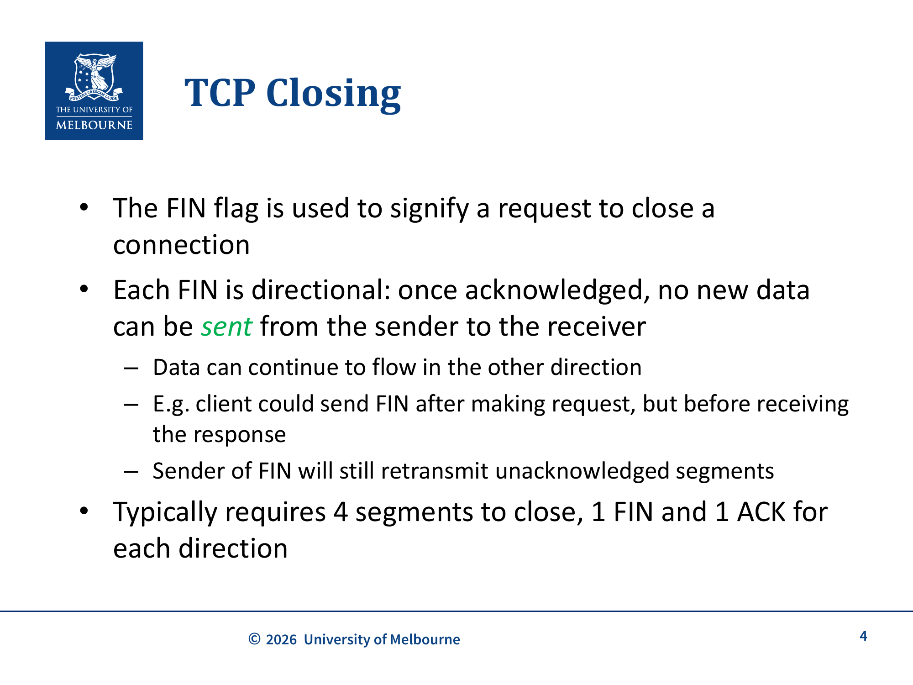
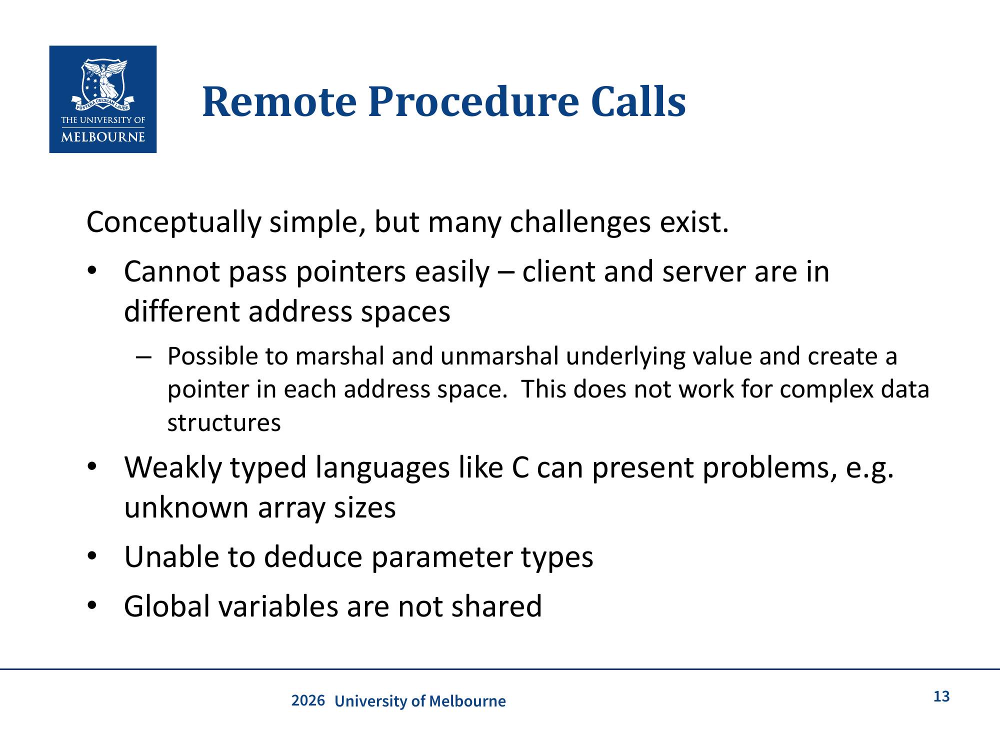
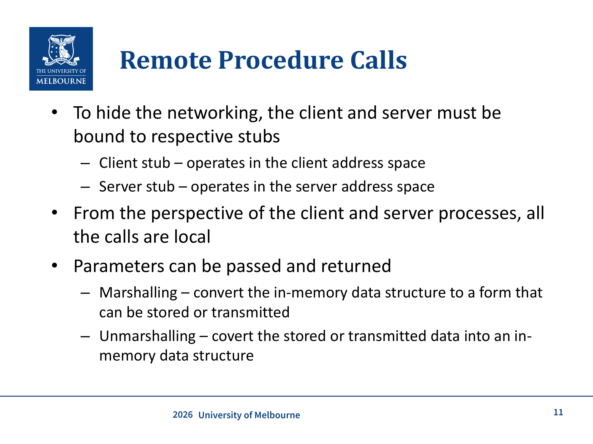

# WK9 - Protocol Design (RPC) & TCP Closing

## 课件概述

本课件分为两部分：第一部分回顾 TCP 的同步和关闭机制（SYN、FIN、RST），第二部分以 Remote Procedure Call (RPC) 为例，介绍协议设计的一般方法论。重点在于理解协议设计的迭代过程，以及 RPC 如何隐藏网络细节让远程调用看起来像本地调用。

---

## 必须掌握的知识点

### 1. TCP Synchronization Recap（TCP 同步回顾）


*TCP 同步回顾：SYN bit 用于建立连接，ACK bit 区分请求和回复（Lecture Slide 2）*

#### What（是什么）
TCP 使用 **SYN bit** 来建立连接。三次握手过程：
- **Connection Request**: SYN=1, ACK=0（客户端发起）
- **Connection Reply**: SYN=1, ACK=1（服务端回复）
- **Third segment**: ACK=1（客户端确认）

SYN 用于 CONNECTION_REQUEST 和 CONNECTION_ACCEPTED 两种消息，通过 ACK bit 区分。

#### Why（为什么）
三次握手的核心目的是**同步双方的初始序列号（Initial Sequence Number, ISN）**。由于 TCP 是全双工的，双方都需要告诉对方自己的起始序列号。

#### How（怎么工作）
连接建立后的编号规则：
- **Sequence Number**: 本 segment payload 的第一个字节编号（= 1 + 之前已发送的数据量）。初始值是随机的（arbitrary），双方的序列号和确认号都反映这个初始偏移。
- **Acknowledgement Number**: 发送方期望接收的下一个字节编号（= 已成功接收的数据 + 1）。如果中间有 gap（某个 segment 丢失），即使后续的 segment 已经收到，ACK number 也不会继续增长。

**关键理解**: ACK number 表示的是"我期望收到的下一个字节"，而不是"我已经收到的最后一个字节"。这意味着 TCP 使用的是**累积确认（cumulative acknowledgement）**机制。

---

### 2. TCP Closing（TCP 关闭）


*TCP 关闭：FIN 用于有序关闭（4 segments），RST 用于硬关闭（Lecture Slide 4）*

#### What（是什么）
TCP 使用 **FIN flag** 来请求关闭连接。关闭是**方向性的（directional）**：
- 一旦 FIN 被确认，该方向不能再发送新数据
- 但反方向的数据传输可以继续
- 发送 FIN 的一方仍然会重传未确认的 segment

通常需要 **4 个 segment** 来关闭连接：每个方向各一个 FIN + ACK。

**具体例子：** 客户端可能在发送请求后但在收到响应前就发送 FIN，表示它不再发送数据了。但服务器仍然可以继续发送响应数据。这说明 FIN 关闭的是**发送方向**而非整个连接。

#### FIN vs RST
| 特性 | FIN | RST |
|------|-----|-----|
| 类型 | 有序关闭（orderly shutdown） | 硬关闭（hard close） |
| 含义 | 请求关闭连接 | 立即终止，不再监听 |
| 使用场景 | 正常关闭 | 无效数据、进程崩溃、无开放连接 |
| 优先级 | 优先使用 | 仅在异常时使用 |

#### RST 的触发场景
当收到一个发往没有开放连接的 5-tuple 的 packet 时，会发送 RST：
- 发送了无效数据
- 远程进程崩溃，OS 正在清理遗留的 socket

---

### 3. Protocol Design Methodology（协议设计方法论）

#### What（是什么）
协议设计是一个**迭代过程**，需要回答以下核心问题：

1. **What does an interaction look like?**（交互模式）
   - 提供给上层的 API 是什么？
   - 需要发送什么消息/包？
   - 面向连接还是无连接？

2. **What data needs to be communicated?**（数据内容）
   - 任务所需的数据
   - 协议本身所需的数据
   - 使用什么下层协议？

3. **What format should be used?**（数据格式）
   - Headers? Fields? Free-form data?
   - 合法的数据范围是什么？

4. **How are errors handled?**（错误处理）

5. **What security risks are there?**（安全风险）
   - 哪些可能的安全威胁？
   - 协议设计中需要考虑哪些安全机制？

#### Why（为什么重要）
设计协议时不能一开始就锁定 API（如 Waterfall 方法会锁定 API 和整体设计），也不能没有整体设计就开始编码（如纯粹的 Agile 中"客户端"嵌入在开发过程中难以解耦）。正确的方法是**从简单功能开始，逐步扩展**。

**部署阶段的考量（对应 slide p.22）**：协议设计不只到"能跑"为止，还要回答部署问题：
- **多成熟才能上线？**（how finished before deploy）——过早发布会被用户当"事实标准"锁死，过晚则错过反馈
- **新 spec 发布怎么办？**（what happens on new spec release）——版本协商、向后兼容、灰度 rolled out
- **公开发布前如何充分测试？**（how to test thoroughly before public release）——协议一旦部署到互联网就很难收回，测试要在受控环境里穷举边界情况

---

### 4. Remote Procedure Call (RPC)（远程过程调用）


*RPC 架构：Client 和 Server 各有 Stub，通过 Network 通信，对上层透明（Lecture Slide 12）*

#### What（是什么）
RPC 允许客户端像调用本地函数一样调用远程服务器上的函数，**对程序员隐藏网络细节**。RPC 不是单一协议，有几十种变体（数据库 API、Google Maps API、gRPC 等）。

#### How（工作原理）

**抽象流程**：
1. Machine A 上的客户端进程调用 Machine B 上的过程
2. Machine A 上的线程被**挂起（suspended）**，执行在 Machine B 上进行
3. Machine B 返回结果给 Machine A，A 继续处理

**Stub 机制**：
- **Client Stub**: 在客户端地址空间中运行，负责将调用请求打包
- **Server Stub**: 在服务端地址空间中运行，负责解包请求并执行
- 对客户端和服务器进程来说，所有调用都是"本地的"

**Marshalling / Unmarshalling**：
- **Marshalling**: 将内存中的数据结构转换为可存储或传输的格式（序列化）
- **Unmarshalling**: 将存储或传输的数据转换回内存中的数据结构（反序列化）

```
Client Process → Client Stub → [Network] → Server Stub → Server Process
     ↑                                                        ↓
     ← Client Stub ← [Network] ← Server Stub ← 结果返回 ←
```

#### RPC 的挑战
- **指针无法直接传递**: 客户端和服务器在不同地址空间。可以 marshal/unmarshal 底层值并在各地址空间创建指针，但对复杂数据结构不适用。
- **弱类型语言问题**: 如 C 语言，数组大小未知
- **无法推断参数类型**
- **全局变量不共享**

---

### 5. 协议设计的迭代过程（RPC Exercise）


*协议设计练习：以 RPC 为例的迭代设计方法（Lecture Slide 10）*

#### Phase 1: 最简单的例子
设计一个支持单个函数的协议：
- 输入：一个 64-bit 整数
- 输出：一个 64-bit 整数

#### 逐步扩展
1. 支持**多个函数** → 如何标识函数？API 和消息格式如何变化？
2. 支持最多 **32 个整数**作为参数
3. 支持**复杂数据类型**的混合参数
4. 支持**返回结构体**
5. 支持**有状态（stateful）**的函数

#### 设计决策点
- 使用什么位置在协议栈中？（Application layer vs Transport layer）
- End-to-end vs Point-to-point 的权衡
- 部署前应该多完善？新版本如何发布？

---

## 关键术语

| 术语 | 定义 |
|------|------|
| SYN | Synchronize，用于 TCP 连接建立的标志位 |
| FIN | Finish，用于 TCP 有序关闭的标志位 |
| RST | Reset，用于 TCP 硬关闭的标志位 |
| ISN | Initial Sequence Number，初始序列号 |
| Cumulative Acknowledgement | 累积确认，ACK number 表示期望接收的下一个字节 |
| RPC | Remote Procedure Call，远程过程调用 |
| Stub | 存根，在 RPC 中负责代理远程调用的代码 |
| Marshalling | 序列化，将内存数据结构转换为传输格式 |
| Unmarshalling | 反序列化，将传输格式转换回内存数据结构 |
| 5-tuple | 五元组：源IP、源端口、目的IP、目的端口、协议 |

---

## 常见问题

### Q1: TCP 关闭为什么需要 4 个 segment？
因为 TCP 是**全双工**的，每个方向需要独立关闭。FIN 表示"我不再发送数据"，但对方可能还有数据要发，所以需要双方各发一个 FIN + ACK。

### Q2: FIN 和 RST 什么情况下用哪个？
- FIN：正常关闭（如 HTTP 请求完成后关闭连接）
- RST：异常情况（如收到无效数据、进程崩溃、连接不存在）

### Q3: RPC 中的 Marshalling 有什么实际例子？
- JSON 序列化（Web API）
- Protocol Buffers（gRPC）
- XML 序列化（SOAP）
- Java 的 Serializable

### Q4: 为什么 RPC 不能直接传递指针？
因为客户端和服务器在**不同的地址空间**中。指针指向的是本地内存地址，在远程机器上这个地址是无效的。需要先将指针指向的数据 marshal 成字节流，传输后再 unmarshal 并创建新的本地指针。

---

## 知识点之间的联系

```
WK7-Sockets (Socket API)
    ↓ 使用
WK8-HTTP (应用层协议)
    ↓ 基于
WK8-Transport-Services-UDP (传输层)
    ↓ 对比
WK9-TCP (TCP 传输层)
    ↓ 连接管理
WK9-Protocol Design (协议设计方法论)
    ↓ 实例
RPC (远程过程调用)
```

- **TCP SYN/FIN/RST** 与 **WK8-Transport-Services** 中的连接建立/关闭直接相关
- **RPC Marshalling** 是本章协议设计练习的核心例子
- **协议设计方法论**适用于所有网络协议的开发

---

## 实际应用案例

### 案例 1: gRPC (Google Remote Procedure Call)
- 使用 Protocol Buffers 进行 marshalling
- 基于 HTTP/2 传输
- 支持多种语言（C++, Java, Python, Go）
- 自动代码生成，隐藏网络细节

### 案例 2: REST API vs RPC
- REST：基于资源（Resource-oriented），使用 HTTP 方法（GET/POST/PUT/DELETE）
- RPC：基于动作（Action-oriented），调用远程函数
- 现代趋势：gRPC 在微服务中越来越流行

### 案例 3: 数据库 API
- JDBC（Java Database Connectivity）
- ODBC（Open Database Connectivity）
- 都是 RPC 的变体，隐藏了底层网络通信

---

## 常见错误和易错点

### ❌ 错误 1: 混淆 Sequence Number 和 Acknowledgement Number
- Sequence Number = 本 segment 的第一个字节编号
- Acknowledgement Number = 期望接收的下一个字节编号（不是最后一个已收到的）

### ❌ 错误 2: 认为 TCP 关闭是"双方同时关闭"
实际上每个方向**独立关闭**。一方发 FIN 后，另一方可能继续发送数据，直到它也发 FIN。

### ❌ 错误 3: 认为 RST 是正常关闭方式
RST 是**异常处理**机制。正常情况下应该使用 FIN 进行有序关闭。

### ❌ 错误 4: 忽略 RPC 中的错误处理
RPC 调用可能失败（网络超时、服务器崩溃、参数错误），设计协议时必须考虑错误处理机制。

---

## 课件总结

本课件的核心是理解 **TCP 连接管理**（SYN/FIN/RST）和 **协议设计的迭代方法**。TCP 通过 SYN 建立连接、FIN 有序关闭、RST 异常终止。RPC 通过 Stub 和 Marshalling 机制隐藏网络细节，让远程调用透明化。协议设计应该从最简单的功能开始，逐步扩展，而不是一开始就设计完整方案。

---

## 复习建议

1. **画出 TCP 三次握手和四次挥手的时序图**，标注每个 segment 的 SYN/ACK/FIN 值
2. **理解 RPC 的完整流程**：Client → Client Stub → Network → Server Stub → Server → 返回
3. **掌握协议设计的 4 个核心问题**：交互模式、数据内容、数据格式、错误处理
4. **思考 RPC 的实际挑战**：指针传递、类型安全、全局变量、错误处理
5. **对比 FIN 和 RST**：何时用哪个？为什么 FIN 更好？

---

*课件来源: COMP30023 2026 S1 WK9*
## 默写背诵 Dictation

> 以下为本章必须能默写的中英对照；网站「默写 Recite」Tab 提供自测模式。

| # | 默写提示 Prompt | 标准答案 Answer |
|---|----------------|----------------|
| 1 | RPC definition. · RPC 定义。 | **EN:** Remote Procedure Call — invoke a procedure on a remote host as if it were local. / **中文：** 远程过程调用——像调用本地函数一样调用远程主机上的过程。 |
| 2 | Marshalling definition. · Marshalling 定义。 | **EN:** Convert in-memory data structures to a canonical byte stream for transmission (unmarshalling reverses). / **中文：** 将内存数据结构转换为规范字节流以便传输（unmarshalling 反向转换）。 |
| 3 | Client stub vs server stub roles. · Client stub vs server stub 角色。 | **EN:** Client stub marshals args, sends request, unmarshals result; server stub unmarshals args, calls procedure, marshals result. / **中文：** Client stub：marshal 参数、发请求、unmarshal 结果；Server stub：unmarshal 参数、调用过程、marshal 结果。 |
| 4 | Protocol design — four core questions (slide p.9). · 协议设计——四个核心问题（课件 p.9）。 | **EN:** (1) What does interaction look like? (2) What data to communicate? (3) What format? (4) How handle errors? / **中文：** （1）交互模式？（2）传什么数据？（3）什么格式？（4）如何处理错误？ |
| 5 | RPC challenges — pointers and global variables (slide p.13). · RPC 挑战——指针与全局变量（课件 p.13）。 | **EN:** Pointers cannot be passed directly across address spaces; global variables are not shared between client and server. / **中文：** 指针不能跨地址空间直接传递；全局变量在客户端与服务器间不共享。 |
| 6 | Protocol deployment questions (slide p.22 exact). · 协议部署问题（课件 p.22 原文）。 | **EN:** How finished before deploy? What happens on new spec release? How to test thoroughly before public release? / **中文：** 多成熟才能上线？新 spec 发布怎么办？公开发布前如何充分测试？ |
| 7 | TCP sync recap — SYN/ACK patterns (slide p.4–5). · TCP 同步回顾——SYN/ACK 模式（课件 p.4–5）。 | **EN:** Connection request: SYN=1, ACK=0; reply: SYN=1, ACK=1; third segment: ACK=1. / **中文：** 连接请求：SYN=1, ACK=0；回复：SYN=1, ACK=1；第三段：ACK=1。 |
| 8 | TCP close recap — FIN directional (slide p.4–5). · TCP 关闭回顾——FIN 方向性（课件 p.4–5）。 | **EN:** FIN closes one direction; other direction may still send data; typically 4 segments (FIN+ACK each way). / **中文：** FIN 关闭一个方向；另一方向仍可发数据；通常 4 段（各向 FIN+ACK）。 |
| 9 | RST vs FIN recap (slide p.4–5). · RST vs FIN 回顾（课件 p.4–5）。 | **EN:** FIN = orderly shutdown; RST = hard close when invalid data, crash, or no open connection. / **中文：** FIN = 有序关闭；RST = 无效数据、崩溃或无连接时的硬关闭。 |
| 10 | Cumulative ACK recap. · 累积 ACK 回顾。 | **EN:** ACK number = next byte expected; does not advance past a gap even if later bytes arrived. / **中文：** ACK 号 = 期望下一字节；中间有 gap 时不前进，即使后续字节已到。 |
| 11 | RPC — client thread suspended during call. · RPC——调用期间客户端线程。 | **EN:** Client thread is suspended while server executes; resumes when result returns. / **中文：** 客户端线程在服务器执行期间挂起；结果返回后恢复。 |
| 12 | Protocol design — start simple, iterate. · 协议设计——从简开始迭代。 | **EN:** Begin with minimal functionality (e.g. one RPC function), then extend — do not lock API too early. / **中文：** 从最小功能开始（如单个 RPC 函数），再逐步扩展——不要过早锁定 API。 |

