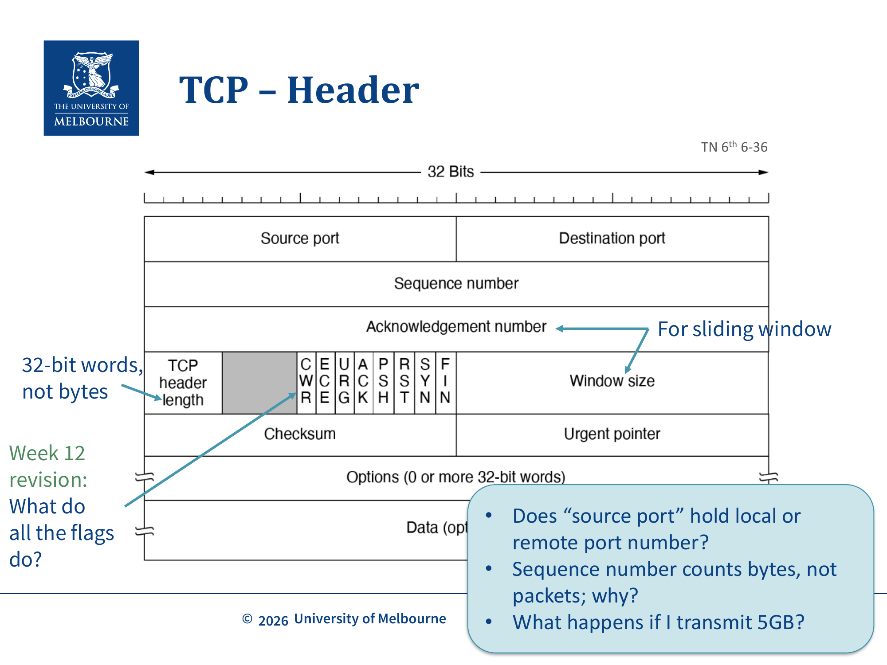
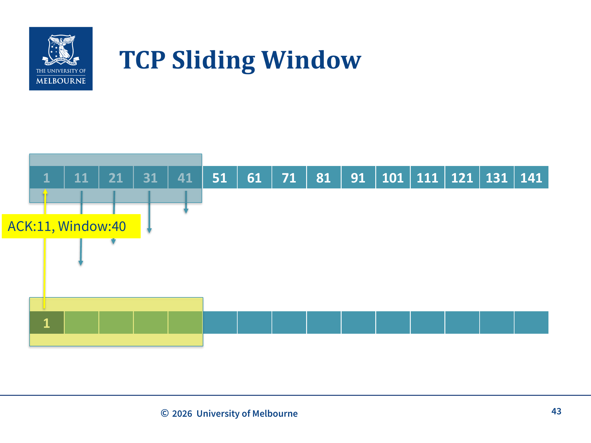
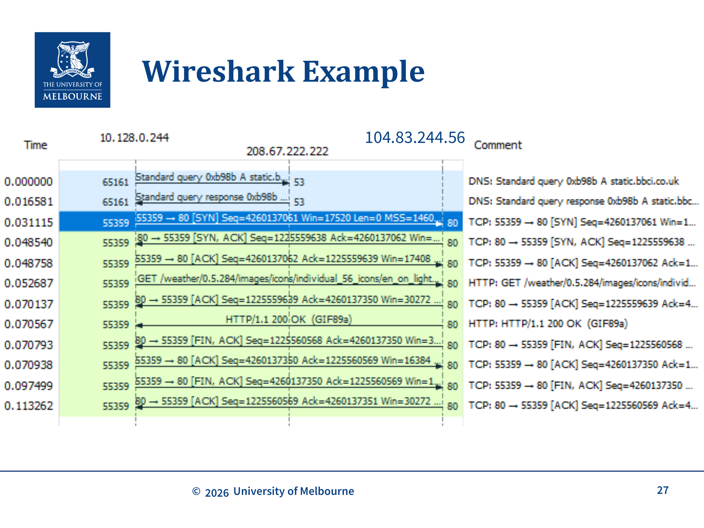

# WK9 - TCP (Transmission Control Protocol)

## 课件概述

本课件详细介绍 TCP 协议的核心机制，包括 TCP 的特性、服务模型、头部格式、连接建立（三次握手）、连接关闭（FIN/RST）、SYN Flooding 攻击，以及 Sliding Window 流量控制机制。TCP 是互联网最重要的传输层协议，提供了可靠的、面向连接的字节流传输服务。

---

## 必须掌握的知识点

### 1. TCP 概述与特性

#### What（是什么）
TCP（Transmission Control Protocol）是一种**面向连接的、可靠的、字节流**传输层协议。它让应用程序可以发送和接收字节流，而无需担心：
- **Segmenting into IP datagrams**（分段）→ **Stream oriented**（面向流）
- **Bytes being dropped or duplicated**（丢包或重复）→ **Reliable**（可靠）
- **Bytes arriving out of order**（乱序到达）→ **In order**（有序）

#### Why（为什么需要）
网络层（IP）提供的是"尽力而为"的服务，存在以下问题：
- Packets don't say which application they are for（不标识应用）
- Packets may be corrupted（可能损坏）
- Packets may be lost（可能丢失）
- Packets may arrive out of order（可能乱序）
- Packets may be duplicated（可能重复）
- Packets may arrive faster than we can process（可能太快）

TCP 提供了"更干净、更友好"的服务集。其中TCP使用**校验和（Checksum）**检测损坏的segment——这是一种廉价哈希（而非数字签名），只检测意外损坏，不是用于安全目的。

#### How（工作原理）
TCP transport entity 接受用户数据流，将其分段为 <64KB 的 segments（通常 1460 bytes，以便 IP + TCP header 能装入单个 Ethernet frame），每个 segment 作为独立的 IP datagram 发送。接收端 TCP entity 从封装中重建原始字节流。

---

### 2. TCP 的关键特性

| 特性 | 说明 |
|------|------|
| **Full duplex** | 全双工，数据可同时双向传输 |
| **End to end** | 端到端，精确的发送-接收对 |
| **Byte streams** | 字节流，**不保留**应用层消息边界 |
| **Buffer capable** | 缓冲能力强，TCP entity 可选择何时发送 |

**重要理解**：TCP 是**字节流**而非**消息流**。这意味着：
- 不能区分一次 `write()` 和下一次 `write()` 的边界
- 发送端发送 4 个 512-byte 的 segments，接收端可能一次 `READ` 收到全部 2048 bytes
- 多次 `write()` 可能合并到同一个 packet 中（Nagle's algorithm）

---

### 3. TCP Service Primitives（服务原语）

| Primitive | Packet Sent | Meaning |
|-----------|-------------|---------|
| **LISTEN** | (none) | 设置 kernel 跟踪 SYN packets |
| **ACCEPT** | (none) | 阻塞直到有连接请求 |
| **CONNECT** | CONNECTION REQ | 主动尝试建立连接 |
| **SEND** | DATA | 发送数据 |
| **RECEIVE** | (none) | 阻塞直到 DATA packet 到达 |
| **DISCONNECT** | DISCONNECTION REQ | 请求释放连接 |

`Select` 是非 TCP 原语，允许非阻塞接收（non-blocking receive）。

---

### 4. TCP Service Model（服务模型）

#### What（是什么）
发送方和接收方都创建 **socket**：
- Socket 是一个 kernel 数据结构，由 **5-tuple** 命名：
  - Source IP, Source Port, Destination IP, Destination Port, Protocol
- TCP 连接必须在发送方 socket 和接收方 socket 之间**显式建立**

#### 示例
```
Host 128.250.58.23                    Host 93.184.216.34
Port 38286 ←→ Port 80                Port 80
Port 53970 ←→ Port 80                Port 80
Web browser (client)                  Web server
```

---

### 5. TCP Segment 格式


*TCP Header 格式：20-60 bytes，关键字段包括 Sequence Number、Acknowledgement Number、Flags（SYN/ACK/FIN/RST）、Window Size（Tanenbaum TN 6th 6-36）*

#### TCP Header（20-60 bytes）

| 字段 | 大小 | 说明 |
|------|------|------|
| **Source port** | 16 bits | 发送端端口 |
| **Destination port** | 16 bits | 接收端端口 |
| **Sequence Number** | 32 bits | 如果 SYN=1: 初始序列号；如果 SYN=0: 本 segment 第一个数据字节的累积序列号 |
| **Acknowledgement Number** | 32 bits | 如果 ACK=1: 发送方期望接收的下一个序列号 |
| **Data offset** | 4 bits | TCP Header 大小（20-60 bytes = 5-15 × 32-bit words） |
| **Flags** | 6 bits | SYN, ACK, RST, FIN, URG, PSH 等单 bit 标志 |
| **Window size** | 16 bits | 接收窗口大小——发送方愿意接收的数据量 |

#### 关键问题
- **Source port** 存的是本地还是远程端口号？→ 本地
- **Sequence number** 为什么计字节而不是包？→ 因为 TCP 是字节流协议，需要精确追踪每个字节
- **如果传输 5GB 会怎样？** → 序列号会 wrap around（32-bit 序列号空间约 4GB）

---

### 6. TCP 三次握手（Three-way Handshake）

#### What（是什么）
三次握手是 TCP 建立连接的过程，确保：
- 即使 setup packets 丢失或重传，也能建立**且仅建立一个**连接
- 为 sliding window 建立初始序列号

#### Why（为什么需要三次）
TCP 运行在**无连接的网络层（IP）**之上。网络可能：
- 丢失 packets
- 存储并延迟 packets
- 重复 packets
- 乱序 packets

**两次握手的问题**：如果双方同时分配了相同的序列号（如主机/路由器崩溃后），可能导致混乱。

**延迟重复（Delayed Duplicates）问题**：拥塞的网络可能延迟ACK，导致发送方重传多次。这些重传中可能有一些没有到达、乱序到达，或者成为**延迟重复**——在连接关闭后才到达的旧packet被误认为是新连接的packet。三次握手通过随机的初始序列号避免了这个问题。

#### How（过程）

```
Client                              Server
  |                                    |
  |--- SYN=1, ACK=0, seq=x --------->|  (Connection Request)
  |                                    |
  |<-- SYN=1, ACK=1, seq=y, ack=x+1 --|  (Connection Accepted)
  |                                    |
  |--- ACK=1, seq=x+1, ack=y+1 ----->|  (Confirm)
  |                                    |
  |         Connection Established     |
```

**关键细节**：
- **SYN** 和 **FIN** 各占 1 byte 的序列号
- 因此第一个数据字节的序列号 = SYN 的序列号 + 1
- 连接建立后，Sequence Number = 本 segment payload 的第一个字节编号
- 初始值是**随机的**（arbitrary），双方的序列号和确认号都反映这个初始偏移

---

### 7. TCP 连接关闭

#### FIN（有序关闭）
- **FIN flag** 请求关闭连接
- 每个 FIN 是**方向性的**：一旦确认，该方向不能再发新数据
- 反方向的数据传输可以继续
- 通常需要 **4 个 segment**（每个方向 FIN + ACK）

```
Client                              Server
  |                                    |
  |--- FIN=1 ----------------------->|  (Client 请求关闭)
  |<-- ACK=1 ------------------------|  (Server 确认)
  |                                    |  (Server 可能继续发数据)
  |<-- FIN=1 ------------------------|  (Server 也请求关闭)
  |--- ACK=1 ----------------------->|  (Client 确认)
  |                                    |
  |         Connection Closed          |
```

#### RST（硬关闭）
- **RST flag** 表示"hard close"
- 发送方声明关闭连接，不再监听任何消息
- 用于回复发往没有开放连接的 5-tuple 的 packet
- 场景：无效数据、进程崩溃后 OS 清理遗留 socket

**FIN vs RST**：FIN 是有序关闭（preferred），RST 是重置（异常情况）。

---

### 8. SYN Flooding 攻击与 SYN Cookies

#### What（是什么）
SYN Flooding 是 90 年代流行的 DoS 攻击：
- 攻击者发送初始 SYN 请求，但**不发送后续 ACK**
- 服务器为每个 SYN 请求存储初始序列号（占用内存）
- 逐渐填满序列号队列，导致服务器无法响应正常连接

#### SYN Cookies 解决方案
- 不存储序列号，而是从**连接信息和定时器**中**派生**序列号
- 使用**密码学哈希**创建**无状态的 SYN 队列**
- 代价：验证 SYN Cookies 有性能开销
- 策略：通常只在**受到攻击时**才启用

---

### 9. TCP Sliding Window（滑动窗口）

#### What（是什么）

*TCP Sliding Window 示意图：接收方发送 ACK:11, Window:40，表示期望收到第 11 字节，还能接收 40 字节（Lecture Slide 43）*

Sliding Window 提供：
- **Reliable delivery**（可靠传输）
- **Flow control**（流量控制，防止发送过快）
- **In-order delivery**（有序传输）
- **累积确认：** TCP使用累积确认——ACK号表示"期望接收的下一个字节"。如果中间有segment丢失，即使后续segment已收到，ACK号也不会增长。这为快速重传（Fast Retransmit）奠定了基础。

#### How（工作原理）

**窗口类型**：
- **Send Window**: 发送方能发送的数据 = 未确认 segments + 能装入接收窗口的未发送数据
- **Receive Window**: 接收方愿意接收的数据量（在 ACK 中通告）
- **其他窗口**: 用于拥塞控制（下节课讲）

**关键不变量**：
```
LastByteSent - LastByteAcked <= ReceiveWindowAdvertised
```

**窗口为 0 时**：
- 发送方不应发送数据
- 但可以发送 **URGENT data**
- 可以发送 **zero window probe**（0 字节 segment），让接收方重新通告窗口大小，防止死锁

**延迟发送**：
- 发送方可能延迟发送，等待更多数据填满窗口
- 例如：不立即发送 2KiB，而是等待更多数据填满 4KiB 接收窗口

---

### 10. TCP 属性与 MTU

| 属性 | 说明 |
|------|------|
| **Segment size** | 每个 segment 有 20-60 byte header + 0 或更多数据 |
| **IP payload** | < 65,515 bytes |
| **MTU** | Maximum Transfer Unit，通常 1500 bytes（Ethernet） |
| **Typical segment** | 1460 bytes 数据（1500 - 20 IP header - 20 TCP header） |

---

## 关键术语

| 术语 | 定义 |
|------|------|
| TCP | Transmission Control Protocol，传输控制协议 |
| Segment | TCP 数据单元，包含 header + payload |
| Socket | Kernel 数据结构，由 5-tuple 标识 |
| Three-way handshake | 三次握手，TCP 连接建立过程 |
| SYN | Synchronize，连接建立标志 |
| FIN | Finish，有序关闭标志 |
| RST | Reset，硬关闭标志 |
| ISN | Initial Sequence Number，初始序列号 |
| MTU | Maximum Transfer Unit，最大传输单元 |
| Sliding Window | 滑动窗口，流量控制机制 |
| SYN Cookie | 无状态 SYN 队列，防御 SYN Flooding |
| Full duplex | 全双工，双向同时传输 |
| Byte stream | 字节流，不保留消息边界 |

---

## 常见问题

### Q1: TCP 为什么是字节流而不是消息流？
因为 TCP 不保留应用层消息边界。发送端多次 `write()` 的数据可能被合并到一个 segment，接收端一次 `READ()` 可能收到多次 `write()` 的数据。这简化了 TCP 设计，但应用层需要自己处理消息边界（如 HTTP 的 Content-Length）。

### Q2: 三次握手中 SYN 为什么占 1 byte 序列号？
因为 SYN 是连接建立的标志，需要消耗序列号空间，以便后续数据的序列号可以正确计算。FIN 同理。

### Q3: TCP 的 Window Size 是什么？
Window Size 是接收方在 ACK 中通告的**接收窗口大小**，告诉发送方"我还能接收多少数据"。这实现了流量控制。

### Q4: 为什么 TCP 需要 4 个 segment 来关闭？
因为 TCP 是全双工的，每个方向需要独立关闭。一方发 FIN 后，另一方可能还有数据要发，所以需要双方各发 FIN + ACK。

---

## 知识点之间的联系

```
WK8-Transport-Services-UDP (传输层基础)
    ↓ 对比
WK9-TCP (TCP 详解) ←→ WK9-Protocol-Design (协议设计)
    ↓ 流量控制
WK10-TCP-Flow-Congestion-Control (拥塞控制)
    ↓ 路由
WK11-Routing (路由算法)
```

- **TCP vs UDP**: TCP 是面向连接的、可靠的；UDP 是无连接的、不可靠的
- **TCP Sliding Window** 是**拥塞控制**的基础（WK10）
- **TCP Header** 的 flags（SYN/ACK/FIN/RST）是**协议设计**的实例（WK9-Protocol-Design）

---

## 实际应用案例

### 案例 1: HTTP 请求的 TCP 连接
```
1. Client → Server: SYN (建立连接)
2. Server → Client: SYN+ACK
3. Client → Server: ACK
4. Client → Server: HTTP GET 请求
5. Server → Client: HTTP 响应
6. Client → Server: FIN (关闭连接)
7. Server → Client: FIN+ACK
```

### 案例 2: Wireshark 分析
课件中展示了使用 Wireshark 捕获 BBC 天气图标请求的例子，可以看到完整的 TCP 三次握手、数据传输、四次挥手过程。


*Wireshark 实际抓包示例：DNS 查询 → TCP SYN/SYN-ACK/ACK → HTTP GET → HTTP 200 OK → FIN/ACK 关闭连接（Lecture Slide 27）*

### 案例 3: SYN Cookie 在 Linux 中的应用
Linux 内核默认启用 SYN Cookie（`net.ipv4.tcp_syncookies = 1`），当 SYN 队列满时自动启用。

---

## 常见错误和易错点

### ❌ 错误 1: 认为 TCP 保留消息边界
TCP 是**字节流**，不保留消息边界。应用层需要自己处理（如使用 `\r\n`、Content-Length 等）。

### ❌ 错误 2: 混淆 Sequence Number 和 Acknowledgement Number
- Sequence Number = 本 segment 的第一个字节编号
- Acknowledgement Number = 期望接收的下一个字节编号（不是最后一个已收到的）

### ❌ 错误 3: 认为 RST 是正常关闭方式
RST 是**异常处理**机制。正常情况下应该使用 FIN 进行有序关闭。

### ❌ 错误 4: 忽略 SYN 占用序列号
SYN 和 FIN 各占 1 byte 序列号，第一个数据字节的序列号 = SYN 序列号 + 1。

### ❌ 错误 5: 认为 Window Size 是发送方的窗口
Window Size 是**接收方通告的接收窗口**，告诉发送方"我还能接收多少数据"。

---

## 课件总结

本课件全面介绍了 TCP 协议：
1. **TCP 特性**: 面向连接、可靠、字节流、全双工
2. **服务模型**: 通过 5-tuple 标识的 socket 进行通信
3. **连接管理**: 三次握手建立、FIN/RST 关闭
4. **SYN Flooding**: 攻击原理与 SYN Cookie 防御
5. **Sliding Window**: 流量控制机制，确保可靠传输

TCP 是互联网的核心协议，理解其工作机制对于网络编程和故障排查至关重要。

---

## 复习建议

1. **画出 TCP 三次握手和四次挥手的时序图**，标注每个 segment 的 SYN/ACK/FIN 值
2. **理解 TCP Header 的关键字段**：Sequence Number、Acknowledgement Number、Window Size
3. **掌握 Sliding Window 的工作原理**：Send Window、Receive Window、不变量公式
4. **理解 TCP vs UDP 的区别**：可靠性、连接性、性能
5. **思考 SYN Flooding 攻击**：为什么需要三次握手？SYN Cookie 如何工作？

---

*课件来源: COMP30023 2026 S1 WK9*
